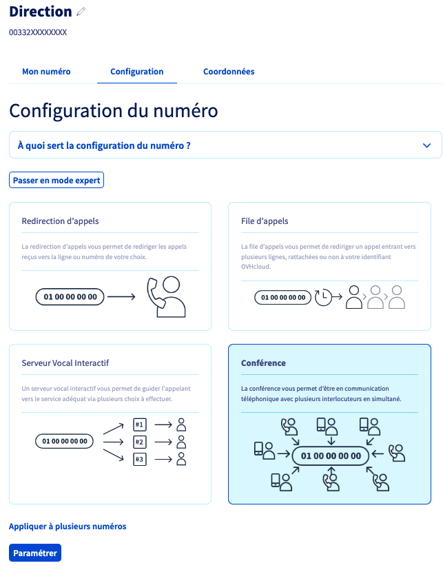
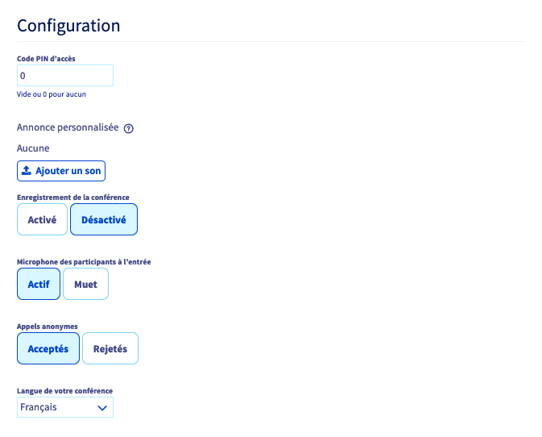
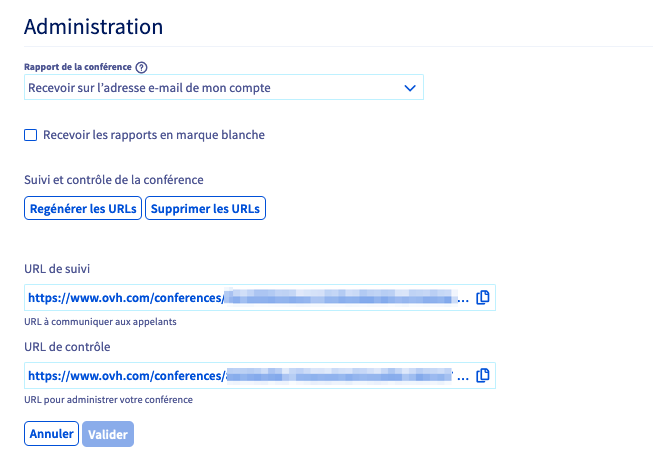

**Dernière mise à jour le 05/08/2022**

## Objectif

La conférence permet à toutes les personnes composant un numéro donné d’être en communication simultanément. Différentes fonctionnalités sont alors disponibles :

- protéger la conférence par un code ;
- définir une annonce personnalisée ;
- enregistrer les participants et recevoir un rapport par e-mail à la fin de celle-ci. 

Une interface spécifique vous propose également de suivre en temps réel les discussions des participants, mais aussi de gérer leur audio et leur micro.

**Découvrez comment créer et gérer des conférences téléphoniques avec votre numéro OVHcloud.**

## Prérequis

- Disposer d'un [numéro alias](https://www.ovhtelecom.fr/telephonie/numeros/){.external}.
- Être connecté à l'[espace client OVHcloud](https://www.ovh.com/auth?onsuccess=https%3A%2F%2Fwww.ovhtelecom.fr%2Fmanager&ovhSubsidiary=fr){.external}, partie `Télécom`{.action}.

{.thumbnail}

> [!primary]
>
> Consultez notre guide « [Choisir et appliquer une configuration pour un numéro](../quelle-configuration-est-adaptee-a-mes-besoins/) » pour plus de détails sur les différentes configurations applicables à un numéro alias.
>

## En pratique

### Étape 1 : accéder à la configuration du numéro

Connectez-vous à votre [espace client OVHcloud](https://www.ovh.com/auth?onsuccess=https%3A%2F%2Fwww.ovhtelecom.fr%2Fmanager&ovhSubsidiary=fr){.external}, partie `Télécom`{.action}. 
Cliquez sur `Téléphonie`{.action}, sélectionnez le groupe de téléphonie puis le numéro à configurer. 
Dans l'onglet `Configuration`{.action}, cliquez sur `Conférence`{.action} puis sur `Paramétrer`{.action}. 
L'application de la configuration prend quelques secondes.

{.thumbnail}

Si une autre configuration est déjà appliquée sur votre numéro, cliquez sur `Configuration`{.action} puis `Changer de configuration`{.action}.

Une fois la configuration appliquée, vous accédez directement aux paramètres de la conférence.

Pour retrouver ce menu ultérieurement, cliquez sur l'onglet `Configuration`{.action} puis sur `Conférence`{.action}.

### Étape 2 : gérer les paramètres de la conférence

#### Configurer la conférence

Dans la partie « Configuration », définissez les paramètres de la conférence.

{.thumbnail}

|Paramètres|Description|
|---|---|
|Code PIN d’accès|Le code PIN défini devra être renseigné lorsqu'un participant rejoindra la conférence. Celui-ci doit être compris entre 1 et 8 numéros. Indiquez « 0 » ou laissez la case vide pour ne pas utiliser de code PIN.|
|Annonce personnalisée|Permet de personnaliser l'annonce d'entrée d'un nouveau participant dans la conférence. Pour cela, cliquez sur `Ajouter un son`{.action} puis suivez les étapes qui apparaissent.|
|Enregistrement de la conférence|Permet d'activer ou non l'enregistrement des conférences réalisées sur le numéro.|
|Microphone des participants à l’entrée|Permet d'activer ou de rendre muet le microphone des participants lorsqu'ils rejoignent la conférence.|
|Appels anonymes|Permet d'autoriser ou d'interdire l'accès à la conférence aux numéros anonymes.|
|Langue de votre conférence|Permet de définir la langue de la conférence parmi plusieurs options.|

Cliquez enfin sur le bouton `Valider`{.action} en bas de la page afin de confirmer les changements.

#### Administrer la conférence

Dans la partie « Administration », définissez également vos paramètres.

{.thumbnail}

|Paramètres|Description|
|---|---|
|Rapport de la conférence|Permet de définir si vous souhaitez recevoir un rapport concernant l'activité de la conférence ; et si oui, l'adresse e-mail sur laquelle le recevoir.|
|Suivi et contrôle de la conférence|Permet d'activer des liens pour suivre et contrôler la conférence. Pour les activer, cliquez sur `Générer les URL`{.action}. Un bouton à droite de chaque URL vous permet de la copier.   Si des URL sont déjà générées, vous avez la possibilité de :   - **Regénérer les URL** : permet de remplacer les URL existantes par d'autres ;  - **Supprimer les URL** : permet de désactiver le suivi et le contrôle de la conférence.|

Cliquez enfin sur le bouton `Valider`{.action} pour confirmer les changements.

### Étape 3 : utiliser la conférence

Une fois votre conférence active et paramétrée, celle-ci est prête à être utilisée. Les participants peuvent donc appeler le numéro défini en tant que conférence, puis interagir selon la configuration que vous avez mise en place.

Les participants ont aussi la possibilité de se servir des raccourcis ci-dessous pendant une conférence :

|Raccourcis|Description|
|---|---|
|##|Quitter la conférence|
|00|Désactiver ou activer le mode muet|
|**|Désactiver ou activer le mode muet et sourd|

## Aller plus loin

Échangez avec notre communauté d'utilisateurs sur <https://community.ovh.com>.
