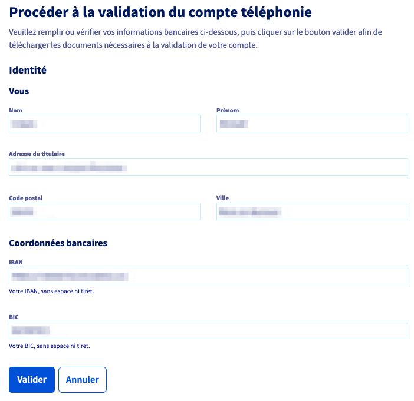

**Dernière mise à jour le 24/01/2022**

## Objectif

Lorsque vous réalisez votre première commande ou que vous souhaitez [changer le contact de facturation](../effectuer-un-changement-de-contact-pour-les-services-voip/) pour vos services de VoIP, une procédure de validation du compte OVHcloud est à réaliser.
Cette procédure vous permet de valider l'identifiant client sur lequel OVHcloud va réaliser la facturation de vos services VoIP.

## Prérequis

- Disposer d'un compte OVHcloud actif.
- Être connecté à votre [espace client OVHcloud](https://www.ovh.com/auth/?action=gotomanager&from=https://www.ovh.com/fr/&ovhSubsidiary=fr){.external}

## En pratique

### Générer la procédure 

Lorsque vous passez commande de votre premier service VoIP, la procédure de validation VoIP est automatiquement générée. Cette procédure vous est envoyée par e-mail au format PDF à l'adresse définie sur le compte du contact facturation. Pour plus de détails sur les différents contacts, consultez notre guide sur le [changement de contacts pour les services VoIP](../effectuer-un-changement-de-contact-pour-les-services-voip/).

L'objet de l'e-mail reçu est : 

>
>[**OVH - IMPORTANT**] Nous attendons votre procédure VoIP pour finaliser votre commande.
>

Vous pouvez également retrouver cet e-mail dans votre espace client. Pour cela, connectez-vous à votre [espace client OVHcloud](https://www.ovh.com/auth/?action=gotomanager&from=https://www.ovh.com/fr/&ovhSubsidiary=fr){.external}, cliquez sur votre nom en haut à droite puis sur `E-mails de service`{.action}

{.thumbnail}

Si vous souhaitez générer la procédure manuellement (dans le cadre d'un changement de NIC Facturation) ou anticiper et valider votre compte OVHcloud pour la téléphonie en vue d'une prochaine commande de services VoIP, connectez-vous à votre [espace client OVHcloud](https://www.ovh.com/auth/?action=gotomanager&from=https://www.ovh.com/fr/&ovhSubsidiary=fr){.external} puis cliquez sur `Telecom`{.action}.

Un message d'information vous invitera à cliquer sur le lien du formulaire de validation.

{.thumbnail}

Renseignez les champs requis pour préciser les coordonnées du propriétaire du compte bancaire à utiliser, puis cliquez sur `Valider`{.action}.

{.thumbnail}

Une fois le formulaire validé, son téléchargement au format PDF vous sera proposé.

{.thumbnail}

### Réaliser la procédure

La procédure pour les clients français est à renvoyer par **voie postale** obligatoirement avec les **justificatifs demandés**. Dans le cadre de la procédure, les justificatifs demandés sont les suivants:

-   ***Client particulier :***
    -   Dater et signer l'autorisation de prélèvement.
    -   Joindre un chèque annulé **original** (Si vous ne possédez pas de chèque annulé, vous pouvez joindre une attestation de bon fonctionnement du compte bancaire à prélever, émise par votre conseiller bancaire).
    -   Photocopie recto/verso de votre pièce d'identité.    
-   ***Société :***
    -   Dater et signer l'autorisation de prélèvement.
    -   Joindre un chèque annulé **original** (Si vous ne possédez pas de chèque annulé, vous pouvez joindre une attestation de bon fonctionnement du compte bancaire à prélever émise par votre conseiller bancaire).
    -   Photocopie recto/verso de la pièce d'identité du gérant ou d'un dirigeant de la société.
    -   Un papier à en-tête de l'entreprise certifiant que la personne dépositaire du dossier est habilitée à agir au nom de l'entreprise.
    -   Un extrait K-Bis de moins de 3 mois.
-   ***Association :***
    -   Dater et signer l'autorisation de prélèvement.
    -   Joindre un chèque annulé **original** (Si vous ne possédez pas de chèque annulé, vous pouvez joindre une attestation de bon fonctionnement du compte bancaire à prélever émise par votre conseiller bancaire).
    -   Photocopie recto/verso de la pièce d'identité du président de l'association.
    -   Copie de la publication au Journal Officiel des statuts de l'association.
    -   Attestation du président de l'association indiquant que la personne dépositaire du dossier est habilitée à agir au nom de l'association.

#### Les variantes selon le pays

Les clients OVHcloud belges et suisses peuvent également commander des services VoIP. La procédure et les justificatifs demandés peuvent, pour ces pays, être envoyés par **e-mail** à l'adresse :

-   **procedure-be@ovh.com** pour les procédures belges.
-   **procedure-ch@ovh.com** pour les procédures suisses.

Les justificatifs à fournir sont :

-   ***Client particulier :***
    -   Photocopie recto/verso d'une pièce d'identité du titulaire du compte OVHcloud.
    -   Preuve de domiciliation dans le pays (facture de gaz, d'eau, électricité ou téléphone).
-   ***Société :***
    -   Photocopie recto/verso d'une pièce d'identité du gérant ou d'un dirigeant de la société.
    -   Un papier à en-tête de l'entreprise certifiant que la personne dépositaire du dossier est habilitée à agir au nom de l'entreprise ou un document d'identification de l'entreprise.
    -   Preuve de domiciliation dans le pays (facture de gaz, d'eau, électricité ou téléphone).
-   ***Association :***
    -   Photocopie recto / verso d'une pièce d'identité du président de l'association.
    -   Copie de la publication au Journal Officiel des statuts de l'association.
    -   Attestation du président de l'association indiquant que la personne dépositaire du dossier est habilitée à agir au nom de l'association.

### Je n'arrive pas à ouvrir la procédure 

La procédure est générée au format **PDF**, il vous faut donc utiliser un lecteur de fichiers PDF pour l'ouvrir. Nous vous recommandons d'utiliser **Adobe Acrobat Reader** qui est gratuit et disponible sur Windows, Mac OS et Linux.

Vous pouvez le télécharger **gratuitement** via ce lien : <http://www.adobe.com/fr/products/reader.html>.

## Aller plus loin

Échangez avec notre communauté d'utilisateurs sur <https://community.ovh.com>.