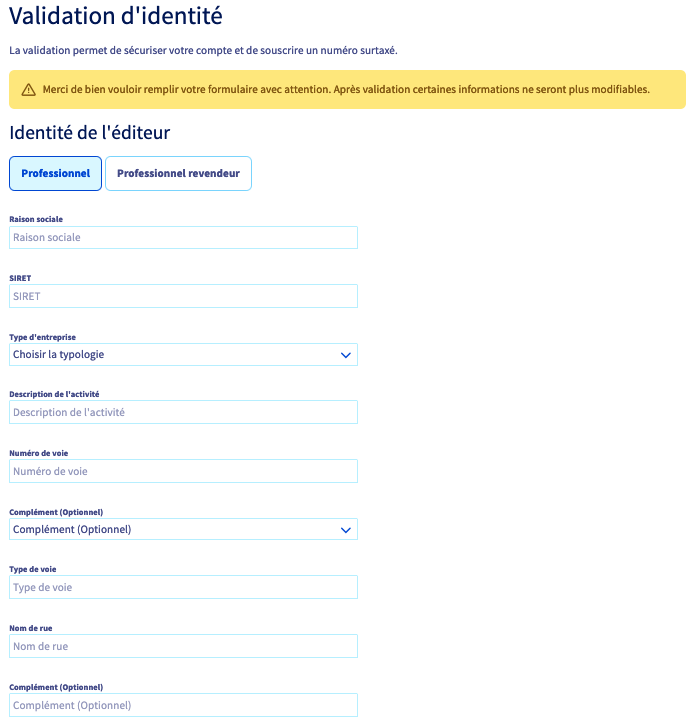
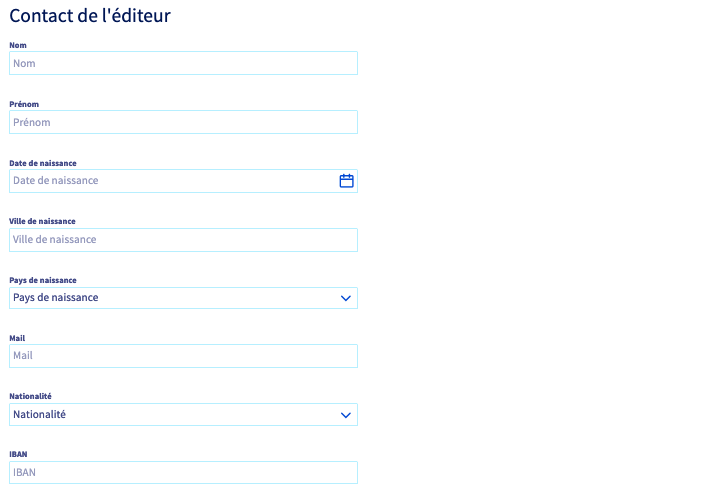
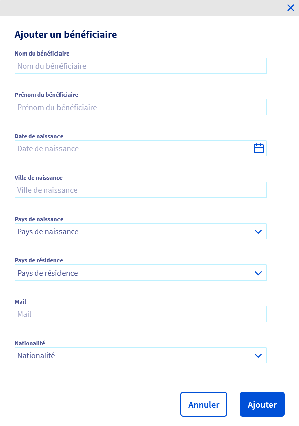
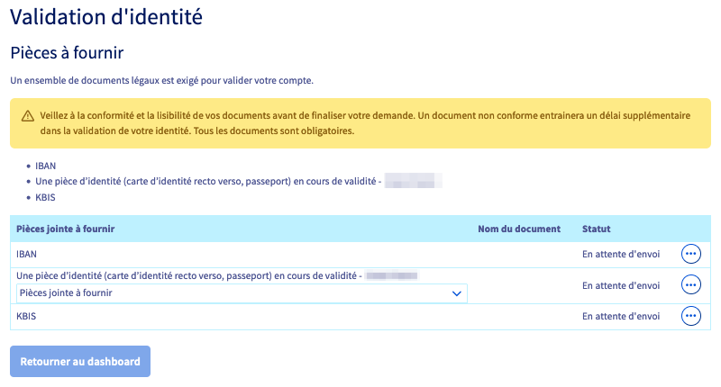

**Dernière mise à jour le 15/02/2022**

## Objectif

L'exploitation de **numéros de Services à Valeur Ajoutée (SVA)** OVHcloud nécessite d'être en conformité avec le cadre réglementaire défini par l'ARCEP et la [Directive Européenne 2015/849](http://eur-lex.europa.eu/legal-content/EN/TXT/HTML/?uri=CELEX:32015L0849&from=FR) du Parlement européen et du Conseil du 20 mai 2015, relative à la prévention de l'utilisation du système financier à des fins de blanchiment d'argent et de financement du terrorisme.

Lors de la commande ou de la portabilité d'un numéro SVA, vous devez renseigner des informations précises sur votre identité ou celle de votre entreprise et fournir des documents justificatifs à OVHcloud.

OVHcloud, en partenariat avec Lemonway&#174;, vous accompagne dans la mise en oeuvre du KYC (*Know Your Customer* ou « Connaître vos clients ») via la fourniture d'éléments justificatifs depuis votre espace client OVHcloud.

**Découvrez comment valider votre identité afin d'exploiter un numéro spécial SVA.**

## Prérequis

- Être connecté à l'[espace client OVHcloud](https://www.ovh.com/auth/?action=gotomanager&from=https://www.ovh.com/fr/&ovhSubsidiary=fr){.external}, partie `Télécom`{.action}.

## En pratique

> [!warning]
> Afin d'exploiter un numéro spécial SVA, il est obligatoire de fournir l'ensemble des justificatifs requis. Faute de validation de ces documents, vous ne pourrez pas exploiter votre numéro.
>

Connectez-vous à votre [espace client OVHcloud](https://www.ovh.com/auth/?action=gotomanager&from=https://www.ovh.com/fr/&ovhSubsidiary=fr){.external}, partie `Télécom`. Cliquez sur `Téléphonie`{.action} dans la barre de services à gauche, puis sélectionnez votre groupe de téléphonie.

Que vous commandiez un nouveau numéro ou souhaitiez valider votre identité pour un numéro déjà en exploitation, cliquez  sur l'onglet `Commande de numéros`{.action} ou sur `Commander un numéro`{.action} dans le menu « Je veux... ».

{.thumbnail}

Vous accédez alors aux différents types de numéros. Cliquez sur `Vérifier l'identité` en face de « Numéros à valeur ajoutée ».

{.thumbnail}

### Renseigner les coordonnées

Choisissez si vous êtes un « Professionnel » ou un « Professionnel revendeur » puis renseignez précisément les coordonnées demandées.

{.thumbnail}
{.thumbnail}
{.thumbnail}

### Ajouter des bénéficiaires

Si vous êtes le seul bénéficiaire, cochez la case « Mon représentant est bénéficiaire ». 

{.thumbnail}

Dans le cas contraire, cliquez sur `+ Ajouter un bénéficiaire`{.action} et renseignez les coordonnées du bénéficiaire.

> [!primary]
> Vous pouvez ajouter jusqu'à 4 bénéficiaires.

{.thumbnail}

Cochez la case :

- « Je certifie être l'éditeur des contenus des numéros SVA » (si vous avez choisi le type de compte « Professionnel »);
- « Je certifie être revendeur de numéro SVA et certifie connaître et appliquer les obligations à mes propres clients »  (si vous avez choisi le type de compte « Professionnel revendeur »).

{.thumbnail}

Cliquez sur `Etape suivante`{.action}.

Dans la fenêtre qui s'affiche alors, prenez connaissance des informations puis saisissez `CONFIRMER` dans le champ prévu à cet effet et cliquez sur `Valider mes informations`{.action}.

{.thumbnail}

### Téléverser les documents justificatifs

Une fois vos informations saisies, la liste des documents justificatifs à fournir apparaît. Cliquez sur le bouton `...`{.action} puis sur `Télécharger`{.action} à droite de chaque document à fournir. 

Cliquez sur `Sélectionner un fichier`{.action}, sélectionnez le document correspondant sur votre poste de travail puis cliquez sur `Valider le document`{.action}.

> [!warning]
> **Choix de la pièce d'identité :**
>
> Veillez à bien sélectionner, via le menu déroulant prévu à cet effet, le type de pièce d'identité que vous souhaitez ajouter **avant** de la téléverser.
>

{.thumbnail}

Une fois tous vos documents ajoutés, cliquez sur `Retourner au tableau de bord`{.action}.

### Liste des documents requis

> [!primary]
> 
> La liste suivante n'est pas exhaustive. Il s'agit des documents standard exigés à tous les clients dans le cadre de la vérification d'identité par Lemonway&#174;.
> Des documents supplémentaires peuvent être requis pour effectuer des vérifications complémentaires.

Cliquez sur le type d'entité concerné pour accéder à la liste des documents requis :

[Compte individuel](#individuel) 
[Entité juridique](#entitejuridique) 
&ensp;&ensp;[Société non cotée](#societenoncotee) 
&ensp;&ensp;[Société cotée dans un pays de l'UE ou un pays tiers équivalent](#societecotee) 
&ensp;&ensp;[Association/Organisme juridique](#association) 
&ensp;&ensp;[Administration/Autorité ou Agences publiques et autorités régionales](#administration) 
&ensp;&ensp;[Fondation](#fondation) 
&emsp;&emsp;[Fondation simple](#fondationsimple) 
&emsp;&emsp;[Fondation sous l'égide d'une fondation abritante](#fondationssousegide) 
&ensp;&ensp;[Fonds de dotation](#fondsdotation) 
&ensp;&ensp;[Artisan](#artisan) 
&ensp;&ensp;[Exploitation agricole à responsabilité limitée](#exploitationagricole) 
[Auto-entrepreneur](#autoentrepreneur) 
[Fonds d'investissement](#fondsinvestissement) 
&ensp;&ensp;[Fonds avec personnalité morale](#fondspersonnalitemorale) 
&ensp;&ensp;[Fonds commun de placement (FCP)](#fcp) 
[Comité social et économique (CSE)](#cse) 
[Groupement d'intérêt public, Centre hospitalier universitaire, Établissement public d'intérêt général, Société d'investissement immobilier, Établissements de santé privés d'intérêt collectif](#divers) 
[Compagnie d'assurance](#assurance) 
[Paroisse ou église](#eglise) 

#### Compte individuel 

- Une première pièce d'identité en cours de validité du titulaire du compte : carte d'identité (recto et verso), passeport, titre de séjour (recto et verso), permis de conduire biométrique (recto et verso).
- Une seconde pièce d'identité en cours de validité du titulaire du compte : carte d'identité (recto et verso), passeport, titre de séjour (recto et verso), permis de conduire (recto et verso), dernier avis d'imposition daté de moins d'un an, livret de famille, récépissé d'enregistrement du pacte civil de solidarité ou carte vitale.
- Un **Relevé d'Identité Bancaire**

#### Entité juridique 

##### **Société non cotée** 

- Une **pièce d'identité** en cours de validité du représentant légal de la société titulaire du compte OVHcloud : carte d'identité (recto et verso), passeport, titre de séjour (recto et verso), permis de conduire biométrique (recto et verso).
- Une **pièce d'identité** en cours de validité de chacun des bénéficiaires effectifs de la société titulaire du compte OVHcloud : carte d'identité (recto et verso), passeport, titre de séjour (recto et verso), permis de conduire biométrique (recto et verso).
- Un **KBIS de moins de trois mois** de la société titulaire du compte OVHcloud.
- Les statuts de la société, datés et signés.
- Le registre des bénéficiaires effectifs type DBE-S1 (présentant les personnes physiques détenant directement ou indirectement plus de 25% du capital de la société).
- Un **Relevé d'Identité Bancaire**

##### **Société cotée dans un pays de l'UE ou un pays tiers équivalent** 

- Une **pièce d'identité** en cours de validité du représentant légal de la société titulaire du compte OVHcloud : carte d'identité (recto et verso), passeport, titre de séjour (recto et verso), permis de conduire biométrique (recto et verso).
- Un **KBIS de moins de trois mois** de la société titulaire du compte OVHcloud. Si non précisé sur le KBIS, le poste de la personne physique habilitée à représenter la société doit être publiquement vérifiable (par exemple sur LinkedIn) ou une délégation de pouvoir doit être fournie.
- Preuve de la présence de la société sur ledit Marché (cela peut être la page de la Bourse du pays montrant les détails de la société).
- Si les actions de la société ne sont pas au moins à 76% des actions publiques, tous les actionnaires détenant ou contrôlant plus de 25% des parts sociales seront soumis à la vérification des bénéficiaires effectifs.
- Un **Relevé d'Identité Bancaire**

##### **Association/Organisme juridique** 

- Une **pièce d'identité** en cours de validité de la personne physique représentant l'association titulaire du compte OVHcloud : carte d'identité (recto et verso), passeport, titre de séjour (recto et verso), permis de conduire biométrique (recto et verso). La personne physique représentant l'association doit occuper le poste de président, trésorier ou secrétaire de l'association.
- Une **copie de moins d'un an du procès-verbal** de la dernière assemblée générale de l'association titulaire du compte OVHcloud.
- Les **statuts datés et signés** de l'association titulaire du compte OVHcloud
- La **parution au JOAFE** (Journal officiel des associations et fondations d'entreprise) répertoriant l'association titulaire du compte OVHcloud.
- Un **Relevé d'Identité Bancaire**.

##### **Administration/Autorité ou Agences publiques et autorités régionales** 

- Une **pièce d'identité** en cours de validité de la personne physique habilitée par l'administration titulaire du compte OVHcloud : carte d'identité (recto et verso), passeport, titre de séjour (recto et verso), permis de conduire biométrique (recto et verso).
- Un **mandat accordé par l'administration titulaire du compte OVHcloud** à la personne physique agissant en son nom.
- Un **Relevé d'Identité Bancaire**.

##### **Fondation** 

###### **Fondation simple** 

- Une **pièce d'identité** en cours de validité de la personne physique représentant la fondation titulaire du compte OVHcloud : carte d'identité (recto et verso), passeport, titre de séjour (recto et verso), permis de conduire biométrique (recto et verso).
- Un **document officiel certifiant** que la personne physique identifiée est bien autorisée à **représenter la fondation** et à gérer le compte OVHcloud.
- Les **statuts datés et signés** de la fondation titulaire du compte OVHcloud.
- La **parution au JOAFE** (Journal officiel des associations et fondations d'entreprise) répertoriant la fondation titulaire du compte OVHcloud.
- Un **Relevé d'Identité Bancaire**.

###### **Fondation sous l'égide d'une fondation abritante** 

- Une **pièce d'identité** en cours de validité de la personne physique représentant la fondation titulaire du compte OVHcloud : carte d'identité (recto et verso), passeport, titre de séjour (recto et verso), permis de conduire biométrique (recto et verso).
- La **parution au JOAFE** (Journal officiel des associations et fondations d'entreprise) répertoriant la fondation abritante.
- Les **statuts datés et signés** de la fondation abritante.
- **L'accord daté et signé** entre la fondation abritante et la fondation abritée.
- Une **copie de moins d'un an du procès-verbal de la dernière assemblée générale** ou la liste des membres du conseil d'administration de la fondation abritée titulaire du compte OVHcloud.
- Un **Relevé d'Identité Bancaire** (au nom de la fondation abritée ou de la fondation abritante).

##### **Fonds de dotation** 

- Une **pièce d'identité** en cours de validité de la personne physique responsable de gérer le compte OVHcloud du fonds de dotation : carte d'identité (recto et verso), passeport, titre de séjour (recto et verso), permis de conduire biométrique (recto et verso).
- Un **document officiel** certifiant que la personne physique identifiée est bien autorisée à représenter le fonds de dotation et à gérer le compte OVHcloud.
- Les **statuts datés et signés** du fonds de dotation titulaire du compte OVHcloud.
- Une **copie de moins d'un an du procès-verbal de la dernière assemblée générale** ou la liste des membres du conseil d'administration du fonds de dotation titulaire du compte OVHcloud.
- Un **Relevé d'Identité Bancaire**.

##### **Artisan** 

- Une **pièce d'identité** en cours de validité de l'artisan qualifié titulaire du compte OVHcloud : carte d'identité (recto et verso), passeport, titre de résidence (recto et verso), permis de conduire biométrique (recto et verso).
- Un **certificat d'immatriculation au Registre des Métiers** de moins de 3 mois au nom de l'artisan titulaire du compte OVHcloud.
- Un **Relevé d'Identité Bancaire**.

##### **Exploitation agricole à responsabilité limitée** 

- Une **pièce d'identité** en cours de validité du président ou trésorier de l'EARL titulaire du compte OVHcloud : carte d'identité (recto et verso), passeport, titre de séjour (recto et verso), permis de conduire biométrique (recto et verso).
- Une **pièce d'identité** en cours de validité de chacun des **bénéficiaires effectifs** de l'EARL : carte d'identité (recto et verso), passeport, titre de séjour (recto et verso), permis de conduire biométrique (recto et verso).
- Un **certificat d'immatriculation au Registre du Commerce et des Sociétés** de moins de 3 mois au nom de l'EARL titulaire du compte OVHcloud.
- Les **statuts datés et signés** de l'EARL titulaire du compte OVHcloud.
- Une copie de la parution de l'acte dans le **Bulletin Officiel des Annonces Civiles et Commerciales** (BODACC).
- Un **Relevé d'Identité Bancaire**.

#### Auto-entrepreneur 

- Une **première pièce d'identité** en cours de validité du titulaire du compte : carte d'identité (recto et verso), passeport, titre de séjour (recto et verso), permis de conduire biométrique (recto et verso).
- Une **seconde pièce d'identité** en cours de validité du titulaire du compte : carte d'identité (recto et verso), passeport, titre de séjour (recto et verso), permis de conduire (recto et verso), dernier avis d'imposition daté de moins d'un an, livret de famille, récépissé d'enregistrement du pacte civil de solidarité ou carte vitale.
- Un **certificat d'inscription à l'INSEE datant de moins de 3 mois** au nom du titulaire du compte ou un document attestant de son inscription auprès de la Chambre de Commerce (pour un auto-entrepreneur exerçant une activité commerciale) ou auprès de la Chambre des métiers (pour un auto-entrepreneur exerçant une activité artisanale).
- Un **Relevé d'Identité Bancaire**.

#### Fonds d'investissement 

##### **Fonds avec personnalité morale** 

- Une **pièce d'identité** en cours de validité du mandataire du fonds titulaire du compte OVHcloud : carte d'identité (recto et verso), passeport, titre de séjour (recto et verso), permis de conduire biométrique (recto et verso).
- Un **KBIS** (extrait attestant de la création de l'entreprise) de moins de trois mois du fonds titulaire du compte OVHcloud.
- Les **statuts datés et signés** par le mandataire du fonds titulaire du compte OVHcloud.
- Un **Relevé d'Identité Bancaire**.

##### **Fonds commun de placement (FCP)** 

- Une **pièce d'identité** en cours de validité du mandataire de la société de gestion titulaire du compte OVHcloud : carte d'identité (recto et verso), passeport, titre de séjour (recto et verso), permis de conduire biométrique (recto et verso).
- Un **KBIS** (extrait attestant de la création de l'entreprise) de moins de trois mois de la société de gestion titulaire du compte OVHcloud.
- Le **document de règlement de gestion** du fonds titulaire du compte OVHcloud.
- Un **Relevé d'Identité Bancaire**.

#### Comité social et économique (CSE) 

- Une **pièce d'identité** en cours de validité de la personne physique responsable de gérer le compte OVHcloud au nom du CSE : carte d'identité (recto et verso), passeport, titre de séjour (recto et verso), permis de conduire biométrique (recto et verso).
- Une **copie de moins d'un an du procès-verbal de la dernière assemblée générale** ou la liste des membres du conseil d'administration du CSE titulaire du compte OVHcloud.
- Un **Relevé d'Identité Bancaire**.

#### Groupement d'intérêt public, Centre hospitalier universitaire, Établissement public d'intérêt général, Société d'investissement immobilier, Établissements de santé privés d'intérêt collectif 

- Une **pièce d'identité** en cours de validité de la personne physique responsable de gérer le compte OVHcloud au nom de l'agence publique : carte d'identité (recto et verso), passeport, titre de séjour (recto et verso), permis de conduire biométrique (recto et verso).
- Un **document officiel** certifiant que la personne physique identifiée est bien autorisée à **représenter l'agence publique** et à gérer le compte OVHcloud.
- Un **Relevé d'Identité Bancaire**.

#### Compagnie d'assurance 

- Une **pièce d'identité** en cours de validité de la personne physique responsable de gérer le compte OVHcloud au nom de la compagnie d'assurance : carte d'identité (recto et verso), passeport, titre de séjour (recto et verso), permis de conduire biométrique (recto et verso).
- Une **décision** (extrait de la délibération ou mandat) désignant la ou **les mandataire(s)** (non exécutifs) autorisés à gérer le compte OVHcloud au nom de la compagnie d'assurance.
- Un **extrait des délibérations** désignant les directeurs et précisant leurs capacités
- Un **extrait de la publication dans le JOAFE** (Journal Officiel des Associations & Fondations d'Entreprise) ou, à défaut, l'extrait de l'enregistrement de compagnies d'assurance mutuelle attestant de l'immatriculation de la compagnie d'assurance titulaire du compte OVHcloud.
- Les **statuts finaux et/ou certifiés conformes**, datés et signés, de la compagnie d'assurance titulaire du compte OVHcloud.
- Un **Relevé d'Identité Bancaire**.

#### Paroisse ou église 

- Une **pièce d'identité** en cours de validité de la personne physique responsable de gérer le compte OVHcloud au nom de la paroisse ou de l'église : carte d'identité (recto et verso), passeport, titre de séjour (recto et verso), permis de conduire biométrique (recto et verso).
- Une copie de moins d'un an du **procès-verbal de la dernière assemblée générale** de l'association diocésaine autorisant l'ouverture du compte et désignant les personnes autorisées à le gérer.
- Un **extrait de la publication dans le JOAFE** (Journal Officiel des Associations & Fondations d'Entreprise) au nom de l'association diocésaine ou du diocèse.
- Les **statuts datés et signés** au nom de l'association diocésaine ou du diocèse.
- Un **Relevé d'Identité Bancaire**.

### Vérifier le statut de mes documents

Dans votre `Tableau de bord`{.action}, cliquez sur `Voir mon profil SVA`{.action} dans la partie `Profil SVA`.

Vous aurez alors accès aux coordonnées précédemment renseignées ainsi qu'au tableau récapitulatif de vos documents.

La colonne `Statut` du tableau vous indique le statut de validation du document. Le bouton `...`{.action} à droite de chaque document vous permet d'interagir en conséquence.

Vos justificatifs d'identité pouvant expirer dans le temps, vous pourrez également les mettre à jour depuis votre espace client OVHcloud.

|Statut|Description|Action possible|
|---|---|---|
|Valide|Votre document a été validé par nos équipes|Pas d'action possible|
|Attente de validation|Votre document a bien été réceptionne et va être vérifié par nos équipes|Pas d'action possible avant la vérification du document|
|Non valide|Votre document a été vérifié mais n'est pas conforme|Cliquez sur `...`{.action} à droite de ce document pour téléverser un nouveau justificatif|
|Arrivé à expiration le XX/XX/XXXX|La date de fin de validité sera bientôt atteinte|Cliquez sur `...`{.action} à droite de ce document pour téléverser un nouveau justificatif à jour|
|Expiré|La date de fin de validité du document est atteinte|Cliquez sur `...`{.action} à droite de ce document pour téléverser un nouveau justificatif à jour|

## Aller plus loin

[Les recommandations déontologiques applicables aux services à valeur ajoutée téléphoniques](https://www.ovh.com/fr/support/documents_legaux/conditions%20particulieres%20deontologie%20numeros%20SVA%20Fr.pdf).

Échangez avec notre communauté d'utilisateurs sur <https://community.ovh.com>.
