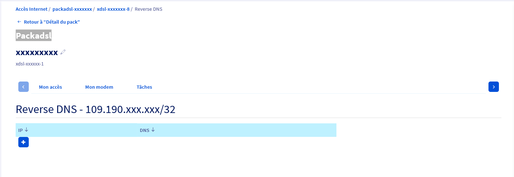

**Dernière mise à jour le 02/06/2022**

## Objectif

Le Reverse DNS, aussi appelé PTR Record (ou pointer record) sert à associer une adresse IP à un enregistrement de nom de domaine.

Il est important de l'utiliser car l'absence de Reverse DNS peut être considérée comme une erreur et peut entrainer le refus d'accès à certains services.
Par exemple, dans le cadre d'utilisation d'un serveur mail, si l'e-mail est envoyé depuis un serveur ayant une adresse IP sans résolution DNS appropriée, il a de grandes chances d'être refusé par le serveur de réception.

## Prérequis

- Un nom de domaine (ou sous-domaine) redirigeant vers l'adresse IP de votre accès xDSL ou fibre.
- Un accès xDSL ou fibre OVHcloud.

Il est également possible de configurer les Reverse DNS des blocs IP fournis en option sur nos accès.<br>
Retrouvez plus d'informations sur notre guide « [Commander et gérer un bloc IP /29](../comment-commander-et-gerer-un-bloc-ip-29/) ».

## En pratique

### Vérifier que le nom de domaine est bien configuré

Nous allons faire le test avec ovhtelecom.fr.

#### Sous Windows

Ouvrez l'invite de commande et saisissez :

```console
nslookup ovhtelecom.fr
```

Vous obtiendrez une réponse du type :

```console
Name : www.ovhtelecom.fr Address : 198.27.92.21
```

#### Sous MAC et Linux

Ouvrez le terminal et saisissez :

```console
host ovhtelecom.fr
```

Vous obtiendrez une réponse du type :

```console
ovhtelecom.fr has address 198.27.92.21
```

Dans les deux cas, nous voyons que le nom de domaine redirige bien vers notre adresse IP 198.27.92.21.<br>

Si ce n'est pas le cas, nous vous invitons à vous rapprocher de votre bureau d'enregistrement afin de configurer votre nom de domaine. Si OVHcloud est votre bureau d'enregistrement, consultez le guide « [Editer une zone DNS OVHcloud](https://docs.ovh.com/fr/domains/editer-ma-zone-dns/) ».

Nous pouvons maintenant passer à l'étape suivante qui est la configuration de notre Reverse DNS de l'adresse 198.27.92.21.

### Configurer le Reverse DNS de votre connexion

La configuration du Reverse DNS s'effectue dans l'Espace Client Telecom :

- Connectez-vous à votre [espace client OVHcloud](https://www.ovh.com/auth/?action=gotomanager&from=https://www.ovh.com/fr/&ovhSubsidiary=fr), partie `Telecom`{.action}
- Cliquez sur `Accès Internet`{.action}.
- Cliquez sur votre packadsl `Packadsl-xxxxxxx`{.action}.
- Cliquez sur votre accès `xdsl-xxxxxxx-1`{.action}.

Dans les caractéristiques sur la droite, vous verrez apparaître votre IP publique sous cette forme : 109.190.xxx.xxx ou 151.127.xxx.xxx.

- Cliquez sur l'icône engrenage à côté de votre IP.
- Cliquez sur le `+`{.action} afin d'ajouter le reverse DNS.

{.thumbnail}

- Saisissez votre IP publique et le sous domaine souhaité puis validez.
- Saisissez le nom de domaine ou sous-domaine et cliquez sur `Suivant`{.action}. Validez à la page suivante.

Quelques minutes seront nécessaires pour que la nouvelle valeur de votre DNS soit visible sur votre espace client.

### Vérifier la configuration du Reverse DNS

Nous allons utiliser les mêmes commandes que pour la vérification de la configuration du nom de domaine mais cette fois-ci avec l'adresse IP.

#### Sous Windows

Ouvrez l'invite de commande et saisissez :

```console
nslookup 198.27.92.21
```

Vous obtiendrez une réponse du type :

```console
Name : www.ovhtelecom.fr Address : 198.27.92.21
```

#### Sous MAC et Linux

Ouvrez le terminal et saisissez :

```console
host 198.27.92.21
```

Vous obtiendrez une réponse du type :

```console
21.92.27.198.in-addr.arpa domain name pointer www.ovhtelecom.fr.
```

Dans les deux cas, nous voyons que l'adresse IP redirige bien vers le nom de domaine [ovhtelecom.fr](http://ovhtelecom.fr){.external-link}.

Votre Reverse DNS est maintenant configuré.

## Aller plus loin

Échangez avec notre communauté d'utilisateurs sur <https://community.ovh.com>.
