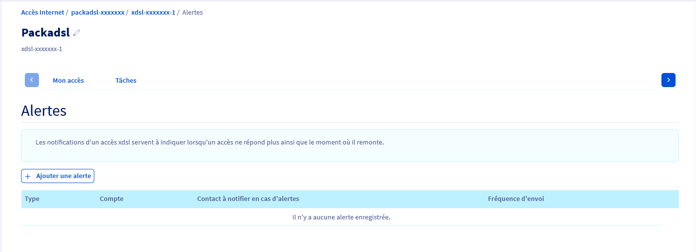

### Préambule {#préambule}

Le monitoring permet de vous alerter lorsque votre accès n'est plus joignable selon une fréquence définie. Les notifications seront effectives lorsque votre accès ne répondra plus aux requêtes ICMP (ping).
Les notifications sont envoyées par e-mail ou par SMS. (Il faut que votre compte SMS soit crédité.)

**Sommaire :**

Niveau : Débutant

------------------------------------------------------------------------

### Prérequis {#prérequis}

-   Disposer d'un accès ADSL / SDSL qui répond aux requêtes ICMP (OK par défaut sur les modems distribués par OVH).
-   Une adresse e-mail pour recevoir les notifications.
-   Un compte SMS crédité si vous souhaitez recevoir les SMS de notifications sur votre mobile.

------------------------------------------------------------------------

### Accéder au menu de gestion des alertes

Pour créer une notification par e-mail :

-	Connectez-vous à votre Espace Client : https://www.ovhtelecom.fr/manager/
-	Cliquez sur l’onglet “Accès Internet”.
-	Cliquez sur votre packadsl sur le menu de gauche (packadsl-xxxxxxx).
-	Cliquez sur votre accès internet sur la droite (xdsl-xxxxxxx-1)

Au centre de la page dans les informations générales cliquez sur “Afficher les alertes“.

Vous arrivez alors sur le formulaire de création de notification.

{.thumbnail}

-   Dans le champ "**e-mail**", entrez l'adresse à notifier.
-   Le lien "**Ajouter un e-mail supplémentaire**" vous permet d'ajouter d'autres adresses e-mails à notifier.
-   La partie "**fréquence**" vous permet de choisir la fréquence des notifications e-mail lors d'une coupure.

Si vous ajoutez une adresse commune à plusieurs accès, vous recevrez un seul e-mail contenant toutes les notifications de coupure.

-   Cliquez sur le bouton "**Suivant**" pour accéder à la confirmation de création.
-   Cliquez sur "**Oui**" pour valider la création.
-   
------------------------------------------------------------------------

### Notifications par e-mail {#notifications-par-e-mail}

Pour créer une notification par e-mail :

-	Cliquez sur “Ajouter une alerte”. 
-	Sélectionnez “E-mail” dans le menu déroulant correspondant au type de notification.
-	Indiquez le mail à notifier et la fréquence.
-	Cliquez sur le bouton valider en bout de ligne.

La partie “fréquence” vous permet de choisir la fréquence des notifications e-mail lors d’une coupure. Si vous sélectionnez une fois vous recevrez un mail à la coupure et un mail au rétablissement de l’accès.

Si vous ajoutez une adresse commune à plusieurs accès, vous recevrez un seul e-mail contenant toutes les notifications de coupure.
{.thumbnail}

------------------------------------------------------------------------

### Notifications par SMS {#notifications-par-sms}

-	Cliquez sur “Ajouter une alerte”. 
-	Sélectionnez “SMS” dans le menu déroulant correspondant au type de notification.
-	Dans le champ “Compte SMS à débiter“, choisissez le compte SMS à utiliser pour envoyer les notifications.
-	Dans le champ “Numéro de téléphone“, entrez le numéro de mobile à notifier au format International (00336xxxxxxx).
-	Dans la partie “Fréquence“, choisissez la fréquence des notifications SMS lors d’une coupure.
-	Cliquez sur le bouton valider en bout de ligne.

{.thumbnail}

Vous recevrez un SMS indiquant la perte de votre accès.

{.thumbnail}

------------------------------------------------------------------------

### Supprimer les notifications {#supprimer-les-notifications}

Vous pouvez, si vous le souhaitez, supprimer une ou la totalité des notifications en place. Pour ce faire :
•	Cliquez sur la poubelle correspondant à la notification à supprimer.
•	Cliquez sur “OK” pour confirmer la suppression.

