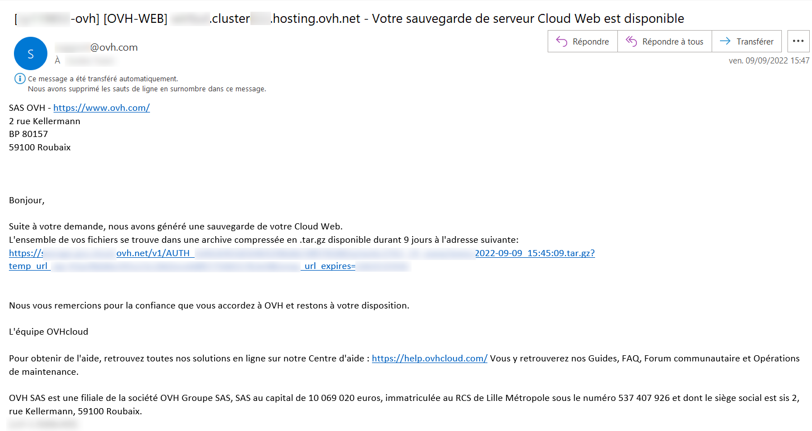

**Dernière mise à jour le 09/09/2022**

## Objectif

Votre Cloud Web dispose d'un espace de stockage dans lequel vous pouvez héberger vos sites ou applications. Lors de votre utilisation, il est possible que vous ayez besoin de récupérer une sauvegarde de son espace FTP.

> [!primary]
> 
> Les sauvegardes proposées par OVHcloud pour les Cloud Web sont non-contractuelles. Celles-ci sont proposées en complément de vos services pour de vous aider dans les situations urgentes. Nous vous recommandons de réaliser régulièrement vos propres sauvegardes de sécurité pour pallier à d'éventuelles pertes de données.
> 
> Lorsque vous effectuez une sauvegarde de sécurité pour votre site et que vous utilisez une base de données, faites également une sauvegarde de celle-ci. N'hésitez pas à consultez notre guide pour [récupérer une sauvegarde de votre base de données](https://docs.ovh.com/fr/hosting/exportation-bases-donnees/).
> 

**Découvrez comment effectuer une sauvegarde FTP de votre Cloud Web.**

## Prérequis

- Disposer d'un [hébergement Cloud Web](https://www.ovhcloud.com/fr/web-hosting/cloud-web-offer/){.external}
- Être connecté à votre [espace client OVHcloud](https://www.ovh.com/auth/?action=gotomanager&from=https://www.ovh.com/fr/&ovhSubsidiary=fr){.external}.
- Avoir accès à votre adresse mail de "contact" associée à votre identifiant client.

## En pratique

### Sauvegardes disponibles

Le Cloud Web peut mettre à disposition jusqu'à 4 dates de sauvegardes automatiques :

- le jour même, effectuée après 0 h 00.
- la veille, effectuée après 0 h 00.
- l’avant-veille, effectuée après 0 h 00.
- le dimanche précédent, effectuée après 01 h 00.

Seuls les sauvegardes citées ci-dessus pourront être proposée par OVHcloud. Sous réserve que votre Cloud Web existait déjà aux dates indiquées et sous réserve des disponibilités de l'infrastructure au moment de la demande de la sauvegarde.

### Générer la sauvegarde

Contrairement aux hébergements mutualisés OVHcloud, il est impossible de faire une restauration FTP "en un clic" depuis [l'espace client OVHcloud](https://www.ovh.com/auth/?action=gotomanager&from=https://www.ovh.com/fr/&ovhSubsidiary=fr){.external}.

La sauvgarde est générée puis envoyée par mail à l'adresse mail associée à l'identifiant client "Administrateur" du Cloud Web.

Pour générer la sauvegarde, connectez-vous sur votre [espace client OVHcloud](https://www.ovh.com/auth/?action=gotomanager&from=https://www.ovh.com/fr/&ovhSubsidiary=fr){.external},rendez-vous dans la partie "Web Cloud", cliquez sur `Hébergements`{.action}, puis sur le Cloud Web concerné. Sélectionnez l'onglet `FTP - SSH`{.action} et cliquez sur le bouton `Générer une sauvegarde`{.action} à droite.

{.thumbnail}

Dans la fenêtre qui s'ouvre, sélectionnez l'une des sauvegardes disponibles puis cliquez sur `Suivant`{.action}.

{.thumbnail}

Une seconde fenêtre apparaît en vous précisant que le fichier de sauvegarde vous sera envoyé par e-mail et qu'aucune restauration automatique sur votre Cloud Web ne sera faite par OVHcloud :

{.thumbnail}

Il ne vous reste plus qu'à `confirmer`{.action} votre demande.

Si la génération de la sauvegarde est bien lancée, vous devez visualiser l'encard suivant dans votre [espace client OVHcloud](https://www.ovh.com/auth/?action=gotomanager&from=https://www.ovh.com/fr/&ovhSubsidiary=fr){.external} :

{.thumbnail}

### Récupérer la sauvegarde

Une fois la génération de la sauvegarde finalisée, vous recevez un mail sur l'adresse mail associée à l'identifiant "Administrateur" de votre Cloud Web. Ce dernier contient un lien de téléchargement valable 9 jours à compter de la réception du mail :

{.thumbnail}

Le fichier ainsi téléchargé est au format *.tar.gz*.

### Restaurer votre sauvegarde

Une fois vos fichiers téléchargés, vous pourrez vous [connecter à votre espace FTP](https://docs.ovh.com/fr/hosting/connexion-espace-stockage-ftp-hebergement-web/) à l'aide d'un logiciel FTP tel que [Filezilla](https://docs.ovh.com/fr/hosting/mutualise-guide-utilisation-filezilla/) puis remplacer les fichiers que vous souhaitez remplacer par ceux récupérés.

> [!success]
>
> Utilisez bien les ports indiqués dans votre [espace client OVHcloud](https://www.ovh.com/auth/?action=gotomanager&from=https://www.ovh.com/fr/&ovhSubsidiary=fr){.external} pour les connexions en SFTP et SSH car le port 22 ne sera pas fonctionnel pour votre Cloud Web.
>

## Aller plus loin

[Se connecter à l’espace de stockage de son hébergement Web](https://docs.ovh.com/fr/hosting/connexion-espace-stockage-ftp-hebergement-web/){.external}

[Se connecter à l'aide du logiciel Filezilla](https://docs.ovh.com/fr/hosting/mutualise-guide-utilisation-filezilla/)

Pour des prestations spécialisées (référencement, développement, etc), contactez les [partenaires OVHcloud](https://partner.ovhcloud.com/fr/).

Si vous souhaitez bénéficier d'une assistance à l'usage et à la configuration de vos solutions OVHcloud, nous vous proposons de consulter nos différentes [offres de support](https://www.ovhcloud.com/fr/support-levels/).

Échangez avec notre communauté d'utilisateurs sur <https://community.ovh.com>
