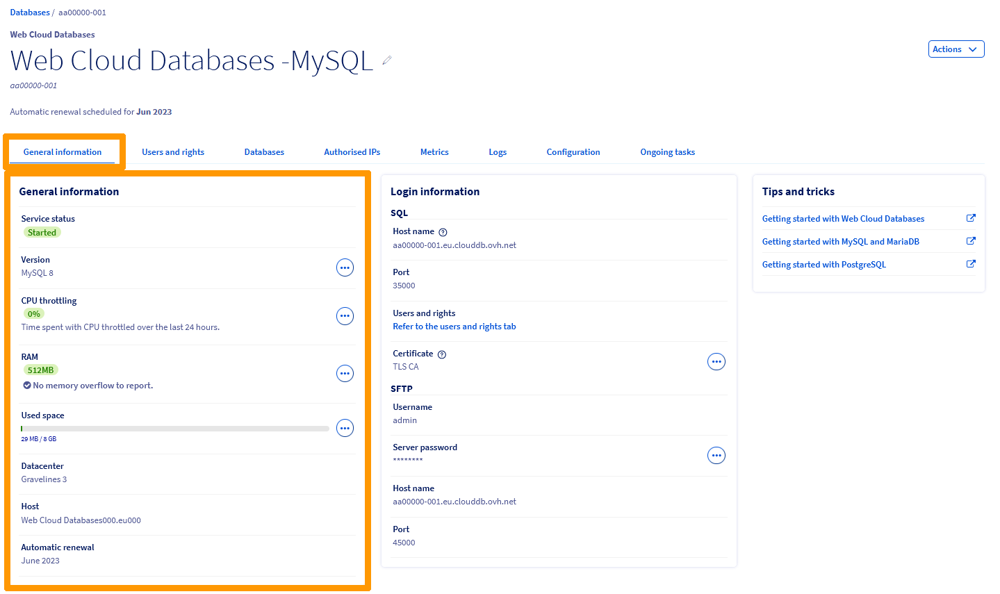
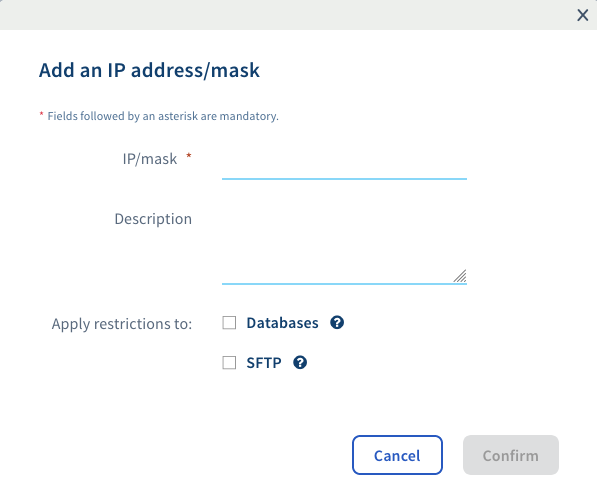
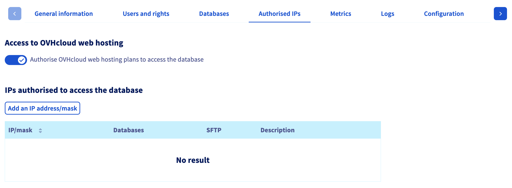

> [!primary]
> Tłumaczenie zostało wygenerowane automatycznie przez system naszego partnera SYSTRAN. W niektórych przypadkach mogą wystąpić nieprecyzyjne sformułowania, na przykład w tłumaczeniu nazw przycisków lub szczegółów technicznych. W przypadku jakichkolwiek wątpliwości zalecamy zapoznanie się z angielską/francuską wersją przewodnika. Jeśli chcesz przyczynić się do ulepszenia tłumaczenia, kliknij przycisk "Zgłóś propozycję modyfikacji" na tej stronie.
>

**Ostatnia aktualizacja z dnia 24-04-2023**

## Wprowadzenie

Za pomocą serwerów baz Web Cloud Databases możesz wpłynąć na globalne parametry serwera. Możesz również wyświetlić aktywność swojego serwera. 

**Dowiedz się, jak skonfigurować i zoptymalizować serwer baz danych.**

## Wymagania początkowe

- Posiadanie [instancji Web Cloud Databases](https://www.ovh.pl/cloud/cloud-databases/) (zawartej w ofercie[hostingu www Performance](https://www.ovhcloud.com/pl/web-hosting/).
- Dostęp do [Panelu klienta OVHcloud](https://www.ovh.com/auth/?action=gotomanager&from=https://www.ovh.pl/&ovhSubsidiary=pl).

## W praktyce

### Wyświetl ogólne informacje o serwerze baz danych

W [Panelu klienta OVHcloud](https://www.ovh.com/auth/?action=gotomanager&from=https://www.ovh.pl/&ovhSubsidiary=pl) przejdź do sekcji `Web Cloud Databases`{.action}, a następnie do odpowiedniej instancji SQL. Następnie przejdź do sekcji `Informacje ogólne`{.action}.

W zakładce tej znajdziesz ważne informacje dotyczące Twojej instancji SQL. Prosimy o poświęcenie kilku minut na sprawdzenie, czy wyświetlane informacje są poprawne lub zgodne z poniższymi wskazówkami.

|Informacja|Szczegóły|
|---|---|
|Status usługi|Pokazuje, czy instancja jest uruchomiona, w trakcie restartu lub zawieszona. Twoja instancja musi być uruchomiona, abyś mógł przeprowadzać na niej działania.|
|Typ|Pokazuje system baz danych używany przez serwer. Jeśli nie masz pewności, czy stosowany typ jest prawidłowy, wiedz, że najczęściej wybieranym jest "MySQL", ale istnieją również inne (PostgreSQL, MariaDB). Na przykład, jeśli Twoja strona WWW korzysta z modułu WordPress, system MySQL jest najlepiej do tego dopasowany.|
|Wersja|Pokazuje wersję systemu baz danych używaną przez serwer. Upewnij się, czy Twoja strona WWW jest kompatybilna z wybraną wersją.|
|Saturacja CPU|Pokazuje czas procesora podczas wysycenia w ciągu ostatnich 24 godzin.|
|RAM|Pokazuje pamięć operacyjną dostępną dla Twojej instancji oraz ewentualne przekroczenia pamięci. Serwer baz danych ma dedykowane i gwarantowane zasoby, jakimi jest pamięć RAM. Jeśli zajdzie taka potrzeba, możesz zwiększyć pamięć RAM, jeśli zużyjesz wszystkie zasoby pamięci Twojej instancji.|
|Infrastruktura|Pokazuje infrastrukturę używaną przez Twoją instancję. Jest to wewnętrzne oznaczenie infrastruktury OVHcloud.|
|Centrum danych|Pokazuje centrum danych, w którym została uruchomiona instancja. Upewnij się, czy centrum danych Twojej instancji jest takie samo, jak centrum danych hostingu OVHcloud, na którym Twoja strona WWW jest lub będzie hostowana.|
|Host|Pokazuje serwer OVHcloud, na którym utworzona jest Twoja instancja. Jest to wewnętrzne oznaczenie infrastruktury OVHcloud i może być wykorzystywane w komunikatach dotyczących [incydentów OVHcloud](https://web-cloud.status-ovhcloud.com/).|

{.thumbnail}

## Zarządzaj dostępami

Usługa Web Cloud Databases jest dostępna z poziomu hostingu OVHcloud lub/i z sieci publicznej.

#### Zatwierdź adres IP

Aby uzyskać dostęp do instancji Web Cloud Databases, należy wskazać adresy IP lub zakresy adresów IP, które mogą się łączyć z Twoimi bazami danych.

W Panelu [klienta OVHcloud](https://www.ovh.com/auth/?action=gotomanager&from=https://www.ovh.pl/&ovhSubsidiary=pl), przejdź do sekcji `Web Cloud Databases`{.action}, a następnie do odpowiedniej instancji Web Cloud Databases. 

Kliknij kartę Autoryzowane `IP`{.action}, a następnie przycisk `Dodaj adres IP/maskę`{.action}.

{.thumbnail}

W oknie, które się wyświetli wskaż adres IP lub maskę, którą chcesz autoryzować w `IP/maska`{.action}. Możesz również dodać opis. Zdecyduj, czy chcesz udzielić dostępu wyłącznie do baz danych czy również do SFTP. Następnie kliknij `Zatwierdź`{.action}.

{.thumbnail}

#### Autoryzacja połączeń do hostingu OVHcloud

W przypadku hostingu OVHcloud możesz po prostu zaznaczyć opcję `Zezwól hostingowi OVHcloud na dostęp do bazy danych`.

{.thumbnail}

### Zmień ofertę Web Cloud Databases <a name="modify-ram-web-cloud-db"></a>

> [!warning]
> 
> Jeśli Twoja usługa Web Cloud Databases jest powiązana z usługą hostingu www **Performance**, musisz wcześniej odłączyć ofertę Web Cloud Databases od hostingu **Performance**, aby przejść na wyższą ofertę.
>
> Aby odłączyć ofertę Web Cloud Databases powiązaną z hostingiem www **Performance**, przejdź do [Panelu klienta OVHcloud](https://www.ovh.com/auth/?action=gotomanager&from=https://www.ovh.pl/&ovhSubsidiary=pl). Kliknij kartę `Web Cloud`{.action}, a następnie odpowiedni hosting w zakładce `Hosting`{.action}, która pojawi się w kolumnie z lewej strony. 
>
> Na nowej stronie `Informacje ogólne`{.action}, która się wyświetla, znajduje się ramka zatytułowana `Konfiguracja`{.action} w centrum strony. Po prawej stronie pozycji `Web Cloud Databases`{.action} kliknij przycisk `...`{.action} a następnie na `Odłącz`{.action}. Wybierz najkrótszy okres odnowienia i postępuj zgodnie z instrukcjami aż do zatwierdzenia zamówienia.
>
> **Operacja ta jest nieodwracalna i usługa Web Cloud Databases będzie odpłatna niezależnie od hostingu Performance.**
>

Aby zmienić ofertę Web Cloud Databases, przejdź do Panelu [klienta OVHcloud](https://www.ovh.com/auth/?action=gotomanager&from=https://www.ovh.pl/&ovhSubsidiary=pl). Kliknij kartę `Web Cloud`, a następnie `Web Cloud Databases`{.action}. Wybierz nazwę serwera baz danych.
W zakładce **"Informacje ogólne"**, która jest wyświetlana domyślnie, kliknij `...`{.action} po prawej stronie słowa "RAM", a następnie `Zmień ilość pamięci RAM`{.action}, aby przejść do zlecenia zamówienia na tą zmianę.

{.thumbnail}

Wybierz żądaną ilość pamięci RAM i kliknij `Dalej`{.action}. Następnie możesz wybrać żądany okres.

> [!primary]
>
> Prorata zostanie wpłacona, jeśli pozostaniesz kilka miesięcy przed wygaśnięciem usługi. Kwota proporcjonalna zostanie obliczona na podstawie daty wygaśnięcia instancji Web Cloud Databases, a nie na podstawie daty wygaśnięcia zamówienia.
> 

Po zatwierdzeniu regulaminów zostaniesz przekierowany do zamówienia, abyś mógł uregulować tą zmianę. Zmiana zostanie wykonana w ciągu kilku godzin.

> [!warning]
>
> Jeśli dysponujesz aktualnie darmowym Web Cloud Databases dzięki hostingowi Performance, zmiana oferty straci jej bezpłatność.
> 

### Zmiana konfiguracji serwera baz danych

Przejdź do Panelu [klienta OVHcloud](https://www.ovh.com/auth/?action=gotomanager&from=https://www.ovh.pl/&ovhSubsidiary=pl). Kliknij kartę `Web Cloud`, a następnie `Web Cloud Databases`{.action}. Wybierz nazwę prywatnego serwera SQL.

#### Instancja MySQL i MariaDB

- Kliknij kartę `Konfiguracja`.

W polu **"Ogólna konfiguracja MySQL"** znajdziesz konfigurację aktualnie zdefiniowaną dla Twojej bazy danych. Możesz ją zmienić, po czym kliknąć `Zastosuj`{.action}.

{.thumbnail}

- **Rozmiar**: Katalog plików tymczasowych. **/dev/shm** odpowiada instancji pamięci RAM. **/tmp** odpowiada instancji dysku twardego.
- **MaxAllowedPacket**: Maksymalny rozmiar pakietów
- **Max_user_connections**: Liczba autoryzowanych jednoczesnych połączeń na użytkownika.
- **Automatycznie**: Definiuje, czy zapytania są automatycznie zatwierdzane (committed) czy nie.
- **Interactive_timeout**: Czas w sekundach, podczas których serwer czeka na działanie w interaktywnym połączeniu przed jego zamknięciem.
- **InnodbBufferPoolSize**: Wybór rozmiaru pamięci buforowej.
- **Maksymalna liczba połączeń**: Liczba autoryzowanych jednoczesnych połączeń do bazy danych.
- **Wait_timeout**: Czas w sekundach, podczas których serwer czeka na działanie w nieinteraktywnym połączeniu przed jego zamknięciem.
- **Event_scheduler**: Umożliwia uruchamianie wykonywania zaprogramowanych zapytań bezpośrednio na serwerze MySQL.
- **sql_mode**: Opcja **sql_mode** wpływa na składnię SQL oraz sprawdzanie poprawności danych przez MySQL lub MariaDB.

> [!primary]
> Jeśli na Twojej stronie pojawi się błąd wskazujący **"Too many connections"**, jest to spowodowane przekroczeniem liczby jednoczesnych połączeń do Twojej bazy danych.
> Możesz następnie zwiększyć zmienną **"MaxConnections"**, jeśli nie ma już maksymalnej wartości.
>

> [!primary]
>
> <b>Tmpdir</b>:
>
> - /dev/shm: Serwer baz danych przypisze połowę pamięci RAM do tego katalogu, aby uzyskać większą wydajność.
>
> - /tmp: Serwer przydzieli nielimitowaną przestrzeń dla tego katalogu na dysku twardym. Zalecamy korzystanie z tego katalogu tylko w przypadku sporadycznych, ciężkich operacji.
>

> [!primary]
>
> <b>sql_mode</b>:
>
> &emsp;&emsp;Tryb domyślny dla MariaDB 10.1:
> <pre class="highlight command-prompt"> <span class="prompt">NO_ENGINE_SUBSTITUTION,NO_AUTO_CREATE_USER</span> </pre>
> 
> &emsp;&emsp;Tryb domyślny dla MariaDB 10.2 i nowszych wersji:
> <pre class="highlight command-prompt"> <span class="prompt">STRICT_TRANS_TABLES,ERROR_FOR_DIVISION_BY_ZERO,NO_AUTO_CREATE_USER,NO_ENGINE_SUBSTITUTION</span> </pre>
>
> &emsp;&emsp;Tryb domyślny dla MySQL 5.6:
> <pre class="highlight command-prompt"> <span class="prompt">NO_ENGINE_SUBSTITUTION</span> </pre>
>
> &emsp;&emsp;Tryb domyślny dla MySQL 5.7 i nowszych wersji:
> <pre class="highlight command-prompt"> <span class="prompt">ONLY_FULL_GROUP_BY,STRICT_TRANS_TABLES,NO_ZERO_IN_DATE,NO_ZERO_DATE,ERROR_FOR_DIVISION_BY_ZERO,NO_ENGINE_SUBSTITUTION</span> </pre>
>
> Zalecamy, aby zawsze używać trybu domyślnego, chyba że baza danych została zaktualizowana z wersji mającej inny tryb domyślny niż bieżąca wersja.
>

Wprowadź niezbędne zmiany i kliknij `Zatwierdź`{.action}.

> [!warning]
>
> Każda zmiana wymaga restartu serwera baz danych.
>

#### Instancja PostgreSQL

Nie można zmienić konfiguracji instancji PostgreSQL. 

Możesz jednak aktywować rozszerzenia Twoich baz danych. W tym celu przejdź do zakładki `Bazy danych`, kliknij ikonę tabeli bazy danych w kolumnie **"Rozszerzenia"**

{.thumbnail}

### Zmiana wersji MySQL, PostgreSQL lub MariaDB serwera baz danych

Aby poznać wersję MySQL, PostgreSQL lub MariaDB Twojego serwera baz danych, przejdź do zakładki **"Informacje ogólne"** po wybraniu serwera baz danych.

Aktualna wersja pojawia się w wierszu **"Wersja"**.

Aby zmienić tę wersję, kliknij `Zmień wersję`{.action}.

{.thumbnail}

#### Jak poznać dokładną wersję PostgreSQL, której używam?

Wprowadź to polecenie w phpPgAdmin klikając na **bazę danych**, sekcja **"SQL"**, a następnie klikając `Uruchom`{.action}:

```sql
select version();
```

#### Jak poznać dokładną wersję MySQL lub MariaDB, której używam?

W tym celu wprowadź komendę w phpMyAdmin, w rubryce **"SQL"**, następnie kliknij `Uruchom`{.action}:

```sql
show variables like "version";
```

> [!primary]
>
> - Przed migracją do wyższej wersji upewnij się, że Twoja baza danych jest kompatybilna z wybraną wersją.
> - Zmiana zostanie wykonana w ciągu kilku minut.
>

> [!warning]
>
> Nie można przejść bezpośrednio z najstarszej wersji do najnowszej. Korzystanie z wszystkich wersji pośrednich jest obowiązkowe.
> 

### Logi i metryki

#### Statystyki czasu wykonywania zapytań

Dzięki temu możesz wyświetlić czas wykonywania zapytań na serwerze baz danych w ciągu ostatnich 24 godzin.

Przejdź do Panelu [klienta OVHcloud](https://www.ovh.com/auth/?action=gotomanager&from=https://www.ovh.pl/&ovhSubsidiary=pl). Kliknij kartę `Web Cloud`, a następnie `Web Cloud Databases`{.action}. Wybierz nazwę serwera baz danych.

Przejdź do karty `Metryki` serwera baz danych. Wykres **"Statystyki czasu wykonywania zapytań"**.

{.thumbnail}

#### Dostęp do logów "Slow Query"

> **Definicja "slow query log"**
> 
> Są to nieoptymalne zapytania, które trwają dłużej. Wartość jest ustawiona na 1 sekundę dla serwerów baz danych w zmiennej **"long_query_time"**.

Logi te, nazywane **"slow-query.log"**, mogą zostać odzyskane z katalogu głównego przestrzeni SFTP Twojego serwera baz danych.

Przejdź do Panelu [klienta OVHcloud](https://www.ovh.com/auth/?action=gotomanager&from=https://www.ovh.pl/&ovhSubsidiary=pl). Kliknij kartę `Web Cloud`, a następnie `Web Cloud Databases`{.action}. Wybierz nazwę serwera baz danych.

W zakładce `informacje ogólne` sekcja **"SFTP"** w polu **"Informacje o logowaniu"**

{.thumbnail}

Aby zalogować się przez **SFTP**, możesz skorzystać z programu Filezilla i z niniejszego przewodnika: [ "Korzystanie z programu FileZilla na Twoim hostingu"](https://docs.ovh.com/pl/hosting/hosting_www_przewodnik_dotyczacy_korzystania_z_programu_filezilla/).

Jeśli ten plik jest pusty, to znaczy, że nie masz żadnych nieoptymalnych zapytań.

#### Monitoruj zużytą pamięć RAM

Przejdź do Panelu [klienta OVHcloud](https://www.ovh.com/auth/?action=gotomanager&from=https://www.ovh.pl/&ovhSubsidiary=pl). Kliknij kartę `Web Cloud`, a następnie `Web Cloud Databases`{.action}. Wybierz nazwę serwera baz danych.

Przejdź do karty `Metryki` w Panelu klienta. Wykres **"Statystyki pamięci RAM"**.

{.thumbnail}

#### Monitorowanie liczby połączeń na minutę

Wykres ten pozwala na śledzenie, w ciągu ostatnich 24 godzin, obciążenia połączeń na minutę na serwerze bazy danych.

Przejdź do Panelu [klienta OVHcloud](https://www.ovh.com/auth/?action=gotomanager&from=https://www.ovh.pl/&ovhSubsidiary=pl). Kliknij kartę `Web Cloud`, a następnie `Web Cloud Databases`{.action}. Wybierz nazwę serwera baz danych.

Przejdź do karty `Metryki` w Panelu klienta. Wykres **"Statystyki całkowitej liczby połączeń na minutę"**.

{.thumbnail}

### Optymalizacja bazy danych

Zalecamy optymalizację bazy danych w celu zapewnienia jej wysokiej wydajności. Wydajność polega na tym, że informacje zawarte w bazie danych są zwracane do skryptu, który je wzywa. Wymaga to ustrukturyzowanej i zoptymalizowanej bazy danych.

#### Indeksowanie bazy danych

Aby przyspieszyć wyszukiwanie podczas zapytania, należy dodać indeks do pól używanych w klauzulach WHERE.

Przykład: regularnie wyszukujesz osób w danym mieście. Zaindeksuj pole "miasto" za pomocą następującego zapytania:

```sql
ALTER TABLE 'test' ADD INDEX ('city')
```

#### Czyszczenie bazy danych

Niektóre z Twoich danych nie są już dostępne? Poprzez ich archiwizację, Twoje tabele będą mniej wypełnione, a wyszukiwania będą trwały krócej.

#### Ograniczenie wyświetlania

Ogranicz wyświetlanie rekordów do ustalonej liczby (np. 10 na stronę), korzystając z limitowanej części zapytania SQL.

#### Łączenie zapytań

Zbierz wszystkie zapytania na początku skryptu w poniższy sposób:

```bash
connexion_base
zapytanie1
zapytanie2
...
odłączenie_bazy
Wyświetlanie
Przetwarzanie danych
Boucles ...
Wyświetlanie
...
```

#### Pobieranie tylko użytecznych danych

W zapytaniach SQL sprawdź, czy wybierasz tylko to, czego potrzebujesz, a przede wszystkim czy pamiętasz o połączeniach między tabelami.

Przykład:

```sql
(where table1.pole = tabela2.pole2)
```

#### Unikanie opcji zużywających zbyt dużo zasobów

Unikanie na przykład stosowania **"HAVING"**. Zwiększa to liczbę twoich zapytań. Podobnie należy unikać korzystania z **"GROUP BY"**, chyba że jest to bezwzględnie konieczne.

## Sprawdź również

[Lista adresów IP klastrów i hostingów](https://docs.ovh.com/pl/hosting/lista-adresow-ip-klastrow-i-hostingow-www/)

W przypadku wyspecjalizowanych usług (pozycjonowanie, rozwój, etc.) skontaktuj się z [partnerami OVHcloud](https://partner.ovhcloud.com/pl/).

Jeśli chcesz otrzymywać wsparcie w zakresie konfiguracji i użytkowania Twoich rozwiązań OVHcloud, zapoznaj się z naszymi [ofertami pomocy](https://www.ovhcloud.com/pl/support-levels/).

Dołącz do społeczności naszych użytkowników na stronie <https://community.ovh.com/en/>. 
