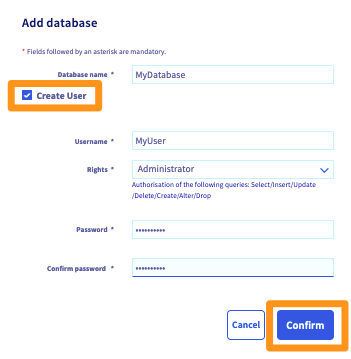
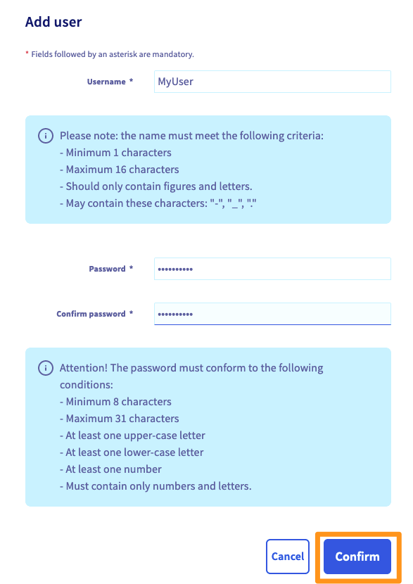

**Laatste update 28-01-2022**

## Introductie

De CloudDB-oplossing geeft u toegang tot een database-instance die dedicated, gegarandeerde resources biedt. Deze dienst biedt betere prestaties en meer flexibiliteit; het is over het algemeen bedoeld voor klanten met specifieke vereisten.

Deze handleiding legt uit hoe u aan de slag kunt met CloudDB.

## Vereisten

- U moet beschikken over een [CloudDB-instance](https://www.ovh.nl/cloud/cloud-databases/){.external}.
- U moet ingelogd zijn op uw [OVH Control Panel](https://www.ovh.com/auth/?action=gotomanager&from=https://www.ovh.nl/&ovhSubsidiary=nl){.external}.

## Instructies

### De algemene informatie van de instance weergeven

In de servicebalk links van uw [OVH Control Panel](https://www.ovh.com/auth/?action=gotomanager&from=https://www.ovh.nl/&ovhSubsidiary=nl){.external} gaat u naar het onderdeel `Databases`{.action} en vervolgens naar de betreffende SQL-instance. Ga na of u het tabblad `Algemene informatie`{.action} geopend hebt.

> [!primary]
>
> De naam van de CloudDB-service in uw OVH Control Panel bevat een deel van uw NIC handle en eindigt met drie cijfers (001 voor de eerste geïnstalleerde CloudDB-service, 002 voor de tweede, enz.).
>

U kunt hier de belangrijke informatie van uw SQL-instance raadplegen. Wij nodigen u uit om even de tijd te nemen om u ervan te verzekeren dat de weergeven informatie juist is of overeenkomt met de onderstaande aanwijzingen.

|Informatie|Details|
|---|---|
|Service status|Het is vooral zichtbaar als de instance wordt gestart, deze wordt herstart, of geblokkeerd. Uw instance moet opnieuw worden opgestart om er acties op uit te voeren.|
|Type|Toont het databasesysteem dat door de server wordt gebruikt.|
|Versie|Toont de versie van het databasesysteem dat door de server wordt gebruikt. Controleer of uw website compatibel is met de door u gekozen versie.|
|RAM|Toont het RAM-geheugen dat beschikbaar is voor uw instance, wordt ook weergegeven als u de RAM-limiet bijna overschrijdt. Uw CloudDB-instance beschikt over dedicated, gegarandeerde resources: zijn RAM-geheugen. Indien nodig kunt u het geheugen uitbreiden en worden gewaarschuwd als u het hele geheugen van uw instance gebruikt.|
|Infrastructuur|Toont de infrastructuur die door uw instance wordt gebruikt. Deze informatie is kenmerkend aan de OVH-infrastructuur.|
|Datacenter|Toont het datacenter waarin de instance is gecreëerd.|
|Host|Toont de server waarop de instance is gecreëerd.  Deze informatie is kenmerkend aan OVH‘s infrastructuur en kan worden gebruikt in onze communicatie omtrent [OVH-incidenten](http://travaux.ovh.net/){.external}.|

{.thumbnail}

### Creëer een database 

> [!primary]
>
> Deze stap is niet van toepassing op het Redis-databasesysteem.
>

Om uw eerste database op uw CloudDB-instance te maken, klikt u op het tabblad `Databases`{.action} en vervolgens op de knop `Een database toevoegen`{.action}.

{.thumbnail}

In het venster dat verschijnt, en tegelijkertijd tijdens het maken van de database, kunt het volgende kiezen:

-  **Een gebruiker aanmaken**: deze gebruiker kan verzoeken indienen bij uw database (zoals lezen, toevoegen of verwijderen van gegevens);

- **Een geautoriseerd IP-adres toevoegen**: verzoeken die afkomstig zijn van dit adres hebben toegang tot uw database.

Vul, afhankelijk van uw keuze, de gevraagde informatie in en klik op `Bevestigen`{.action}.

|Informatie|Omschrijving|
|---|---|
|Database naam|Dit is de naam van uw toekomstige database|
|Gebruikersnaam|Dit is de gebruiker die kan inloggen op uw database en query's kan uitvoeren (optioneel als het selectievakje ‘Een gebruiker aanmaken’ niet is aangevinkt).|
|Rechten|Dit zijn de rechten die aan de gebruiker worden gekoppeld; voor standaard gebruik selecteert u `Admin (Beheerder)`{.action} (optioneel als het vakje *‘Een gebruiker aanmaken’* niet is aangevinkt).|
|Het wachtwoord|Selecteer een wachtwoord en bevestig het (optioneel als het vakje *‘Een gebruiker aanmaken’* niet is aangevinkt).|
|IP/mask|Dit is het IP-adres of het IP-masker voor de server(s) geautoriseerd voor toegang tot uw databases (optioneel als het vakje *‘Een geautoriseerd IP-adres toevoegen’* niet is aangevinkt).|

> [!warning]
>
> Om veiligheidsredenen verzoeken wij u de voorwaarden te respecteren die tijdens de registratie van informatie worden aangegeven.
>

{.thumbnail}

### Creatie van een gebruiker  

> [!primary]
>
> Deze stap is niet van toepassing op het Redis-databasesysteem.
>

Deze stap is optioneel als u de gebruiker tegelijk met de database aangemaakt hebt in de vorige handeling. Voor een specifieker project kan het echter nodig zijn om meerdere gebruikers aan te maken die toegang hebben tot uw database. Eén van de gebruikers die aan uw database is gekoppeld, kan bijvoorbeeld lees- en schrijfrechten hebben terwijl de andere uitsluitend leesrechten heeft.

Als u geen extra gebruiker voor uw project nodig hebt, kunt u meteen naar de volgende stap gaan. Om een gebruiker aan te maken, klikt u naar keuze op het tabblad `Gebruikers en rechten`{.action} en vervolgens op de knop `Een gebruiker toevoegen`{.action}.

{.thumbnail}

Vul, afhankelijk van uw keuze, de gevraagde informatie in en klik op `Bevestigen`{.action}.

|Informatie|Omschrijving|
|---|---|
|Gebruikersnaam|Dit is de gebruiker die kan inloggen op uw instance. U kunt de gebruiker in de volgende stap rechten verlenen tot uw database.|
|Het wachtwoord|Voer een wachtwoord in en bevestig het.|

> [!warning]
>
> Om veiligheidsredenen verzoeken wij u de voorwaarden te respecteren die tijdens de registratie van informatie worden aangegeven.
>

{.thumbnail}

Als de gebruiker aangemaakt is, moet u er rechten aan verlenen zodat deze handelingen kan uitvoeren in uw database (zoals gegevens lezen, schrijven of verwijderen). Hiervoor klikt u op het tandwielpictogram en vervolgens op `Rechten beheren`{.action}. Op de nieuwe pagina selecteert u het gewenste recht en klikt hierop. Voor een standaard gebruik selecteert u Admin (Beheerder).

{.thumbnail}

### Importatie van een database

> [!primary]
>
> Deze stap is van toepassing als u de backup van een bestaande database wilt importeren. Als dit niet het geval is, gaat u naar de volgende stap.
>

Er zijn verschillende technieken waaruit u kunt kiezen om een database te importeren. Er is een tool beschikbaar in uw OVH Control Panel, en we gaan ons richten op deze methode. U kunt natuurlijk ook een andere methode gebruiken, als u dat liever doet en er bekend mee bent.

De onderstaande stappen laten zien hoe u een database importeert met behulp van de tool die beschikbaar is in uw OVH Control Panel.

- **Stap 1: Toegang tot de import-interface**

Ga naar het tabblad `Databases`{.action} klik op het tandwielpictogram en vervolgens op `Een bestand importeren`{.action}. In het venster dat geopend wordt, selecteert u het vakje `Een nieuw bestand importeren`{.action} en klikt vervolgens op `Volgende`{.action}.

{.thumbnail}

- **Stap 2: Selecteer en verzend het opgeslagen bestand**

Voer een bestandsnaam in waarmee u deze backup later kunt identificeren als u deze later opnieuw wilt herstellen. Selecteer vervolgens naast **Bestand** het databasebackup-bestand van uw computer en klik op `Verzenden`{.action}. Wacht even tot de interface aangeeft dat het bestand met succes verzonden is en klik op de knop `Volgende`{.action}.

{.thumbnail}

- **Stap 3: Start de database-import**

Kies tot slot of de onderstaande aanvullende opties moeten worden toegepast en klik op `Bevestigen`{.action}.

|Aanvullende opties|Omschrijving|
|---|---|
|Maak de huidige database leeg|De inhoud in de database wordt volledig verwijderd en vervangen door de inhoud van uw backup.|
|Stuur een e-mail zodra de import is voltooid|U ontvangt een e-mailmelding zodra het importeren van de database is voltooid.|

{.thumbnail} 

### Autoriseer een IP-adres

Om ervoor te zorgen dat uw CloudDB-instance toegankelijk is, moet u de IP-adressen of reeksen, die verbinding kunnen maken met uw database, invoeren. Klik hiervoor op het tabblad `Geautoriseerde IP-adressen`{.action} en klik vervolgens op `Een IP-adres / masker toevoegen`{.action}.

{.thumbnail}

In het venster dat verschijnt, voert u het IP-adres of masker in dat u wilt autoriseren in `IP/mask`{.action}, samen met een beschrijving als u dat wenst. U kunt vervolgens beslissen of u alleen toegang wilt verlenen tot de databases of tot de SFTP. Klik vervolgens op `Bevestigen`{.action}. 

{.thumbnail}

### Uw site aan de database koppelen

Nu u uw database hebt gemaakt, één of meerdere gebruikers hebt aangemaakt met toegang ertoe, en minimaal één IP-adres hebt geautoriseerd in uw CloudDB-instance, hoeft u alleen nog maar uw website te koppelen aan de database. Deze stap kan op meerdere manieren worden uitgevoerd, afhankelijk van de site en de CMS die u gebruikt (WordPress, Joomla! enz.) of de stap waarin u zich bevindt indien u een website aan het installeren bent.

Om deze handeling met succes te kunnen uitvoeren, moet u over de volgende vijf gegevens beschikken:

|Informatie|Omschrijving|
|---|---|
|Naam van de database|De naam die u invoerde toen u uw database aanmaakte U kunt alle databases die in uw CloudDB-instance zijn gemaakt, bekijken op het tabblad `Databases`{.action}.|
|Gebruikersnaam|De naam van de gebruiker die u hebt ingevoerd toen u de database aanmaakte, of de naam van een extra gebruiker die u in een later stadium hebt gemaakt. U kunt alle gebruikers die in uw CloudDB-instance zijn gemaakt, bekijken op het tabblad `Gebruikers en rechten`{.action}.|
|Gebruikerswachtwoord|Het wachtwoord dat aan de gebruiker is gekoppeld, dat tijdens de vorige stappen is ingesteld.|
|Server hostnaam|De server die moet worden ingevoerd om uw website aan te sluiten op uw database. U kunt deze informatie in uw Control Panel openen door naar het gedeelte **Verbindingen (Inloggen)** te gaan en vervolgens het tabblad `Algemene informatie`{.action}.|
|Serverpoort|De poort voor verbinding met uw CloudDB-instance, zodat uw website verbinding kan maken met uw database. U kunt deze informatie in uw Control Panel openen door naar het gedeelte **Verbindingen (Inloggen)** te gaan en vervolgens het tabblad `Algemene informatie`{.action}.|

> [!warning]
>
> In zeldzame gevallen wordt het veld `poort`{.action} niet voorgesteld in de configuratie van uw site. Als dit het geval is, moet u dit veld toevoegen na de hostnaam van uw server, en scheiden door *:* (voorbeeld: hostnaam:poort).
>

{.thumbnail}

## Verder

Ga in gesprek met andere communityleden op <https://community.ovh.com/en/>.