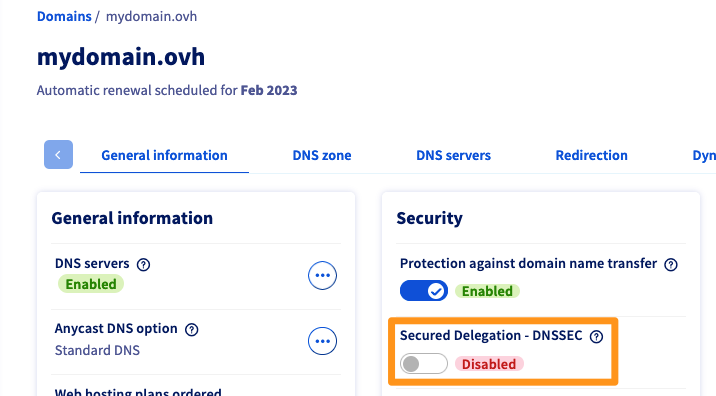

**Ultimo aggiornamento: 18/07/2018**

## Obiettivo

I server DNS contengono le configurazioni dei domini che, convenzionalmente, consentono di collegare il dominio a uno o più server che ospitano un sito Internet o caselle email. Negli ultimi anni alcuni hacker hanno sviluppato tecniche di poisoning a danno dei server DNS, riuscendo a reindirizzare il traffico verso le proprie macchine. Utilizzare DNSSEC è una valida soluzione per proteggere i domini da questo tipo di attacchi.

**Questa guida ti mostra come attivare il protocollo DNSSEC per rendere sicuro il tuo dominio in caso di DNS Cache Poisoning.**  
Per maggiori informazioni sul funzionamento di questa protezione, consulta la pagina relativa al [servizio DNSSEC](https://www.ovhcloud.com/it/domains/dnssec/){.external}.

## Prerequisiti

- Disporre di un [dominio](https://www.ovhcloud.com/it/domains/){.external} registrato in OVH
- L’estensione del dominio deve essere compatibile con DNSSEC
- Avere accesso allo [Spazio Cliente OVH](https://www.ovh.com/auth/?action=gotomanager&from=https://www.ovh.it/&ovhSubsidiary=it){.external}, sezione `Web Cloud`{.action}

## Procedura

Attivare DNSSEC è possibile seguendo due modalità:

- **se il dominio utilizza server DNS OVH**, l’operazione è disponibile direttamente dallo Spazio Cliente

- **se il dominio non utilizza server DNS OVH**, contatta il provider responsabile della sua configurazione. Se ti occupi personalmente della gestione installa manualmente DNSSEC consultando, se necessario, la documentazione disponibile online.

> [!primary]
>
> Per verificare se il tuo dominio utilizza la configurazione OVH accedi allo [Spazio Cliente](https://www.ovh.com/auth/?action=gotomanager&from=https://www.ovh.it/&ovhSubsidiary=it){.external}, seleziona il tuo servizio nella sezione `Domini`{.action} della colonna a sinistra e clicca sulla scheda `Server DNS`{.action}.
>

### Step 1: accedi alla gestione del dominio

Accedi alla sezione `Web Cloud` dello [Spazio Cliente OVH](https://www.ovh.com/auth/?action=gotomanager&from=https://www.ovh.it/&ovhSubsidiary=it){.external} e clicca su `Hosting`{.action} nel menu a sinistra.

Visualizzi una tabella con tutte le informazioni generali del dominio. 

{.thumbnail}

### Step 2: gestisci il DNSSEC del dominio

Sempre nella scheda `Informazioni generali`{.action} è possibile verificare lo stato di attivazione del DNSSEC sul dominio.

L’informazione è disponibile nel riquadro `Sicurezza`, sotto la voce `Delegazione Sicura (DNSSEC)`.

{.thumbnail}

Per attivare e disattivare DNSSEC è sufficiente spostare il pulsante da sinistra verso destra (e viceversa) e confermare la modifica nella nuova finestra.

{.thumbnail}

### Step 3: attendi la propagazione delle modifiche

Una volta completata l’operazione attendi il tempo necessario alla sua elaborazione. L’attivazione e disattivazione di DNSSEC potrebbe richiedere fino a 24 ore. 

## Per saperne di più

Contatta la nostra Community di utenti all’indirizzo <https://community.ovh.com/en/>.