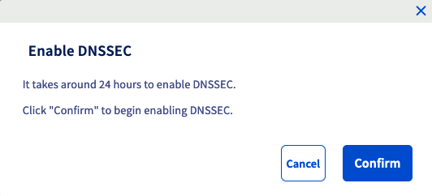

> [!primary]
> Questa traduzione è stata generata automaticamente dal nostro partner SYSTRAN. I contenuti potrebbero presentare imprecisioni, ad esempio la nomenclatura dei pulsanti o alcuni dettagli tecnici. In caso di dubbi consigliamo di fare riferimento alla versione inglese o francese della guida. Per aiutarci a migliorare questa traduzione, utilizza il pulsante "Modifica" di questa pagina.
>

**Ultimo aggiornamento: 19/10/2022**

## Obiettivo

I server DNS contengono le configurazioni dei domini che, convenzionalmente, consentono di collegare il dominio a uno o più server che ospitano un sito Internet o caselle email. Negli ultimi anni alcuni hacker hanno sviluppato tecniche di poisoning a danno dei server DNS, riuscendo a reindirizzare il traffico verso le proprie macchine. Utilizzare DNSSEC è una valida soluzione per proteggere i domini da questo tipo di attacchi.

**Questa guida ti mostra come attivare il protocollo DNSSEC per rendere sicuro il tuo dominio in caso di DNS Cache Poisoning.**  
Per maggiori informazioni sul funzionamento di questa protezione, consulta la pagina relativa al [servizio DNSSEC](https://www.ovhcloud.com/it/domains/dnssec/){.external}.

## Prerequisiti

- Disporre di un [dominio](https://www.ovhcloud.com/it/domains/){.external} registrato in OVHcloud
- L’estensione del dominio deve essere compatibile con DNSSEC
- Avere accesso allo [Spazio Cliente OVHcloud](https://www.ovh.com/auth/?action=gotomanager&from=https://www.ovh.it/&ovhSubsidiary=it){.external}, sezione `Web Cloud`{.action}

## Procedura

Attivare DNSSEC è possibile seguendo due modalità:

- **se il dominio utilizza server DNS OVHcloud**, l’operazione è disponibile direttamente dallo Spazio Cliente

- **se il tuo dominio non utilizza i server DNS OVHcloud**, contatta il provider che gestisce la configurazione dei DNS e richiedi tutti i parametri. Accedi alla sezione `Web Cloud`{.action} Seleziona `Domini`{.action}, quindi seleziona il dominio in questione dalla lista.
Clicca sulla scheda `Record DS`{.action}, quindi sul pulsante `Modifica`{.action} a destra e infine sul pulsante `+`{.action}.
Puoi ora completare i 4 campi, "Key Tag", "Flag", "Algoritmo", "Chiave pubblica (codificata in base64)", con i dati forniti dal tuo provider attuale.

> [!primary]
>
> Per verificare se il tuo dominio utilizza la configurazione OVHcloud accedi allo [Spazio Cliente](https://www.ovh.com/auth/?action=gotomanager&from=https://www.ovh.it/&ovhSubsidiary=it){.external}, seleziona il tuo servizio nella sezione `Domini`{.action} e clicca sulla scheda `Server DNS`{.action}.
>

### Step 1: accedi alla gestione del dominio

Accedi alla sezione `Web Cloud`{.action} dello [Spazio Cliente OVHcloud](https://www.ovh.com/auth/?action=gotomanager&from=https://www.ovh.it/&ovhSubsidiary=it){.external} e clicca su `Hosting`{.action}.

Visualizzi una tabella con tutte le informazioni generali del dominio. 

### Step 2: gestisci il DNSSEC del dominio

Sempre nella scheda `Informazioni generali`{.action} è possibile verificare lo stato di attivazione del DNSSEC sul dominio.

L’informazione è disponibile nel riquadro `Sicurezza`, sotto la voce `Delegazione Sicura (DNSSEC)`.

{.thumbnail}

Per attivare e disattivare DNSSEC è sufficiente spostare il pulsante da sinistra verso destra (e viceversa) e confermare la modifica nella nuova finestra.

{.thumbnail}

### Step 3: attendi la propagazione delle modifiche

Una volta completata l’operazione attendi il tempo necessario alla sua elaborazione. L’attivazione e disattivazione di DNSSEC potrebbe richiedere fino a 24 ore. 

## Per saperne di più

Contatta la nostra Community di utenti all’indirizzo <https://community.ovh.com/en/>.
