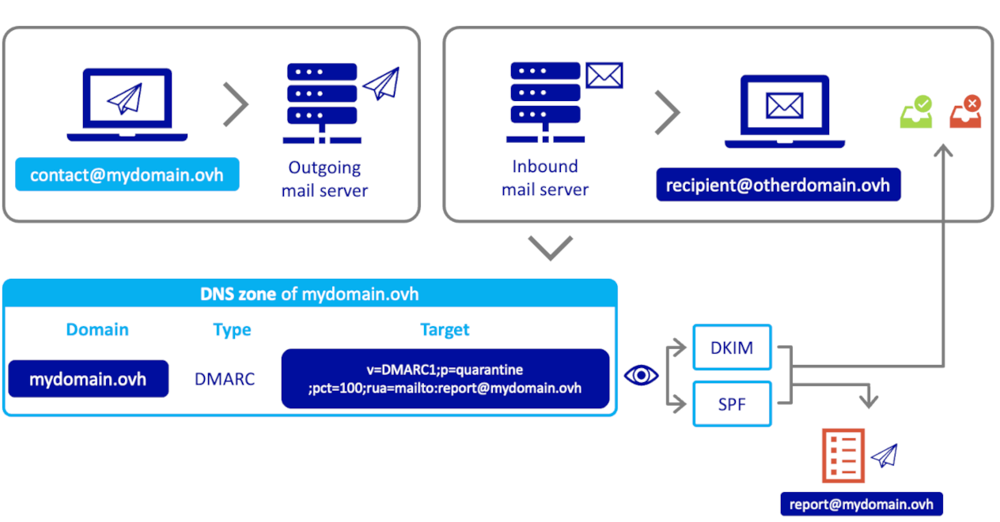

## Objectif

L'enregistrement DMARC (**D**omain-based **M**essage **A**uthentication, **R**eporting, and **C**onformance) est un mécanisme de sécurité e-mail. Il s'appuie sur le résultat des vérifications [SPF](/pages/web/domains/dns_zone_spf) et [DKIM](/pages/web/domains/dns_zone_dkim).

**Découvrez comment fonctionne DKIM et comment le mettre en place pour votre service e-mail.**

## Prérequis

- Disposer d'un accès à la gestion du nom de domaine concerné depuis l'[espace client OVHcloud](https://www.ovh.com/auth/?action=gotomanager&from=https://www.ovh.com/fr/&ovhSubsidiary=fr) ou auprès de votre prestataire de domaine s'il est enregistré en dehors d'OVHcloud.
- Être connecté à votre [espace client OVHcloud](https://www.ovh.com/auth/?action=gotomanager&from=https://www.ovh.com/fr/&ovhSubsidiary=fr).

## En pratique

L' enregistrement DMARC contient des informations sur la politique à appliquer concernant les e-mails malveillant qui tente d'usurper votre nom de domaine. Pour cela DMARC intéroge les protocoles d'authentification [SPF](/pages/web/domains/dns_zone_spf) et [DKIM](/pages/web/domains/dns_zone_dkim) pour vérifier les courriels entrants et les mesures à prendre lorsqu'un courriel échoue aux contrôles d'authentification, comme la mise en quarantaine ou le rejet du courriel.n

### Comment le DMARC fonctionne-t-il ? 

Pour bien comprendre comment fonctionne le DMARC, nous allons voir un exmple.

Lorsque l'adresse **contact@mydomain.ovh** envoie un e-mail à l'adresse **recipient@otherdomain.ovh**, le serveur de réception du nom de domaine **otherdomain.ovh** va intéroger la zone DNS du nom de domaine **mydomain.ovh** pour lire la valeur de l'enregistrement DMARC.

L'enregistrement DMARC 

{.thumbnail}