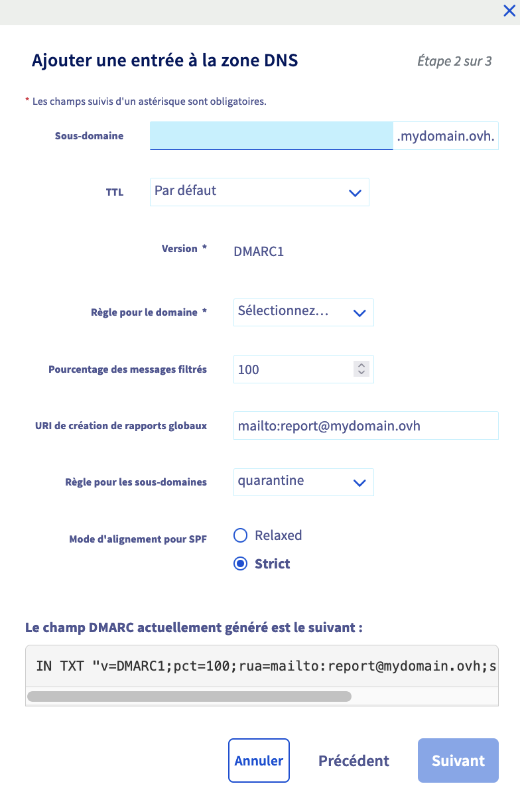
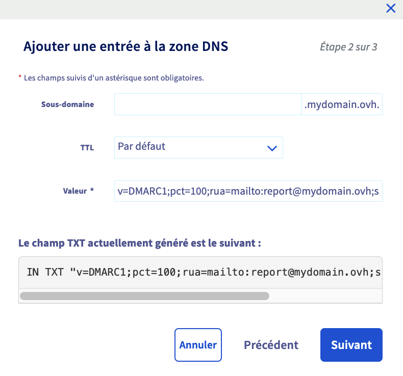
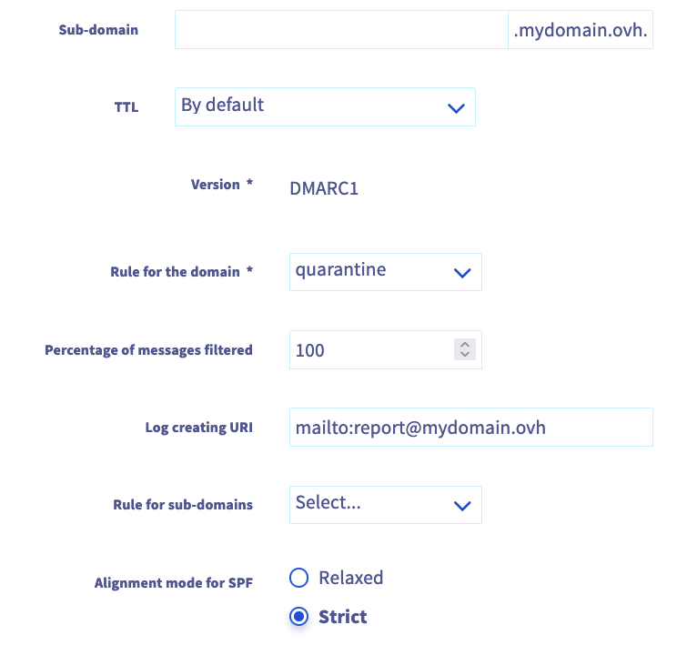
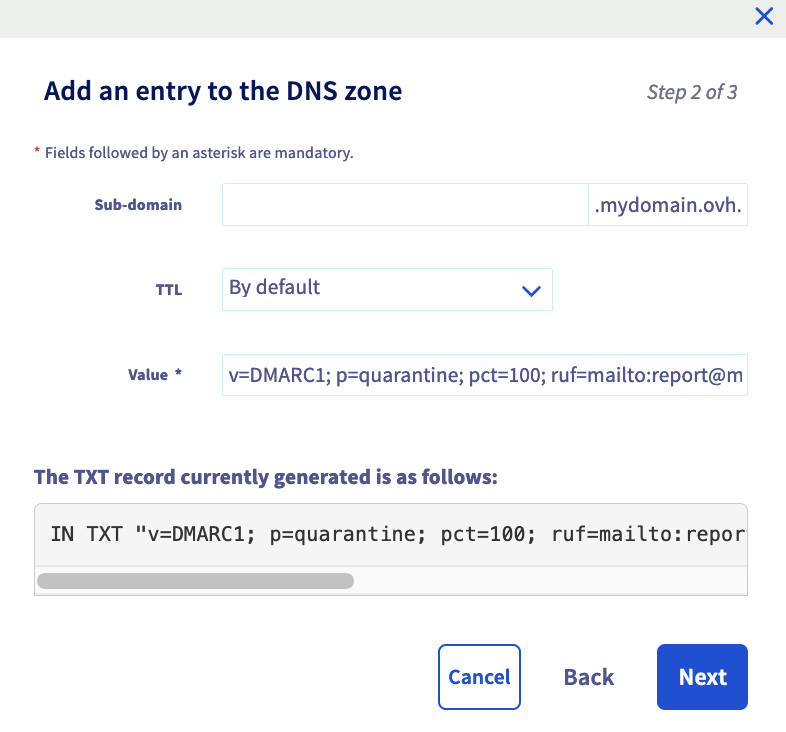

<style>
 pre {
     font-size: 14px;
 }
 pre.console {
   background-color: #fff; 
   color: #000;
   font-family: monospace;
   padding: 5px;
   margin-bottom: 5px;
 }
 pre.console code {
   border: solid 0px transparent;
   font-family: monospace !important;
   font-size: 0.90em;
   color: #000;
 }
 .small {
     font-size: 0.90em;
 }
</style>

## Objectif

L'enregistrement DMARC (**D**omain-based **M**essage **A**uthentication, **R**eporting, and **C**onformance) est un mécanisme de sécurité e-mail. Il s'appuie sur le résultat des vérifications [SPF](/pages/web/domains/dns_zone_spf) et [DKIM](/pages/web/domains/dns_zone_dkim).

**Découvrez comment fonctionne DMARC et comment le mettre en place pour votre service e-mail.**

## Prérequis

- Disposer d'un accès à la gestion du nom de domaine (attaché à votre solution e-mail) depuis l'[espace client OVHcloud](https://www.ovh.com/auth/?action=gotomanager&from=https://www.ovh.com/fr/&ovhSubsidiary=fr).
- Disposer d'une solution e-mail compatible avec le DMARC.
- Un des mécanismes d'authentification, [SPF](/pages/web/domains/dns_zone_spf) et/ou [DKIM](/pages/web/domains/dns_zone_dkim) doit être configuré dans la zone DNS du nom de domaine de l'offre e-mail.

## En pratique

L' enregistrement DMARC contient des informations sur la politique à appliquer pour les e-mails malveillants qui tentent d'usurper votre nom de domaine.<br>
DMARC interroge les mécanismes d'authentification [SPF](/pages/web/domains/dns_zone_spf) et [DKIM](/pages/web/domains/dns_zone_dkim) pour vérifier les e-mails entrants.<br>
Le résultat de ces vérifications SPF et/ou DKIM est traduit par DMARC en mesures à prendre lorsqu'un e-mail échoue aux contrôles, comme la mise en quarantaine ou le rejet des e-mails concernés.

### Comment le DMARC fonctionne-t-il ? <a name="how-dmarc-works"></a>

Pour bien comprendre comment fonctionne le DMARC, voici un exemple.

Lorsque l'adresse **contact@mydomain.ovh** envoie un e-mail vers l'adresse de destination **recipient@otherdomain.ovh**, le serveur de réception du nom de domaine destinataire « **otherdomain.ovh** » va interroger la zone DNS du nom de domaine émetteur **mydomain.ovh** pour lire les instructions de l'enregistrement DMARC.

L'enregistrement DMARC communique la politique à adopter en fonction du résultat des tests SPF et DKIM. Il peut également renseigner une ou des adresses e-mail (représentées dans notre exemple par l'adresse **report@mydomain.ovh**) servant à recevoir les rapports d'échecs d'e-mails envoyés depuis le nom de domaine **mydomain.ovh**.

Après lecture des instructions de l'enregistrement DMARC du nom de domaine **mydomain.ovh** par le serveur de réception de **« otherdomain.ovh »**, les e-mails seront soit délivrés vers l'adresse **recipient@otherdomain.ovh**, soit marqués comme « SPAM » ou rejetés.

{.thumbnail}

### Configurer le DMARC 

Vous devez d'abord activer le DMARC sur le service e-mail associé à votre nom de domaine.

Pour configurer la zone DNS du nom de domaine de votre service e-mail, rendez-vous dans l'[espace client OVHcloud](https://www.ovh.com/auth/?action=gotomanager&from=https://www.ovh.com/fr/&ovhSubsidiary=fr){.external}, dans la section `Noms de domaine`{.action} à gauche.

Il y a deux façons de configurer le DMARC dans votre zone DNS OVHcloud :

- Par le biais d'un [enregistrement DMARC](#dmarc-record). Cet enregistrement permet une configuration simplifiée du DMARC, vous n'aurez qu'à compléter les champs avec les paramètres DMARC nécessaires à votre configuration. Cet enregistrement est lu comme un enregistrement TXT par les serveurs DNS.

- Par le biais d'un [enregistrement TXT](#txt-record). Cet enregistrement standard peut être utilisé dans le cadre de la configuration du DMARC depuis l'espace client OVHcloud, il vous permettra d'intégrer l'ensemble des balises de paramétrage DMARC y compris celles absentes via l'enregistrement DMARC OVHcloud. Il nécessite toutefois de bien respecter les règles de syntaxe du protocole DMARC.

#### Enregistrement DMARC <a name="dmarc-record"></a>

Vous pouvez ajouter l'enregistrement DMARC à votre zone DNS depuis l'[espace client OVHcloud](https://www.ovh.com/auth/?action=gotomanager&from=https://www.ovh.com/fr/&ovhSubsidiary=fr){.external}. Cliquez sur `Noms de domaine`{.action} puis choisissez le nom de domaine concerné. Positionnez-vous enfin sur l'onglet `Zone DNS`{.action}.

Une fois votre zone DNS affichée, cliquez sur le bouton `Ajouter une entrée`{.action} puis sur « Champs mails » `DMARC`{.action}.

Vous trouverez ci-dessous le descriptif exhaustif des balises utilisées pour **l'enregistrement DMARC** OVHcloud :

- **Version (v=)** : champ obligatoire déterminant la version du protocole DMARC.

- **Règle pour le domaine (p=)** : politique à adopter par le destinataire à la demande du propriétaire du domaine expéditeur. La politique s'applique au domaine interrogé et aux sous-domaines, sauf si la balise de sous-domaine **sp=** indique des instructions différentes. Les valeurs possibles sont les suivantes :
    - *aucune* : le propriétaire du domaine ne demande aucune action spécifique concernant la livraison des messages.
    - *quarantaine* : en cas d'échec de la vérification du mécanisme DMARC, les e-mails doivent être considérés comme suspects par les destinataires. Selon les capacités du serveur destinataire, cela peut signifier « placer dans le dossier spam » et/ou « signaler comme suspect ».
    - *reject* : rejet des e-mails qui échouent à la vérification du mécanisme DMARC.

- **Pourcentage des messages filtrés (pct=)** (valeur comprise entre 0 et 100, la valeur par défaut est 100) : pourcentage du flux de messages auquel la politique DMARC doit être appliquée. Le but de la balise « pct » est de permettre aux propriétaires de domaines d'adopter une mise en œuvre lente du mécanisme DMARC.

- **URI de création de rapports globaux (rua=)** : adresses auxquelles les rapports doivent être envoyés (liste en texte brut séparé par des virgules). N'importe quel URI valide peut être spécifié. La mention « mailto:» doit précéder le destinataire e-mail (exemple : `mailto:address@example.com`).

- **Règle pour les sous-domaines (sp=)** : politique à adopter par le destinataire pour tous les sous-domaines. Elle s'applique uniquement aux sous-domaines du domaine interrogé et non au domaine lui-même. Sa syntaxe est identique à celle de la balise « p » définie ci-dessus. Si cette balise est absente, la politique spécifiée par la balise « p » est appliquée pour les sous-domaines.

- **Mode d'alignement pour SPF (aspf=)** (la valeur par défaut est `r`) : indique le mode d'allignement SPF. Les valeurs sont les suivantes :
    - `r`(relaxed) pour le mode souple : les e-mails échouant à l'authentification SPF sont marqués comme « indésirables » par le serveur destinataire.
    - `s`(strict) pour le mode strict : les e-mails échouant à l'authentification SPF sont rejetés par le serveur destinataire.

{.thumbnail}

#### Enregistrement TXT <a name="txt-record"></a>

Vous pouvez ajouter l'enregistrement TXT à votre zone DNS depuis l'[espace client OVHcloud](https://www.ovh.com/auth/?action=gotomanager&from=https://www.ovh.com/fr/&ovhSubsidiary=fr){.external}. Cliquez sur `Noms de domaine`{.action} puis choisissez le nom de domaine concerné. Positionnez-vous enfin sur l'onglet `Zone DNS`{.action}.

Une fois votre zone DNS affichée, cliquez sur le bouton `Ajouter une entrée`{.action} puis sur « Champs étendus » `TXT`{.action}.

Vous trouverez ci-dessous la liste des balises utilisées pour créer un **enregistrement TXT** avec les paramètres DMARC. Cette liste est complémentaire des balises mentionnées dans la section précédente « [Enregistrement DMARC](#dmarc-record) ».

- **adkim** (la valeur par défaut est `r`) : indique le mode d'alignement DKIM. Les valeurs sont les suivantes :
    - `r`(relaxed) pour le mode souple : les e-mails échouant à l'authentification DKIM sont marqués comme « indésirables » par le serveur destinataire.
    - `s`(strict) pour le mode strict : les e-mails échouant à l'authentification DKIM sont rejetés par le serveur destinataire.

- **ruf** (liste en texte brut séparée par des virgules) : adresses auxquelles les informations d'échec spécifiques au message doivent être signalées . Si cette balise est présente, le propriétaire du domaine expéditeur demande aux destinataires d'envoyer des rapports d'échec détaillés sur les e-mails qui échouent à l'évaluation DMARC de manière spécifique (voir la balise `fo` ci-dessous). Le format du message à générer doit suivre le format spécifié pour la balise `rf`. La mention « mailto:» doit précéder le destinataire e-mail (exemple : `mailto:address@example.com`).

- **fo** (texte brut ; la valeur par défaut est `0`) : options du rapport d'échec détaillé. Les générateurs de rapports peuvent choisir de se conformer aux options demandées. Le contenu de cette balise doit être ignoré si une balise `ruf` (ci-dessus) n'est pas également spécifiée. La valeur de cette balise est une liste de caractères séparés par deux-points qui indiquent les options de rapport d'échec suivant :
     - **0** : génère un rapport d'échec DMARC si tous les mécanismes d'authentification (DKIM **ET** SPF) ne parviennent pas à produire un résultat « pass » aligné.
     - **1** : génère un rapport d'échec DMARC si un mécanisme d'authentification (DKIM **OU** SPF) produit autre chose qu'un résultat « success » aligné.
     - **d** : génère un rapport d'échec DKIM si le mécanisme d'authentification DKIM échoue, quel que soit son alignement.
     - **s** : génère un rapport d'échec SPF si le mécanisme d'authentification SPF échoue, quel que soit son alignement.

- **rf** (valeurs en texte brut séparées par des virgules, la valeur par défaut est `afrf`) : cette balise indique le type de format attendu pour les rapports qui fournissent des détails spécifiques sur les échecs d'authentification des messages. Actuellement, seul `afrf`(Auth Failure Reporting Format) est pris en charge.

- **ri** (entier non signé de 32 bits en texte brut ; la valeur par défaut est 86400) : intervalle requis, en secondes, entre les rapports agrégés. Cette balise spécifie la fréquence à laquelle les destinataires des e-mails doivent générer des rapports agrégés sur les résultats d'évaluation DMARC pour le domaine concerné.

{.thumbnail}

#### Exemples d'enregistrement TXT<a name="txt-record"></a>

##### Premier exemple

Pour illustrer ce premier exemple, nous avons utilisé l'[enregistrement DMARC](#dmarc-record) dans la zone DNS et nous lui avons appliqué les paramètres suivants :

{.thumbnail}

Vous obtiendrez le résultat suivant :

```
"v=DMARC1;p=quarantine;pct=100;rua=mailto:report@mydomain.ovh;aspf=s;"
```

La totalité des e-mails envoyés (**pct=100**) sont traités par les mécanismes d'authentification SPF et/ou DKIM. Les e-mails ayant échoués au test SPF sont automatiquement rejetés car "**aspf=s**" (mécanisme SPF en mode strict). Un rapport d'erreurs sur l'échec des mécanismes d'authentification SPF et/ou DKIM est envoyé à l'adresse `report@mydomain.ovh` (**rua=mailto:report@mydomain.ovh**).

##### Deuxième exemple

Pour ce deuxième exemple, nous avons utilisé un [enregistrement TXT](#txt-record) pour utiliser des balises qui ne sont pas disponibles via l'[enregistrement DMARC](#dmarc-record) simplifié.

{.thumbnail}

Vous obtiendrez le résultat suivant :

```
"v=DMARC1; p=quarantine; pct=100; ruf=mailto:report@mydomain.ovh; fo=0; adkim=r; aspf=s; adkim=r; ri=86400"
```

- **p=quarantine** : les e-mails qui ne passent pas les tests DMARC sont traités comme « suspects ».

- **pct=100** : la politique DMARC s'applique à 100% des messages provenant du flux d'e-mail du propriétaire du domaine.

- **ruf=mailto:report@mydomain.ovh** : adresse e-mail à laquelle les rapports d'échec détaillés doivent être envoyés via l'argument « mailto ».

- **fo=0** : options de génération des rapports d'échec. La valeur « 0 » indique que des rapports d'échec DMARC doivent être générés uniquement si les mécanismes d'authentification SPF et DKIM échouent à produire un résultat aligné « pass ».

- **adkim=r** : le mode d'alignement d'identifiant DKIM requis par le propriétaire du domaine est "relaxed" (mode souple). Dans ce mode, DKIM doit fournir une signature valide et l'identifiant de l'en-tête "From" peut être partiellement aligné.

- **aspf=s** : le mode d'alignement d'identifiant SPF requis est « strict ». Cela signifie que l'identifiant SPF du domaine aligné doit correspondre exactement à l'adresse IP émettrice du message.

- **adkim=r** : le mode d'alignement d'identifiant DKIM requis par le propriétaire du domaine est « relaxed » (mode souple). Dans ce mode, DKIM doit fournir une signature valide et l'identifiant de l'en-tête « From » peut être partiellement aligné.

- **ri=86400** : définit l'intervalle demandé entre les rapports agrégés, en secondes. Dans ce cas, un rapport agrégé doit être généré au moins une fois toutes les 86400 secondes (soit une fois par jour).

## Aller plus loin

Échangez avec notre communauté d'utilisateurs sur [https://community.ovh.com](https://community.ovh.com).
