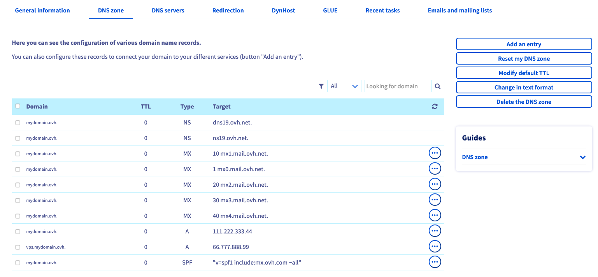

**Päivitetty 8.3.2018**

## Tavoite

Verkkotunnuksen Domain Name System (DNS) -alue sisältää sen konfigurointitiedoston. Se koostuu teknisistä tiedoista, joita kutsutaan tietueiksi. Perinteisessä käytössä näillä tietueilla voidaan yhdistää verkkotunnuksesi ja palvelin tai palvelimet, jotka ylläpitävät verkkosivuasi ja sähköpostiosoitteitasi.

**Opi muokkaamaan DNS-aluetta OVH:n hallintapaneelin kautta.**

## Edellytykset

- Sinulla on pääsyoikeus verkkotunnuksen hallintaan [OVH:n hallintapaneelissa](https://www.ovh.com/auth/?action=gotomanager){.external}.
- Olet kirjautunut [hallintapaneeliin](https://www.ovh.com/auth/?action=gotomanager){.external}.
- Käytät kyseistä verkkotunnusta varten OVH:n konfiguraatiota (nimipalvelimia).

> [!warning]
>
> - Jos verkkotunnuksesi ei käytä OVH:n nimipalvelimia, sinun on tehtävä muokkaus verkkotunnuksesi konfiguraatiota hallinnoivalla palveluntarjoajalla.
> 
> - Jos verkkotunnuksesi on rekisteröity OVH:lle, voit tarkistaa, käyttääkö se konfiguraatiotamme. Mene sitä varten [hallintapaneelin](https://www.ovh.com/auth/?action=gotomanager){.external} välilehdelle `Nimipalvelimet`{.action}, kun olet ensin siirtynyt kyseiseen verkkotunnukseen.
>

## Käytännössä

**DNS-alueen muokkauksessa on noudatettava varovaisuutta.** Muutoksen tekeminen, joka ei ole asianmukainen, saattaa esimerkiksi estää pääsyn verkkosivullesi tai uusien viestien saapumisen sähköpostiosoitteisiisi.

Kun ymmärrät tietueiden merkityksen, saat paremman käsityksen muutoksista, joita teet verkkotunnuksesi DNS-aluetta muokatessa. Suosittelemme vahvasti tutustumaan alla olevaan taulukkoon. Taulukko kertoo jokaisen tietueen erityisominaisuudet.

|Tietueen tyyppi|Kuvaus|  
|---|---|
|A|Mahdollistaa verkkotunnuksen yhdistämisen IP-osoitteeseen (IPv4). Esimerkiksi verkkosivuasi ylläpitävän palvelimen IP-osoite.|
|AAAA|Mahdollistaa verkkotunnuksen yhdistämisen IP-osoitteeseen (IPv6). Esimerkiksi verkkosivuasi ylläpitävän palvelimen IP-osoite.|
|CNAME|Tämän avulla verkkotunnus voi käyttää toisen verkkotunnuksen IP-osoitteita yhdistämällä ne alias-periaatteen mukaisesti. Esimerkiksi, jos *www.mypersonaldomain.ovh* on verkkotunnuksen *mypersonaldomain.ovh* alias, tämä merkitsee, että *www.mypersonaldomain.ovh* käyttää verkkotunnuksen *mypersonaldomain.ovh* IP-osoitteita.|
|MX|Mahdollistaa verkkotunnuksen yhdistämisen sähköpostipalvelimeen. Esimerkiksi sähköpostiratkaisuasi ylläpitävän palvelimen osoite. On todennäköistä, että palveluntarjoajalla on useita sähköpostipalvelimia, jolloin on siis luotava useita MX-kenttiä.|
|SRV|Ilmoittaa palvelua hallinnoivan palvelimen osoitteen. Tämä tietue voi esimerkiksi kertoa SIP-palvelimen osoitteen tai sen palvelimen, jonka avulla sähköpostiohjelmiston konfigurointi voi tapahtua automaattisesti autodiscover-periaatteen mukaisesti.|
|TXT|Mahdollistaa valitsemasi arvon (tekstimuodossa) lisäämisen verkkotunnuksesi DNS-asetuksiin. Tätä tietuetta käytetään usein varmistusprosessissa.|
|SPF|Mahdollistaa henkilötietojen väärinkäytön estämisen verkkotunnustasi käyttävillä sähköpostiosoitteilla. Tällä tietueella voidaan esimerkiksi ilmoittaa, että ainoastaan sähköpostiratkaisun tarjoajan palvelin tunnistetaan lailliseksi lähetyslähteeksi. Lue lisää [SPF-tietueesta kertovasta dokumentaatiostamme](https://docs.ovh.com/fi/domains/webhotelli_spf-kentta/){.external}.|
|CAA|Listaa varmenneviranomaiset, joilla on hyväksyntä SSL-varmenteiden toimittamiseen verkkotunnuksille.|

### Vaihe 1: Mene verkkotunnuksesi OVH:n DNS-alueen hallintaan

Kirjaudu [hallintapaneeliisi](https://www.ovh.com/auth/?action=gotomanager){.external}, klikkaa `Verkkotunnukset`{.action} vasemman reunan valikossa ja valitse sitten kyseessä oleva verkkotunnus. Mene lopuksi välilehdelle `DNS-alue`{.action}.

Näkyviin tuleva taulukko näyttää verkkotunnuksesi konfiguraation OVH:lla. Se koostuu useista DNS-tietueista, joita kutakin symboloi yksi taulukon rivi. Sisältöä on mahdollista suodattaa tietueen tyypin tai verkkotunnuksen perusteella.

{.thumbnail}

### Vaihe 2: Muokkaa verkkotunnuksesi OVH:n DNS-aluetta

Voit muokata verkkotunnuksesi DNS-aluetta lisäämällä, muokkaamalla tai poistamalla DNS-tietueita. Siihen on kaksi vaihtoehtoa:

- **Alueen muokkaaminen käsin tekstitilassa**: ainoastaan asiantunteville käyttäjille. Klikkaa välilehdellä `DNS-alue`{.action} kohtaa `Muokkaa tekstitilassa`{.action}, ja seuraa sitten näkyviin tulevia vaiheita.

- **Käytä konfigurointiavustajiamme**.

Tästä eteenpäin tämä dokumentaatio keskittyy ainoastaan konfigurointiin avustajiemme kautta.

> [!primary]
>
> Ota esiin tiedot, joita haluat muokata OVH:n DNS-alueella. Jos teet muokkauksen palveluntarjoajan pyynnöstä, tämän on täytynyt toimittaa lista muokattavista tiedoista.
>

- **Uuden DNS-tietueen lisääminen**

Uuden DNS-tietueen lisäämistä varten on edelleen oltava hallintapaneelisi välilehdellä `DNS-alue`{.action}. Klikkaa taulukon oikealla puolella olevaa painiketta `Lisää tietue`{.action}. Valitse DNS-kentän tyyppi ja seuraa vaiheita.

Kehotamme kuitenkin tarkistamaan, ettei tämä tietue ole jo olemassa ja ettei se osoita eri kohteeseen. Suodata tätä varten taulukon sisältö tietueen tyypin tai verkkotunnuksen mukaan. Jos tietue on jo olemassa, kehotamme muokkaamaan sitä alla kuvatulla tavalla.

{.thumbnail}

- **Olemassa olevan DNS-tietueen muokkaaminen**

Klikkaa DNS-tietueen muokkaamiseksi, edelleen hallintapaneelisi `DNS-alue`{.action}-välilehdellä, hammasrattaan kuvaa valitun tietueen oikealla puolella olevassa taulukossa. Klikkaa sitten `Muokkaa tietuetta`{.action} ja seuraa näkyviin tulevia vaiheita.

{.thumbnail}

- **DNS-tietueen poistaminen**

Klikkaa DNS-tietueen poistamiseksi, edelleen hallintapaneelisi `DNS-alue`{.action}-välilehdellä, hammasrattaan kuvaa valitun tietueen oikealla puolella olevassa taulukossa. Klikkaa sitten `Poista tietue`{.action} ja seuraa näkyviin tulevia vaiheita.

Voit poistaa useita tietueita kerralla rastittamalla ne taulukon vasemmassa osassa ja klikkaamalla sitten painiketta `Poista`{.action}.

{.thumbnail}

### Vaihe 3: Odota propagaatioajan loppumista

Kun verkkotunnuksesi OVH:n DNS-aluetta on muokattu, tarvitaan enintään 24 tuntia kestävä propagaatioaika, jotta muutokset astuvat voimaan.

Jos haluat lyhentää tätä aikaa seuraaville DNS-alueen muokkauksille, on sitä mahdollista muokata tietyssä määrin säätämällä kaikkiin DNS-alueen tietueisiin sovellettavaa TTL-arvoa (*Time To Live*).
Mene tätä varten hallintapaneelisi välilehdelle `DNS-alue`{.action}, klikkaa painiketta `Oletus TTL`{.action} ja seuraa näkyviin tulevia vaiheita. 

Lisäksi on mahdollista muokata yhden DNS-tietueen TTL-arvoa. Tämä toimenpide voidaan kuitenkin suorittaa ainoastaan yksi tietue kerrallaan joko tietueen muokkauksen yhteydessä tai tietuetta lisättäessä.

## Lue lisää aiheesta

[Yleistä nimipalvelimista](https://docs.ovh.com/fi/domains/webhotellit_yleista_nimipalvelimista/){.external}

[SPF-kentän lisäys verkkotunnuksen konfiguraatioon.](https://docs.ovh.com/fi/domains/webhotelli_spf-kentta/){.external}

[Verkkotunnuksen suojaus DNS-myrkytystä vastaan DNSSEC-palvelulla.](https://www.ovh-hosting.fi/verkkotunnukset/dnssec_palvelu.xml){.external}

Viesti käyttäjäyhteisömme kanssa osoitteessa [https://ovh-hosting.fi/community/foorumi](https://ovh-hosting.fi/community/foorumi){.external}.