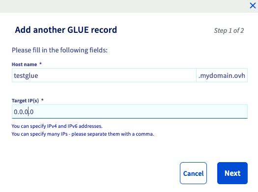

**Stand 19.07.2019**

## Ziel

Auf DNS-Servern werden DNS-Konfigurationen von Domains gespeichert. Diese DNS-Konfigurationen (auch DNS-Zonen genannt) bestehen aus verschiedenen technischen Informationen, den sogenannten Einträgen. DNS-Einträge werden üblicherweise dazu verwendet, Ihre Domain mit dem oder den Servern zu verbinden, auf denen Ihre Website oder E-Mail-Adressen gehostet werden.

Bei Bedarf können Sie den Namen der DNS-Server Ihrer OVHcloud Domain anpassen.

**Hier erfahren Sie, wie Sie die DNS-Server Ihrer OVHcloud Domain anpassen.**

## Voraussetzungen

- Sie besitzen eine bei OVHcloud registrierte Domain.
- Sie sind im [OVHcloud Kundencenter](https://www.ovh.com/auth/?action=gotomanager&from=https://www.ovh.de/&ovhSubsidiary=de){.external} eingeloggt und befinden sich im Bereich `Web Cloud`{.action}.

## In der praktischen Anwendung

**Seien Sie vorsichtig bei der Anpassung der DNS-Server Ihrer Domain**: Wenn Sie einen Fehler machen, kann es sein, dass Ihre Website nicht mehr erreichbar ist und Ihre E-Mail-Adressen keine Nachrichten mehr empfangen können. Folgen Sie den nachstehend beschriebenen Schritten deshalb ganz genau oder lassen Sie sich von einer fachkundigen Person unterstützen, wenn Sie sich bei einer Änderung nicht sicher sind.

### Schritt 1: GLUE-Einträge hinzufügen

Loggen Sie sich zunächst im [OVHcloud Kundencenter](https://www.ovh.com/auth/?action=gotomanager&from=https://www.ovh.de/&ovhSubsidiary=de){.external} ein und gehen Sie im Bereich `Web Cloud`{.action} auf `Domainnamen`{.action}. Wählen Sie die Domain aus, für die Sie die DNS-Server anpassen möchten. Gehen Sie danach auf den Tab `GLUE`{.action}.

Es wird eine Tabelle angezeigt, die alle aktuell bei OVHcloud für Ihre Domain konfigurierten GLUE-Einträge enthält. Klicken Sie auf den Button `Hinzufügen`{.action}, um einen neuen GLUE-Eintrag hinzuzufügen.

{.thumbnail}

Geben Sie im angezeigten Fenster die notwendigen Informationen ein.

|Information|Beschreibung|  
|---|---|
|Hostname|Tragen Sie an dieser Stelle den Hostnamen ein, den Sie für Ihren DNS-Server verwenden möchten.|
|Ziel-IP(s)|Geben Sie hier die IP-Adresse (oder Adressen) ein, mit denen der Hostname verknüpft werden soll. Diese Adresse ist die IP Ihres DNS-Servers, der aktuell für Ihre Domain verwendet wird. Sollte Ihre Domain OVHcloud DNS-Server verwenden und Sie kennen die zugehörige IP-Adresse nicht, können Sie diese über den „dig“-Befehl ermitteln. Sie wird im Bereich `ANSWER SECTION` neben „A“ angezeigt.|

Wenn Sie alle Informationen eingegeben haben, klicken Sie auf `Hinzufügen`{.action} und gehen Sie die angezeigten Informationen durch. Klicken Sie dann auf `Bestätigen`{.action}. Wiederholen Sie diesen Vorgang so oft wie nötig, das heißt entsprechend der Anzahl der von Ihrer Domain verwendeten DNS-Server.

{.thumbnail}

### Schritt 2: Zugehörige DNS-A-Einträge erstellen

Für die im letzten Schritt definierten Hostnamen sind nun A-Einträge zu erstellen. Jeder A-Eintrag muss als Ziel die IP-Adresse enthalten, die dem zuvor erstellten Hostnamen entspricht.

Verwenden Sie das Interface des Anbieters, der die DNS-Konfiguration Ihrer Domain verwaltet. Nun gibt es zwei Möglichkeiten:

- **Ihre Domain verwendet nicht die DNS-Konfiguration von OVHcloud**: Wenden Sie sich an den Anbieter, der die Konfiguration verwaltet. Wenn der Vorgang abgeschlossen ist, können Sie zum nächsten Schritt übergehen.

- **Ihre Domain verwendet die DNS-Konfiguration von OVHcloud**: Gehen Sie auf den Tab `DNS Zone`{.action} und fügen Sie einen neuen A-Eintrag hinzu, indem Sie auf `Eintrag hinzufügen`{.action} klicken. Wählen Sie dann den Eintragstyp A aus und folgen Sie den angezeigten Schritten. Für weitere Informationen lesen Sie die Anleitung „[Bearbeiten der OVHcloud DNS-Zone](https://docs.ovh.com/de/domains/webhosting_bearbeiten_der_dns_zone/){.external}“.

{.thumbnail}

### Schritt 3: DNS-Server Ihrer Domain ändern

Ändern Sie im letzten Schritt die DNS-Server Ihrer Domain. Gehen Sie hierfür auf den Tab `DNS Server`{.action} und klicken Sie dann auf `DNS Server ändern`{.action}. Ersetzen Sie nun Ihre aktuellen DNS-Server mit den Servern, die Sie verwenden möchten. 

Vervollständigen Sie den Vorgang und lesen Sie falls nötig die Anleitung „[DNS-Server einer OVHcloud Domain ändern](https://docs.ovh.com/de/domains/webhosting_allgemeine_informationen_zu_den_dns_servern/){.external}“.

Nachdem die DNS-Server geändert wurden, warten Sie ab, bis diese Änderung umgesetzt ist. Eine Propagationszeit von maximal 48 Stunden ist erforderlich.

{.thumbnail}

## Weiterführende Informationen

Für den Austausch mit unserer User Community gehen Sie auf <https://community.ovh.com/en/>.
