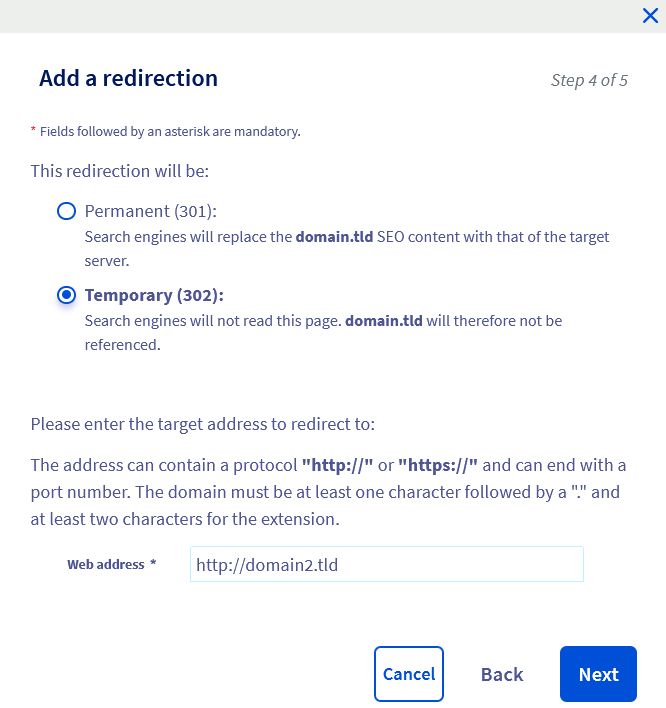
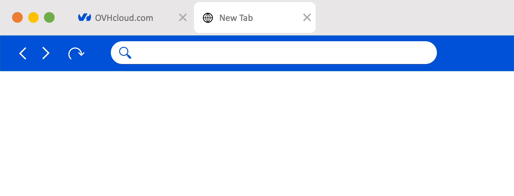
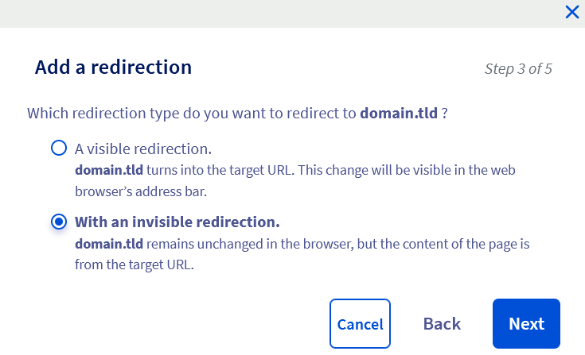

**Letzte Aktualisierung am 27.09.2022**

> [!primary]
> Diese Übersetzung wurde durch unseren Partner SYSTRAN automatisch erstellt. In manchen Fällen können ungenaue Formulierungen verwendet worden sein, z.B. bei der Beschriftung von Schaltflächen oder technischen Details. Bitte ziehen Sie beim geringsten Zweifel die englische oder französische Fassung der Anleitung zu Rate. Möchten Sie mithelfen, diese Übersetzung zu verbessern? Dann nutzen Sie dazu bitte den Button «Mitmachen» auf dieser Seite.
>

## Ziel

Bei der Weiterleitung einer Domain wird diese auf ein neues Ziel umgeleitet. Es gibt verschiedene Arten von Weiterleitungen, die jeweils einem bestimmten Bedarf entsprechen.

**Diese Anleitung erklärt, wie Sie verschiedene Arten der Weiterleitung Ihrer Domain**

## Voraussetzungen

- Über eine [Domainname](https://www.ovhcloud.com/de/domains/)
- Sie sind in Ihrem [OVHcloud Kundencenter](https://www.ovh.com/auth/?action=gotomanager&from=https://www.ovh.de/&ovhSubsidiary=de){.external} eingeloggt.
- Sie sind mit Ihrem Webhosting verbunden (für eine Weiterleitung über eine [.htaccess](#htaccess_rewrite) Datei).

## In der praktischen Anwendung

### Die Weiterleitung einer Domain verstehen

Mit dieser Funktion können Sie eine Domain/Subdomain auf:

- eine andere bereits bestehende Domain/Subdomain:
    - **Beispiel**: `domain.tld`
- eine URL (Uniform Resource Locator) für eine Website:
    - **Beispiele**: `http://www.domain.tld/welcome/` oder `https://www.domain.tld/welcome/` (wenn die Zieldomain über ein kompatibles SSL-Zertifikat verfügt).

Diese Aktionen können auf mehrere Arten durchgeführt werden:

- **Über das [OVHcloud Kundencenter](https://www.ovh.com/auth/?action=gotomanager&from=https://www.ovh.de/&ovhSubsidiary=de)**, in dem ein Konfigurationsassistent Ihre Weiterleitung einrichten kann.
- **Über eine programmierbare Methode**. Erstellen Sie die Weiterleitung selbst in einer Datei (in der Regel [.htaccess](#htaccess_rewrite)).

> [!warning]
>
> Die Einrichtung einer Weiterleitung kann Auswirkungen auf die Referenzierung Ihrer Website haben. 
> Achten Sie auf die Änderungen, die Sie vornehmen werden, oder kontaktieren Sie bei Bedarf einen [spezialisierten Dienstleister](https://partner.ovhcloud.com/de/) in der Referenzierung.
>
> Achtung: Eine über das [OVHcloud Kundencenter](https://www.ovh.com/auth/?action=gotomanager&from=https://www.ovh.de/&ovhSubsidiary=de) erstellte Weiterleitung erlaubt nicht die Weiterleitung einer URL im Sinne `https://` auf eine andere Domain oder eine andere URL. 
> Um diese Weiterleitungsart zu erstellen, müssen Sie zum Beispiel URL Rewriting über eine ".htaccess"-Datei ausführen.
>

### Eine Domain über das Kundencenter weiterleiten

Loggen Sie sich in das [OVHcloud Kundencenter](https://www.ovh.com/auth/?action=gotomanager&from=https://www.ovh.de/&ovhSubsidiary=de){.external} ein, gehen Sie in den Bereich `Web Cloud`{.action}, wählen Sie die Domain aus, die Sie im Bereich `Domainnamen`{.action} weiterleiten sollen, und klicken Sie dann auf den Tab `Weiterleitung`{.action}.

Die Tabelle zeigt die für Ihre Domain aktiven Weiterleitungen an. Verwalten Sie Ihre existierenden Weiterleitungen mit der Kfz-Nabe `...`{.action} rechts von jeder Zeile.

Klicken Sie auf den Button `Eine Weiterleitung hinzufügen`{.action}.

{.thumbnail}

Über das [OVHcloud Kundencenter](https://www.ovh.com/auth/?action=gotomanager&from=https://www.ovh.de/&ovhSubsidiary=de) sind drei Weiterleitungsoptionen verfügbar, von denen jede aus **5 aufeinander folgenden Schritten** besteht. 

> Der Tab `Weiterleitung`{.action} zeigt eine vierte Option, mit der Ihre Domain schnell auf die DNS A, AAAA und CNAME Einträge verweisen kann<br>
> Da es sich hierbei nicht um eine "Weiterleitung"handelt, wird diese Option in diesem Leitfaden nicht näher erläutert.
>
> Mehr Informationen zu den DNS Einträgen finden Sie in unserer Dokumentation zu den [DNS Einträgen](https://docs.ovh.com/de/domains/webhosting_bearbeiten_der_dns_zone/).
>

Nachfolgend finden Sie die drei Arten detaillierter Weiterleitungen Schritt für Schritt.

> [!primary]
>
> Unabhängig von der gewählten Weiterleitungsoption dauert die Änderung eine Propagationszeit von 4 bis maximal 24 Stunden, bis sie voll wirksam ist.
>

#### Option 1: sichtbare permanente Weiterleitung auf eine Web-Adresse

Diese Option erlaubt es, nach der Eingabe der weitergeleiteten Domain die Zieldomain in der Adresszeile Ihres Browsers anstatt der weitergeleiteten Domain anzuzeigen.

- **Beispiel**: Wenn Sie `domain1.tld` auf `domain2.tld` weiterleiten, dann wird dort die ganze Adresszeile `domain2.tld` Ihres Browsers angezeigt.

{.thumbnail}

> Diese "Standard" Weiterleitung wird einen HTTP 301 Code zurückgeben.

> [!success]
> Klicken Sie auf die nachstehenden Tabs, um alle 5 Schritte nacheinander anzuzeigen.

> [!tabs]
> **Schritt 1**
>>
>> Im Fenster wird Ihre umzuleitende Domain bereits angezeigt. Füllen Sie das Formular aus **nur**, wenn Sie eine *Subdomain* weiterleiten möchten.
>>
>> Der Eintrag `Weiterleiten auch`{.action} kann angekreuzt werden, um Ihre Subdomain auch auf die Option `www` weiterzuleiten, die Sie für Ihre Domain/Subdomain auswählen.
>>
>> {.thumbnail}
>>
>> Klicken Sie auf `Weiter`{.action}, um zu Schritt 2 = überzugehen.
>>
> **Schritt 2**
>>
>> Wählen Sie eine `Web-Adresse`{.action} aus.
>>
>> {.thumbnail}
>>
>> Klicken Sie auf `Weiter`{.action}, um zu Schritt 3 = überzugehen.
>>
> **Schritt 3**
>>
>> Wählen Sie `Mit einer sichtbaren Weiterleitung`{.action} aus den beiden angegebenen Optionen.
>>
>> {.thumbnail}
>>
>> Klicken Sie auf `Weiter`{.action}, um zu Schritt 4 = überzugehen.
>>
> **Schritt 4**
>>
>> Wählen Sie `Permanent (301)`{.action} aus den beiden angegebenen Auswahlmöglichkeiten aus und geben Sie die Zieldomain oder -URL Ihrer Weiterleitung im angezeigten Formular `Web-Adresse`{.action} ein.
>>
>> {.thumbnail}
>>
>> Klicken Sie auf `Weiter`{.action}, um zu Schritt 5 = überzugehen.
>>
> **Schritt 5**
>>
>> Überprüfen Sie im letzten Schritt, dass die angezeigten Informationen korrekt sind.
>>
>> {.thumbnail}
>>
>> Klicken Sie auf `Bestätigen`{.action}, um Ihre Konfiguration zu validieren.
> >
>> > [!primary]
>> >
>> > Wenn die Nachricht "*Es gibt Weiterleitungen aus den Domains, die mit den Weiterleitungen, die Sie hinzufügen möchten*"in Konflikt stehen, angezeigt wird, können Sie in dem Feld `Bestätigen die Löschung der existierenden Weiterleitung`{.action} setzen, um die Anwendung Ihrer Weiterleitung zu erzwingen.
>> >
>> > Achtung, die alte Konfiguration wird deshalb deaktiviert und gelöscht.
>> >
>>

#### Option 2: temporäre sichtbare Weiterleitung auf eine Web-Adresse

Wie bei Option 1 erlaubt diese Option, nach der Eingabe der weitergeleiteten Domain die Zieldomain in der Adresszeile Ihres Browsers anstatt der weitergeleiteten Domain anzuzeigen.

Diese ist jedoch punktuell zu verwenden, zum Beispiel für kurzlebige Ereignisse.<br>
Die Positionierung in den Suchmaschinen ist weniger leistungsfähig als bei einer permanenten **sichtbare Weiterleitung** Typ 301 (HTTP-Code).

- **Beispiel**: Wenn Sie `domain1.tld` auf `domain2.tld` weiterleiten, dann wird dort die ganze Adresszeile `domain2.tld` Ihres Browsers angezeigt.

{.thumbnail}

> Diese Weiterleitung wird einen HTTP 302 Code zurückgeben.

> [!success]
> Klicken Sie auf die nachstehenden Tabs, um alle 5 Schritte nacheinander anzuzeigen.

> [!tabs]
> **Schritt 1**
>>
>> Im Fenster wird Ihre umzuleitende Domain bereits angezeigt. Füllen Sie das Formular aus **nur**, wenn Sie eine *Subdomain* weiterleiten möchten.
>>
>> Der Eintrag `Weiterleiten auch`{.action}" kann angekreuzt werden, um Ihre Subdomain auch auf die Option `www` weiterzuleiten, die Sie für Ihre Domain/Subdomain auswählen.
>>
>> {.thumbnail}
>>
>> Klicken Sie auf `Weiter`{.action}, um zu Schritt 2 = überzugehen.
>>
> **Schritt 2**
>>
>> Wählen Sie `eine Web-Adresse aus`{.action}.
>>
>> {.thumbnail}
>>
>> Klicken Sie auf `Weiter`{.action}, um zu Schritt 3 = überzugehen.
>>
> **Schritt 3**
>>
>> Wählen Sie `Mit einer sichtbaren Weiterleitung`{.action} aus den beiden angegebenen Optionen.
>>
>> {.thumbnail}
>>
>> Klicken Sie auf `Weiter`{.action}, um zu Schritt 4 = überzugehen.
>>
> **Schritt 4**
>>
>> Wählen Sie `Temporär (302)`{.action} aus den beiden angegebenen Auswahlmöglichkeiten aus und geben Sie die Zieldomain oder -URL Ihrer Weiterleitung im angezeigten Formular Web-Adresse {.action} ein.
>>
>> {.thumbnail}
>>
>> Klicken Sie auf `Weiter`{.action}, um zu Schritt 5 = überzugehen.
>>
> **Schritt 5**
>>
>> Überprüfen Sie im letzten Schritt, dass die angezeigten Informationen korrekt sind.
>>
>> {.thumbnail}
>>
>> Klicken Sie auf `Bestätigen`{.action}, um Ihre Konfiguration zu validieren.
>>
>> > [!primary]
>> >
>> > Wenn die Nachricht "*Es gibt Weiterleitungen aus den Domains, die mit den Weiterleitungen, die Sie hinzufügen möchten*"in Konflikt stehen, angezeigt wird, können Sie in dem Feld `Bestätigen die Löschung der existierenden Weiterleitung`{.action} setzen, um die Anwendung Ihrer Weiterleitung zu erzwingen.
>> >
>> > Achtung, die alte Konfiguration wird deshalb deaktiviert und gelöscht.
>> >
>>

#### Option 3: unsichtbare Weiterleitung auf eine Web-Adresse

Diese Weiterleitung erlaubt es nach der Eingabe der weitergeleiteten Domain, diese in der Adresszeile Ihres Browsers angezeigt zu lassen, anstatt sie durch die Zieldomain zu ersetzen<br>.
**Achtung, diese Aktion ist nicht mit allen Seiten kompatibel und beeinträchtigt das Ranking Ihrer Website.**

- **Beispiel**: Wenn Sie `domain1.tld` auf `domain2.tld` weiterleiten, dann wird dort die ganze Adresszeile `domain1.tld` Ihres Browsers angezeigt.

{.thumbnail}

Die unsichtbare Weiterleitung funktioniert mit einem HTML *iFrame* Beacon. Diese erlaubt es Ihrer weitergeleiteten Domain, den Inhalt der anderen Seite zur Zieldomain in ihre eigene HTML-Seite zu integrieren.

Diese Verkapselung verhindert, dass Besucher Ihrer Website die Zieldomain anzeigen

> Diese Option führt zu einem HTTP 200 Code.

> [!warning]
>
> Achtung: Smartphones mit *iFrame* gekapselte Seiten können möglicherweise nicht lesen. Ihre Inhalte werden von den Suchmaschinen im Allgemeinen nicht für die Referenzierung und Indexierung Ihrer Seite berücksichtigt.
>

> [!success]
> Klicken Sie auf die nachstehenden Tabs, um alle 5 Schritte nacheinander anzuzeigen.
>

> [!tabs]
> **Schritt 1**
>>
>> Im Fenster wird Ihre umzuleitende Domain bereits angezeigt. Füllen Sie das Formular aus **nur**, wenn Sie eine *Subdomain* weiterleiten möchten.
>>
>> Der Eintrag `Weiterleiten auch`{.action} kann angekreuzt werden, um Ihre Subdomain auch auf die Option `www` weiterzuleiten, die Sie für Ihre Domain/Subdomain auswählen.
>>
>> {.thumbnail}
>>
>> Klicken Sie auf `Weiter`{.action}, um zu Schritt 2 = überzugehen.
>>
> **Schritt 2**
>>
>> Wählen Sie `eine Web-Adresse`{.action} aus.
>>
>> {.thumbnail}
>
>> Klicken Sie auf `Weiter`{.action}, um zu Schritt 3 = überzugehen.
>>
> **Schritt 3**
>>
>> Wählen Sie `Mit einer unsichtbaren Weiterleitung`{.action} aus den beiden angegebenen Optionen.
>>
>> {.thumbnail}
>>
>> Klicken Sie auf `Weiter`{.action}, um zu Schritt 4 = überzugehen.
>>
> **Schritt 4**
>>
>>> Wählen Sie `Temporär (iframe)`{.action} aus den beiden angegebenen Optionen aus und geben Sie die Zieldomain oder -URL Ihrer Weiterleitung im angezeigten Formular `Web-Adresse`{.action} ein.
>>
>> {.thumbnail}
>>
>> Für diesen Schritt stehen Ihnen drei optionale Einstellungen zur Verfügung:
>>
>> - **Titel**: des Webhostings. Es wird als Seitentitel im Tab der Webbrowser angezeigt.<br>
>> - **Schlüsselwörter**: Sie können von Suchmaschinen verwendet werden, um die Seite teilweise zu referenzieren.<br>
>> - **Beschreibung**: betrifft Ihre Website. Sie wird von den Suchmaschinen in ihren Ergebnissen verwendet.
>>
>> Klicken Sie auf `Weiter`{.action}, um zu Schritt 5 = überzugehen.
>>
> **Schritt 5**
>>
>> Überprüfen Sie im letzten Schritt, dass die angezeigten Informationen korrekt sind.
>>
>> {.thumbnail}
>>
>> Klicken Sie auf `Bestätigen`{.action}, um Ihre Konfiguration zu validieren.
>>
>> > [!primary]
>> >
>> > Wenn die Nachricht "*Es gibt Weiterleitungen aus den Domains, die mit den Weiterleitungen, die Sie hinzufügen möchten*"in Konflikt stehen, angezeigt wird, können Sie in dem Feld `Bestätigen die Löschung der existierenden Weiterleitung`{.action} setzen, um die Anwendung Ihrer Weiterleitung zu erzwingen.
>> >
>> > Achtung, die alte Konfiguration wird deshalb deaktiviert und gelöscht.
>> >
>>

#### Eine Domain über eine ".htaccess" Datei <a name="htaccess_rewrite"></a> weiterleiten

> [!warning]
>
> OVHcloud stellt Ihnen Dienste zur Verfügung, deren Konfiguration, Verwaltung und Verantwortung Ihnen obliegen. Es liegt daher an Ihnen, dafür zu sorgen, dass sie ordnungsgemäß funktionieren.
> 
> Wir stellen Ihnen diesen Teil der Anleitung zur Verfügung, um Sie bei alltäglichen Aufgaben bestmöglich zu unterstützen. Dennoch empfehlen wir Ihnen, falls Sie Hilfe brauchen, einen [spezialisierten Dienstleister](https://partner.ovhcloud.com/de/) zu kontaktieren. Wir werden Ihnen nicht in der Lage sein, Sie bei den unten dokumentierten Schritten zu unterstützen. Weitere Informationen finden Sie im Abschnitt ["Weiterführende Informationen"](#go-further) dieser Anleitung.
>

".htaccess" sind Konfigurationsdateien, in denen Befehle spezifiziert werden können. Wenn der Webserver (Apache) den Code Ihrer Website ausführt, werden die Befehle interpretiert und ausgeführt.<br>
Unter diesen Befehlen können Weiterleitungen erstellt werden.

Wenn Sie eine ".htaccess"-Datei bearbeiten, ist Ihre Website möglicherweise nicht mehr erreichbar. Kontaktieren Sie im Zweifelsfall einen [spezialisierten Dienstleister](https://partner.ovhcloud.com/de/) .

Die vollständige Dokumentation zum ".htaccess" finden Sie im Abschnitt ["Weiterführende Informationen"](#go-further) dieser Anleitung.

> [!success]
>
> Wir empfehlen Ihnen, **vor der Bearbeitung eine Sicherung Ihrer .htaccess-Datei durchzuführen**. So können Sie im Falle eines Fehlers die vorherige Version der Datei wiederherstellen.
>

Nachfolgend finden Sie 4 Variablen, um Weiterleitungen über die Datei ".htaccess"durchzuführen.

#### Variable 1 - "Permanent Redirect"

Diese Variable erlaubt die Weiterleitung einer Website als Ganzes, oder nur eines Teils einer Website, auf eine andere Website oder einen anderen Teil einer Website. Die Besucher werden dann automatisch auf die richtige Adresse/URL weitergeleitet, wenn sie versuchen, über die historische Adresse/URL auf Ihre Website zuzugreifen.

> [!tabs]
> Code im ".htaccess" einfügen 
>>
>> Um eine ganze Website weiterzuleiten:
>>
>>```bash
>>Redirect permanent / http://domainTarget.tld/
>>```
>>
>> Um ein Verzeichnis auf ein anderes weiterzuleiten:
>>
>>```bash
>>Redirect permanent /old_folder http://domain.tld/new_folder
>>```
>>
>> Um eine Datei auf eine andere weiterzuleiten:
>>
>>```bash
>>Redirect permanent /old_file.php http://domain.tld/new_file.php
>>```
>>
> HTTP-Code
>>
>> Das Skript sendet einen HTTP 301 Code. Dies warnt die Roboter der Suchmaschinen, dass ihre Links zur neuen Adresse/URL aktualisiert werden müssen.
>>

#### Variable 2 - "Redirect gone"

Diese Variable ist für gelöschte Dateien nützlich. Sie ersetzt die Nachricht *404 Dokument nicht gefunden* durch eine deutlichere Nachricht vom Typ *410 Dokument existiert nicht mehr*. Der Besucher Ihrer Seite wird darüber informiert, dass die Datei, die er anzurufen versucht, nicht mehr existiert.

> [!tabs]
>> Code im ".htaccess" einfügen 
>>
>>```bash
>>Redirect gone /fileDeleted.html
>>```
>>
> HTTP-Code
>>
>> Das Skript wird einen HTTP 410 Code versenden.
>>

#### Variable 3 - "Redirect seeother"

Wenn Sie die Dateiendung ändern, kann die *seeother*-Variable den Typ ändern. Der Besucher, der versucht, auf die alte Datei zuzugreifen, wird automatisch auf den mit der richtigen Endung weitergeleitet.

> [!tabs]
> Code im ".htaccess" einfügen 
>>
>>```bash
>>Redirect seeother /example.doc http://domain.tld/example.pdf
>>```
>>
> HTTP-Code
>>
>> Das Skript wird einen HTTP 303 Code versenden.
>>

#### Variable 4 - "Redirect Temp"

Diese Variable kann verwendet werden, wenn Sie Dateien vorübergehend auf eine andere Seite verschieben. Besucher, die über die historische URL/Adresse auf Ihre Website zugreifen möchten, werden automatisch auf die neue temporäre URL weitergeleitet.

> [!tabs]
> Code im ".htaccess" einfügen 
>>
>>```bash
>>Redirect temp / http://OtherWebsite.tld/site/
>>```
>>
> HTTP-Code
>>
>> Das Skript wird einen HTTP 302 Code versenden.
>>

## Weiterführende Informationen <a name="go-further"></a>

[Den Zugang zu meiner Website für bestimmte IP-Adressen über eine ".htaccess" Datei sperren](https://docs.ovh.com/de/hosting/htaccess_how_to_block_a_specific_ip_address_from_accessing_your_website/).

[Das Verwaltungsinterface Ihrer Website über das ".htaccess" schützen](https://docs.ovh.com/de/hosting/hosting-htaccess-authentifizierung/).

[Weitere Operationen mit der Datei ".htaccess" durchführen](https://docs.ovh.com/de/hosting/webhosting_welche_anderen_operationen_sind_mit_htaccess-dateien_moglich/).

[Wie kann ich meine DNS Zone bearbeiten?](https://docs.ovh.com/de/domains/webhosting_bearbeiten_der_dns_zone/)

Für spezialisierte Dienstleistungen (Referenzierung, Entwicklung etc.) kontaktieren Sie die [OVHcloud Partner](https://partner.ovhcloud.com/de/).

Wenn Sie Hilfe bei der Nutzung und Konfiguration Ihrer OVHcloud Lösungen benötigen, können Sie unsere verschiedenen [Support-Angebote](https://www.ovhcloud.com/de/support-levels/) einsehen.

Für den Austausch mit unserer User Community gehen Sie auf <https://community.ovh.com/en/>.