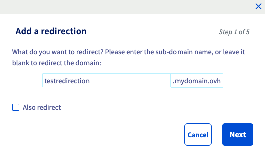
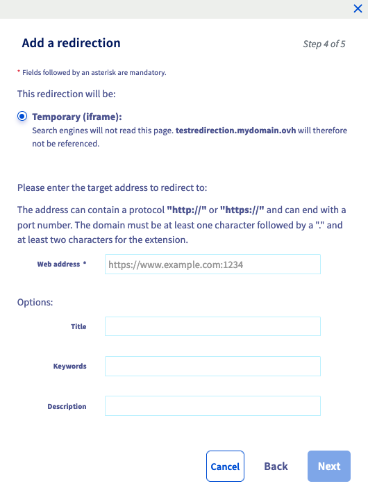

**Stand 27.11.2018**


## Einleitung

Eine Domainweiterleitung wird verwendet, um eine Domain auf ein neues Ziel umzuleiten. Dafür stehen verschiedene, den jeweiligen Anforderungen entsprechende Weiterleitungsarten zur Verfügung.

**Hier lernen Sie die verschiedenen Weiterleitungsarten kennen und erfahren, wie Sie diese für von OVHcloud verwaltete Domains einrichten.**

## Voraussetzungen

- Sie sind in Ihrem [OVHcloud Kundencenter](https://ovh.com/auth/?action=gotomanager){.external} eingeloggt.
- Sie sind mit Ihrem Webhosting verbunden (nur wenn Sie eine [.htaccess-Datei](https://docs.ovh.com/de/hosting/webhosting_alles_uber_die_datei_htaccess/){.external} hinzufügen möchten).

## Beschreibung

### Domainweiterleitung verstehen

Bevor Sie für Ihre Domain eine Weiterleitung einrichten, ist es wichtig zu verstehen, wozu diese dient. Domainweiterleitungen werden dann vorgenommen, wenn eine Domain auf ein neues Ziel umgeleitet werden soll (in der Regel auf eine andere Domain).

Das kann in verschiedenen Fällen notwendig sein. Meistens muss eine Weiterleitung eingerichtet werden, wenn der Name der Website geändert wurde. Durch die Weiterleitung werden die Besucher beim Aufruf des alten Domainnamens dann automatisch zum neuen Domainnamen weitergeleitet.

Die Weiterleitung kann auf verschiedene Arten eingerichtet werden:

- **Über das OVHcloud Kundencenter**: Sie können die Weiterleitung mithilfe eines Konfigurationsassistenten einrichten.

- **Weiterleitung selbst einrichten**: Bei dieser Methode erstellen Sie die Weiterleitung selbst in einer Datei (meist eine *.htaccess*-Datei). Hierzu sind Programmierkenntnisse erforderlich.

Beachten Sie, dass die Einrichtung einer Weiterleitung Auswirkungen auf das SEO-Ranking Ihrer Website haben kann. Gehen Sie bei Änderungen bitte vorsichtig vor und kontaktieren Sie einen Spezialisten für SEO-Ranking, wenn Sie Hilfe brauchen.

### Domainweiterleitung über das Kundencenter einrichten

Loggen Sie sich in Ihrem [OVHcloud Kundencenter](https://ovh.com/auth/?action=gotomanager){.external} ein, klicken Sie auf Domains und gehen Sie dann auf den Tab `Weiterleitung`{.action}.

Die Tabelle zeigt alle für Ihre Domain aktiven Weiterleitungen an.

Um eine Weiterleitung hinzuzufügen, klicken Sie auf den Button `Weiterleitung hinzufügen`{.action}.

Geben Sie im angezeigten Fenster die Domain (bzw. die Subdomain) ein, die Sie umleiten möchten. Dadurch legen Sie die Quell-Domain für die Weiterleitung fest.

{.thumbnail}

Wählen Sie nun das Ziel aus, auf das Sie die ausgewählte Domain weiterleiten möchten. Sie haben zwei Möglichkeiten:

- **Weiterleitung auf eine Webadresse**

Leiten Sie Ihre Domain auf eine andere Domain um. Wählen Sie diese Option, wenn Sie den Domainnamen Ihrer Website geändert haben.

- **Weiterleitung auf einen OVHcloud Server oder auf externe Server**

Ändern Sie die DNS-Konfiguration der Domain und geben Sie ein anderes Ziel ein (Eintrag A, AAAA oder CNAME). Wählen Sie diese Option, wenn Ihre Website an einem anderen Ort (zum Beispiel bei einem anderen Anbieter) gehostet wird, der Domainname aber bestehen bleibt.
Wenn Ihre Domain die OVHcloud Konfiguration verwendet, können Sie diese Änderung auch über das Kundencenter vornehmen (siehe [Bearbeiten der OVHcloud DNS-Zone](https://docs.ovh.com/de/domains/webhosting_bearbeiten_der_dns_zone/){.external}).

Die vorliegende Anleitung beschreibt von hier an ausschließlich die **Weiterleitung auf eine Webadresse**. Wenden Sie sich für die Weiterleitung auf einen anderen Server an Ihren Hosting-Anbieter. Die notwendigen Änderungen in Ihrer DNS-Konfiguration können Sie dort erfragen.

{.thumbnail}

Für die **Weiterleitung auf eine Webadresse** wählen Sie zunächst die Weiterleitungsart, die Sie einrichten möchten. Sie haben zwei Möglichkeiten:

|Weiterleitungsart|Beschreibung|
|---|---|
|Sichtbar (HTTP-Weiterleitung)|Der im Webbrowser eingegebene Domainname (die vorherige Webadresse) wird auf den neuen Domainnamen (Zieldomain) umgeleitet. Dabei wird die eingegebene Adresse (URL) in der Adresszeile des Browsers durch die neue Adresse ersetzt.|
|Unsichtbar (Frame-Weiterleitung)|Der im Webbrowser eingegebene Domainname (die vorherige Webadresse) wird nicht auf den neuen Domainnamen (Zieldomain) umgeleitet. Sie greifen weiterhin auf die vorherige Webadresse zu, die die auf der neuen Domain gehostete Website über eine Overlay-Ebene (*iframe*) anzeigt. Beachten Sie bitte, dass diese Möglichkeit nicht mit allen Websites kompatibel ist. Außerdem kann das SEO-Ranking Ihrer Website beeinträchtigt werden.|

{.thumbnail}

#### Sichtbare Weiterleitung

Für eine **sichtbare Weiterleitung** haben Sie zwei Möglichkeiten.

|Weiterleitungsart|HTTP-Code|Beschreibung|
|---|---|---|
|Permanent|301|Dies ist die Standard-Weiterleitung und gibt an, dass eine Seite dauerhaft umgezogen ist.|
|Temporär|302|Wählen Sie diese Weiterleitungsart für vorübergehende Weiterleitungen (beispielsweise für temporäre oder saisonale Ereignisse). Das SEO-Ranking wird in diesem Fall schlechter sein als bei einer 301-Weiterleitung.|

Nachdem Sie die Weiterleitungsart ausgewählt haben, geben Sie Ihre Zieldomain ein (die URL, auf die Sie weiterleiten möchten).

{.thumbnail}

Wenn Sie alle Informationen eingegeben haben, klicken Sie auf `Weiter`{.action}. Überprüfen Sie, dass die angezeigten Informationen korrekt sind, und klicken Sie dann auf `Bestätigen`{.action}.

> [!primary]
>
> Die Änderung erfordert eine Propagationszeit zwischen 4 und maximal 24 Stunden, bis sie voll wirksam ist.
>

#### Unsichtbare Weiterleitung (Frame-Weiterleitung)

Geben Sie für eine unsichtbare Weiterleitung (HTTP-200-Code) die angeforderten Informationen ein (Webadresse und Optionen) und klicken Sie dann auf `Weiter`{.action}. Vergewissern Sie sich, dass die angezeigten Informationen korrekt sind, bevor Sie auf `Bestätigen`{.action} klicken.

|Felder|Beschreibung|
|---|---|
|Titel|Geben Sie hier den Seitentitel Ihrer Website ein. Dieser wird beispielsweise im Tab des Webbrowsers angezeigt, wenn Sie Ihre Seite aufrufen.|
|Keywords|Diese Schlüsselwörter werden von Suchmaschinen für das Ranking Ihrer Website genutzt.|
|Beschreibung|Geben Sie hier eine Beschreibung Ihrer Website ein. Diese kann von Suchmaschinen bei der Anzeige der Suchergebnisse genutzt werden.|

> [!primary]
>
> Die Änderung erfordert eine Propagationszeit zwischen 4 und maximal 24 Stunden, bis sie voll wirksam ist.
>

{.thumbnail}

### Domainweiterleitung via .htaccess-Datei einrichten

.htaccess-Dateien sind Konfigurationsdateien, in denen Befehle angegeben werden können. Führt der Webserver (Apache) den Code Ihrer Website aus, werden diese Befehle interpretiert und entsprechend ausgeführt. Über diese Befehle können auch Weiterleitungen eingerichtet werden.

Für die Änderung einer .htaccess-Datei sind technische Kenntnisse erforderlich. Fehler bei der Anpassung der Datei können dazu führen, dass Ihre Website (bzw. Websites, wenn Sie in Unterverzeichnissen Ihres Webhostings mehrere Seiten hosten), nicht mehr erreichbar sind. Wenn Sie Zweifel haben oder bei Änderungen der .htaccess-Datei Hilfe brauchen, kontaktieren Sie bitte einen spezialisierten Webentwickler.

Weitere Tipps zu .htaccess-Dateien finden Sie in unserer Anleitung [Webhosting: Alles über die Datei .htaccess](https://docs.ovh.com/de/hosting/webhosting_alles_uber_die_datei_htaccess/){.external}.

> [!primary]
>
> **Erstellen Sie vor jeder Änderung unbedingt eine Sicherungskopie Ihrer .htaccess-Datei.** So können Sie bei Bedarf die vorherige Version wiederherstellen.
>

- **Redirect permanent**

Für eine permanente Weiterleitung wird ein HTTP-301-Code übermittelt. Er teilt den Suchmaschinen mit, dass sie ihre Links auf die neue URL aktualisieren müssen.

Fügen Sie den folgenden Code hinzu, um Ihre gesamte Website umzuleiten:

```
Redirect permanent /http://neue-seite.tld/
```

Fügen Sie den folgenden Code hinzu, um ein Verzeichnis/eine Datei zu ändern:

```
Redirect permanent /altes_verzeichnis http://neue-seite.tld/neues_verzeichnis
Redirect permanent /alte_datei.php http://neue-seite.tld/neue_datei.php
```

- **Redirect gone**

Wenn eine Datei nicht mehr existiert, ersetzen Sie die Fehlermeldung *404 Dokument nicht gefunden* am besten mit einer eindeutigen Meldung wie *410 Dokument existiert nicht mehr*:

```
Redirect gone /löschen.html
```

- **Redirect seeother**

Wenn Sie eine Dateiendung ändern möchten, verwenden Sie `seeother`, um den Dateityp über einen HTTP-303-Code zu ändern:

```
Redirect seeother/beispiel.doc http://seite.tld/beispiel.pdf
```

- **Redirect Temp**

Verwenden Sie einen HTTP-302-Code für eine temporäre Weiterleitung, wenn Sie Dateien vorübergehend auf eine andere Website übertragen.

```
Redirect temp / http://andere_website.tld/seite/
```

## Weiterführende Informationen

[Webhosting: Alles über die Datei .htaccess](https://docs.ovh.com/de/hosting/webhosting_alles_uber_die_datei_htaccess/){.external}

[Bearbeiten der OVHcloud DNS-Zone](https://docs.ovh.com/de/domains/webhosting_bearbeiten_der_dns_zone/){.external}

Für den Austausch mit unserer User Community gehen Sie auf [https://community.ovh.com/en/](https://community.ovh.com/en/){.external}.