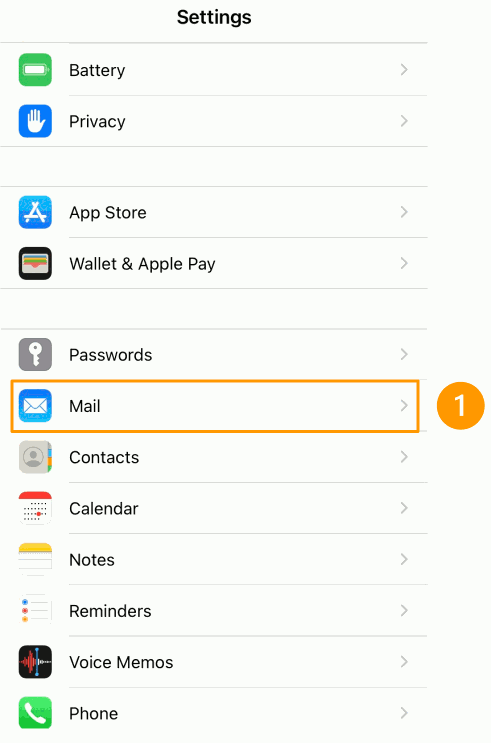
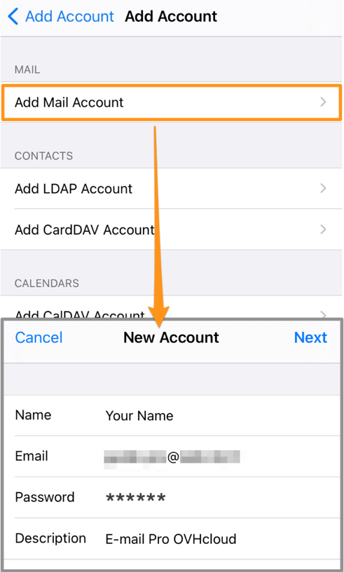
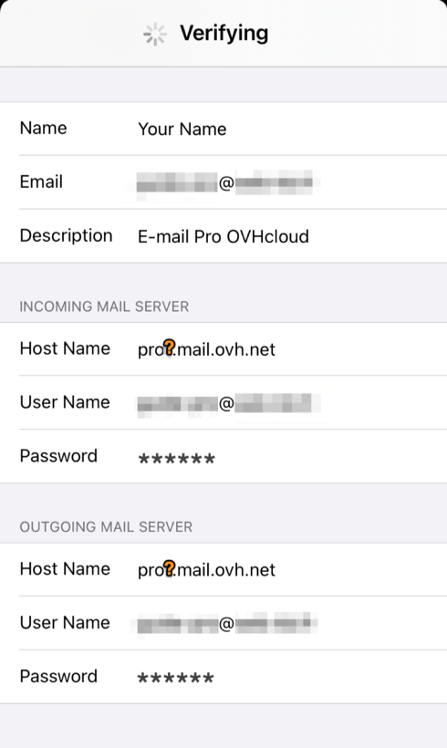

> [!primary]
> Diese Übersetzung wurde durch unseren Partner SYSTRAN automatisch erstellt. In manchen Fällen können ungenaue Formulierungen verwendet worden sein, z.B. bei der Beschriftung von Schaltflächen oder technischen Details. Bitte ziehen Sie beim geringsten Zweifel die englische oder französische Fassung der Anleitung zu Rate. Möchten Sie mithelfen, diese Übersetzung zu verbessern? Dann nutzen Sie dazu bitte den Button «Mitmachen» auf dieser Seite.
>

**Letzte Aktualisierung am 21.05.2021**

## Ziel

E-Mail Pro Accounts können auf verschiedenen, kompatiblen E-Mail-Clients eingerichtet werden. So können Sie Ihr bevorzugtes Gerät für Ihre E-Mail-Adressen verwenden.

**Diese Anleitung erklärt, wie Sie einen E-Mail Pro Account via Mail App auf einem iPhone oder iPad einrichten.**

> [!warning]
> OVHcloud stellt Ihnen Dienstleistungen zur Verfügung, für deren Konfiguration und Verwaltung Sie die alleinige Verantwortung tragen. Es liegt somit bei Ihnen, sicherzustellen, dass diese ordnungsgemäß funktionieren.
>
> Diese Anleitung soll Sie bei allgemeinen Aufgaben so weit wie möglich unterstützen. Bei Schwierigkeiten kontaktieren Sie bitte einen [spezialisierten Dienstleister](https://partner.ovhcloud.com/de/directory/) und/oder stellen Ihre Fragen in der [OVHcloud Community](https://community.ovh.com/en/).
>

## Voraussetzungen

- Sie verfügen über einen [E-Mail Pro Account](https://www.ovhcloud.com/de/emails/email-pro/){.external}.
- Die Mail App ist auf Ihrem iOS Gerät installiert.
- Sie verfügen über Anmeldeinformationen für die E-Mail-Adresse, die Sie konfigurieren möchten.

## In der praktischen Anwendung

### Schritt 1: Account hinzufügen

> [!primary]
>
> In dieser Anleitung verwenden wir als Serverbezeichnung: pro**?**.mail.ovh.net. Das „?“ muss mit der jeweils passenden Nummer Ihres zuständigen Servers für den einzurichtenden Email Pro Dienst ersetzt werden.
> 
> Sie finden diese Information im [OVHcloud Kundencenter](https://www.ovh.com/auth/?action=gotomanager&from=https://www.ovh.de/&ovhSubsidiary=de), wenn Sie den betreffenden `E-Mail Pro`{.action} Dienst auswählen. Der Servername wird im Kasten **Verbindung** auf der Seite `Allgemeine Informationen`{.action} angezeigt.
>

Klicken Sie vom Homescreen des Geräts aus auf `Einstellungen`{.action} (Zahnradsymbol). Je nach Ihrer iOS-Version erfolgt das Hinzufügen eines Accounts auf verschiedene Weise:

- **iOS 7, 8, 9 und 10**: Tippen Sie auf `Mail, Kontakte, Kalender`{.action} und dann auf `Account hinzufügen`{.action}. Als Accounttyp wählen Sie `Andere`{.action}, und klicken anschließend auf `Mail-Account hinzufügen`{.action}. Gehen Sie dann zu Schritt 5 der nachfolgenden Tabelle.

- **iOS 11**: Tippen Sie `auf Accounts und Passwörter`{.action} und dann auf `Account hinzufügen`{.action}. Als Accounttyp wählen Sie `Andere`{.action}, und klicken anschließend auf `Mail-Account hinzufügen`{.action}. Gehen Sie dann zu Schritt 5 der nachfolgenden Tabelle.

- **Für die aktuellen Versionen**: Folgen Sie den Anweisungen in der nachfolgenden Tabelle.

| | |
|---|---|
|{.thumbnail}|1. In `Einstellungen` gehen Sie auf `Mail`.    2. Tippen Sie auf `Accounts`.   3. Tippen Sie auf `Account hinzufügen`.   4. Wählen Sie unten `Andere`.|
|5. Tippen Sie auf `Mail-Account hinzufügen`.  6. Geben Sie **Name**, **E-Mail-Adresse**, **Passwort** und eine **Beschreibung** Ihres Accounts ein.  7. Drücken Sie auf `Weiter`.|{.thumbnail}|
|{.thumbnail}|8. Wählen Sie `IMAP` (empfohlen) oder `POP` aus.  Geben Sie als `INCOMING` und `OUTGOING` (trotz der Angabe "optional") folgende Werte ein:  - Hostname pro**?**.mail.ovh.net (ersetzen Sie **?** durch die Servernummer von E-Mail Pro)  - Ihre vollständige **E-Mail-Adresse** als Benutzername  - das Passwort Ihres E-Mail-Accounts|

Stellen Sie am Ende der Konfiguration sicher, dass Sie `Mail`{.action} aktiviert lassen, damit die Anwendung diesen Account verwenden kann, und klicken Sie dann auf `Speichern`{.action}.

Sie können eine Test-E-Mail versenden, um zu überprüfen, ob der Account korrekt eingerichtet ist.

Wenn manuelle Änderungen in den Account-Einstellungen erforderlich sind, verwenden Sie die folgenden technischen Einstellungen für E-Mail Pro Accounts:

|Servertyp|Servername|SSL|Port|
|---|---|---|---|
|Eingangsserver|pro**?**.mail.ovh.net|Ja|993|
|Ausgangsserver|pro**?**.mail.ovh.net|Ja|587|

### E-Mail-Adresse verwenden

Sobald Ihre E-Mail-Adresse eingerichtet ist, können Sie sie verwenden. Sie können ab sofort E-Mails versenden und empfangen.

OVHcloud bietet auch eine Webanwendung mit [kollaborativen Funktionen](https://www.ovhcloud.com/de/emails/){.external} an, unter <https://www.ovh.de/mail/>. Sie können sich mit den Login-Daten Ihrer E-Mail-Adresse anmelden.

> [!primary]
>
> Bei Schwierigkeiten beim Empfang oder beim Versand von E-Mails konsultieren Sie bitte unsere [FAQ zu den OVHcloud E-Mail-Diensten](../../emails/e-mails-faq/).
>

## Weiterführende Informationen

[Konfiguration Ihrer MX Plan E-Mail-Adresse auf iPhone oder iPad](../../emails/mail-konfiguration-iphone-ios-91/)

[Konfiguration von Exchange auf iPhone oder iPad](../../microsoft-collaborative-solutions/exchange_20132016_automatische_konfiguration_in_ios_iphone_-_ipad/)

[E-Mails FAQ](../../emails/e-mails-faq/)

Für den Austausch mit unserer User Community gehen Sie auf <https://community.ovh.com/en/>.
