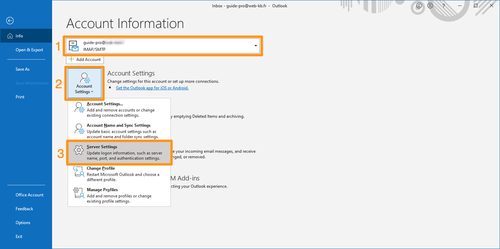

> [!primary]
> Diese Übersetzung wurde durch unseren Partner SYSTRAN automatisch erstellt. In manchen Fällen können ungenaue Formulierungen verwendet worden sein, z.B. bei der Beschriftung von Schaltflächen oder technischen Details. Bitte ziehen Sie beim geringsten Zweifel die englische oder französische Fassung der Anleitung zu Rate. Möchten Sie mithelfen, diese Übersetzung zu verbessern? Dann nutzen Sie dazu bitte den Button «Mitmachen» auf dieser Seite.
>

**Stand 05.07.2021**

## Ziel

E-Mail Pro Accounts können auf verschiedenen, kompatiblen E-Mail-Clients eingerichtet werden. So können Sie Ihr bevorzugtes Gerät für Ihre E-Mail-Adressen verwenden.

**Hier erfahren Sie, wie Sie Ihre E-Mail Pro Adresse auf Outlook oder später für Windows einrichten.**
 

> [!warning]
>
> OVHcloud stellt Ihnen Dienstleistungen zur Verfügung, für deren Konfiguration und Verwaltung Sie die alleinige Verantwortung tragen. Es liegt somit bei Ihnen, sicherzustellen, dass diese ordnungsgemäß funktionieren.
> 
> Wir stellen Ihnen diese Anleitung zur Verfügung, um Ihnen bei der Bewältigung alltäglicher Verwaltungsaufgaben zu helfen. Dennoch empfehlen wir Ihnen, falls Sie Hilfe brauchen, einen spezialisierten Dienstleister und/oder den Herausgeber des Dienstes zu kontaktieren. Für externe Dienstleistungen bietet OVHcloud leider keine Unterstützung. Genauere Informationen finden Sie im Teil „Weiterführende Informationen" dieser Anleitung.
> 

## Voraussetzungen

- Sie verfügen über einen [E-Mail Pro Account](https://www.ovh.de/emails/email-pro/){.external}.
- Sie verfügen über Microsoft Outlook oder nachfolgende Software.
- Sie haben die Login-Daten der E-Mail-Adresse, die Sie einrichten möchten.

## In der praktischen Anwendung

### Account hinzufügen

- **Wenn Sie die Anwendung zum ersten Mal starten**, öffnet sich ein Konfigurationsassistent und Sie werden dazu aufgefordert, Ihre E-Mail-Adresse einzugeben.

- **Wenn Sie bereits einen Account eingerichtet haben**, klicken Sie am oberen Rand Ihres Bildschirms auf `Datei`{.action} und anschließend auf `Konto hinzufügen`{.action}.

- Geben Sie nun Ihre E-Mail-Adresse an und klicken Sie auf `Erweiterte Optionen`{.action}. Setzen Sie einen Haken in dem sich öffnenden Feld `Ich möchte mein Konto manuell einrichten`{.action} und klicken Sie anschließend auf `Verbinden`{.action}. 

{.thumbnail}

> [!primary]
>
> In unserem Beispiel verwenden wir den Servernamen: pro***.mail.ovh.net Ersetzen Sie das "? " durch die Zahl für den Server Ihres E-Mail Pro Dienstes.
> 
> Diese Zahl finden Sie in Ihrem [OVHcloud Kundencenter](https://www.ovh.com/auth/?action=gotomanager&from=https://www.ovh.de/&ovhSubsidiary=de) r im Bereich `Web Cloud`{.action} und `E-Mail Pro`{.action}
>  in der Spalte links. Den Servernamen sehen Sie im Rahmen  **Verbindung** des Tabs `Allgemeine Informationen`{.action}.
> 

| | |
|---|---|
|{.thumbnail}|Wählen Sie zwischen IMAP und POP aus den verschiedenen Kontotypen.  Wir empfehlen die Verwendung von IMAP.|
|Geben Sie das Passwort Ihrer E-Mail-Adresse ein und klicken Sie auf `Weiter`{.action}. |{.thumbnail}|
|{.thumbnail}|Wenn Outlook Ihre Adresse nicht automatisch konfigurieren konnte, öffnet sich dieses Fenster.  Klicken Sie auf `Die Einstellungen des Accounts ändern`{.action} |
|Geben Sie in **eingehender E-Mail ein**:  - der Server **pro**?**.mail.ovh.net** (ersetzen Sie gut "**?**"durch die Nummer Ihres Servers)  - Port **993** - SSL/**TLS Verschlüsselung**  Geben Sie in **Ausgehende Post ein**:  - der Server **pro**?**.mail.ovh.net** (ersetzen Sie gut "**?**"durch die Nummer Ihres Servers) - Port **465** - SSL/**TLS Verschlüsselung**  Klicken Sie auf `Weiter`{.action}, um zu bestätigen. |{.thumbnail}|

Bei einer POP-**Konfiguration** ergeben sich folgende Werte:

|Server-Typ|Servername|Verschlüsselungsmethode|Port|
|---|---|---|---|
|Eingangsserver|pro**?**.mail.ovh.net (Angabe **"?"**soll durch die Nummer Ihres Servers ersetzt werden)|SSL/TLS|995|
|Ausgangsserver|pro**?**.mail.ovh.net (Angabe **"?"** soll durch die Nummer Ihres Servers ersetzt werden)|STARTTLS|587|

### E-Mail-Adresse verwenden

Wenn Ihre E-Mail-Adresse eingerichtet ist, können Sie sie verwenden. Sie können ab sofort E-Mails versenden und empfangen.

OVHcloud bietet auch eine Webanwendung, mit der Sie über einen Webbrowser auf Ihre E-Mail-Adresse zugreifen können. Diese ist über <https://www.ovh.de/mail/> verfügbar. Sie können sich mit den Login-Daten Ihrer E-Mail-Adresse anmelden. Für Fragen zur Verwendung lesen Sie bitte unsere Anleitung [Ihren Exchange Account über das OWA Interface einsehen](https://docs.ovh.com/de/microsoft-collaborative-solutions/exchange_2016_verwendung_der_outlook_web_app/).

### Backup Ihrer E-Mail-Adresse abrufen

Wenn Sie eine Änderung vornehmen müssen, die den Verlust der Daten Ihres E-Mail-Accounts zur Folge haben könnte, empfehlen wir Ihnen eine vorherige Sicherung des betreffenden E-Mail-Accounts. Lesen Sie hierzu den Abschnitt "**Windows** exportieren"in unserer Anleitung [E-Mail-Adresse manuell migrieren](https://docs.ovh.com/de/emails/email-adressen-manuell-migrieren/#uber-windows-exportieren).

### Bestehende Einstellungen ändern

Wenn Ihr E-Mail-Account bereits eingerichtet ist und Sie auf die Account-Einstellungen zugreifen müssen, um diese zu ändern:

- Gehen Sie `über`{.action} die Menüleiste oben auf Ihrem Bildschirm in Datei und wählen Sie dann im Drop-down-Menü den zu ändernden Account aus **(1)**.
- Klicken Sie `unten auf`{.action}** Account-Einstellungen(2)**.
- Klicken Sie `auf Server`{.action}**-Einstellungen**(3), um zum Parameterfenster zu gelangen.

{.thumbnail}

Das Fenster ist in zwei Teile unterteilt, **Eingehende** und **Ausgehende**. Klicken Sie auf das eine oder das andere, um diese zu ändern.

> [!primary]
>
> In unserem Beispiel verwenden wir den Servernamen: pro***.mail.ovh.net Ersetzen Sie das "? " durch die Zahl für den Server Ihres E-Mail Pro Dienstes.
> 
> Diese Zahl finden Sie in Ihrem [OVHcloud Kundencenter](https://www.ovh.com/auth/?action=gotomanager&from=https://www.ovh.de/&ovhSubsidiary=de)  im Bereich `Web Cloud`{.action} und `E-Mail Pro`{.action}
>  in der Spalte links. Den Servernamen sehen Sie im Rahmen  **Verbindung** des Tabs `Allgemeine Informationen`{.action}.
> 

{.thumbnail}

## Weiterführende Informationen

[Konfiguration Ihrer E-Mail-Adresse aus dem MX Plan Angebot oder einem Webhosting Angebot auf Outlook 2016 für Windows](https://docs.ovh.com/de/emails/konfiguration-outlook-2016/){.external}

[Konfiguration von Exchange auf Outlook 2016 für Windows](https://docs.ovh.com/de/microsoft-collaborative-solutions/exchange-automatische-konfiguration-auf-outlook-2016/){.external}

Für den Austausch mit unserer User Community gehen Sie auf <https://community.ovh.com/en/>.
