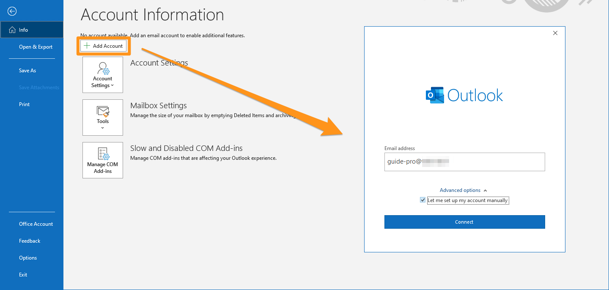
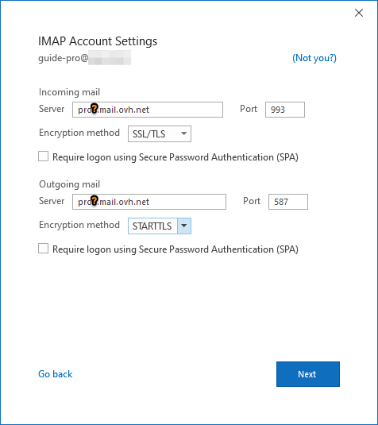
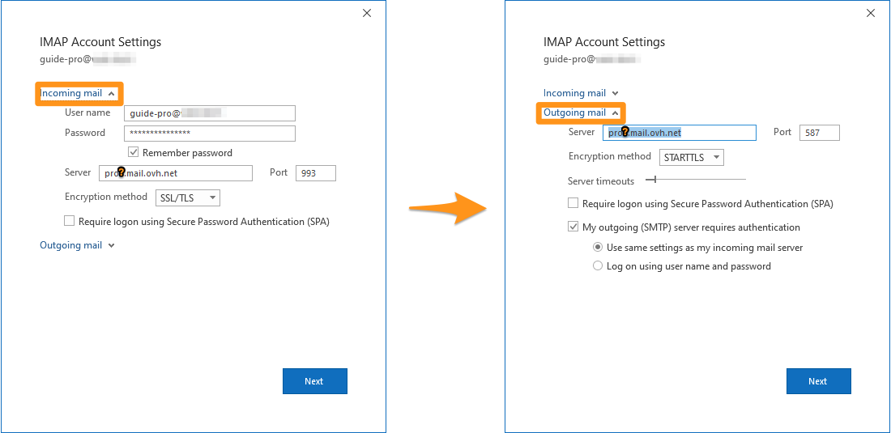

> [!primary]
> Questa traduzione è stata generata automaticamente dal nostro partner SYSTRAN. I contenuti potrebbero presentare imprecisioni, ad esempio la nomenclatura dei pulsanti o alcuni dettagli tecnici. In caso di dubbi consigliamo di fare riferimento alla versione inglese o francese della guida. Per aiutarci a migliorare questa traduzione, utilizza il pulsante "Modifica" di questa pagina.
>

**Ultimo aggiornamento: 05/07/2021**

## Obiettivo

Gli account Email Pro possono essere configurati su client di posta compatibili per permetterti di utilizzare il tuo account email dal dispositivo che preferisci.

**Questa guida ti mostra come configurare il tuo account email Email Pro su Outlook o successivamente su Windows.**
 

> [!warning]
>
> OVHcloud mette a tua disposizione servizi di cui tu sei responsabile per la configurazione e la gestione. Garantirne quotidianamente il corretto funzionamento è quindi responsabilità dell’utente.
> 
> Questa guida ti aiuta a eseguire le operazioni necessarie alla configurazione del tuo account. Tuttavia, in caso di difficoltà o dubbi, ti consigliamo di contattare un fornitore specializzato o l’amministratore del servizio. OVH non può fornirti alcuna assistenza. Per maggiori informazioni consulta la sezione “Per saperne di più” di questa guida.
> 

## Prerequisiti

- Disporre di un account email [Email Pro](https://www.ovh.it/emails/email-pro/){.external}
- Disporre di un software Microsoft Outlook o successivo
- Disporre delle credenziali associate all’indirizzo email da configurare

## Procedura

### Aggiungi l'account

- Durante il primo avvio dell’applicazione un assistente di configurazione apparirà sullo schermo e ti inviterà a inserire il tuo indirizzo e-mail.

- **Se hai già configurato un account**, clicca su `File`{.action} nella barra dei menù in alto nello schermo e poi su `Aggiungi account`{.action}.

- Ora inserisci il tuo indirizzo e-mail e clicca su Opzioni avanzate.  Selezione la voce accanto a Configurare il mio account manualmente appena comparsa e clicca su Connetti 

{.thumbnail}

> [!primary]
>
> Nel nostro esempio, usiamo il nome del server: pro**?**.mail.ovh.net. Dovrai sostituire il ""? " dalla cifra che indica il server del tuo servizio Email Pro.
> 
> Questa cifra è disponibile nello [Spazio Cliente OVHcloud](https://www.ovh.com/auth/?action=gotomanager&from=https://www.ovh.it/&ovhSubsidiary=it), nella sezione `Web Cloud`{.action} e poi `nella sezione Email Pro`{.action}
>  nella colonna a sinistra. Il nome del server è visibile nel riquadro **Connessione** della `scheda Informazioni generali`{.action}.
> 

| | |
|---|---|
|{.thumbnail}|Tra i diversi tipi di account, scegli tra IMAP e POP.  Ti consigliamo di utilizzare IMAP|
|Inserisci la password del tuo indirizzo email e clicca su `Avanti`{.action}. |{.thumbnail}|
|{.thumbnail}|Se Outlook non è riuscito a configurare automaticamente il tuo indirizzo, visualizzi questa finestra.  Clicca su `Modifica le impostazioni dell'account`{.action} |
|Inserisci nella **Posta in entrata**:  - il server **pro**?**.mail.ovh.net** (sostituisci "**?**" con il numero del tuo server)  - Port **993** - Crittografia **SSL/TLS**  Inserisci nella **Posta in uscita**:  - il server **pro**?**.mail.ovh.net** (sostituisci "**?**" con il numero del tuo server) - Port **465** - Crittografia **SSL/TLS**  Clicca su `Seguente`{.action} per confermare l'operazione. |{.thumbnail}|

Nell'ambito di una configurazione in **POP**, i valori sono i seguenti:

|Tipo di server|Nome del server|Metodo di cifratura|Porta|
|---|---|---|---|
|In entrata|pro**?**.mail.ovh.net (la menzione **"?"** è da sostituire con il numero del tuo server)|SSL/TLS|995|
|In uscita|pro**?**.mail.ovh.net (la menzione **"?"** è da sostituire con il numero del tuo server)|STARTTLS|587|

### Utilizza l'indirizzo email

Una volta configurato l’indirizzo email, non ti resta che utilizzarlo! A partire da questo momento puoi inviare e ricevere messaggi.

OVHcloud propone anche un'applicazione Web che permette di accedere al tuo indirizzo email da un browser Internet. disponibile alla pagina <https://www.ovh.it/mail/> accessibile utilizzando le credenziali del tuo account. Per maggiori informazioni sul suo utilizzo, consulta la guida [Consultare il suo account Exchange dall'interfaccia OWA](https://docs.ovh.com/it/microsoft-collaborative-solutions/exchange_2016_guida_allutilizzo_di_outlook_web_app/).

### Recuperare un backup del tuo indirizzo email

Se è necessario effettuare un'operazione che potrebbe comportare la perdita dei dati del tuo account email, ti consigliamo di effettuare un backup preliminare dell'account email in questione. Per effettuare questa operazione, consulta il paragrafo "**Esporta da Windows**" nella nostra guida [Migrare manualmente il tuo indirizzo email](https://docs.ovh.com/it/emails/migrare-i-indirizzi-email-manualmente/#esporta-da-windows).

### Modifica i parametri esistenti

Se il tuo account email è già configurato e devi accedere alle impostazioni dell'account per modificarle:

- Accedi al `File`{.action} dalla barra dei menu in alto nello schermo e seleziona l'account da modificare nel menu a tendina **(1)**.
- Clicca su `Impostazioni dell'account`{.action}**(2)** sotto.
- Clicca su `Impostazioni del server`{.action}**(3)** per accedere alla finestra delle impostazioni.

{.thumbnail}

La finestra è divisa in due parti: **Posta in entrata** e **Posta in uscita**. Clicca sull'uno o sull'altro per poterli modificare.

> [!primary]
>
> Nel nostro esempio, usiamo il nome del server: pro**?**.mail.ovh.net. Dovrai sostituire il "? " dalla cifra che indica il server del tuo servizio Email Pro.
> 
> Questa cifra è disponibile nello [Spazio Cliente OVHcloud](https://www.ovh.com/auth/?action=gotomanager&from=https://www.ovh.com/fr/&ovhSubsidiary=fr), nella sezione `Web Cloud`{.action} e poi `nella sezione Email Pro`{.action}
>  nella colonna a sinistra. Il nome del server è visibile nel riquadro **Connessione** della `scheda Informazioni generali`{.action}.
> 

{.thumbnail}

## Per saperne di più

[Configurare un account email su Outlook 2016 per Windows](https://docs.ovh.com/it/emails/configurazione-outlook-2016/){.external}

[Configurare un account Exchange su Outlook 2016 per Windows.](https://docs.ovh.com/it/microsoft-collaborative-solutions/configurazione-exchange-outlook-2016-windows/){.external}

Contatta la nostra Community di utenti all’indirizzo <https://community.ovh.com/en/>.
