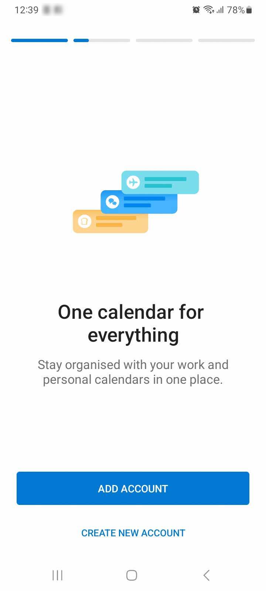
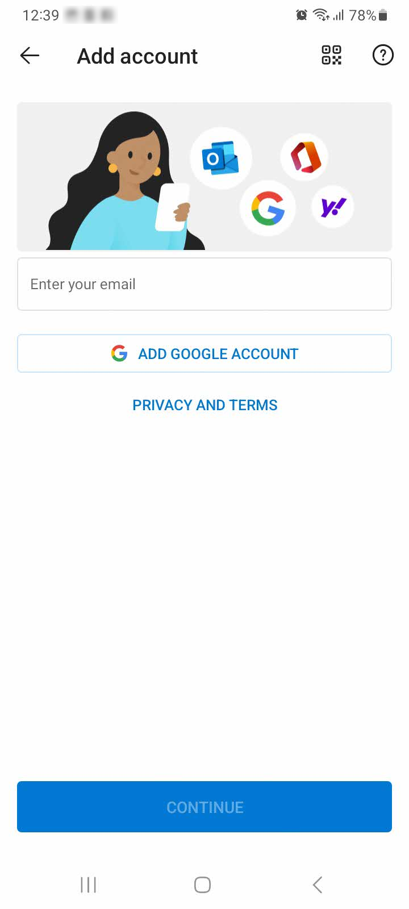
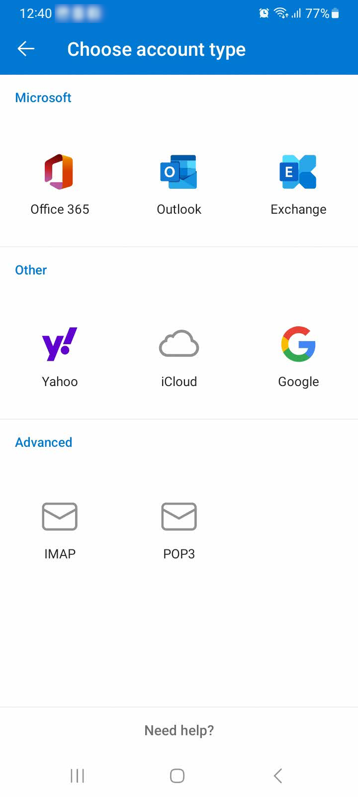

> [!primary]
> Diese Übersetzung wurde durch unseren Partner SYSTRAN automatisch erstellt. In manchen Fällen können ungenaue Formulierungen verwendet worden sein, z.B. bei der Beschriftung von Schaltflächen oder technischen Details. Bitte ziehen Sie im Zweifelsfall die englische oder französische Fassung der Anleitung zu Rate. Möchten Sie mithelfen, diese Übersetzung zu verbessern? Dann nutzen Sie dazu bitte den Button "Beitragen" auf dieser Seite.
>

## Ziel

E-Mail Pro Accounts können auf verschiedenen kompatiblen E-Mail-Clients eingerichtet werden. So können Sie Ihre E-Mail-Adresse über das Gerät Ihrer Wahl verwenden.

**Diese Anleitung erklärt, wie Sie Ihren E-Mail Pro Account mit der Microsoft Outlook App in Android einrichten.**

## Voraussetzungen

- Sie verfügen über ein Angebot [E-Mail Pro](https://www.ovhcloud.com/de/emails/email-pro/){.external}.
- Sie haben die Microsoft Outlook Anwendung auf Ihrem Android Gerät installiert. Sie können die Datei über das *Google Play Store* herunterladen.

> [!warning]
>
> OVHcloud stellt Ihnen Dienste zur Verfügung, deren Konfiguration, Verwaltung und Verantwortung Ihnen obliegen. Es liegt daher an Ihnen, dafür zu sorgen, dass sie ordnungsgemäß funktionieren.
> 
> Wir stellen Ihnen diese Anleitung zur Verfügung, um Sie bei alltäglichen Aufgaben bestmöglich zu unterstützen. Dennoch empfehlen wir Ihnen, falls Sie Hilfe brauchen, einen [spezialisierten Dienstleister](https://partner.ovhcloud.com/de/directory/) und/oder den Herausgeber des Dienstes zu kontaktieren. Wir werden Ihnen leider keine Unterstützung anbieten können. Weitere Informationen finden Sie im Abschnitt "Weiterführende Informationen" dieser Anleitung.
> 

## In der praktischen Anwendung

### Schritt 1: Informationen des E-Mail Pro Accounts abrufen 

Loggen Sie sich in Ihr [OVHcloud Kundencenter](https://www.ovh.com/auth/?action=gotomanager&from=https://www.ovh.de/&ovhSubsidiary=de){.external} ein und gehen Sie in den Bereich `Web Cloud`{.action}. Klicken Sie in der linken Spalte auf `E-mail für Profis`{.action} und wählen Sie die E-Mail Pro Plattform aus, in der sich die zu konfigurierende E-Mail-Adresse befindet.

Klicken Sie auf der neuen Seite auf den Tab `E-Mail-Accounts`{.action}.

{.thumbnail}

Rufen Sie den Namen des Pro E-Mail-Servers ab, der unter dem Eintrag für `Webmail`{.action} erscheint. In unserem oben dargestellten Beispiel handelt es sich um `proX.mail.ovh.net`.

> [!warning]
>
> Geben Sie den **guten Namen** des E-Mail Pro Servers mit der E-Mail-Adresse ein, die Sie einrichten möchten. Dieser kann je nach Alter Ihres E-Mail Pro Angebots unterschiedlich ausfallen (pro1.mail.ovh.net, pro2.mail.ovh.net usw.).
> 

Im Tab `E-Mail-Accounts`{.action} Ihrer Plattform *E-Mail Pro* wird eine Tabelle mit Ihrer E-Mail Pro Adresse(n) angezeigt.

Wenn Sie sich nicht mehr an das Passwort für den Zugang zur E-Mail-Adresse erinnern, die Sie konfigurieren möchten, können Sie es mithilfe der Schaltfläche Kfz `...`{.action} ändern auf derselben Zeile rechts neben dem E-Mail Account.

Wählen Sie dann die Option `Ändern`{.action} aus, wählen Sie ein neues Passwort aus und bestätigen Sie dieses. Klicken Sie dann auf `Weiter`{.action} und dann auf im zweiten Fenster `bestätigen`{.action}.

Die Änderung des Passworts wird in etwa 15 Minuten durchgeführt.

> [!warning]
>
> Wenn Sie das Passwort Ihrer E-Mail-Adresse ändern und diese bereits von einem anderen Gerät (E-Mail-Programm, Computer, Tablet, Smartphone, Kopierer usw.) verwendet wird, müssen Sie das Passwort für diese anderen Geräte aktualisieren.
> Diese können sich dann nicht mehr mit Ihrer E-Mail-Adresse über das alte Passwort verbinden.
>

Am Ende dieses ersten Schritts müssen Sie nun folgende Angaben haben:

- Name des E-Mail Pro Servers (pro1.mail.ovh.net, pro2.mail.ovh.net usw.)
- zu konfigurierende E-Mail-Adresse
- das Passwort der zu konfigurierenden E-Mail-Adresse.

### Schritt 2: Ihre Adresse in Android über die Microsoft Outlook Anwendung konfigurieren 

Starten Sie auf Ihrem Android-Gerät die Microsoft Outlook Anwendung. Wenn Sie es noch nicht installiert haben, laden Sie es über das *Google Play Store* herunter.

|||
|---|---|
|{.thumbnail}|{.thumbnail}|

Klicken Sie nach dem `Öffnen auf Account`{.action} hinzufügen, geben Sie Ihre vollständige E-Mail-Adresse im Feld `E-Mail-Adresse`{.action} angeben und klicken Sie dann auf `Weiter`{.action}.

Hier finden Sie unten auf Ihrem Bildschirm zwei Konfigurationsmöglichkeiten: `IMAP`{.action} und `POP3`{.action}

|||
|---|---|
| {.thumbnail} | {.thumbnail} |

> [!success]
>
> Das Synchronisationsprotokoll **IMAP** ermöglicht es, ein "Bild" der E-Mails in Ihrer E-Mail Pro Server-Adresse abzurufen, um diese in Ihrer Microsoft Outlook Anwendung anzuzeigen, **ohne** die E-Mail-Adresse des E-Mail Pro Servers zu löschen, an dem sich Ihre E-Mail-Adresse befindet. Dieses Protokoll ist besonders nützlich, wenn Sie mehrere Geräte mit Ihrer E-Mail-Adresse konfiguriert haben.
>
> Das Protokoll **POP3** wird standardmäßig die E-Mail abrufen, die auf dem E-Mail Pro Server empfangen wurde, auf dem sich Ihre E-Mail-Adresse befindet, um diese in der mit dieser E-Mail konfigurierten Anwendung / Software zu speichern. Aus diesem Grund ist die E-Mail nicht mehr auf dem E-Mail Pro Server, sondern nur noch auf dem mit Ihrer E-Mail-Adresse über das POP-Protokoll konfigurierten Gerät verfügbar.
> Dieses Protokoll wird nicht empfohlen, wenn Sie mehrere Geräte mit Ihrer E-Mail-Adresse konfiguriert haben. Die E-Mail wird nur auf einem der in **POP3** konfigurierten Geräte und nicht auf allen mit Ihrer E-Mail-Adresse konfigurierten Geräten aktiv sein.
>
> Trotz einer Konfiguration in **POP3** senden einige E-Mail-Programme / Anwendungen dennoch eine Kopie der E-Mail auf den Server, auf dem sich Ihre E-Mail-Adresse befindet. Diese Kopie kann temporär oder dauerhaft sein.
> Um zu erfahren, ob Ihre Applikation / Software Teil davon ist, kontaktieren Sie den Herausgeber der Software direkt.
>

#### Fall #1: Konfiguration der Microsoft Outlook Anwendung in Android mit dem IMAP Protokoll

Wählen Sie `IMAP`{.action} unten auf Ihrem Bildschirm aus.

Auf der neu geöffneten Seite ist Ihre E-Mail-Adresse im Voraus angegeben.

Geben Sie das Passwort Ihrer E-Mail Pro Adresse im Formular `Passwort`{.action} direkt unter dem Ort ein, an dem Ihre E-Mail-Adresse bereits vorab angegeben ist.

Geben Sie in den beiden folgenden Formularen **fakultativ** einen `vollständigen Namen`{.action} und eine ganze `Beschreibung`{.action} ein.

Setzen Sie hier einen Haken bei der Schaltfläche `FORTGESCHRITTENE EINSTELLUNGEN`{.action}, um den Rest des Konfigurationsmenüs anzugeben.

Füllen Sie anschließend die einzelnen Formulare mit folgenden Angaben aus.

Für den Bereich **Posteingangsserver IMAP**:

 - **IMAP-Hostname**: Geben Sie den Namen Ihres E-Mail Pro Servers an, der zuvor in [Schritt 1](#step1) abgerufen wurde : (Beispiele: *pro1.mail.ovh.net*, *pro2.mail.ovh.net* usw.)
 - **Port**: Geben Sie die Port-Nummer an **993**
 - **Art der Sicherheit**: Sicherheitsliste **SSL/TLS**
 - **IMAP-Benutzername**: Geben Sie die E-Mail-Adresse an, die Sie konfigurieren möchten.
 - **IMAP Passwort**: Geben Sie das Passwort für den Zugriff auf die E-Mail-Adresse ein, die Sie konfigurieren möchten.

Für den Bereich **Postausgangsserver SMTP**:

 - **SMTP-Hostname**: Geben Sie den Namen Ihres E-Mail Pro Servers an, der zuvor in [Schritt 1](#step1) abgerufen wurde : (Beispiele: *pro1.mail.ovh.net*, *pro2.mail.ovh.net* usw.)
 - **Port**: Geben Sie die Port-Nummer an **587**
 - **Art der Sicherheit**: Sicherheitsliste **StartTls**
 - **SMTP-Benutzername**: Geben Sie die E-Mail-Adresse an, die Sie konfigurieren möchten.
 - **SMTP Passwort**: Geben Sie das Passwort für den Zugriff auf die E-Mail-Adresse ein, die Sie konfigurieren möchten.

Überprüfen Sie anschließend, ob alle eingegebenen Einstellungen den oben angegebenen Elementen entsprechen, und klicken Sie rechts oben auf Ihrem Bildschirm auf das `V`{.action}-förmige Icon.

#### Fall #2: Konfiguration der Microsoft Outlook Anwendung in Android mit dem "POP3" Protokoll

Klicken Sie unten auf den entsprechenden `POP3`{.action}-Bildschirm. 

Auf der neu geöffneten Seite ist Ihre E-Mail-Adresse im Voraus angegeben.

Geben Sie das Passwort Ihrer E-Mail Pro Adresse im Formular `Passwort`{.action} direkt unter dem Ort ein, an dem Ihre E-Mail-Adresse bereits vorab angegeben ist.

Geben Sie in den beiden folgenden Formularen **fakultativ** einen `vollständigen Namen`{.action} und eine ganze `Beschreibung`{.action} ein.

Setzen Sie hier einen Haken bei der Schaltfläche `FORTGESCHRITTENE EINSTELLUNGEN`{.action}, um den Rest des Konfigurationsmenüs anzugeben.

Füllen Sie anschließend die einzelnen Formulare mit folgenden Angaben aus.

Für den Bereich **Posteingangsserver POP**:

 - **POP-Hostname**: Geben Sie den Namen Ihres E-Mail Pro Servers an, der zuvor in [Schritt 1](#step1) abgerufen wurde : (Beispiele: *pro1.mail.ovh.net*, *pro2.mail.ovh.net* usw.)
 - **Port**: Geben Sie die Port-Nummer an **995**
 - **Art der Sicherheit**: Sicherheitsliste **SSL/TLS**
 - **POP-Benutzername**: Geben Sie die E-Mail-Adresse an, die Sie konfigurieren möchten.
 - **POP Passwort**: Geben Sie das Passwort für den Zugriff auf die E-Mail-Adresse ein, die Sie konfigurieren möchten.

Für den Bereich **Postausgangsserver SMTP**:

 - **SMTP-Hostname**: Geben Sie den Namen Ihres E-Mail Pro Servers an, der zuvor in [Schritt 1](#step1) abgerufen wurde : (Beispiele: *pro1.mail.ovh.net*, *pro2.mail.ovh.net* usw.)
 - **Port**: Geben Sie die Port-Nummer an **587**
 - **Art der Sicherheit**: Sicherheitsliste **StartTls**
 - **SMTP-Benutzername**: Geben Sie die E-Mail-Adresse an, die Sie konfigurieren möchten.
 - **SMTP Passwort**: Geben Sie das Passwort für den Zugriff auf die E-Mail-Adresse ein, die Sie konfigurieren möchten.

Überprüfen Sie anschließend, ob alle eingegebenen Einstellungen den oben angegebenen Elementen entsprechen, und klicken Sie rechts oben auf Ihrem Bildschirm auf das `V`{.action}-förmige Icon.

### Schritt 3: Konfiguration der Microsoft Outlook App auf Android abschließen

Nachdem Sie auf das Icon in der Form `V`{.action} geklickt haben, testet die Anwendung die Einstellungen und loggt sich in den E-Mail Pro Server ein, auf dem sich Ihre E-Mail-Adresse befindet.
Die E-Mail-Adresse wird dann synchronisiert / abgerufen, um den Inhalt Ihrer E-Mail-Adresse anzuzeigen.

Testen Sie anschließend den Versand und Empfang von E-Mails von Ihrer Microsoft Outlook Applikation aus, um die Konfiguration abzuschließen.

## Weiterführende Informationen 

Kontaktieren Sie für spezialisierte Dienstleistungen (SEO, Web-Entwicklung etc.) die [OVHcloud Partner](https://partner.ovhcloud.com/de/directory/).

Wenn Sie Hilfe bei der Nutzung und Konfiguration Ihrer OVHcloud Lösungen benötigen, beachten Sie unsere [Support-Angebote](https://www.ovhcloud.com/de/support-levels/).

Für den Austausch mit unserer User Community gehen Sie auf <https://community.ovh.com/en/>.