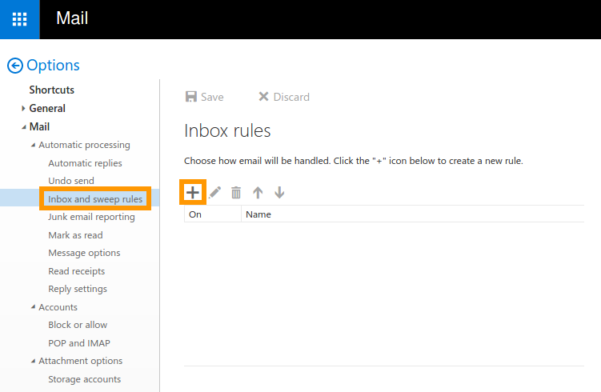
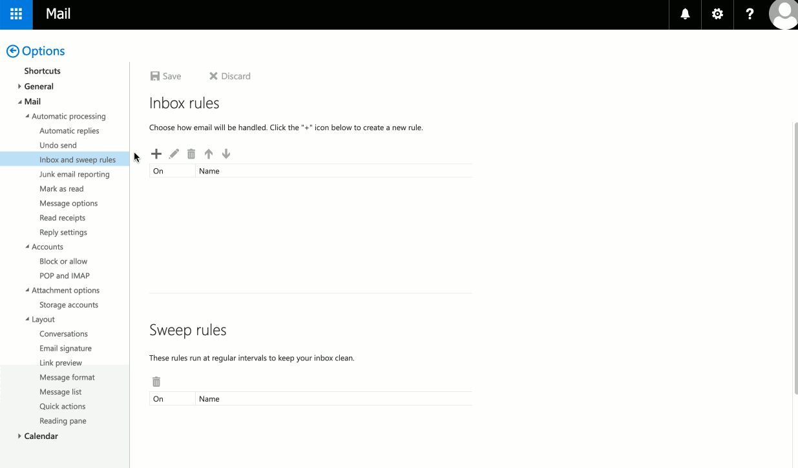
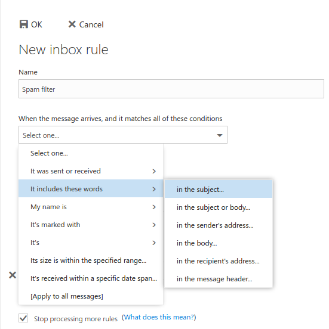

**Ostatnia aktualizacja: 11-03-2020**

## Wprowadzenie

Przy użyciu opcji „Reguły skrzynki odbiorczej” można utworzyć złożone zestawy reguł do obsługi e-maili przychodzących. Ułatwia to utrzymanie porządku na koncie poczty elektronicznej dzięki automatycznemu sortowaniu wiadomości w folderach. Jest też możliwe zdefiniowanie ustawień przesyłania dalej e-maili (przekierowywania) i filtrowanie wiadomości będących spamem.

**Dowiedz się, jak utworzyć filtry poczty e-mail i przekierowania przy użyciu aplikacji Outlook Web App (OWA).**

## Wymagania początkowe

- skonfigurowane rozwiązanie poczty elektronicznej OVHcloud (**usługa MX Plan** dostępna w ramach [hostingu WWW](https://www.ovhcloud.com/pl/web-hosting/), zawarta w [bezpłatnym hostingu Start10M](https://www.ovhcloud.com/pl/domains/free-web-hosting/) lub zamówiona oddzielnie jako rozwiązanie autonomiczne; [**Hosted Exchange**](https://www.ovhcloud.com/pl/emails/hosted-exchange/) lub [**E-mail Pro**](https://www.ovhcloud.com/pl/emails/email-pro/))
- dane do logowania dla adresu e-mail, który chcesz skonfigurować

## W praktyce

### Krok 1: przejście do sekcji opcji

Zaloguj się na Twoje konto Exchange przy użyciu interfejsu [OVHcloud webmail](https://www.ovh.pl/mail/). Kliknij ikonę koła zębatego w prawym górnym rogu, aby rozwinąć menu „Opcje”, i wybierz pozycję `Opcje`{.action}.

{.thumbnail}

W drzewie „Opcje” wybierz pozycję `Skrzynka odbiorcza i reguły oczyszczania`{.action}, aby przejść do interfejsu reguł. Zostanie wyświetlona lista reguł, jakie można zastosować do danego konta. Utwórz nową regułę, klikając ikonę `+`{.action}.

{.thumbnail}

### Krok 2: tworzenie reguł

{.thumbnail}

Edytor reguł pomaga w skonfigurowaniu odmiennych mechanizmów dla wszystkich e-maili przychodzących w zależności od różnych założeń. Proces zdefiniowania reguły ma trzy części:

|Krok|Opis|
|---|---|
|Dodanie warunku|Wybór co najmniej jednego warunku, który wyzwala regułę.|
|Dodanie działania|Wybór działań, które powinny nastąpić względem wiadomości e-mail spełniających warunki.|
|Dodanie wyjątku (opcjonalnie)|Regułę można doprecyzować, dodając co najmniej jeden warunek wykluczenia pewnych e-maili.|

Na przykład można ustawić warunek „Odebrana od...” i określić adres e-mail, a następnie wybrać przenoszenie tych wiadomości do konkretnego folderu.

#### Pole wyboru „Zatrzymaj przetwarzanie dalszych reguł”

Jeśli utworzono kilka reguł, do e-maila przychodzącego prawdopodobnie może mieć zastosowanie kilka z nich. Pozostaw tę opcję aktywną dla każdej reguły, po której nigdy nie powinny następować inne reguły. To prosty sposób, aby zapobiec dalszemu przetwarzaniu e-maili, które spełniają wiele warunków.

### Tworzenie użytecznych reguł za pomocą dwóch przykładów: przekierowania i filtrowania spamu 

Ponieważ jest dostępnych wiele warunków i działań, nie jesteśmy w stanie przedstawić wszystkich z nich w tym przewodniku. Poniżej znajdują się dwa przykłady zasadnicze z punktu widzenia korzystania z konta e-mail OVHcloud. 

> [!warning]
>OVHcloud oferuje usługi, ale to użytkownik ponosi odpowiedzialność za zarządzanie nimi oraz ich konfigurację. Tym samym odpowiada za zapewnienie ich prawidłowego działania.
>
>Niniejszy przewodnik zawiera informacje pomocne przy wykonywaniu typowych zadań. Jednak w przypadku wystąpienia problemów zalecamy kontakt z dostawcą konkretnych usług lub wydawcą oprogramowania, ponieważ nie będziemy w stanie udzielić pomocy. Więcej informacji zawiera sekcja „Sprawdź również” tego przewodnika.
>

#### Przykład 1: przekierowanie e-maili na inny adres

Utwórz nową regułę, klikając ikonę `+`{.action}. Nadaj nazwę regule i poniżej wybierz e-maile, do których ma ona mieć zastosowanie. Na potrzeby tego przykładu początkowo wybraliśmy **wszystkie wiadomości**. Następnie wybierz odpowiednie działanie. Działaniem wybranym w tym przykładzie jest **przekierowanie**. Weź pod uwagę różnicę techniczną: jeśli „prześlesz dalej” e-mail, końcowy odbiorca zobaczy Twój adres e-mail jako nadawcę. „Przekierowanie” natomiast spowoduje wysłanie e-maila na adres docelowy bez zmiany oryginalnego adresu nadawcy. 

{.thumbnail}

W następnym interfejsie wybierz adres e-mail z listy „Twoje kontakty” (`+`{.action}) lub wpisz adres w górnym pasku. Można też wyszukać użytkowników, których nie ma na liście kontaktów. Na koniec kliknij przycisk `Zapisz`{.action}, aby wrócić do interfejsu „Nowa reguła skrzynki odbiorczej”. Regułę możesz rozszerzyć, klikając przycisk `Dodaj akcję`{.action}. W razie potrzeby dodaj też wyjątki, które na przykład uniemożliwią przekierowanie wiadomości przychodzącej wysłanej z konkretnego adresu e-mail lub zawierającej pewne słowa kluczowe. Zapisz regułę, klikając przycisk `OK`{.action}.

Nowa reguła jest widoczna na liście wraz z wyjaśnieniem jej działania. Można ją edytować, dezaktywować lub usunąć.

{.thumbnail}

#### Przykład 2: filtrowanie niechcianych e-maili (spamu)

> [!primary]
>
Poniższe instrukcje są wykonalne tylko wtedy, jeśli w domenie są właściwie używane rekordy OVHcloud MX. Inne konfiguracje usługi są również możliwe, ale mogą nie korzystać z ochrony OVHcloud przed spamem.
>

Utwórz nową regułę, klikając ikonę `+`{.action}.

{.thumbnail}

Nadaj nazwę regule, a jako warunki wybierz „Zawiera te wyrazy” i „w temacie...”. W następnym interfejsie wpisz „\[SPAM]”, aby wybrać wiadomości, które zostały wstępnie oznaczone przez funkcję ochrony przed spamem OVHcloud. Dodaj to wyrażenie, klikając ikonę `+`{.action}, a następnie kliknij przycisk `OK`{.action}.

{.thumbnail}

Ponieważ żadne mechanizmy ochrony antyspamowej nie są w stanie precyzyjnie określić, czy dany e-mail naprawdę jest spamem, dobrym sposobem jest zbieranie takich e-maili w dedykowanym folderze. Dzięki temu można sprawdzić zawartość folderu spamu przed jego opróżnieniem. Aby zarchiwizować e-maile, wybierz działanie „Przenieś, kopiuj lub usuń”, a następnie „Przenieś wiadomość do folderu...”. Wybierz folder z listy. Zapisz regułę, klikając przycisk `OK`{.action}.

{.thumbnail}

> [!primary]
>
Wiadomości błędnie oznaczonych jako spam (tzw. fałszywie pozytywnych) nie można zgłosić bezpośrednio w aplikacji OWA. Jeśli otrzymujesz e-maile błędnie oznaczone jako \[SPAM], zalecamy powiadomienie naszego zespołu wsparcia klienta przez utworzenie zgłoszenia w [Panelu klienta OVHcloud](https://www.ovh.com/manager/dedicated/#/support/tickets/new).  
>

## Sprawdź również

[Exchange 2016: Uruchomienie autorespondera w interfejsie OWA](../exchange_2016_uruchomienie_autorespondera_w_interfejsie_owa/)

[Exchange 2016: współdzielenie kalendarza w interfejsie OWA](../exchange_2016_wspoldzielenie_kalendarza_poprzez_webmail_owa/)

[Korzystanie z konta e-mail przy użyciu Webmail Outlook Web App (OWA)](../exchange_2016_przewodnik_dotyczacy_korzystania_z_outlook_web_app/)

Dołącz do naszej społeczności użytkowników: <https://community.ovh.com/en/>.