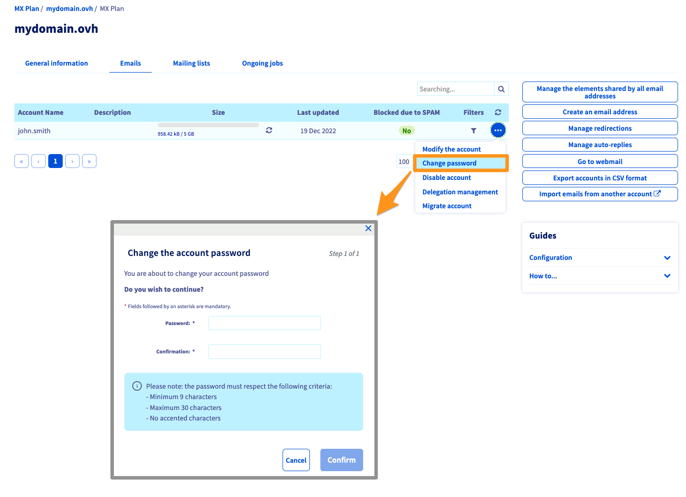
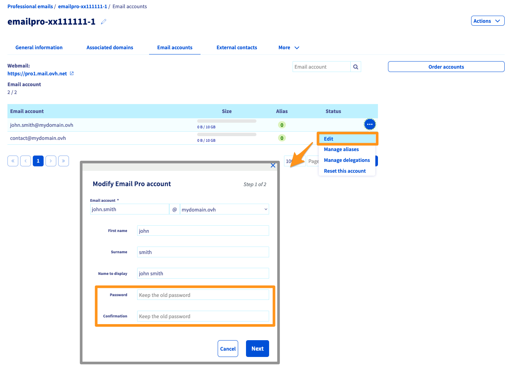

**Ostatnia aktualizacja z dnia 03-01-2023**

## Wprowadzenie

Konta e-mail w ramach Twojej usługi OVHcloud są dostępne za pomocą przypisanego do nich hasła. Możesz ją zmienić na 2 sposobów, w zależności od oferty e-mail:

- Z poziomu interfejsu Webmail
- W Panelu klienta OVHcloud

**Dowiedz się, jak zmienić hasło do konta e-mail OVHcloud.**

## Wymagania początkowe

- Posiadanie wcześniej skonfigurowanego rozwiązania poczty elektronicznej OVHcloud (**MX Plan**, zaproponowanego w naszej [ofercie hostingu](https://www.ovhcloud.com/pl/web-hosting/), zawartego w [Darmowy hosting 100M](https://www.ovhcloud.com/pl/domains/free-web-hosting/) lub zamówionym oddzielnie jako rozwiązanie autonomiczne, takie jak [**Hosted Exchange**](https://www.ovhcloud.com/pl/emails/hosted-exchange/) lub [**Email Pro**](https://www.ovhcloud.com/pl/emails/email-pro/))
- W zależności od metody, której używasz: zalogować się do [Panelu klienta OVHcloud](https://www.ovh.com/auth/?action=gotomanager&from=https://www.ovh.pl/&ovhSubsidiary=pl) w sekcji `Web Cloud`{.action} lub logować się do konta e-mail za pośrednictwem [interfejsu webmail](https://www.ovhcloud.com/pl/mail/).

> [!primary]
>
> Po zmianie hasła do Twojego konta e-mail wprowadź tę zmianę na wszystkich urządzeniach, na których skonfigurowałeś konto. Zapoznaj się z naszymi przewodnikami dotyczącymi konfiguracji Twojego programu pocztowego na stronie głównej Twojej usługi e-mail:
>
> - [MXplan](/products/web-cloud-email-collaborative-solutions-mx-plan)
> - [E-mail Pro](/products/web-cloud-email-collaborative-solutions-email-pro)
> - [Exchange](/products/web-cloud-email-collaborative-solutions-microsoft-exchange)
>

## W praktyce

### Zmiana hasła w Panelu klienta 

> [!warning]
> Ze względów bezpieczeństwa zalecamy nie używać dwa razy tego samego hasła. Najlepiej wybrać hasło, które nie ma żadnego związku z Twoimi danymi osobistymi (takimi jak nazwisko, imię i data urodzenia) i regularnie je zmieniać.

W [Panelu klienta OVHcloud](https://www.ovh.com/auth/?action=gotomanager&from=https://www.ovh.pl/&ovhSubsidiary=pl) przejdź do sekcji `Web Cloud`{.action} i postępuj zgodnie z instrukcjami zawartymi w Twojej ofercie:

> [!tabs]
> **E-maile MXplan (wersja historyczna)**
>>
>> Jeśli nie wiesz, jakiego typu jest Twoja oferta MXplan, zapoznaj się z naszym punktem [Sprawdź ofertę MXplan](#whichmxplan). 
>> Kliknij `E-maile`{.action}, po czym wybierz odpowiednią usługę MX Plan. Przejdź do zakładki `E-maile`{.action}. Pojawi się okno, w którym widoczne są istniejące konta e-mail.  
>> Kliknij przycisk, <i class="icons-ellipsis icons-border-rounded icons-masterbrand-blue"></i> a następnie `Zmień hasło`{.action}.  
>>{.thumbnail} 
>>
> **E-maile MXplan (nowa wersja)**
>>
>> Jeśli nie wiesz, jakiego typu jest Twoja oferta MXplan, zapoznaj się z naszym punktem [Sprawdź ofertę MXplan](#whichmxplan). 
>> Kliknij `E-maile`{.action}, po czym wybierz odpowiednią usługę MX Plan. Przejdź do zakładki `E-maile`{.action}. Pojawi się okno, w którym widoczne są istniejące konta e-mail.  
>> Kliknij przycisk, po czym <i class="icons-ellipsis icons-border-rounded icons-masterbrand-blue"></i> kliknij `Zmień`{.action}.  
>>{.thumbnail} 
>>
> **Email Pro**
>>
>> Kliknij `E-mail Pro`{.action}, po czym wybierz odpowiednią platformę. Przejdź do zakładki `Konta e-mail`{.action}. Pojawi się okno, w którym widoczne są istniejące konta e-mail. 
>> Kliknij przycisk, <i class="icons-ellipsis icons-border-rounded icons-masterbrand-blue"></i> a następnie `Zmień`{.action}.  
>>{.thumbnail} 
>>
> **Exchange**
>>
>> Kliknij `Microsoft`{.action} / `Exchange`{.action}, następnie wybierz odpowiednią platformę. Przejdź do zakładki `Konta e-mail`{.action}. Pojawi się okno, w którym widoczne są istniejące konta e-mail. 
>> Kliknij przycisk, <i class="icons-ellipsis icons-border-rounded icons-masterbrand-blue"></i> a następnie `Zmień`{.action}.  
>>{.thumbnail} 
>>

### Zmiana hasła w interfejsie Webmail

Zmiana hasła za pomocą interfejsu webmail jest dostępna w przypadku ofert e-mail OVHcloud wykorzystujących **OWA** (**O**utlook **W**eb **A**pplication):

- E-maile MXplan (Nowa wersja)
- Email Pro
- Exchange

> [!warning]
>
> W ofercie **Email MXplan (wersja historyczna)** używamy interfejsu Webmail Roundcube. Zmiana hasła jest wykonywana tylko [w Panelu klienta](#controlpanel).
>

<iframe width="560" height="315" src="https://www.youtube-nocookie.com/embed/msmUN7cLSNI" title="YouTube wideo player" frameborder="0" allow="accelerometer; autoplay; clipboard-write; encrypted-media; gyroscope; picture-in-picture" allowfullscreen></iframe>

Przejdź do strony "[Webmail](https://www.ovhcloud.com/pl/mail/)". Wprowadź pełny adres e-mail oraz aktualne hasło. Następnie kliknij przycisk `Logowanie`{.action}. 

{.thumbnail}

Kliknij przycisk <i class="icons-gear-concept icons-masterbrand-blue"></i> w górnej części, a następnie `Opcje`{.action}.

{.thumbnail}

Na nowej stronie, która się wyświetli, po lewej stronie rozwiń kartę „Ogólne” w widoku drzewa, po czym kliknij `Moje konto`{.action}. Następnie kliknij `Zmień hasło`{.action}.

{.thumbnail}

W nowym oknie, które się wyświetli, wprowadź aktualne hasło, po czym je zatwierdź Następnie wpisz nowe hasło i potwierdź je. Kliknij przycisk `Zapisz`{.action}, aby zapisać zmiany.

> [!primary]
>
> Wprowadź nowe hasło na wszystkich urządzeniach, na których skonfigurowałeś konto.
>

{.thumbnail}

#### Zidentyfikuj ofertę MXplan 

W poniższej tabeli znajdziesz informacje niezbędne do identyfikacji Twojej oferty MXplan.

|Poprzednia wersja usługi MX Plan|Nowa wersja usługi MX Plan|
|---|---|
|{.thumbnail}  Oferta pojawia się w ramce "**Abonament**" po prawej stronie. Historyczna oferta *nie* posiada żadnego odniesienia do serwera.|{.thumbnail} Nowa oferta posiada "**Oznaczenie serwera**" w polu "**Podsumowanie**" po lewej stronie.|

## Sprawdź również

[Pierwsze kroki z usługą MXplan](/pages/web/emails/email_generalities)

[Pierwsze kroki z usługą E-mail Pro](/pages/web/emails-pro/first_config)

[Pierwsze kroki z usługą Hosted Exchange](/pages/web/microsoft-collaborative-solutions/exchange_starting_hosted)

Jeśli chcesz otrzymywać wsparcie w zakresie konfiguracji i korzystania z rozwiązań OVHcloud, sprawdź naszą [ofertę wsparcia](https://www.ovhcloud.com/pl/support-levels/).

Przyłącz się do społeczności naszych użytkowników na stronie <https://community.ovh.com/en/>.
