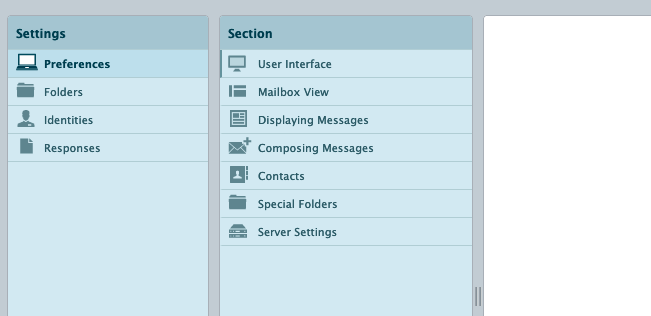
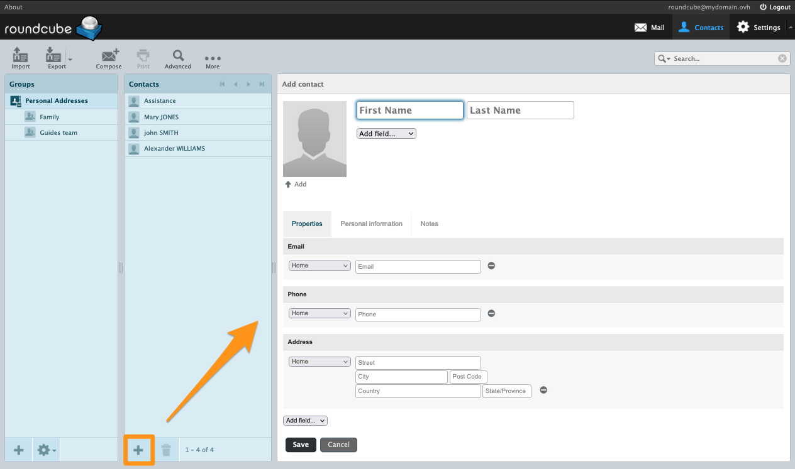
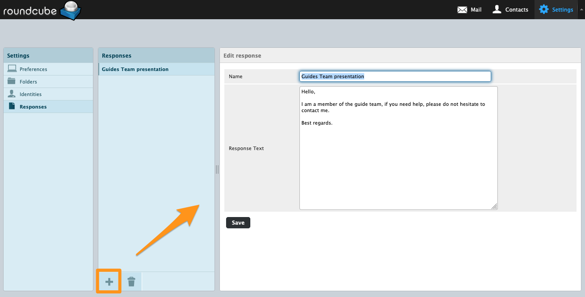

**Stand 31.05.2022**

## Ziel

Mit dem MX Plan Angebot von OVHcloud können Sie E-Mails über ein Drittpartei-Programm oder ein Webmail-Interface versenden und empfangen. OVHcloud bietet einen Online-E-Mail-Dienst namens RoundCube, der über einen Webbrowser den Zugriff auf einen E-Mail-Account ermöglicht.

**Hier erfahren Sie, wie Sie RoundCube Webmail für Ihre OVHcloud E-Mail-Adressen verwenden.**

## Voraussetzungen

- Sie verfügen über eine OVHcloud E-Mail-Lösung **MX Plan**, die unter unseren [Webhosting-Angeboten](https://www.ovhcloud.com/de/web-hosting/) wird, in einem [kostenlosen Start10M Hosting](https://www.ovhcloud.com/de/domains/free-web-hosting/) enthalten ist oder separat als eigenständige Lösung bestellt wird.
- Sie verfügen über die Verbindungsinformationen zur MX Plan E-Mail-Adresse, die Sie einsehen möchten. Weitere Informationen finden Sie in unserer Anleitung [Erste Schritte mit MX Plan](https://docs.ovh.com/de/emails/allgemeines-zu-shared-e-mails/).

## In der praktischen Anwendung

### Mit dem RoundCube Webmail verbinden

Gehen Sie auf die Seite <https://www.ovh.com/de/mail/>. Geben Sie eine E-Mail-Adresse und das Passwort ein und klicken Sie dann auf `Verbindung` {.action}. 

{.thumbnail}

Sie werden dann zum RoundCube Interface weitergeleitet.

{.thumbnail}

> [!warning]
> 
> Wenn Sie auf ein Outlook **W**eb **A**ccess **I**nterface (OWA) weitergeleitet werden, sind Sie auf der neuesten Version des MX Plan Angebots. Weitere Informationen zu Ihrem MX Plan Angebot finden Sie auf unserer Seite [Erste Schritte mit MX Plan](https://docs.ovh.com/de/emails/allgemeines-zu-shared-e-mails/).
>
> Um sich mit dem **OWA** Interface vertraut zu machen, lesen Sie unsere Anleitung Ihren [E-Mail Account über das OWA Interface einsehen](https://docs.ovh.com/de/microsoft-collaborative-solutions/exchange_2016_verwendung_der_outlook_web_app/).

### Allgemeines Webmail RoundCube Interface <a name="general-interface"></a>

Sobald Sie auf Ihren E-Mail-Account eingeloggt sind, haben Sie Zugriff auf das Roundcube Hauptfenster, das aus 3 Zonen besteht:

- [**Linke Spalte**](#leftcolumn): die Ordnerstruktur Ihres E-Mail-Accounts, bestehend aus Ordnern und Unterordnern. Die Hauptdatei ist `der Posteingang`.

- [**Oberes Fenster**](#topwindow): die Liste der E-Mails, die im in der linken Spalte ausgewählten Ordner enthalten sind.

- [**Unteres Fenster**](#lowerwindow): den Inhalt der im oberen Fenster ausgewählten E-Mail.

#### Ordnerverwaltung (linke Spalte) <a name="leftclumn"></a>

In dieser Zone werden die Ordner in Ihrem E-Mail-Account angezeigt.

Um die Ordner genauer zu verwalten, klicken Sie auf das Zahnrad am Ende der Spalte und anschließend auf `Ordner verwalten`{.action}.

{.thumbnail}

Um einen Ordner zu erstellen, klicken Sie `Ordner`{.action} in der Spalte Ordner auf den Button `+`{.action}.

Um eine Datei zu löschen, wählen Sie die betreffende Datei aus, klicken Sie auf das Zahnrad am Ende der Spalte `Ordner` und dann auf  `Löschen`{.action}. Um den Inhalt zu löschen und den Ordner zu behalten, klicken Sie auf `Leeren`{.action}.

Die auf Ordnerebene anzukreuzen sind die "Abonnements". Das Abonnement legt fest, ob der Ordner im Webmail-Interface oder im E-Mail-Programm angezeigt werden soll, und behält dabei den Inhalt des Ordners. Das Ziel ist nur, einen Ordner im E-Mail-Account zu verbergen oder anzuzeigen.

> [!primary]
>
> Ordner mit grauem Haken sind spezielle Ordner. Es ist nicht möglich, sie zu löschen oder ihr Abonnement zu entfernen.

#### Liste der empfangenen / versandten E-Mails (oberes Fenster) <a name="topwindow"></a>

Dieses Fenster zeigt den Inhalt des in der linken Spalte ausgewählten Verzeichnisses an. 

##### **Anzeigetyp**

Dieses Fenster wird in einer Form dargestellt, die individuell angepasst werden kann. Klicken Sie hierzu auf das Zahnrad oben links dieses Fensters.

{.thumbnail}

Folgende Einstellungen sind möglich:

- **Layout**: ermöglicht die Bestimmung der Anordnung der Verwaltungsfenster eines E-Mail-Accounts.
- **Spalten**: ermöglicht das Hinzufügen von anzuzeigenden Spalten (Prioritäten der E-Mails usw.).
- **Sortieren nach**: erlaubt die Wahl der Spalte, auf der die Standardsortierung durchgeführt wird.
- **Sortierung**: erlaubt die Wahl der Reihenfolge der Aufwärtssortierung oder der Abwärtssortierung nach Maßgabe der Sortiersäule.

##### **Aktion auf einer ausgewählten E-Mail**

Wenn Sie eine E-Mail ausgewählt haben, können Sie diese bearbeiten. Hier die möglichen Aktionen:

- `Antworten`{.action}: direkt an den Absender antworten.
- `Allen antworten`{.action}: direkt an alle Empfänger in den Feldern "A"und "Kopie"antworten.
- `Weiterleiten`{.action}: die ausgewählte E-Mail an einen oder mehrere Empfänger weiterleiten.
- `Löschen`{.action}: die ausgewählte E-Mail in den "Papierkorb"einfügen.
- `Spam`{.action}: die ausgewählte E-Mail direkt in die Spam-Mailbox (Junk) legen.
- `Markieren`{.action}: manuell den Zustand einer E-Mail bestimmen.
- `Mehr`{.action} 
    - `Nachricht drucken`{.action}.
    - `Lokal speichern (.eml)`{.action}: Den Header der E-Mail und deren Inhalt abrufen.
    - `Als neue Nachricht öffnen`{.action}: eine neue E-Mail auf der Grundlage der ausgewählten E-Mail erstellen.
    - `Queltext anzeigen`{.action}: die E-Mail in ihrer Rohform mit dem Header anzeigen.
    - `Verschieben nach`{.action}: Die E-Mail in einen Ordner verschieben
    - `Kopiern nach`{.action}: Die E-Mail in einen Ordner kopieren.
    - `In neuem Fenster öffnen`{.action}.

{.thumbnail}

> [!primary]
>
> Wenn einer Ihrer Gesprächspartner beim Lesen seiner E-Mail einen Leseverdächtigen anfordert, erhalten Sie folgende Nachricht: `Der Absender dieser Nachricht bat um Benachrichtigung, wenn Sie diese Nachricht lesen. Möchten Sie den Absender benachrichtigen`?
> 

##### **Eine E-Mail suchen**

Im oberen rechten Bereich des Interface ist ein Suchwerkzeug verfügbar.

Klicken Sie auf den Pfeil rechts neben der Lupe, um die Suchfilter anzuzeigen.

{.thumbnail}

#### Inhalt einer E-Mail (unteres Fenster) <a name="lowerwindow"></a>

Wird eine E-Mail aus der Liste ausgewählt, wird diese im unteren Fenster angezeigt.

Hier finden Sie die Abkürzungen der folgenden Funktionen:

- Als original HTML anzeigen
- Als reiner Text anzeigen
- Antworten verfassen
- Allen antworten
- Weiterleiten
- In neuem Fenster öffnen 

{.thumbnail}

### Einstellungen des Roundcube Interface konfigurieren

Die folgenden Kapitel dieser Anleitung entsprechen den Tabs, die den Teil `Einstellungen`{.action} im Abschnitt `Einstellungen`{.action} von Roundcube bilden. Ihre Beschreibung ist nicht erschöpfend.
{.thumbnail}

#### Benutzeroberfläche

Hier legen Sie die verwendete `Sprache` des Roundcube-Interfaces, die `Zeitzone`, das `Zeitformatierung` und das `Datumsformatierung`.

Die Option `Kurze Datumsanzeige` ermöglicht die Anzeige des Empfangs-Versanddatums mit relativen Begriffen wie "Heute", "Gestern" etc.<br>
**Zum Beispiel**: Es ist **19.05.2022**. Eine am **17.05.2022** um **17:00** Uhr zugesandte/empfangene E-Mail wird **Di 17:38** angezeigt, da die E-Mail dem vorhergehenden Dienstag entspricht.

Das Feld `Den nächsten Eintrag nach Löschen oder Verschieben` anzeigen bedeutet, dass nach Löschen oder Verschieben auf einer E-Mail das Element der unteren Zeile systematisch ausgewählt wird, unabhängig von der Reihenfolge der Sortierung. 

#### Postfachansicht

Definieren Sie hier die Ergonomie, um E-Mails visuell zu visualisieren und zu bearbeiten. Die Option `Layout` erlaubt es, die 3 im Bereich Allgemeines [Webmail-Interface RoundCube beschriebenen Fenster anzuordnen](#topwindow).

#### Nachrichtendarstellung

Legen Sie fest, wie E-Mails angezeigt werden.<br>
Es wird empfohlen, das Feld `HTML-Anzeigen` anzukreuzen, um sicherzustellen, dass die vom Absender formatierten E-Mails korrekt angezeigt werden.<br>
Darüber hinaus ist es ratsam, die Option `Externe Ressourcen erlauben (Bilder, Stile)` für immer `nie`. Dies verhindert, dass die Elemente einer E-Mail geladen werden, die bösartig erscheint.

#### Nachrichtenerstellung

Legen Sie die Standardform beim Verfassen einer E-Mail oder Antwort fest.<br>
Es wird empfohlen, die Option `HTML-Nachrichten verfassen` auf `immer` zu wechseln, um standardmäßig von den HTML-Editoren zu profitieren und eine HTML-Signatur nicht zu ändern.

#### Kontakte

Personalisieren Sie hier die Anordnung der Informationen in Ihrem Adressbuch.

#### Spezialordner

Roundcube verfügt über 4 Sonderordner: `Entwürfe`, `Gesendet`, `Spam`, `Gelöscht`.

Wir raten nicht, diese zu ändern, aber mithilfe der Laufbahnmenüs können wir das Verhalten eines Sonderdossiers einem später erstellten Dossier zuordnen.<br>
**Sie** können zum Beispiel "Scrambler"-Verhalten einem anderen Ordner zuweisen, den Sie erstellt haben. Die dort gespeicherten E-Mails gelten bis zum tatsächlichen Versand als Störungen.

#### Servereinstellungen

In diesem Tab können Sie den Speicherplatz auf einem E-Mail-Account optimieren. Mit der Option `Papierkorb beim Abmelden leeren` wird nämlich vermieden, dass die Elemente, die gelöscht wurden, kumuliert werden. Die Option `Nachrichten in Spam direkt löschen` löscht automatisch alle als SPAM angesehenen E-Mails.

> [!warning]
> 
> Es ist nicht ratsam, die Option `Nachrichten in Spam direkt löschen` zu lassen, wenn ein falsches Positiv-E-Mail (fälschlicherweise als "SPAM"gemeldet) für den Empfangsserver als SPAM deklariert wird. Wenn eine E-Mail in den Ordner "Spam" eingegeben wird, kann noch überprüft werden, ob die E-Mail rechtmäßig ist.

### Identitäten und deren Signatur verwalten <a name="identity"></a>

Klicken Sie im oberen Menü auf `Einstellungen`{.action} und im linken Menü auf `Identitäten`{.action}. "Identität" erlaubt es, die an die Empfänger gesendeten Informationen zu personalisieren, wie zum Beispiel den Anzeigenamen oder die Signatur.

{.thumbnail}

#### Attribute einer Identität einstellen 

- **Angezeigter Name**: Dieser Name wird im "Absender" des Empfängers erscheinen
- **E-Mail**: entspricht der Adresse, von der aus die E-Mail versandt wird.
- **Organisation**: Feld für den Namen Unternehmen, Vereine oder eine andere Einrichtung.
- **Antwort an**: eine andere E-Mail-Adresse als die des Absenders zuweisen.
- **Blindkopie**: Eine E-Mail-Adresse beim Versand in eine versteckte Kopie kopieren.
- **Als Standard**: Gibt es mehrere Identitäten (Unterschriften), so weist diese standardmäßig zu.
- **Signatur**: Den Fußzeile einer E-Mail bei deren Abfassung anpassen (Name, Vorname, besetzter Posten, Sätze, Bilder...).
- **HTML-Signatur**: aktiviert das HTML-Format auf der Signatur. 

> [!alert]
> 
> Das Feld **E-Mail** mit einer anderen E-Mail-Adresse als der Adresse, an die Sie sich anmelden, zu vervollständigen, gilt als Diebstahl elektronischer Identität (*spoofing*). Die für den Versand verwendete IP-Adresse kann bei Ihren Empfängern als "SPAM"deklariert und/oder eingestuft werden. 

#### Signatur hinzufügen

Standardmäßig ist das Feld `Signatur` in "unverschlüsselter Text" einzutragen. Dieses Format erlaubt keine erweiterte Bearbeitung oder die Eingabe eines Images in Ihre Signatur. Um die erweiterten Bearbeitungsoptionen für eine Signatur nutzen zu können, empfehlen wir die Aktivierung des HTML-Modus durch Klicken auf **HTML-Signatur** im Eingaberahmen.

> [!warning]
> 
> Wenn die Signatur im HTML-Format vorliegt, muss für die Erstellung einer E-Mail auf den HTML-Modus umgestellt werden. Sie können diese Standardoption für jede E-Mail-Redaktion im Bereich `Einstellungen`{.action} des Roundcube Interfaces aktivieren.
> Klicken Sie in der linken Spalte auf `Einstellungen`{.action}  und dann auf `Nachrichtenerstellung`{.action} . Für den Eintrag **HTML-Nachrichten verfassen**  wählen Sie `Immer`.
>

Um ein Image in eine Signatur einzufügen, muss das Image auf einem Server (einem OVHcloud Hosting oder einem anderen) gehostet werden.<br>
**Ein Bild von einem Computer fernzuleiten, wird seine Anzeige nicht erlauben**.

Klicken Sie auf den Button `< >`{.action} im HTML-Werkzeugbalken und fügen Sie folgenden Code ein, indem Sie `your-image-url` durch die Adresse (URL) des Images ersetzen und `text-if-image-is-not-displayed` durch einen Text, der das Bild ersetzt, wenn es nicht angezeigt werden kann.

```bash

```

{.thumbnail}

### Adressbuch

Klicken Sie `im`{.action} oberen Menü auf Kontakte, um zum Kontaktbuch zu gelangen. Dieser ist in **3 Spalten unterteilt**:

- **Gruppen**: Im Adressbuch können Sie Gruppen erstellen, um die Kontakte zu ordnen.
- **Kontakte**: sehen Sie die Kontakte im Adressbuch oder der ausgewählten Gruppe.
- **Kontaktdaten** oder **Kontakt hinzufügen**: Dieses Fenster wird angezeigt, wenn ein Kontakt ausgewählt wird oder erstellt wird. Dort können Sie die Informationen eines Kontakts lesen oder ändern.

{.thumbnail}

#### Gruppen <a name="group"></a>

Gruppen sind Unterkategorien des Adressbuchs. Sie erlauben es, die Kontakte in Untergruppen zu ordnen. So finden Sie zum Beispiel leichter einen Kontakt in einer Gruppe, die Sie erstellt haben, als im gesamten Adressbuch. So können Sie auch eine E-Mail versenden, indem Sie eine Gruppe pro Empfänger hinzufügen, anstatt die Kontakte der Gruppe einzeln hinzuzufügen.

Um eine Gruppe zu erstellen, klicken Sie unten in der Spalte `Gruppen`{.action} auf den Button `+`. Legen Sie den Namen der Gruppe fest und klicken Sie auf `Speichern`{.action}, um zu bestätigen.

{.thumbnail}

Um einen Kontakt einer der Gruppen zuzuweisen, wählen Sie einen Kontakt in der Spalte `Kontakte` aus und klicken Sie im sichtbaren Fenster auf den Tab `Gruppen`{.action}. Wählen Sie die Gruppe aus, die Sie dem Kontakt zuweisen möchten.

#### Kontakte <a name="contacts"></a>

Wählen Sie in der Spalte `Gruppen` das Adressbuch oder eine der Gruppen aus.

> [!primary]
> 
> Wenn Sie aus einer ausgewählten Gruppe einen Kontakt erstellen, wird der Kontakt automatisch zur Gruppe hinzugefügt.

Klicken Sie auf den Button `+`{.action} unten in der Spalte `Kontakte,` um einen Kontakt zu erstellen.

{.thumbnail}

Geben Sie anschließend die Kontaktinformationen ein.

> [!primary]
>
> Sie können über das Drop-down-Menü Ein `Feld hinzufügen...` unter den Feldern `Telefon` und `Adresse` weitere Felder hinzufügen.

### Schnellantworten (Templates) <a name="responses"></a>

Mit dieser Funktion können Sie beim Verfassen einer E-Mail Templates erstellen.

Klicken Sie im oberen Menü auf `Einstellungen`{.action} und im linken Menü auf `Schnellantworten`{.action}.

Um eine Antwort hinzuzufügen, klicken Sie unten in der Spalte `Schnellantworten`{.action} auf den Button `+`{.action}.

{.thumbnail}

> [!primary]
> 
> "Schnellantworten" sind im Format "unverschlüsselt".

### E-Mail Redaktion

Klicken Sie im Tab `E-Mail`{.action} im oberen Menü auf `Aufladen`{.action}.

Im Fenster zum Verfassen einer E-Mail finden Sie folgende Felder: 

- **Von**: eine [Identität](#identity) für den Absender auswählen.
- **An**: Empfänger und/oder eine [Empfängergruppe hinzufügen](#group).

> [!primary]
> 
> Das Feld **"An"** darf nicht mehr als 100 Empfänger umfassen, dies schließt die in einer [Gruppe](#group) enthaltenen Kontakte ein.

- **Kopie hinzufügen** hinzufügen: Empfänger in einfacher Kopie hinzufügen
- **Blindkopie hinzufügen** hinzufügen: Empfänger in versteckter Kopie hinzufügen Die anderen Empfänger der E-Mail werden die E-Mails auf CCI nicht sehen.
- **Followup-To hinzufügen**: die E-Mail an Empfänger weiterleiten.
- **Bearbeitungstyp**:  
    - `Einfacher Text`: nur Text ohne Formatierung.
    - `HTML`: Formatierter Text. Oberhalb des Eingabefensters erscheint eine HTML-Werkzeugleiste.
- **Priorität** für die E-Mail.
- **Empfangsbestätigung (MDN)**: Der Empfänger erhält eine Empfangsbestätigung.
- **Übermittlungsbestätigung (DSN)** die E-Mail an den Empfänger versandt wurde.
- **Nachricht speichern in** an: den Ordner auswählen, in dem eine Kopie der E-Mail gespeichert wird.

Im oberen Menü sind folgende Aktionen verfügbar:

- `Abbrechen `{.action} Erstellung einer E-Mail mit einer Bestätigungsanfrage abbrechen.
- `Senden`{.action} E-Mail versenden.
- `Speichern `{.action} E-Mail im Sonderordner "Entwurf" speichern
- `Rechtschreibung`{.action}, um den Text zu überprüfen, mit einem Menü zur Wahl der Sprache.
- `Anhang`{.action} Datei mit einer E-Mail verbinden
- `Signatur`{.action}: fügt die mit der ausgewählten [Identität](#identity) verbundene Signatur hinzu.
- `	Schnellantworten`{.action}: fügt eine im Abschnitt [Antworten](#responses) gespeicherte Vorlage hinzu.

{.thumbnail}

## Weiterführende Informationen

[Erste Schritte mit MX Plan](https://docs.ovh.com/de/emails/allgemeines-zu-shared-e-mails/)

[Passwort einer MX Plan E-Mail-Adresse ändern](https://docs.ovh.com/de/emails/passwort-e-mail-adresse-aendern/)

[Filter für Ihre E-Mail-Adressen erstellen](https://docs.ovh.com/de/emails/email-hosting-filter/)

[E-Mail Weiterleitungen verwenden](https://docs.ovh.com/de/emails/webhosting_e-mail_anleitung_zum_einrichten_einer_mail-weiterleitung/)

Für den Austausch mit unserer User Community gehen Sie auf <https://community.ovh.com/en/>.
