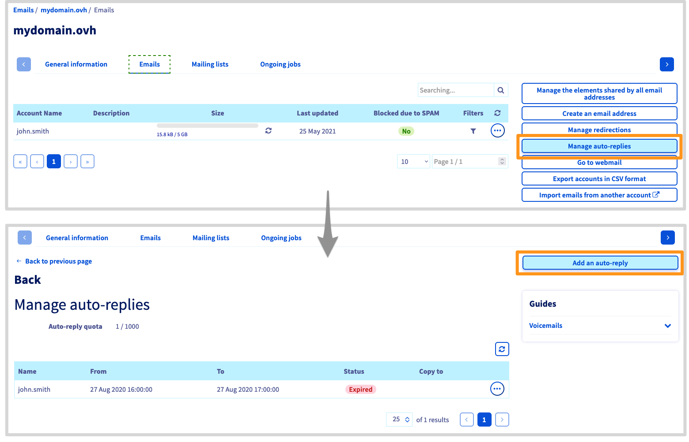

> [!primary]
> Esta traducción ha sido generada de forma automática por nuestro partner SYSTRAN. En algunos casos puede contener términos imprecisos, como en las etiquetas de los botones o los detalles técnicos. En caso de duda, le recomendamos que consulte la versión inglesa o francesa de la guía. Si quiere ayudarnos a mejorar esta traducción, por favor, utilice el botón «Contribuir» de esta página.
> 

**Última actualización: 28/08/2020**

## Objetivo

En caso de ausencia en su despacho, puede poner en marcha un contestador email que dejará un mensaje a los interlocutores que deseen contactar con usted por email.

**Esta guía explica cómo instalar un contestador de correo.**

## Requisitos

- Tener una solución MX Plan. (disponible en: un [plan de hosting](https://www.ovhcloud.com/es-es/web-hosting/){.external}, el [Alojamiento gratuito 100M](https://www.ovhcloud.com/es-es/domains/free-web-hosting/){.external} incluido con un dominio (previamente activado) o el MX Plan contratado por separado.
- Haber iniciado sesión en el [Panel de configuración de OVHcloud](https://www.ovh.com/auth/?action=gotomanager&from=https://www.ovh.es/&ovhSubsidiary=es){.external}.

## Procedimiento

> [!primary]
>
> Si su dirección de correo electrónico está en un servicio [**Exchange**](https://www.ovhcloud.com/es-es/emails/hosted-exchange/), [**Email Pro**](https://www.ovhcloud.com/es-es/emails/email-pro/) o no hay una sección de `Gestión de contestadores`{.action} en su MXplan, deberá crear el contestador desde su webmail utilizando la guía ["Implementar un contestador automático desde la interfaz OWA"](/pages/web/microsoft-collaborative-solutions/owa_automatic_replies).

### Creación del contestador

Inicie sesión en el  [Panel de configuración de OVHcloud](https://www.ovh.com/auth/?action=gotomanager&from=https://www.ovh.es/&ovhSubsidiary=es){.external}, 

Seleccione el dominio en la sección `Correo electrónico`{.action}.

Abra la pestaña `Correo electrónico`{.action}y haga clic en `Gestión de contestadores`{.action}.

El sistema le redirigirá a la ventana de `Gestión de contestadores`, que muestra todos los contestadores de correo electrónico de su solución de correo.

Haga clic en `Añadir un contestador`{.action}

{.thumbnail}

Se abrirá la ventana de adición. Puede completarla con los siguientes datos:

- `Tipo de contestador`:

Asociado a una cuenta de correo: que debe utilizar si se trata de una dirección de correo electrónico existente en su servicio de correo.
"Libre": para un alias. Por lo tanto, no está asociado a una dirección existente.

- `Buzón de correo` o `Nombre del contestador`: la dirección de correo electrónico o el alias correspondiente al contestador.

- `Duración del contestador`:

"Temporal": establezca una fecha de inicio y de fin a tener en cuenta para el funcionamiento de su contestador (útil si se va de vacaciones, por ejemplo).
"Permanente": el contestador funcionará hasta que lo haya desactivado.

- `Enviar una copia` o `guardar los mensajes en el servidor`: permite reenviar los mensajes recibidos durante su ausencia a la dirección que usted elija o conservarlos en la dirección de correo electrónico.

> [!warning]
> Si desmarca esta casilla, los mensajes recibidos durante su ausencia se borrarán automáticamente.

- `Dirección en copia` (solo en modo libre): en caso de un alias, seleccione la dirección de correo electrónico en la que quiera recibir los mensajes enviados al alias.

- `Mensaje` : Se trata del mensaje que sus interlocutores recibirán cuando le envíen un mensaje de correo electrónico.

A continuación, puede hacer clic en `Aceptar`{.action} para que el contestador esté instalado.

### Modificación o supresión del contestador

Una vez creado el contestador de correo, aparecerá en la lista visible en la sección `Gestión de contestadores`{.action} de su solución de correo. Puede eliminarlo o modificarlo haciendo clic en `...`{.action} a la derecha.

{.thumbnail}

## Más información

Interactúe con nuestra comunidad de usuarios en <https://community.ovh.com/en/>.