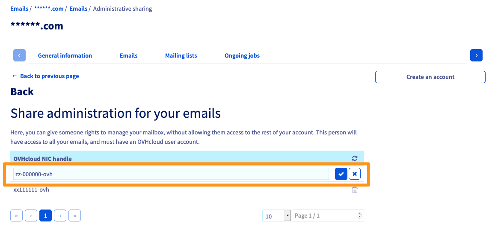

**Last updated 08/10/2021**

## Objective 

By creating a delegation, you can enable an email account user to manage their own features (e.g. changing passwords). These features depend on the type of delegation set up:

- Delegate **all of your email accounts** to one or more OVHcloud accounts. This type of delegation allows beneficiary customer accounts to manage filters, email auto-replies, redirections/aliases, and mailing lists.

- Delegate **one or more email accounts** and their filters to a single OVHcloud account. This type of delegation does not allow recipients to manage email auto-replies, redirections, or Mailing Lists. It also does not allow recipients to delete the relevant email account(s), import emails from another account or manage delegations.

**Find out how to delegate email accounts for your MX Plan solution.**

## Requirements

- an MX plan solution, This is available via: a [Web Cloud](https://www.ovh.co.uk/web-hosting/) hosting plan, a free Start 10M [hosting plan](https://www.ovh.co.uk/domains/start10m_hosting_offer.xml), or an MX Plan solution ordered separately
- access to the [OVHcloud Control Panel](https://www.ovh.com/auth/?action=gotomanager&from=https://www.ovh.co.uk/&ovhSubsidiary=GB), and `Web Cloud`{.action} section

> [!warning]
>
> The following guide is for holders of the legacy MXplan solution. For the new offer, there are no delegations. You can change your password, filters and auto-replies for an email address directly via OWA (**O**utlook **W**eb **A**pplication) webmail. **Identify your solution using the table below.**
>

|MX Plan legacy version|MX Plan new version|
|---|---|
|{.thumbnail}  Find the solution in the "Subscription" box.|{.thumbnail} Locate the `Server model` in the `Summary` box|
|Continue reading this guide in the “[In Practice](#oldmxplan)” section|See our guide on [Accessing your Exchange account via the OWA](https://docs.ovh.com/gb/en/microsoft-collaborative-solutions/exchange_2016_outlook_web_app_user_guide/#changing-the-password) interface|

## In practice 

> [!primary]
>
>When you set up a delegation on an email account, it will appear in [the relevant Control Panel](https://www.ovh.com/auth/?action=gotomanager&from=https://www.ovh.co.uk/&ovhSubsidiary=GB). However, only the modifications listed in the [Objective](#objective) section of this guide will be possible in this situation.
>

Log in to the [OVHcloud Control Panel](https://www.ovh.com/auth/?action=gotomanager&from=https://www.ovh.co.uk/&ovhSubsidiary=GB){.external}, and open the `Web Cloud` section.

Click `Emails`{.action} in the service bar on the left-hand side, and then choose the name of the MX Plan service concerned.

To view the list of email accounts in your MX Plan solution, click on the `Emails`{.action} tab.

{.thumbnail}

### Delegate all of your email accounts to one or more OVHcloud accounts

This type of delegation allows its recipient to manage passwords, filters, email auto-replies, redirections/aliases, and mailing lists.

Click `Manage your shares for all email addresses`{.action}

{.thumbnail}

A new window appears. Click the `+`{.action} button to the right of the `Add username` comment. Enter the OVHcloud NIC handle that will take advantage of this delegation, and confirm your choice.

{.thumbnail}

You can delegate the management of your MXplan service to multiple OVHcloud credentials.

### Delegating one or more email accounts with a username

With this delegation, you can change the password for the email account concerned, and manage its filters.

To the right of the email account you want to delegate, click on the `...`{.action} button, then `Manage delegation`{.action}.

{.thumbnail}

Enter the OVHcloud NIC handle that will benefit from this delegation, and confirm your choice.

{.thumbnail}

You can add multiple OVHcloud credentials to manage each email address.

## Go further

[Getting started with the MX Plan solution](https://docs.ovh.com/gb/en/emails/web_hosting_an_overview_of_ovh_email/)

Join our community of users on <https://community.ovh.com/en/>.