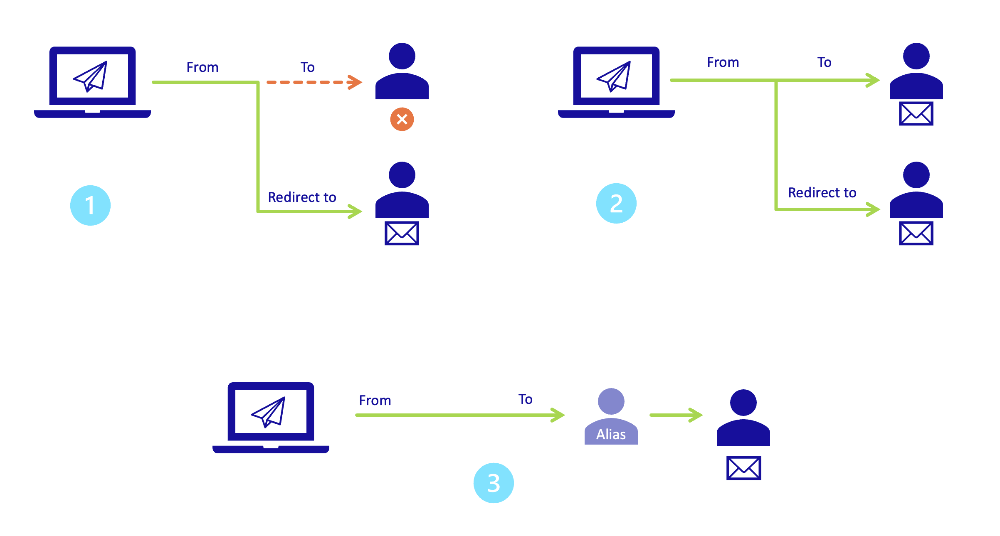
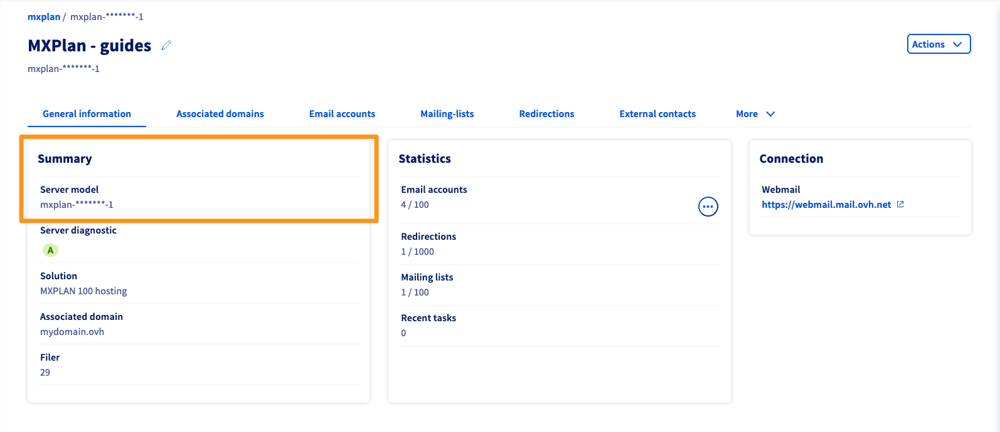

> [!primary]
> Diese Übersetzung wurde durch unseren Partner SYSTRAN automatisch erstellt. In manchen Fällen können ungenaue Formulierungen verwendet worden sein, z.B. bei der Beschriftung von Schaltflächen oder technischen Details. Bitte ziehen Sie beim geringsten Zweifel die englische oder französische Fassung der Anleitung zu Rate. Möchten Sie mithelfen, diese Übersetzung zu verbessern? Dann nutzen Sie dazu bitte den Button «Mitmachen» auf dieser Seite.
>

**Letzte Aktualisierung 01.02.2023**

## Ziel

In dieser Anleitung finden Sie verschiedene Informationen und Anleitungen zur Konfiguration Ihrer Weiterleitungen und E-Mail-Alias, zum Beispiel um empfangene E-Mails an eine Adresse A weiterzuleiten.

**Hier erfahren Sie, wie Sie Ihre Alias und E-Mail-Weiterleitungen verwalten.**

### Was ist eine E-Mail-Weiterleitung?

Mit einer Weiterleitung können Sie den ursprünglichen Weg einer E-Mail zu einer oder mehreren anderen E-Mail-Adressen ändern.

Sie möchten zum Beispiel, dass beim Versand einer E-Mail auf **contact@mydomain.ovh** diese auch an **john.smith@otherdomain.ovh** versendet wird. So können Sie automatisch eine E-Mail an **contact@mydomain.ovh** an **john.smith@otherdomain.ovh** senden.

### Was ist ein E-Mail Alias?

Im Gegensatz zur Weiterleitung ist die dem Alias zugeordnete E-Mail-Adresse keine Adresse, die man abfragt, sondern eine "Maske".

Die Erstellung eines Alias für Ihre E-Mail-Adresse erlaubt es Ihnen, Ihren Kontakten eine "Maske"-Adresse zu übermitteln, ohne Ihre persönliche E-Mail-Adresse an den Absender weitergeben zu müssen. Eine E-Mail-Adresse kann mehrere Alias haben.

Ihre E-Mail-Adresse ist zum Beispiel **john.smith@mydomain.ovh** und Ihr Alias **information@mydomain.ovh**. Sie können dann die Adresse **information@mydomain.ovh** an Ihre Kontakte weiterleiten und Ihre E-Mails auf **john.smith@mydomain.ovh** empfangen, ohne dass der Absender von **john.smith@mydomain.ovh** Kenntnis hat.

### Weiterleitung und Alias in Bildern 

- **Einfache Weiterleitung (Schema Nr. 1)**: Die E-Mail wird direkt an die Weiterleitungsadresse versandt, der ursprüngliche Empfänger erhält die E-Mail nicht.

- **Weiterleitung mit lokaler Kopie (Schema Nr. 2)**: Die E-Mail wird an den ursprünglichen Empfänger sowie an die Weiterleitungsadresse übermittelt.

- **Alias E-Mail (Schema Nr. 3)**: Die E-Mail wird an das Alias gesandt, das es an den Empfänger zurücksendet, auf dem das Alias konfiguriert wurde.

{.thumbnail}

> [!primary]
>
> Bitte beachten Sie, dass eine Weiterleitung auf mehrere E-Mail-Adressen eingerichtet werden kann.

## Voraussetzungen

- Sie sind in Ihrem [OVHcloud Kundencenter](https://www.ovh.com/auth/?action=gotomanager&from=https://www.ovh.de/&ovhSubsidiary=de) angemeldet.
- Sie verfügen über eine zuvor konfigurierte OVHcloud E-Mail-Lösung (**MX Plan**, die aus unseren [Webhosting-Angeboten](https://www.ovhcloud.com/de/web-hosting/) angeboten wird, in einem kostenlosen oder separat bestellten [Start10M Hosting wie ](https://www.ovhcloud.com/de/domains/free-web-hosting/),[Hosted Exchange](https://www.ovhcloud.com/de/emails/hosted-exchange/) oder [Email Pro](https://www.ovhcloud.com/de/emails/email-pro/)).

## In der praktischen Anwendung

Die Kapitel "[Weiterleitung erstellen](#redirect)" und "[Alias erstellen](#alias)" betreffen alle unsere OVHcloud E-Mail-Angebote, es **sei denn**:

- Sie verfügen über die historische MXplan Version (Informationen finden Sie hier).
- Sie haben eine bei OVHcloud registrierte Domain ohne angehängtes E-Mail-Angebot.

Für diese beiden Ausnahmen lesen Sie direkt das Kapitel "[Eine Weiterleitung oder ein Alias auf einem historischen MX Plan Angebot erstellen oder einen Domainnamen ohne E-Mail-Angebot erstellen](#mxplanlegacy)".

>
> Je nach Aktivierungsdatum Ihres MXplan Angebots oder wenn [kürzlich migriert](https://www.ovhcloud.com/de/web-hosting/mxplan-migration/), können Sie die historische oder die neue Version des Angebots haben. Bevor Sie fortfahren, identifizieren Sie diese. 
>
> Loggen Sie sich hierfür in Ihr [OVHcloud Kundencenter](https://www.ovh.com/auth/?action=gotomanager&from=https://www.ovh.de/&ovhSubsidiary=de), Teil `Web Cloud`{.action}. Klicken Sie auf `E-Mails`{.action} und wählen Sie den Namen des betreffenden MX Plan Dienstes aus. Fahren Sie nach Ihrer eigenen Version fort: 
>
> |Historische MX Plan Version|Neue MX Plan Version|
> |---|---|
> |{.thumbnail}  Ihr Angebot steht in der Box „Abo“.|{.thumbnail} Die `Server-Referenz` steht in der Box „Zusammenfassung“.|
> |Lesen Sie weiter auf "[Historische Version des MX Plan Angebots](#mxplanlegacy)"|Lesen Sie weiter: [Weiterleitung erstellen](#redirect) oder [Alias erstellen](#alias)|

### Weiterleitung erstellen 

Die Verwaltung der Weiterleitungen erfolgt nicht über das Kundencenter, sondern direkt über das Webmail der betreffenden E-Mail-Adresse.

Gehen Sie auf die Adresse <https://www.ovhcloud.com/de/mail/>. Geben Sie die **E-Mail-Adresse** und das **Passwort** ein, um sich einzuloggen.

{.thumbnail}

In unserem Beispiel handelt es sich um eine **Weiterleitung mit lokaler Kopie** (siehe [Schema 2](#diagram) am Anfang dieser Anleitung). Wenn das auch Ihre gewünschte Einstellung ist, klicken Sie links oben auf `OK`{.action} (Diskettensymbol) und die Regel wird angewendet. Ist das nicht der Fall, gehen Sie zum nachstehenden Schritt über.

Folgen Sie den beschriebenen Schritten, indem Sie nacheinander auf jeden Tab klicken :

> [!tabs]
> **Schritt 1**
>>
>> Wenn Sie sich via [Webmail](https://www.ovhcloud.com/de/mail/) an Ihre E-Mail-Adresse eingeloggt haben, klicken Sie oben rechts auf das Zahnrad und dann auf `Optionen`{.action}  
>>  E-Mails 
>>
> **Schritt 2**
>> Gehen Sie im Fenster **Optionen** in der linken Spalte in die Kategorie **Automatische Verarbeitung** im Bereich **E-Mails** und klicken Sie `dann auf Posteingangs- und Speicherregeln`{.action}.   
>> {.thumbnail}  
>> Dieses Fenster erlaubt es, Ihre Weiterleitungen zu verwalten, aber auch Filter auf alle eingehenden E-Mails anzuwenden. 
>>
> **Schritt 3**
>>
>> Wenn Sie im Verwaltungsfenster für **Posteingangsregeln** sind, klicken Sie oben links auf das `+`{.action}-Icon.  
>> {.thumbnail}  
>>
> **Schritt 4**
>>
>> **Name**: Legen Sie den Namen Ihrer Weiterleitung fest.  
>> **Wenn die Nachricht ankommt und alle Bedingungen erfüllt**: Wenn Ihre Weiterleitung für alle Nachrichten gilt, wählen Sie `[Auf alle Nachrichten anwenden]`{.action}.  
>>{.thumbnail .w-640}  
>>
> **Schritt 5**
>>
>> **Alle folgenden Operationen ausführen**: Hier wenden Sie die Weiterleitung an. Wählen Sie `Weiterleitung, Weiterleitung oder Versand`{.action} und `Weiterleitung der Nachricht an...`{.action}.  
>>{.thumbnail .w-640}  
>>
> **Schritt 6**
>>
>> Geben Sie anschließend die Adresse ein, an die Sie die E-Mail weiterleiten möchten, vor "**E-Mail weiterleiten an...**" und klicken Sie dann auf `Speichern`{.action}. Klicken Sie dann auf `OK`{.action} (Diskettensymbol), um Ihre Weiterleitung abzuschließen.  
>>{.thumbnail .w-640}  
>>

> [!primary]
>
> Um eine einfache **Weiterleitung** (siehe [Abbildung 1](#diagram) am Anfang dieser Anleitung) anzuwenden, fügen Sie in diesem Fenster eine zusätzliche Regel zu Ihrer **Weiterleitung mit lokaler** Kopie hinzu. Klicken Sie auf `Aktion hinzufügen`{.action} (Box 1) , dann auf **Verschieben, kopieren oder löschen** und klicken Sie dann auf **Nachricht löschen**. Mit dieser Regel wird die E-Mail direkt im Papierkorb abgelegt, nachdem sie an die Weiterleitungsadresse versendet wurde.
> {.thumbnail .w-640}

### Alias erstellen 

Loggen Sie sich in Ihr [OVHcloud Kundencenter ein](https://www.ovh.com/auth/?action=gotomanager&from=https://www.ovh.de/&ovhSubsidiary=de) und gehen Sie in den Bereich `Web Cloud`. Wählen Sie das Menü abhängig von Ihrem E-Mail-Angebot aus:

- **Exchange**: in `Microsoft`{.action}, dann auf `Exchange`{.action} und wählen Sie die entsprechende Plattform aus. Klicken Sie auf den Tab `E-Mail-Accounts`{.action}.

- **E-Mail Pro**: Wählen Sie in `E-Mail Pro`{.action} die betreffende Plattform aus und klicken Sie dann auf den Tab `E-Mail Accounts`{.action}.

- **E-Mails** (MXplan): Wählen Sie in `E-Mails`{.action} die betreffende Plattform aus und klicken Sie dann auf den Tab `E-Mail-Accounts`{.action}.

Um ein Alias zu Ihrem E-Mail-Account hinzuzufügen, klicken Sie in jedem Tab nacheinander auf die folgenden Schritte:

> [!tabs]
> **Schritt 1**
>>
>> In der angezeigten Tabelle finden Sie eine Spalte `Alias`.  
>> {.thumbnail} 
>>
> **Schritt 2**
>>
>> Klicken Sie auf den Button `...`{.action} und dann auf `Alias konfigurieren`{.action} (oder `Alias verwalten`{.action}).  
>> {.thumbnail} 
>>
> **Schritt 3**
>>
>> Klicken Sie auf `Alias hinzufügen`{.action}, geben Sie dann die Adresse ein, die Sie für Ihren Alias ausgewählt haben, und bestätigen Sie Ihre Wahl.  
>> {.thumbnail} 

#### Ein Alias löschen

Klicken Sie im Tab `E-Mail-Accounts`{.action} auf `...`{.action} rechts neben der betreffenden E-Mail-Adresse. Klicken Sie anschließend auf `Alias konfigurieren`{.action} (oder `Alias verwalten`{.action}).

Klicken Sie rechts neben dem betreffenden Alias auf den Button `...`{.action} im Menü zur Alias-Verwaltung. Klicken Sie anschließend auf `Alias löschen`{.action}

{.thumbnail}

### Eine Weiterleitung oder ein Alias auf einem historischen MX Plan Angebot oder einem Domainnamen ohne E-Mail Angebot erstellen 

Loggen Sie sich in Ihr [OVHcloud Kundencenter ein](https://www.ovh.com/auth/?action=gotomanager&from=https://www.ovh.de/&ovhSubsidiary=de) und gehen Sie in den Bereich `Web Cloud`. Gehen Sie in den Bereich `E-Mails`{.action}:

Die Methode zur Erstellung eines Alias oder einer Weiterleitung ist genau die gleiche. Folgen Sie den beschriebenen Schritten, indem Sie nacheinander auf jeden Tab klicken:

> [!tabs]
> **Schritt 1**
>> Wenn Sie Ihr MX Plan Angebot aufrufen, gelangen Sie zuerst zum Tab `Allgemeine Informationen`{.action}. Klicken Sie auf den Tab `E-Mails`{.action} und dann rechts auf den Button `Verwaltung der Weiterleitungen`{.action}.  
>> {.thumbnail} 
>>
> **Schritt 2**
>>
>> Es wird eine Tabelle mit bereits aktiven Weiterleitungen angezeigt. Klicken Sie rechts auf den Button `Weiterleitung hinzufügen`{.action}.  
>> {.thumbnail} 
>>
> **Schritt 3**
>>
>> **Von der Adresse**: Geben Sie hier die E-Mail-Adresse ein, die Sie weiterleiten möchten.  
>> **Zur Adresse**: Geben Sie hier die Ziel-Adresse Ihrer Weiterleitung ein. Hierbei kann es sich um eine Ihrer OVHcloud E-Mail-Adressen oder eine externe Adresse handeln.  
>> **Wählen Sie einen Kopiermodus**: Wählen Sie aus, wenn Sie möchten:   - **Eine Kopie der E-Mail bei OVHcloud aufbewahren** (E-Mail an Ihrer Haupt- und Weiterleitungsadresse erhalten)  *cf. am [Schema 2](#diagram) am Anfang dieser Anleitung.*   - **Keine Kopie der Mail** aufbewahren (direkt an die Weiterleitungsadresse weiterleiten, ohne dass die Hauptadresse diese empfängt)   *cf. am [Schema 1](#diagram) am Anfang dieser Anleitung.*  
>> Klicken Sie anschließend auf `Bestätigen`{.action}, um das Hinzufügen der Weiterleitung zu bestätigen.  
>> {.thumbnail}

> [!primary]
>
> Wenn Sie den Kopiermodus "**Eine Kopie der E-Mail bei OVHcloud aufbewahren**" wählen, wird automatisch eine Weiterleitung der E-Mail-Adresse auf diese selbst in der Liste der Weiterleitungen erstellt, die diese lokale Kopie verkörpert.
> 

## Weiterführende Informationen

Für den Austausch mit unserer User Community gehen Sie auf <https://community.ovh.com/en/>.