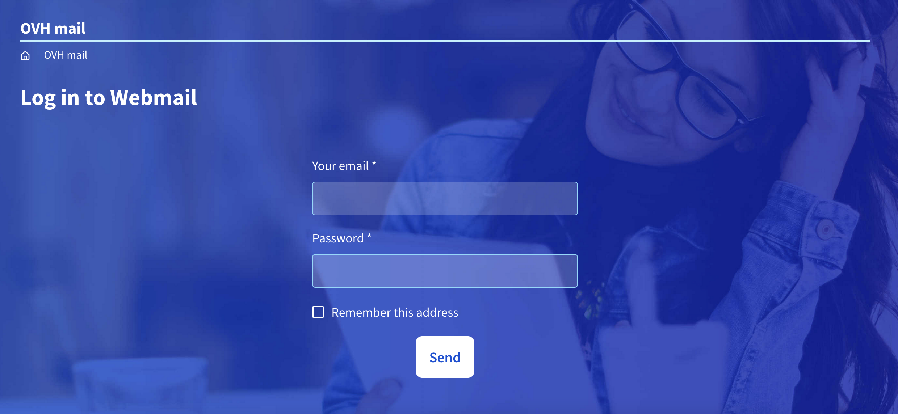
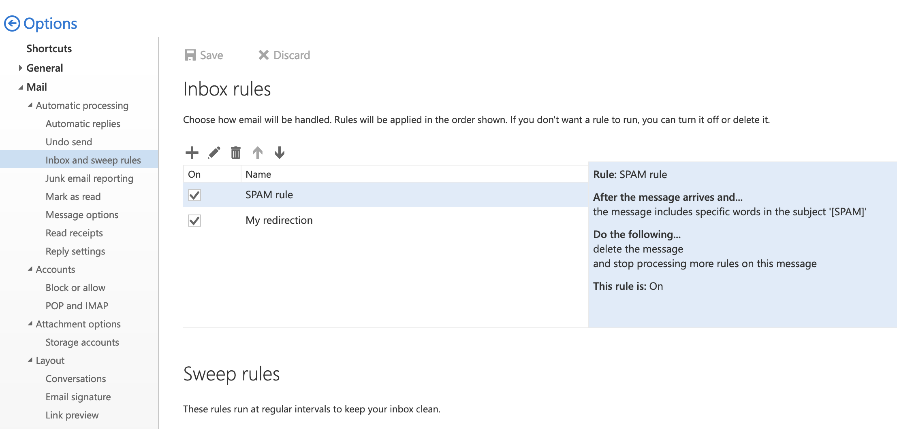
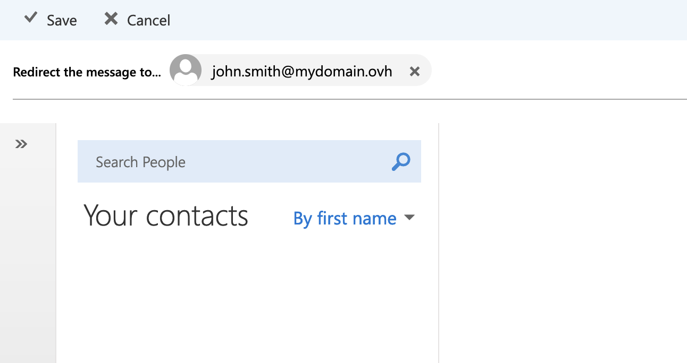

> [!primary]
> Diese Übersetzung wurde durch unseren Partner SYSTRAN automatisch erstellt. In manchen Fällen können ungenaue Formulierungen verwendet worden sein, z.B. bei der Beschriftung von Schaltflächen oder technischen Details. Bitte ziehen Sie beim geringsten Zweifel die englische oder französische Fassung der Anleitung zu Rate. Möchten Sie mithelfen, diese Übersetzung zu verbessern? Dann nutzen Sie dazu bitte den Button «Mitmachen» auf dieser Seite.
>

**Letzte Aktualisierung 01.02.2023**

## Ziel

In dieser Anleitung finden Sie Informationen und Instruktionen zur Konfiguration von Weiterleitungen und Aliasen für Ihre E-Mail-Lösung, zum Beispiel um auf einem Account A empfangene E-Mails an eine Adresse B weiterzuleiten.

**Diese Anleitung erklärt, wie Sie E-Mail Aliase und Weiterleitungen konfigurieren.**

### Was ist eine E-Mail-Weiterleitung?

Sie können Weiterleitungen verwenden, um das Routing einer E-Mail zu ändern und sie somit an eine oder mehrere andere E-Mail-Adressen weiterzusenden.

Sie möchten zum Beispiel, dass E-Mails an **contact@mydomain.ovh** auch an **john.smith@otherdomain.ovh** zugestellt werden. So können Sie automatisch E-Mails von **contact@mydomain.ovh** zu **john.smith@otherdomain.ovh** weiterleiten lassen.

### Was ist ein E-Mail Alias?

Im Gegensatz zur Weiterleitung ist eine Alias-Adresse kein eigener E-Mail-Account, sondern eine sekundäre Adresse für den E-Mail-Account, für den der Alias eingerichtet wurde.

Indem Sie einen Alias für Ihren E-Mail-Account erstellen, können Sie Ihren Kontakten eine "verschleiernde" Adresse mitteilen, anstatt Ihre persönliche E-Mail-Adresse preiszugeben. Ein E-Mail-Account kann mehrere Alias-Adressen haben.

Für die E-Mail-Adresse **john.smith@mydomain.ovh** besteht beispielsweise der Alias **information@mydomain.ovh**. Sie können dann die Adresse **information@mydomain.ovh** öffentlich machen und Ihre E-Mails auf dem Account von **john.smith@mydomain.ovh** empfangen, ohne dass Absender die Adresse **john.smith@mydomain.ovh** kennen.

### Weiterleitung und Alias im Vergleich 

- **Einfache Weiterleitung (Schema 1)**: Die E-Mail wird direkt an die Weiterleitungsadresse gesendet, der ursprüngliche Empfänger-Account erhält die E-Mail nicht.

- **Weiterleitung mit lokaler Kopie (Schema 2)**: Sowohl der ursprüngliche Empfänger als auch der Ziel-Account der Weiterleitung erhalten die E-Mail.

- **E-Mail Alias (Schema 3)**: Die E-Mail wird an die Alias-Adresse gesendet und von dem E-Mail-Account empfangen, für das der Alias konfiguriert wurde.

{.thumbnail}

> [!primary]
>
> Beachten Sie, dass eine Weiterleitung auch zu mehreren E-Mail-Adressen eingerichtet werden kann.

## Voraussetzungen

- Sie verfügen über eine bereits konfigurierte OVHcloud E-Mail-Lösung: [**Hosted Exchange**](https://www.ovhcloud.com/de/emails/hosted-exchange/), [**Email Pro**](https://www.ovhcloud.com/de/emails/email-pro/) oder **MX Plan** (enthalten in einem [Webhosting](https://www.ovhcloud.com/de/web-hosting/), einem kostenlosen Start 10M Hosting](https://www.ovhcloud.com/de/domains/free-web-hosting/) oder separat bestellt).
- Sie haben Zugriff auf Ihr [OVHcloud Kundencenter](https://www.ovh.com/auth/?action=gotomanager&from=https://www.ovh.de/&ovhSubsidiary=de).

## In der praktischen Anwendung

Die Abschnitte "[Weiterleitung erstellen](#redirect)" und "[Alias erstellen](#alias)" betreffen alle OVHcloud E-Mail-Angebote, außer in diesen beiden **Sonderfällen**:

- Sie verfügen über einen MX Plan Legacy (siehe unten).
- Sie haben einen bei OVHcloud registrierten Domainnamen ohne einen damit verbundenen E-Mail-Dienst.

Für diese beiden Ausnahmen gehen Sie direkt zu "[Weiterleitung oder Alias mit MX Plan Legacy oder für einen Domainnamen ohne E-Mail-Dienst konfigurieren](#mxplanlegacy)".

>
> Je nach Aktivierungsdatum Ihres MX Plans oder falls Ihr Dienst kürzlich [migriert wurde](https://www.ovhcloud.com/de/web-hosting/mxplan-migration/), haben Sie entweder die historische oder die neue Version dieses Dienstes. Bevor Sie fortfahren, identifizieren Sie Ihre Dienstversion. 
>
> Loggen Sie sich hierfür in Ihr [OVHcloud Kundencenter](https://www.ovh.com/auth/?action=gotomanager&from=https://www.ovh.de/&ovhSubsidiary=de) ein und gehen Sie zum Bereich `Web Cloud`{.action}. Öffnen Sie `E-Mails`{.action} in der Seitenleiste und wählen Sie den Namen des betreffenden MX Plans aus. Identifizieren Sie Ihre Version gemäß der folgenden Tabelle: 
>
> |MX Plan Legacy|Neue MX Plan Version|
> |---|---|
> |{.thumbnail} Die Dienstbezeichnung steht im Rahmen **Abo** rechts. MX Plan Legacy *hat keine* Server-Referenz.|{.thumbnail} Das neue Angebot hat eine **Server-Referenz** im Rahmen **Zusammenfassung** links.|
> |Fahren Sie fort mit "[MX Plan Legacy](#mxplanlegacy)".|Fahren Sie fort mit "[Weiterleitung erstellen](#redirect)" oder "[Alias erstellen](#alias)".|

### Weiterleitung erstellen 

Die Verwaltung von Weiterleitungen erfolgt nicht im Kundencenter, sondern über Webmail, nachdem Sie sich in den betreffenden E-Mail-Account eingeloggt haben.

Gehen Sie zur Adresse <https://www.ovhcloud.com/de/mail/>. Geben Sie die **E-Mail-Adresse** und das **Passwort** ein, um sich einzuloggen.

{.thumbnail}

In diesem Beispiel handelt es sich um eine **Weiterleitung mit lokaler Kopie** (siehe [Schema 2](#diagram) zu Beginn dieser Anleitung). Wenn das Ihre gewünschte Einstellung ist, klicken Sie links oben auf `OK`{.action} (Diskettensymbol) und die Regel wird angewendet. Ist das nicht der Fall, gehen Sie zum nächsten Schritt über.

Folgen Sie den Anleitungsschritten, indem Sie nacheinander die Tabs aufrufen:

> [!tabs]
> **Schritt 1**
>>
>> Wenn Sie sich im [Webmail](https://www.ovhcloud.com/de/mail/) Ihres E-Mail-Accounts eingeloggt haben, klicken Sie oben rechts auf das Zahnrad und dann auf `Optionen`{.action}  
>>  E-Mails 
>>
> **Schritt 2**
>>
>> In den **Optionen** der linken Navigationsstruktur finden Sie den Bereich **Automatische Verarbeitung**. Klicken Sie hier auf `Posteingangs- und Aufräumregeln`{.action}.   
>> {.thumbnail}  
>> Hier können Sie Weiterleitungen verwalten sowie Filter auf alle eingehenden E-Mails anwenden. 
>>
> **Schritt 3**
>>
>> Klicken Sie im Verwaltungsfenster für **Posteingangsregeln** oben links auf das `+`{.action}-Symbol.  
>> {.thumbnail}  
>>
> **Schritt 4**
>>
>> **Name**: Geben Sie einen Namen für die Weiterleitung ein. 
>> **Wenn die Nachricht eintrifft und alle Bedingungen erfüllt**: Wenn Ihre Weiterleitung für alle Mails gilt, wählen Sie `[Auf alle Nachrichten anwenden]`{.action}.  
>>{.thumbnail .w-640}  
>>
> **Schritt 5**
>>
>> **Alle folgenden Operationen ausführen**: Hier wenden Sie die Weiterleitung an. Wählen Sie `Weiterleiten, Umleiten oder Senden`{.action} und `Weiterleiten der Nachricht an...`{.action}.  
>>{.thumbnail .w-640}  
>>
> **Schritt 6**
>>
>> Geben Sie anschließend die Adresse, an die Sie E-Mails weiterleiten möchten im Feld "**Weiterleiten der Nachricht an...**" ein und klicken Sie dann auf `Speichern`{.action}. Klicken Sie dann auf `OK`{.action} (Diskettensymbol), um die Weiterleitung zu erstellen.  
>>{.thumbnail .w-640}  
>>

> [!primary]
>
> Um eine einfache **Weiterleitung** (siehe [Abbildung 1](#diagram) am Anfang dieser Anleitung) anzuwenden, fügen Sie in diesem Fenster eine zusätzliche Regel zu Ihrer **Weiterleitung mit lokaler Kopie** hinzu. Klicken Sie auf `Aktion hinzufügen`{.action} (Box 1) , dann auf **Verschieben, kopieren oder löschen** und klicken Sie dann auf **Nachricht löschen**. Mit dieser Regel wird die E-Mail direkt im Papierkorb abgelegt, nachdem sie an die Weiterleitungsadresse versendet wurde.  
> {.thumbnail .w-640}

### Alias erstellen 

Loggen Sie sich in Ihr [OVHcloud Kundencenter](https://www.ovh.com/auth/?action=gotomanager&from=https://www.ovh.de/&ovhSubsidiary=de) ein und gehen Sie zum Bereich `Web Cloud`{.action}. Wählen Sie links im Menü je nach Ihrem E-Mail-Angebot aus:

- **Exchange**: Öffnen Sie `Microsoft`{.action}, dann `Exchange`{.action} und wählen Sie den Dienst aus. Klicken Sie auf den Tab `E-Mail-Accounts`{.action}.

- **E-Mail Pro**: Öffnen Sie `E-Mail Pro`{.action} und wählen Sie den Dienst aus. Klicken Sie auf den Tab `E-Mail-Accounts`{.action}.

- **E-Mails** (MX Plan): Öffnen Sie `E-Mails`{.action} und wählen Sie den Dienst aus. Klicken Sie auf den Tab `E-Mail-Accounts`{.action}.

Um einen Alias zu Ihrem E-Mail-Account hinzuzufügen, folgen Sie den Anleitungsschritten indem Sie nacheinander die Tabs aufrufen:

> [!tabs]
> **Schritt 1**
>>
>> In der Tabelle finden Sie die Spalte `Alias`.  
>> {.thumbnail} 
>>
> **Schritt 2**
>>
>> Klicken Sie auf den Button `...`{.action} und dann auf `Alias verwalten`{.action} (oder `Verwaltung der Alias`{.action}).  
>> {.thumbnail} 
>>
> **Schritt 3**
>>
>> Klicken Sie auf `Alias hinzufügen`{.action}. Geben Sie hier die Adresse ein, die Sie als Alias einrichten möchten und bestätigen Sie.  
>> {.thumbnail} 

#### Alias löschen

Klicken Sie im Tab `E-Mail-Accounts`{.action} auf `...`{.action} in der Zeile des betreffenden E-Mail-Accounts. Klicken Sie anschließend auf `Alias verwalten`{.action} (oder `Verwaltung der Alias`{.action}).

Klicken Sie in der Zeile des betreffenden Alias auf den Button `...`{.action} und  wählen Sie `Alias löschen`{.action} aus.

{.thumbnail}

### Weiterleitung oder Alias mit MX Plan Legacy oder für einen Domainnamen ohne E-Mail-Dienst konfigurieren 

Loggen Sie sich in Ihr [OVHcloud Kundencenter ein](https://www.ovh.com/auth/?action=gotomanager&from=https://www.ovh.de/&ovhSubsidiary=de) und gehen Sie in den Bereich `Web Cloud`. Öffnen Sie links im Menü `E-Mails`{.action}.

Die Methode zur Erstellung eines Alias oder einer Weiterleitung ist dieselbe. Folgen Sie den Anleitungsschritten, indem Sie nacheinander die Tabs aufrufen:

> [!tabs]
> **Schritt 1**
>>
>> Wenn Sie Ihren MX Plan aufrufen, gelangen Sie zuerst zum Tab `Allgemeine Informationen`{.action}. Klicken Sie auf den Tab `E-Mails`{.action} und dann rechts auf den Button `Verwaltung der Weiterleitungen`{.action}.  
>> {.thumbnail} 
>>
> **Schritt 2**
>>
>> Es wird eine Tabelle mit bereits aktiven Weiterleitungen angezeigt. Klicken Sie rechts auf den Button `Weiterleitung hinzufügen`{.action}.  
>> {.thumbnail} 
>>
> **Schritt 3**
>>
>> **Von der Adresse**: Geben Sie hier die E-Mail-Adresse ein, von der aus weitergeleitet werden soll.  
>> **Zur Adresse**: Geben Sie hier die Ziel-Adresse Ihrer Weiterleitung ein. Hierbei kann es sich um eine Ihrer OVHcloud E-Mail-Adressen oder eine externe Adresse handeln.  
>> **Wählen Sie einen Kopiermodus**: Wählen Sie Ihre gewünschte Option aus:   - **Eine Kopie der E-Mail bei OVHcloud aufbewahren** (E-Mail auf der Haupt- und Weiterleitungsadresse erhalten)  *vgl. [Schema 2](#diagram) am Anfang dieser Anleitung.*   - **Keine Kopie der Mail aufbewahren** (direkt an die Weiterleitungsadresse weiterleiten, ohne dass die Hauptadresse diese empfängt)   *vgl. [Schema 1](#diagram) am Anfang dieser Anleitung.*  
>> Klicken Sie anschließend auf `Bestätigen`{.action}, um die Weiterleitung einzurichten.  
>> {.thumbnail}

> [!primary]
>
> Wenn Sie den Kopiermodus "**Eine Kopie der E-Mail bei OVHcloud aufbewahren**" wählen, wird automatisch eine Weiterleitung der E-Mail-Adresse auf sich selbst in der Liste der Weiterleitungen erstellt. Dies erzeugt die lokalen Kopien der E-Mails.
> 

## Weiterführende Informationen

Für den Austausch mit unserer User Community gehen Sie auf <https://community.ovh.com/en/>.
