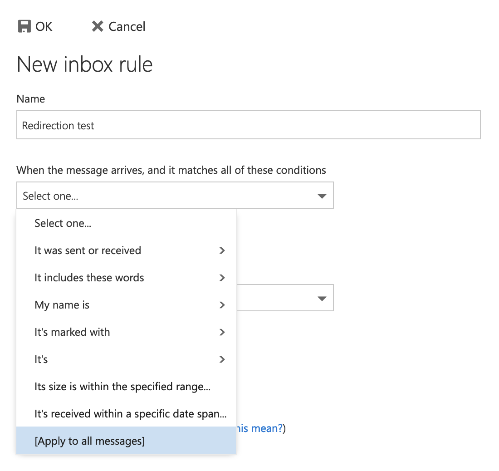
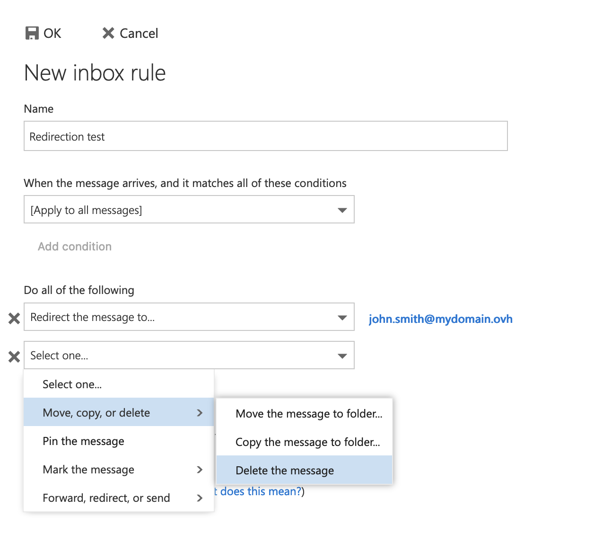
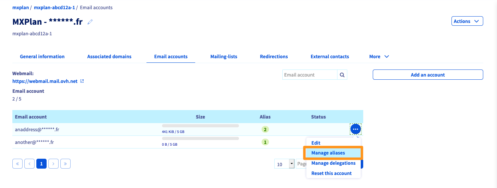

**Last updated 01/02/2023**

## Objective

In this guide, you will find information and help on how to configure your redirections and email aliases, e.g. sending emails received from address A to address B.

**Find out how to manage aliases and email redirections.**

### What is an email redirection?

You can use a redirection to change the initial routing of an email to one or more other email addresses.

For example, you may want an email sent to **contact@mydomain.ovh** to be sent back to **john.smith@otherdomain.ovh**. By doing so, you can automatically send an email to **contact@mydomain.ovh** to **john.smith@otherdomain.ovh**.

### What is an email alias?

Unlike redirection, the email address associated with the alias is not an address you can view; it is a “mask”.

By creating an alias for your email address, you can give your contacts a “mask” address, without having to give your personal email address to the sender. An email address can have multiple aliases.

For example, your email address is **john.smith@mydomain.ovh** and your alias is **information@mydomain.ovh**. You can then send your contacts the address **information@mydomain.ovh** and receive your emails on **john.smith@mydomain.ovh**, without the sender knowing **john.smith@mydomain.ovh**.

### Image redirection and alias 

- **Simple redirection (diagram 1 below)**: the email is sent directly to the redirection email address, the original recipient does not receive the email.

- **Redirection with local copy (diagram 2 below)**: the email is sent to the original recipient as well as the redirection email address.

- **Email alias (diagram 3 below)**: the email is sent to the alias, which sends it to the recipient on whom the alias has been configured.

{.thumbnail}

> [!primary]
>
> Please note that you can configure a redirection to several email addresses.

## Requirements

- access to the [OVHcloud Control Panel](https://www.ovh.com/auth/?action=gotomanager&from=https://www.ovh.co.uk/&ovhSubsidiary=GB)
- You must have a pre-configured OVHcloud email solution (**MX Plan**, included in our [web hosting plans](https://www.ovhcloud.com/en-gb/web-hosting/), included in a [free Start10M hosting package](https://www.ovhcloud.com/en-gb/domains/free-web-hosting/), or ordered separately as a standalone solution, such as [**Hosted Exchange**](https://www.ovhcloud.com/en-gb/emails/hosted-exchange/) or [**Email Pro**](https://www.ovhcloud.com/en-gb/emails/email-pro/)).

## Instructions

The chapters “[create a redirection](#redirect)” and “[create an alias](#alias)” concern all of our OVHcloud email solutions, **unless**:

- if you are using the legacy version of the MXplan solution (to check this, you can view the framework below).
- if you have a domain name registered with OVHcloud without an attached email solution

For these two exceptions, please read the chapter “[Creating a redirection or alias on a legacy MX Plan solution or a domain name without an email solution](#mxplanlegacy)”.

>
> Depending on the date your MX Plan solution was activated and if [it was recently migrated](https://www.ovhcloud.com/en-gb/web-hosting/mxplan-migration/), you may have the legacy version or the new version of the solution. Before you proceed, you will need to identify it. 
>
> To do this, log in to your [OVHcloud Control Panel](https://www.ovh.com/auth/?action=gotomanager&from=https://www.ovh.co.uk/&ovhSubsidiary=GB), go to the `Web Cloud`{.action} section. Click `Emails`{.action} then choose the name of the relevant MX Plan service. Continue as you have: 
>
> |MX Plan legacy version|MX Plan new version|
> |---|---|
> |{.thumbnail}  Find the solution in the "Subscription" box.|{.thumbnail} Locate the `Server model` in the "Summary" box.|
> |Continue reading [MX Plan legacy version](#mxplanlegacy)|Continue reading to [Create Redirection](#redirect) or [Create Alias](#alias)|

### Create a redirection 

You cannot manage redirections via the OVHcloud Control Panel, but directly via the webmail platform for the email address concerned.

Go to the address <https://www.ovhcloud.com/en-gb/mail/>. Enter the **email address** and **password** to log in.

{.thumbnail}

In our example, we are setting a **redirection with a local copy** (see [diagram 2](#diagram) at the beginning of this guide). If this is what you need, click `OK`{.action} (floppy disk icon) in the top left-hand corner, and the rule will be applied. If you do not want to do this, skip to the next step.

Follow the steps described by clicking successively on each tab below:

> [!tabs]
> **Step 1**
>>
>> Once you have logged in to your email address via [webmail](https://www.ovhcloud.com/en-gb/mail/), click on the cogwheel icon in the top right-hand corner, then on `Options`{.action}.  
>> {.thumbnail} 
>>
> **Step 2**
>> From the **Options** window in the left-hand column, go to the **Automatic processing** category in the **Mail** section and click on `Inbox and storage rules`{.action}.   
>> {.thumbnail}  
>> In this window, you can manage redirections and apply filters to all incoming emails. 
>>
> **Step 3**
>>
>> Once you have opened the window for managing **Indobx rules**, click on the `+`{.action} icon on the top left-hand corner.  
>> {.thumbnail}  
>>
> **Step 4**
>>
>> **Name**: define the name of your redirection.  
>> **When the message arrives and meets all of these conditions**: If your redirection applies to all messages, select `[Apply to all messages]`{.action}.  
>>{.thumbnail .w-640}  
>>
> **Step 5**
>>
>> **Perform all of the following**: This is where you apply the redirection. Select `Forward, redirect or send`{.action}, then `Redirect the message to...`{.action}.  
>>{.thumbnail .w-640}  
>>
> **Step 6**
>>
>> Next, type the address you want to redirect the email to in front of **Redirect the message to...** then click `Save`{.action}. Finally, click `OK`{.action} (floppy disk icon) to complete your redirection.  
>>{.thumbnail .w-640}  
>>

> [!primary]
>
> To apply a **simple redirection** (see [diagram 1](#diagram) at the beginning of this guide), add an additional rule to your **redirection with a local** copy in this window. Click `Add action`{.action} (box 1), then `Move, copy, or delete`{.action}, and then click `Delete the message`{.action}. This rule directly moves the email into the trash folder, once the email has been redirected to the redirection email address.  
> {.thumbnail .w-640}

### Create an alias 

Log in to the [OVHcloud Control Panel](https://www.ovh.com/auth/?action=gotomanager&from=https://www.ovh.co.uk/&ovhSubsidiary=GB), and go to the `Web Cloud` section. Then choose the menu based on your email solution:

- **Exchange**: in `Microsoft`{.action}, then on `Exchange`{.action}, and select the platform concerned. Click the `Email accounts`{.action} tab.

- **Email Pro**: In `Email Pro`{.action}, select the platform concerned, then click the `Email accounts`{.action} tab.

- **Emails** (MXplan): In `Emails`{.action}, select the platform concerned, then click the `Email accounts`{.action} tab.

To add an alias to your email account, follow the steps described by clicking successively on each tab below:

> [!tabs]
> **Step 1**
>>
>> In the table that appears, you will see an `Alias` column.  
>> {.thumbnail} 
>>
> **Step 2**
>>
>> Click the `...`{.action} button, then click `Configure aliases`{.action} (or `Manage aliases`{.action}).  
>> {.thumbnail} 
>>
> **Step 3**
>>
>> Click `Add Alias`{.action} and enter the address you have chosen for your alias and confirm your choice.  
>> {.thumbnail} 

#### Delete an alias

In the `Email accounts`{.action} tab, click on the `...`{.action} button to the right of the email address concerned. Then click `Configure Aliases`{.action} ( or `Manage Aliases`{.action}).

Click the button `...`{.action} to the right of the alias in question, in the alias management menu. Finally, click `Delete alias`{.action}

{.thumbnail}

#### Create a redirection or an alias on a historical MX Plan solution or a domain name without an email solution 

Log in to the [OVHcloud Control Panel](https://www.ovh.com/auth/?action=gotomanager&from=https://www.ovh.co.uk/&ovhSubsidiary=GB), and go to the `Web Cloud` section. Go to the `Emails`{.action} section:

The method for creating an alias or redirection is exactly the same. Follow the steps described by clicking successively on each tab below:

> [!tabs]
> **Step 1**
>> By default, you will be on the `General information`{.action} tab for your MX Plan. Click on the `Emails`{.action} tab, then `Manage redirections`{.action} on the right-hand side.  
>> {.thumbnail} 
>>
> **Step 2**
>>
>> The table showing active redirections will appear. Click on the `Add a redirection`{.action} button to the right.  
>> {.thumbnail} 
>>
> **Step 3**
>>
>> **From the address**: enter the email address you would like to redirect.  
>> **To the address**: enter the destination address for your redirection. This can be one of your OVHcloud email addresses, or an external email address.  
>> **Choose a copy mode**: choose whether you want to:   - **Keep a copy of the email at OVHcloud** (receive the email on your primary email address and redirection email address)  *cf. the [diagram 2](#diagram) at the beginning of this guide.*   - **Do not keep copies of the email** (refer directly to the redirection email address without the primary email address receiving it)   *cf. the [diagram 1](#diagram) at the beginning of this guide.*  
>> Then click `Confirm`{.action} to add this redirection.  
>> {.thumbnail}

> [!primary]
>
> When you choose the “**Keep a copy of the email with OVHcloud**” copy mode, a redirection of the email address to itself is automatically created in the redirection list, it materialises this local copy.

## Go further

Join our community of users on <https://community.ovh.com/en/>.
