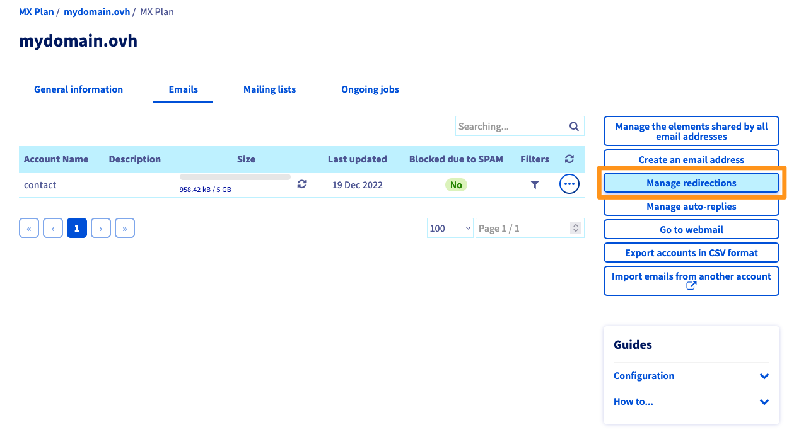
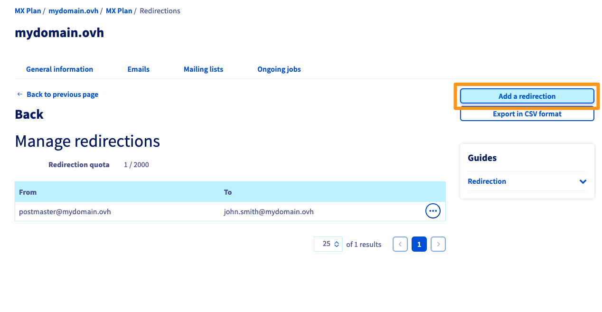

**Dernière mise à jour le 05/05/2020**

## Objectif

Vous trouverez dans ce guide différentes informations et aides concernant la configuration de vos redirections e-mail, par exemple pour rediriger des e-mails reçus sur une adresse A vers une adresse B.

## Généralités

### Qu'est-ce qu'une redirection e-mail ?

Une redirection permet de réorienter un e-mail reçu sur une première adresse, vers une ou plusieurs autres adresses.

Par exemple, vous souhaitez qu'à l'envoi d'un e-mail sur **public@mydomain.com**, celui-ci soit renvoyé vers **private@otherdomain.com**. Cela permet de communiquer la première adresse à l'expéditeur ( **public@mydomain.com** ), sans qu'il ne connaisse votre véritable adresse ( **private@otherdomain.com** ).

Il y a deux types de redirections : 

- La redirection simple (schéma 1); l'e-mail est directement renvoyé vers l'adresse de redirection et le destinataire ne reçoit pas l'e-mail. 

- La redirection avec copie locale (schéma 2); l'e-mail est transmis au destinataire ainsi qu'à l'adresse de redirection.

{.thumbnail}

> [!primary]
>
> Sachez qu'il est possible d'effectuer une redirection vers plusieurs adresses e-mail.

## Prérequis

- Être connecté à votre [espace client OVHcloud](https://ca.ovh.com/auth/?action=gotomanager&from=https://www.ovh.com/ca/fr/&ovhSubsidiary=qc).
- Disposer d'une offre MX Plan. Celle-ci est disponible via : une [offre d’hébergement web](https://www.ovhcloud.com/fr-ca/web-hosting/){.external}, [l'hébergement gratuit Start 10M](https://www.ovhcloud.com/fr/domains/free-web-hosting/){.external}, ou l'offre MX Plan commandée séparément.

## En pratique

Selon la date d'activation de votre offre MXplan ou si celle-ci a été récemment migrée, il est possible que vous disposiez de la version historique ou de la nouvelle version de l'offre. Avant de poursuivre, vous devez identifier celle-ci. 

Pour cela, connectez-vous à votre [espace client OVHcloud](https://ca.ovh.com/auth/?action=gotomanager&from=https://www.ovh.com/ca/fr/&ovhSubsidiary=qc){.external}, partie « Web ». Cliquez sur `Emails`{.action} dans la barre de services à gauche, puis choisissez le nom de l'offre concernée. Poursuivez selon la version que vous possédez.

|Version historique de l'offre MX Plan|Nouvelle version de l'offre MX Plan|
|---|---|
|{.thumbnail}  Repérez l'offre dans le cadre « Abonnement »|{.thumbnail} Repérez la `Référence serveur` dans le cadre « Résumé »|
|Poursuivre vers « [Version historique de l'offre MX Plan](./#version-historique-de-loffre-mx-plan) »|Poursuivre vers « [Nouvelle version de l'offre MX Plan](./#nouvelle-version-de-loffre-mx-plan_1) »|

### Version historique de l'offre MX Plan

#### Étape 1: accéder a la gestion des redirections
Par défaut, vous êtes dans l'onglet `Informations générales`{.action} de votre MX Plan. Cliquez sur l'onglet `Emails`{.action} puis à droite sur le bouton `Gestion des redirections`{.action}.

{.thumbnail}

#### Étape 2: ajouter une redirection

Le tableau des redirections déjà actives s'affiche. À droite, cliquez sur le bouton `Ajouter une redirection`{.action}.

{.thumbnail}

Complétez selon les 3 paramètres suivants :

|Information|Description| 
|---|---|  
|De l'adresse |Renseignez ici l'adresse e-mail que vous souhaitez rediriger.|  
|Vers l'adresse|Renseignez ici l'adresse de destination de votre redirection. Il peut s'agir de l'une de vos adresses e-mail OVHcloud, ou d'une adresse e-mail externe.|
|Choisissez un mode de copie|Choisissez si vous souhaitez :   - **Conserver une copie du mail chez OVH** (recevoir l'e-mail sur votre adresse principale ainsi que l'adresse de redirection)   - **Ne pas conserver de copie du mail** (renvoyer directement vers l'adresse de redirection sans que l'adresse principale ne le reçoive)   *cf. le [schéma](./#generalites){.external} au début de ce guide.*|

Cliquez ensuite sur `Valider`{.action} pour confirmer l'ajout de cette redirection.

{.thumbnail}

> [!primary]
> Lorsque vous choisissez le mode de copie « **Conserver une copie du mail chez OVH** », une redirection de l'adresse e-mail vers elle-même est créée automatiquement dans la liste des
> redirections, elle matérialise cette copie locale.
> 

### Nouvelle version de l'offre MX Plan

La gestion des redirections ne se fait pas via l'espace client pour la nouvelle version de l'offre MX Plan mais directement via le webmail de l'adresse e-mail concernée.

Rendez-vous sur le webmail à l'adresse [mail.ovh.net](https://www.ovh.com/ca/fr/mail/){.external}. Saisissez **l'adresse e-mail** et le **mot de passe** pour vous y connecter.
{.thumbnail}

#### Étape 1: accéder à la gestion des redirections

Une fois connecté à votre adresse e-mail via le [webmail](https://www.ovh.com/ca/fr/mail/){.external}, cliquez sur la roue crantée en haut à droite puis sur `Options`{.action},

{.thumbnail}
Depuis la fenêtre **Options**, dans la colonne de gauche, dirigez-vous dans la catégorie **Traitement automatique** de la section **Courrier** puis cliquez sur `Règles de boîte de réception et de rangement`{.action} 

{.thumbnail}

Cette fenêtre permet de gérer vos redirections mais également d'appliquer des filtres sur l'ensemble des e-mail entrants.

#### Étape 2: ajouter une redirection

Une fois dans la fenêtre de gestion des **Règles de boîte de réception**, cliquez sur l'icône `+`{.action} en haut à gauche.
{.thumbnail}

Sur cette fenêtre, vous allez définir les règles nécessaires pour créer une redirection :

|Information|Description| 
|---|---|  
|Nom |Définissez le nom de votre redirection (cadre 1).|  
|Lorsque le message arrive et remplit toutes ces conditions| Votre redirection s'appliquant à tous les messages, selectionnez **[Appliquer à tous les messages]** (cadre 2).|
|Effectuer toutes les opérations suivantes|C'est ici que vous appliquez la redirection, selectionnez **Transférer, rediriger ou envoyer** puis **Rediriger le message vers...** (cadre 3). Tapez ensuite l'adresse vers laquelle vous souhaitez rediriger l'e-mail devant **Rediriger le message vers...** puis cliquez sur `Enregistrer`{.action} (cadre 4)|

{.thumbnail}

Dans notre exemple, il s'agit d'une **redirection avec copie locale** (voir le [schéma 2](./#generalites){.external} au début de ce guide). Si cela correspond à votre besoin, cliquez sur `OK`{.action} (icône de disquette) en haut à gauche et la règle sera appliquée. Sinon, passez à l'étape ci-dessous.

Pour appliquer une **redirection simple** ([schéma 1](./#generalites){.external} au début de ce guide), ajoutez une règle supplémentaire à votre **redirection avec copie locale** depuis cette fenêtre. Cliquez sur `Ajouter une action`{.action} (cadre 1) puis sur **Déplacer, copier ou supprimer** et enfin **supprimer le message**. Cette règle place directement le message dans la corbeille, après avoir redirigé le message vers l'adresse de redirection.

{.thumbnail}

Une fois la fenêtre complétée, cliquez sur `OK`{.action}(icône de disquette) en haut à gauche.

## Aller plus loin

Échangez avec notre communauté d'utilisateurs sur <https://community.ovh.com>.
