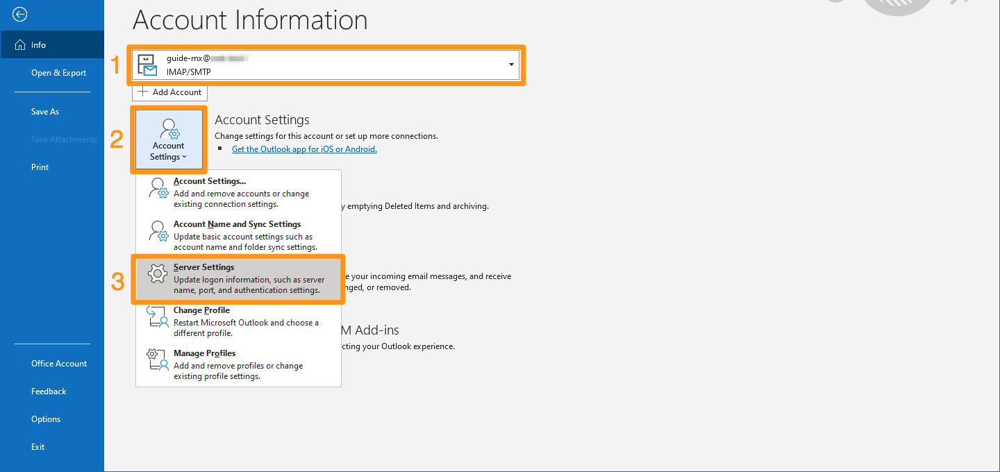
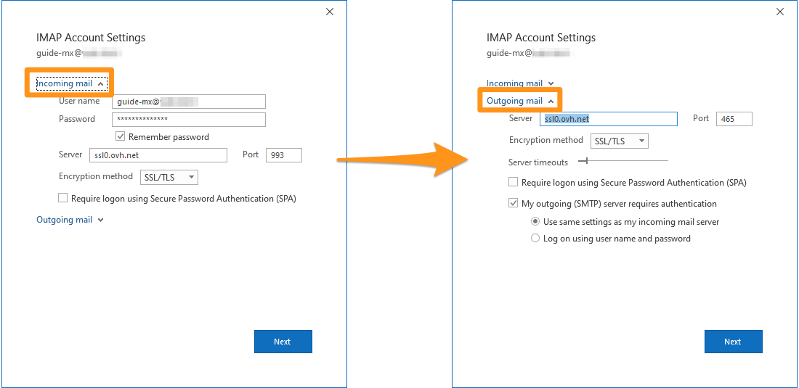

**Dernière mise à jour le 05/06/2021**

## Objectif

Les comptes MX Plan  peuvent être configurés sur différents logiciels de messagerie compatibles. Cela vous permet d’utiliser votre adresse e-mail depuis l’appareil de votre choix.

**Découvrez comment configurer votre adresse e-mail MX Plan sur Outlook 2016 ou ultérieur pour Windows.**

> [!warning]
>
> OVHcloud met à votre disposition des services dont la configuration, la gestion et la responsabilité vous incombent. Il vous revient de ce fait d'en assurer le bon fonctionnement.
> 
> Nous mettons à votre disposition ce guide afin de vous accompagner au mieux sur des tâches courantes. Néanmoins, nous vous recommandons de faire appel à un [prestataire spécialisé](https://partner.ovhcloud.com/fr/) et/ou de contacter l'éditeur du service si vous éprouvez des difficultés. En effet, nous ne serons pas en mesure de vous fournir une assistance. Plus d'informations dans la section « Aller plus loin » de ce guide.
> 

## Prérequis

- Disposer d’une adresse e-mail MX Plan (comprise dans l’offre MX Plan ou dans une offre d’[hébergement web OVHcloud](https://www.ovhcloud.com/fr/web-hosting/){.external}).
- Disposer du logiciel Microsoft Outlook 2016 ou ultérieur.
- Posséder les identifiants relatifs à l'adresse e-mail que vous souhaitez paramétrer.
 
> [!primary]
>
> Vous utilisez Outlook 2016 pour Mac ? Consultez notre documentation : [Configurer son adresse e-mail sur Outlook 2016 pour Mac](/pages/web/emails/how_to_configure_outlook_2016_mac){.external}.
>

## En pratique

### Ajouter le compte

- **Lors du premier démarrage de l'application** : un assistant de configuration s'affiche et vous invite à renseigner votre adresse e-mail.

- **Si un compte a déjà été paramétré** : cliquez sur `Fichier`{.action} dans la barre de menu en haut de votre écran, puis sur `Ajouter un compte`{.action}.

- Renseignez à présent votre adresse e-mail, puis appuyez sur `Options avancées`{.action}. Cochez la case à côté de `Configurer mon compte manuellement`{.action} qui vient d'apparaître, puis cliquez sur `Connexion`{.action}. 

{.thumbnail}

| | |
|---|---|
|{.thumbnail}|Parmi les différents types de comptes, choisissez entre IMAP et POP.  Nous vous conseillons une utilisation en IMAP.|
|Saisissez le mot de passe de votre adresse e-mail, puis cliquez sur `Suivant`{.action}. |{.thumbnail}|
|{.thumbnail}|Si Outlook n'est pas parvenu à configurer automatiquement votre adresse, cette fenêtre s'affiche.  Cliquez sur `Modifier les paramètres du compte`{.action} |
|Saisissez dans **Courrier entrant**:  - le serveur **ssl0.ovh.net**  - Port **993** - Méthode de chiffrement **SSL/TLS**  Saisissez dans **Courrier sortant**:  - le serveur **ssl0.ovh.net**  - Port **465** - Méthode de chiffrement **SSL/TLS**  Cliquez sur `Suivant`{.action} pour valider. |{.thumbnail}|

Dans le cadre d'une configuration en **POP**, les valeurs sont les suivantes:

|Type de serveur|Nom du serveur|Méthode de chiffrement|Port|
|---|---|---|---|
|Entrant|ssl0.ovh.net|SSL/TLS|995|
|Sortant|ssl0.ovh.net|SSL/TLS|465|

### Utiliser l'adresse e-mail

Une fois l'adresse e-mail configurée, il ne reste plus qu’à l'utiliser ! Vous pouvez dès à présent envoyer et recevoir des messages.

OVHcloud propose aussi une application web permettant d'accéder à votre adresse e-mail depuis un navigateur internet. Celle-ci est accessible à l’adresse <https://www.ovh.com/fr/mail/>. Vous pouvez vous y connecter grâce aux identifiants de votre adresse e-mail. Pour toute question relative à son utilisation, n'hésitez pas à consulter notre guide [Consulter son compte Exchange depuis l’interface OWA](/pages/web/emails/email_owa).

### Récupérer une sauvegarde de votre adresse e-mail

Si vous devez effectuer une manipulation qui risquerait d'entrainer la perte des données de votre compte e-mail, nous vous conseillons d'effectuer une sauvegarde préalable du compte e-mail concerné. Pour ce faire, consulter le paragraphe « **Exporter depuis Windows** » sur notre guide [Migrer manuellement votre adresse e-mail](/pages/web/emails/manual_email_migration#exporter-depuis-windows).

### Modifier les paramètres existants

Si votre compte e-mail est déjà paramétré et que vous devez accéder aux paramètres du compte pour les modifier :

- Allez dans `Fichier`{.action} depuis la barre de menu en haut de votre écran, puis sélectionnez le compte à modifier dans le menu déroulant **(1)**.
- Cliquez sur `Paramètres du compte`{.action}**(2)** en dessous.
- Cliquez sur `Paramètres du serveur`{.action}**(3)** pour accéder à la fenêtre de paramètres.

{.thumbnail}

La fenêtre est divisée en deux parties, **Courrier entrant** et **Courrier sortant**. Cliquez sur l'un ou l'autre pour pouvoir les modifier.

{.thumbnail}

## Aller plus loin

[Configurer son compte E-mail Pro sur Outlook 2016 pour Windows](/pages/web/emails-pro/how_to_configure_outlook_2016){.external}

[Configurer son compte Exchange sur Outlook 2016 pour Windows](/pages/web/microsoft-collaborative-solutions/how_to_configure_outlook_2016){.external}

Échangez avec notre communauté d'utilisateurs sur <https://community.ovh.com>.
