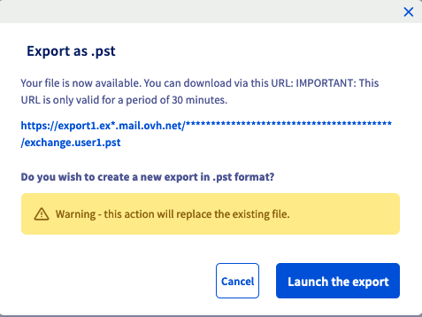
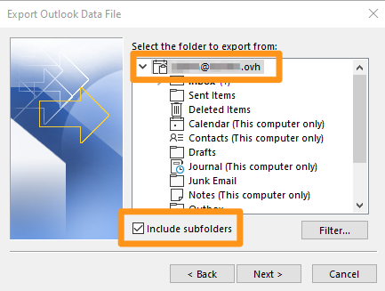
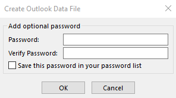
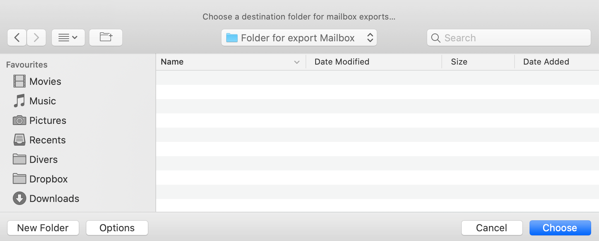
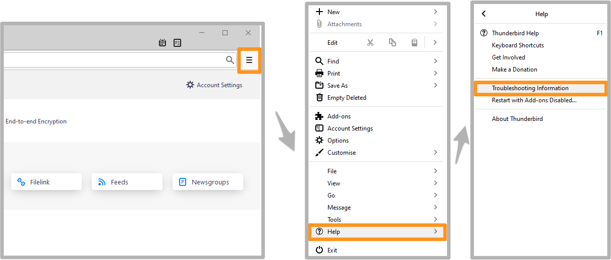

**Last updated 5th January 2021**

## Objective

You can [migrate an email address automatically](../../microsoft-collaborative-solutions/exchange-account-migration-with-ovh-mail-migrator/){.external} via our [OVH Mail Migrator](https://omm.ovh.net/){.external} tool. You can also manually migrate your email address using an email client.

**Find out how to migrate your email address manually.**

> [!warning]
>
> This guide will show you how to use one or more OVHcloud solutions with external tools, and the changes you need to make in specific contexts. You may need to adapt the instructions according to your situation. If you experience any difficulties carrying out these operations, please get in touch with a specialist service provider, and/or discuss your issues with our community on https://community.ovh.com/en/. OVHcloud cannot assist you in this regard.
>

## Requirements

- an email service with OVHcloud, such as an [Exchange](https://www.ovhcloud.com/en-ca/emails/hosted-exchange/){.external} or [Web Hosting](https://www.ovhcloud.com/en-ca/web-hosting/){.external} solution
- access to the email accounts you want to migrate (the source accounts)
- access to the OVHcloud email accounts that will be receiving the migrated data (the target accounts)

## Instructions

> [!primary]
> First of all, check if automatic migration is possible using our [OVH Mail Migrator](https://omm.ovh.net/){.external}. To do this, please use our guide on [Migrating email accounts with OVH Mail Migrator](../../microsoft-collaborative-solutions/exchange-account-migration-with-ovh-mail-migrator/){.external}.

In this guide, we have carried out operations on the most commonly used email software, i.e. **Outlook**, **Mail** on Mac OS and **Thunderbird**.

The following instructions are divided into two parts:

- **Exporting**: By doing so, you can extract a full backup of your email account, and migrate it to another computer, email software, or import it to another account. If you need to move items from one email address to another address that is configured on the same email software, you can copy/paste or drag/drop one to the other. However, it is recommended that you use the export system of the software you are using.

- **Importing**: This allows you to apply a backup that you have made on your new computer or software. Verify that the backup file you want to import is compatible with the email software you are using.

### Outlook

If you have an [OVHcloud Exchange email account](https://www.ovhcloud.com/en-ca/emails/hosted-exchange/), you can export it directly in PST format via the OVHcloud Control Panel.

Log in to the [OVHcloud Control Panel](https://ca.ovh.com/auth/?action=gotomanager&from=https://www.ovh.com/ca/en/&ovhSubsidiary=ca){.external}, then go to the `Web Cloud`{.action} section. Select `Microsoft`{.action} in the left-hand column, then `Exchange`{.action}. Click the name of the concerned Hosted Exchange service.

In the `Email accounts`{.action} tab, click the `...`{.action} button to the right of the email account you want to export, then `Export in PST`{.action} format.

{.thumbnail}

You will then need to wait for the export process to complete, which may take from a few minutes to several hours, depending on the size of the export. At the end of it, you just need to return to the `Export to PST`{.action} button to retrieve a link to download the file.

{.thumbnail}

#### Exporting from Windows

- Click `File` in the top left-hand corner, then `Open and Export`, and then `Import/Export`.

{.thumbnail}

- Select `Export to a file` and then click `Next`.

{.thumbnail}

- Select `Outlook Data File (.pst)` and click `Next`.

{.thumbnail}

- Select the name of the email account to export.

> [!primary]
> You can only export one account at a time.

Select `Include subfolders`, then click `Next`.

{.thumbnail}

- Choose the destination folder for your backup and enter a name for it by clicking `Browse`. Select the option you want, and then click `Finish`.

{.thumbnail}

Your file is being exported. When you create a file, you will be asked to set a password. This is optional.

{.thumbnail}

#### Importing from Windows

- Click `File` in the top left-hand corner, then `Open and Export`, and then `Import/Export`.

{.thumbnail}

- Select `Import from another program or file` and click `Next`.

{.thumbnail}

- Select `Outlook Data File (.pst)` and click `Next`.

{.thumbnail}

- Choose your backup file by clicking `Browse`. Select the option you want, and then click `Next`.

{.thumbnail}

- If you need to set a password on your backup file, enter the password and click `OK`.

- Select `Import items to the current folder` and then click `Finish`.

Your backup will be imported.

#### Exporting from Mac OS

In the `Tools` tab of your Outlook window, click `Export`.

{.thumbnail}

In the Export to archive (.olm) window, tick the items you want to add to your backup file, then click `Continue`.

{.thumbnail}

Then select the destination folder for your backup, and click `Save`.

{.thumbnail}

A progress window will appear, click `Continue` at the end of the operation. You will find your backup file in the folder you selected earlier.

#### Importing from Mac OS

In the `Tools` tab of your Outlook window, click `Import`.

{.thumbnail}

Choose the backup format you want to import, and then click `Continue`.

{.thumbnail}

Select your backup file, and then click `import`.

{.thumbnail}

A progress window will appear, click `Continue` at the end of the operation. Your backup is then deployed on your Outlook.

### Mail on Mac OS

#### Exporting

In the left-hand column, select one or more email accounts. Click `Mailbox` in the horizontal menu, and then click `Export Mailbox`.

{.thumbnail}

Select the folder you want, or create a new folder, and then click `Choose`.

{.thumbnail}

Your export is in the form of a .mbox file.

#### Importing

Click `File` on the horizontal menu, and then click `Import Mailboxes`.

{.thumbnail}

Select your .mbox backup file, and then click `Continue`.

{.thumbnail}

In the left-hand column, the imported emails are stored in a new email account named Import. You can drag folders and messages from the "Import" account to your already configured email accounts. Once your transfers are complete, you can delete the "Import" account.

### Thunderbird

There is currently no native feature to export or import an email account from Thunderbird. However, you can save a Thunderbird profile. It contains all accounts and emails locally stored on your computer. We will look at how to back up a Thunderbird profile and reintegrate it into a new Thunderbird instance.

#### Exporting

In the main window, click on the menu in the top right-hand corner, then `Help`, then `Troubleshooting Information`.

{.thumbnail}

A table appears. Identify the `Profile Folder` line and click the `Open Folder` button.

{.thumbnail}

You will then be directed to the profile folder. Move up one folder in the tree.

{.thumbnail}

Right-click the profile folder and paste it into the folder or media of your choice.

{.thumbnail}

#### Importing

Rather than an import, this will be a profile load. 
If email accounts have already been configured on the destination Thunderbird instance, they will be present on a profile (profile A).
When Thunderbird loads a new profile (profile B), it can **only** load the elements of **this particular** profile.
For this reason, we recommend loading the new profile (profile B) first, then configuring the email accounts from profile A.

You must first start Thunderbird via the profile manager.

- On Windows, go to the `Start` menu and open the `Run` application. On the latter, type `thunderbird.exe -ProfileManager` and click `OK`.

{.thumbnail}

- On Mac OS, launch the Terminal application then drag and drop your Thunderbird application into the Terminal window, adding it to the line `/Contents/MacOS/thunderbird-bin -ProfileManager`. Press the `Enter` (⏎) key to validate.

{.thumbnail}

The following window displays the existing profiles. Click `Create Profile` and then click `Next` when the information message appears.

{.thumbnail}

In the next step, name your profile and identify the folder where the profile will be created, below the sentence "Your user settings, preferences and other user-related data will be stored in":

{.thumbnail}

> [!primary]
> We recommend copying your Thunderbird profile backup to the Thunderbird profile folder.

Click `Choose Folder...` to select the folder that contains your backup. Click `Finish` to create the profile with your backup.

You will find your profile selection window with your new profile selected. When you click `Start Thunderbird`, Thunderbird will be launched with all the items you had in your backup.

### Checking the import on the new email address

When you have done the necessary steps by following the import instructions, make sure that your items are present on the server.

Log in to [webmail](https://www.ovh.com/ca/en/mail/).

In your inbox and the left-hand column, you will find the folders and emails for your saved email address.

> [!primary]
> You will need to bear in mind the delay of loading elements on your computer to the email server. This may take several minutes or several hours, depending on your internet connection.

## Go further

[Migrating email accounts using OVH Mail Migrator](../../microsoft-collaborative-solutions/exchange-account-migration-with-ovh-mail-migrator/)

Join our community of users on <https://community.ovh.com/en/>.
