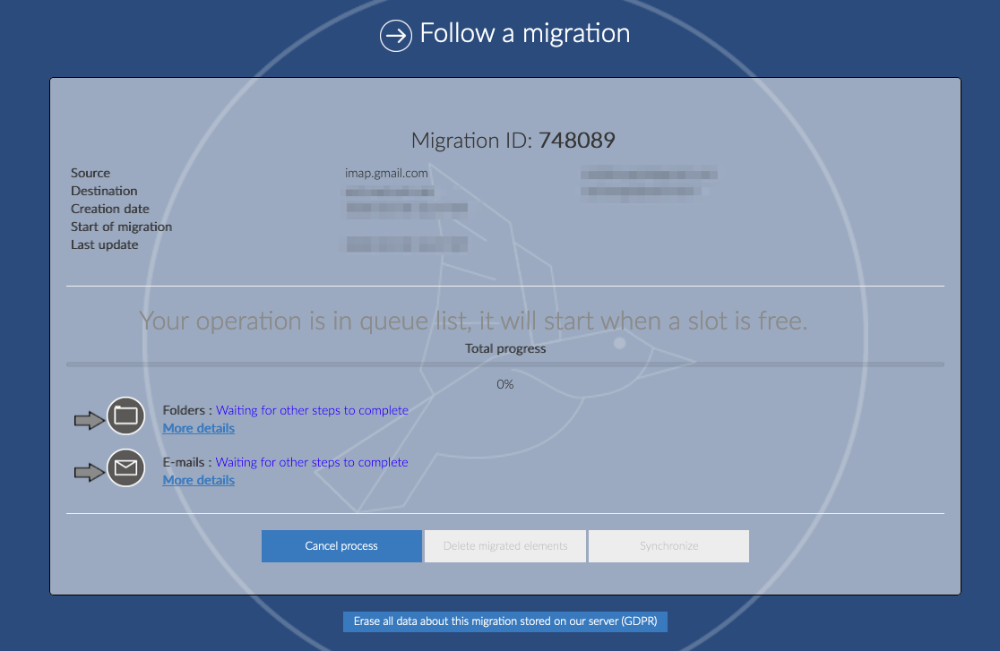

**Ostatnia aktualizacja z dnia 03-02-2020**

## Wprowadzenie

[OVH Mail Migrator](https://omm.ovh.net/){.external} (OMM) jest narzędziem przygotowanym przez OVHcloud. Umożliwia ono przeprowadzanie migracji kont e-mail od jednego dostawcy usług hostingowych do drugiego. Operacja obejmuje przeniesienie różnych typów treści, takich jak e-maile, kontakty, kalendarze i zadania, o ile są one kompatybilne z Twoimi kontami e-mail w OVHcloud. 

Z tego przewodnika dowiesz się, jak używać narzędzia OMM do importowania różnych elementów konta Gmail do konta e-mail OVHcloud.

**Dowiedz się, jak przenieść Twoje konto Gmail do konta e-mail OVHcloud przy użyciu narzędzia OMM.**

## Wymagania początkowe

- Korzystanie z usługi poczty elektronicznej w OVHcloud, takiej jak [oferta Exchange](https://www.ovhcloud.com/pl/emails/){.external}, [E-mail Pro](https://www.ovhcloud.com/pl/emails/email-pro/){.external} lub MX Plan (w postaci oferty MX Plan lub kont e-mail dostępnych w ramach [hostingu OVHcloud](https://www.ovhcloud.com/pl/web-hosting/){.external})
- Posiadanie danych dostępowych do kont e-mail, które chcesz przenieść (konta źródłowe)
- Posiadanie danych dostępowych do kont e-mail OVHcloud, na które przeniesione zostaną dane (konta docelowe)

## W praktyce

### Etap 1: Migracja e-maili i folderów

> [!primary]
> Aby migracja była możliwa, na koncie Gmail trzeba aktywować protokół IMAP. W tym celu postępuj zgodnie z przewodnikiem Google dotyczącym
> [aktywowania protokołu IMAP na koncie Gmail](https://support.google.com/mail/answer/7126229?hl=pl){.external}.

Po aktywowaniu protokołu IMAP na koncie Google, przejdź do strony narzędzia [OMM](https://omm.ovh.net/){.external}.

Kliknij przycisk `Migracja`{.action}, a następnie `Nowa migracja`{.action}.

{.thumbnail}

Pojawi się następujące okno:

{.thumbnail}

Uzupełnij wymagane pola zgodnie z informacjami z dwóch poniższych tabel:

**Konto źródłowe**

| Informacja            	| Opis                                                                              	|
|------------------------	|------------------------------------------------------------------------------------------	|
| Typ serwera         	| Z menu rozwijanego wybierz pozycję **„IMAP”**.         									|
| Adres URL serwera          	| Wpisz **„imap.gmail.com”**.                       					 			  	|
| Login						| Wpisz Twój adres Gmail.															|
| Hasło				| Wpisz hasło do Twojego konta Gmail.										|

**Konto docelowe**

| Informacja            	| Opis                                                                              							|
|------------------------	|-------------------------------------------------------------------------------------------------------------------|
| Typ serwera         	| Z menu rozwijanego wybierz opcję **„Hosting w OVH (wykrywanie automatyczne)”**.   											|
| Adres URL serwera          	| Pole zostaje uzupełnione automatycznie.                     					  		 							|
| Login						| Wpisz Twój adres e-mail OVHcloud.																			|
| Hasło				| Kliknij polecenie `wykryj parametry`{.action}, a następnie wpisz hasło do Twojego konta e-mail OVHcloud.	|

W sekcji **„Opcje”** zaznacz wyłącznie pozycję **„E-maile”**, ponieważ inne opcje nie są dostępne w przypadku protokołu IMAP. Migracja kontaktów i kalendarzy zostanie przeprowadzona w 2\. i 3\. etapie.

{.thumbnail}

W sekcji **„Informacje”** możesz wpisać adres e-mail, na który chcesz otrzymywać powiadomienia dotyczące postępów migracji. To pole jest opcjonalne. Następnie kliknij polecenie `Rozpocznij migrację`{.action}.

{.thumbnail}

Pojawi się okno monitorowania migracji (poniżej). Możesz zostawić je otwarte, aby na bieżąco monitorować migrację, lub też je zamknąć bez wpływu na migrację.

{.thumbnail}

> [!warning]
> Podczas uruchamiania migracji może pojawić się poniższy komunikat:

{.thumbnail}

W takim przypadku przejdź do skrzynki odbiorczej Twojego konta Gmail i sprawdź, czy przyszła wiadomość zatytułowana **„Krytyczny alert bezpieczeństwa”**. Jest to środek bezpieczeństwa stosowany przez Gmail. Należy wówczas postępować zgodnie z instrukcjami z przewodnika: [Jak zezwolić na mniej bezpieczne połączenia w Gmailu](../migracja-konta-gmail-przez-ovh-mail-migrator/bezpieczenstwo-gmail/)

Gdy **zezwolisz na „mniej bezpieczne połączenia”** na koncie Gmail, możesz ponownie uruchomić migrację.

### Etap 2: Migracja kalendarzy

#### 2.1 Pobieranie kopii zapasowej kalendarza na koncie Gmail

Aby zaimportować kalendarz do konta OVHcloud, musisz pobrać jego kopię zapasową z panelu Gmail. W tym celu postępuj zgodnie z instrukcjami w przewodniku Google:

[Eksportowanie kalendarza z konta Gmail](https://support.google.com/calendar/answer/37111?hl=pl){.external}

Jeśli na koncie Google masz kilka kalendarzy, pobierzesz plik archiwum do rozpakowania. Każdy kalendarz będzie w formacie **.ics**.

#### 2.2 Importowanie kalendarza przy użyciu narzędzia OMM

> [!primary]
> Migracja kalendarzy przy użyciu narzędzia OMM jest możliwa tylko do kont Exchange.

Po pobraniu kopii zapasowej kalendarza w formacie **.ics** przejdź do strony narzędzia [OMM](https://omm.ovh.net/){.external}.

U góry wybierz kartę `PST/ICS/VCF`{.action}, a następnie kliknij pozycję `Nowa migracja PST/ICS/VCF`{.action}.

{.thumbnail}

Uzupełnij wymagane pola zgodnie z informacjami podanymi w poniższej tabeli, a następnie kliknij polecenie `Rozpocznij migrację`{.action}:

| Informacja            	| Opis                                                                              	|
|------------------------	|------------------------------------------------------------------------------------------	|
| Login                  	| Podaj adres e-mail OVHcloud, na który ma zostać przeprowadzona migracja kalendarza.           	|
| Hasło           	| Wpisz hasło przypisane do docelowego konta e-mail.                          	|
| E-mail do komunikacji 	| Podaj adres e-mail, na który będziesz otrzymywać informacje o postępach migracji i który pozwoli na wznowienie pobierania pliku.	|

{.thumbnail}

 Kliknij pozycję `Wybierz plik`{.action}, aby pobrać na Twój komputer plik kalendarza w formacie **.ics**, a następnie kliknij polecenie `Prześlij`{.action}.

{.thumbnail}

Podaj hasło przypisane do docelowego konta e-mail, a następnie kliknij polecenie `Rozpocznij migrację`{.action}.

{.thumbnail}

Pojawi się okno monitorowania migracji (poniżej). Możesz zostawić je otwarte, aby na bieżąco monitorować migrację, lub też je zamknąć bez wpływu na migrację.

{.thumbnail}

### Etap 3: Migracja kontaktów

> [!primary]
> Migracja kontaktów przy użyciu narzędzia OMM jest możliwa tylko do kont Exchange.

Aby zaimportować kontakty do konta OVHcloud, musisz pobrać ich kopię zapasową z panelu Gmail. W tym celu postępuj zgodnie z instrukcjami w przewodniku Google:

[Eksportowanie kontaktów z konta Gmail](https://support.google.com/contacts/answer/7199294?hl=pl){.external}

> [!warning]
> Eksport należy wykonać do formatu vCard (**.vcf**) przez panel Gmail. Ta opcja jest proponowana na koniec procesu eksportu.

{.thumbnail}

Uzupełnij wymagane pola zgodnie z informacjami podanymi w poniższej tabeli, a następnie kliknij polecenie `Rozpocznij migrację`{.action}:

| Informacja            	| Opis                                                                              	|
|------------------------	|------------------------------------------------------------------------------------------	|
| Login                  	| Podaj adres e-mail OVHcloud, na który ma zostać przeprowadzona migracja kontaktów.            	|
| Hasło           	| Wpisz hasło przypisane do docelowego konta e-mail.                          	|
| E-mail do komunikacji 	| Podaj adres e-mail, na który będziesz otrzymywać informacje o postępach migracji i który pozwoli na wznowienie pobierania pliku.	|

{.thumbnail}

Kliknij pozycję `Wybierz plik`{.action}, aby pobrać na Twój komputer plik kontaktów w formacie **.vcf**, a następnie kliknij polecenie `Prześlij`{.action}.

{.thumbnail}

Podaj hasło przypisane do docelowego konta e-mail, a następnie kliknij polecenie `Rozpocznij migrację`{.action}.

{.thumbnail}

Pojawi się okno monitorowania migracji. Możesz zostawić je otwarte, aby na bieżąco monitorować migrację, lub też je zamknąć bez wpływu na migrację.

{.thumbnail}

## Sprawdź również

[Jak zezwolić na mniej bezpieczne połączenia w Gmailu](../migracja-konta-gmail-przez-ovh-mail-migrator/bezpieczenstwo-gmail/)

Przyłącz się do społeczności naszych użytkowników na stronie <https://community.ovh.com/en/>.

