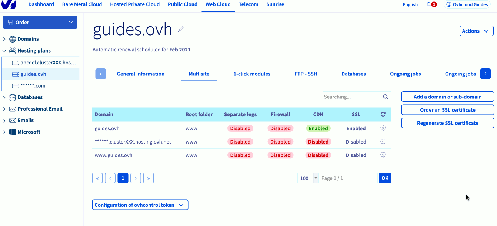
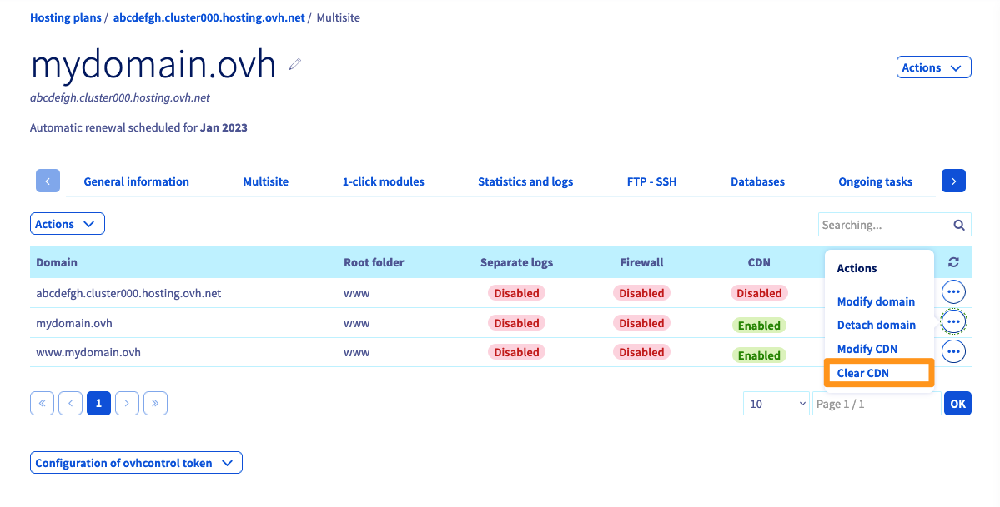
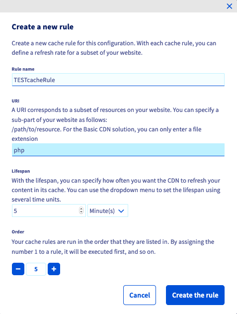
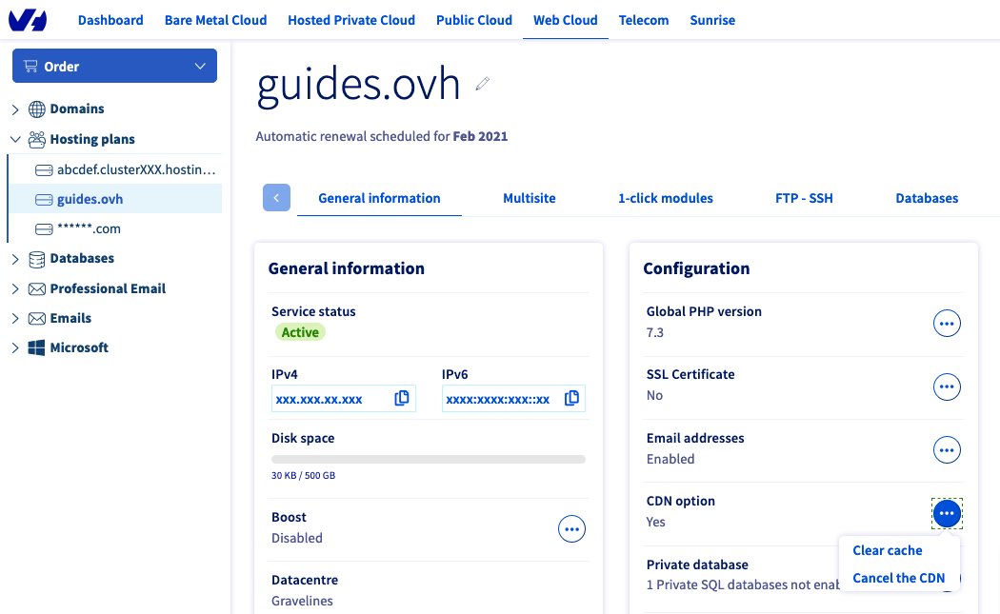

**Ultimo aggiornamento: 26/04/2021**

> [!primary]
> Questa traduzione è stata generata automaticamente dal nostro partner SYSTRAN. I contenuti potrebbero presentare imprecisioni, ad esempio la nomenclatura dei pulsanti o alcuni dettagli tecnici. In caso di dubbi consigliamo di fare riferimento alla versione inglese o francese della guida. Per aiutarci a migliorare questa traduzione, utilizza il pulsante "Modifica" di questa pagina.
>

## Obiettivo

Per accelerare la velocità di caricamento del tuo sito Web e migliorare così l’esperienza utente, la tecnica più efficace consiste nell’attivare la CDN (Content Delivery Network), che consente di conservare in cache i file che non richiedono un continuo aggiornamento (cosiddetti “statici”), come le immagini, i css e i javascript nei server più vicini ai tuoi utenti.

**Questa guida ti mostra come gestire l’opzione CDN del tuo hosting Web.**

## Definizione

**Come funziona una CDN?**

La CDN (Content Delivery Network) è letteralmente una rete dedicata alla consegna dei contenuti  e per visualizzare il contenuto del tuo sito Web utilizza vari server sparsi in tutto il mondo.  Più i server vicini ai tuoi utenti, maggiore sarà la velocità di caricamento del tuo sito Web sui loro dispositivi.

Per funzionare correttamente, ciascun server salva nella memoria cache una parte del tuo sito Web. In generale, ti consigliamo di includere i file cosiddetti “statici”: le immagini, i file javascript e css che garantiscono il buon funzionamento del tuo server, ma che vengono modificati molto raramente.

## Prerequisiti

- Avere accesso allo [Spazio Cliente OVHcloud](https://www.ovh.com/auth/?action=gotomanager&from=https://www.ovh.it/&ovhSubsidiary=it){.external}
- Disporre di un piano di [hosting Web OVHcloud](https://www.ovhcloud.com/it/web-hosting/){.external} attivo

## Procedura

###  Attiva l'opzione CDN

> [!primary]
> 
> L’opzione CDN è già inclusa nei piani di hosting Web Performance.

####  Se l'opzione CDN non è ordinata o attivata sul tuo hosting Web

Accedi allo [Spazio Cliente OVHcloud](https://www.ovh.com/auth/?action=gotomanager&from=https://www.ovh.it/&ovhSubsidiary=it){.external} e seleziona `Web Cloud`{.action}. e seleziona il tuo servizio nella sezione `Hosting`{.action} della colonna a sinistra. Clicca sui tre puntini `...`{.action} a destra di "Opzione CDN" e poi su `Ordina una CDN`{.action} o `Attiva l'opzione`{.action} se l'opzione CDN è già inclusa nel tuo hosting.

> [!primary]
> 
> Se hai un'opzione CDN precedente al 19/11/2020, puoi ordinare la nuova offerta Shared CDN cliccando su `Aggiorna la CDN verso la versione superiore`{.action}.

{.thumbnail}

Sarai reindirizzato verso una pagina in cui è possibile generare un buono d’ordine. Una volta effettuato il pagamento, il tuo servizio sarà disponibile in pochi minuti.

#### Se l'opzione CDN è già attiva sul tuo hosting Web

Accedi allo [Spazio Cliente OVHcloud](https://www.ovh.com/auth/?action=gotomanager&from=https://www.ovh.it/&ovhSubsidiary=it){.external} e seleziona `Web Cloud`{.action}. e seleziona il tuo servizio nella sezione `Hosting`{.action} della colonna a sinistra. Nella scheda `Multisito`{.action}, clicca sull’icona a forma di ingranaggio e poi clicca su `Modifica`{.action}.

A questo punto, seleziona la voce “Attiva la CDN”, clicca su `Seguente`{.action} e infine su`Conferma`{.action}.

{.thumbnail}

> [!warning]
> 
> Sa hai aggiunto un dominio esterno (non OVHcloud) al multisito dell’hosting Web, è necessario indicare l’indirizzo IP della CDN del tuo hosting nella zona DNS del dominio.<br>
> Consulta la [lista degli indirizzi IP di cluster e hosting Web](../lista-indirizzi-ip-di-cluster-e-hosting-web/){.external} per recuperare l’indirizzo IP specifico per la CDN del tuo cluster.

 
**Perché non puoi utilizzare l'IP geolocalizzato con l'opzione CDN?** <br>
<br>
La CDN utilizza il principio degli indirizzi IP Anycast. A seconda della tua geolocalizzazione, verranno interrogati diversi server, il che ridurrà il tempo di caricamento dei tuoi file statici. Pertanto la geolocalizzazione degli indirizzi IP è praticamente inutile. <br>
Per quanto riguarda la SEO (motori di ricerca), la velocità di visualizzazione del tuo sito Web è più importante della geolocalizzazione dell'indirizzo IP del tuo hosting.

### Gestisci la tua CDN Shared 

> [!primary]
> 
> L'opzione Shared CDN è già inclusa nelle offerte di hosting Web Performance o è disponibile al momento dell'ordine dal 19/11/20. Per le versioni precedenti, consulta il paragrafo [Gestisci la tua CDN (versione storica)](./#gestisci-la-tua-cdn-versione-storica_2).

#### Svuota la cache della CDN Shared

Ogni tanto è utile cancellare la cache della CDN, specialmente quando effettui l’aggiornamento dei tuoi file statici: ad esempio, durante la pubblicazione online di una nuova versione del tuo sito. Puoi svuotare la cache per ogni input multisito.

Clicca sulla scheda `Multisito`{.action} del tuo hosting, clicca sui tre puntini...` a destra del record multisito e poi `{.action}Purger la CDN` `{.action}.

{.thumbnail}

#### Configura le opzioni della CDN Shared

Clicca sulla scheda `Multisito`{.action} del tuo hosting, clicca sui tre puntini...` a destra del record multisito e poi su `{.action}Modifica la CDN` `{.action}. 

Clicca sull'icona di penna in corrispondenza di un record Multisito, quando la CDN è attiva. Clicca su Modifica `la tua CDN`{.action}.

> [!warning]
> 
> Alcune opzioni sono bloccate sull'offerta Basic.

{.thumbnail}

- **Sempre online**: Permette il mantenimento dei dati della CDN online in caso di guasto del server.

- **HTTP/2**: Protocollo che permette di migliorare le performance del tuo sito Web in termini di sicurezza e latenza.

- **Dev-mode**: ti permette di disattivare la cache durante lo sviluppo del tuo sito.

- **Brotli**:  tipo di compressione che permette di ottimizzare la dimensione dei tuoi file in cache.

- **Regole della cache**: Crea fino a 5 regole. che definiscono la frequenza di aggiornamento della cache per alcune risorse specifiche del tuo sito. ([segui il passo successivo](./#crea-una-regola-di-inserimento-in-cache).

Una volta selezionate le opzioni, clicca su `Applica la configurazione`{.action} e poi su `Conferma la configurazione`{.action} nella finestra successiva.

{.thumbnail}

##### Crea una regola di inserimento in cache

Per aggiungere una regola di cache su uno degli elementi del tuo sito, vai alla scheda `Multisito`{.action} del tuo hosting, clicca sui `...`{.action} a destra del record multisito e poi su `Configura la CDN`{.action}.

Seleziona **Regole di cache** e clicca sul pulsante `Aggiungi una regola`{.action}.

{.thumbnail}

- **Regola**: Assegna un nome alla tua regola.

- **URI**: Inserisci la sottounità di risorse del tuo sito Web tramite la sua directory. Per le offerte CDN-Basic e CDN-Security, è possibile inserire solo un'estensione di file.

- **Durata**: indica la durata di messa in cache della risorsa scelta.

- **Classificazione**:  Classifica per ordine di esecuzione le tue regole (da minimo a massimo).

Una volta effettuata la scelta, clicca sul pulsante `crea la regola`{.action}.

Le regole figurano in un elenco.  Per modificarli, clicca sui tre puntini `...`{.action} in corrispondenza della stessa, seleziona `Modifica la regola`{.action} o elimina cliccando su `Elimina la regola`{.action}.

{.thumbnail}

Una volta configurate le regole e selezionate le opzioni, clicca su `Applica la configurazione`{.action} e poi su `Conferma la configurazione`{.action} nella finestra successiva.

#### Configura le opzioni della CDN Security

> [!primary]
>  le opzioni presentate qui sotto richiedono la sottoscrizione della [CDN security](https://www.ovh.com/fr/hebergement-web/cdn.xml) o della [CDN Advanced](https://www.ovh.com/fr/hebergement-web/cdn.xml)

Clicca sulla scheda `Multisito`{.action} del tuo hosting, clicca sui tre puntini `...`{.action} a destra del record multisito e poi  `Modifica la CDN `{.action}. 

Clicca sull'icona di penna in corrispondenza di un record Multisito, quando la CDN è attiva. Clicca su Modifica `la tua CDN`{.action}.

- **Cross-Origin Resource Sharing (CORS)**: Indica, nell'elenco, i domini esterni che saranno autorizzati ad accedere alle risorse del tuo sito web per condividerle. 

Una volta attivata la funzione, clicca su `Modifica l'elenco delle risorse esterne`{.action} per aggiungere i domini autorizzati a condividere le tue risorse.

{.thumbnail}

Una volta completata la lista, clicca su `Conferma`{.action}.

> [!primary]
> Attivando l'opzione CORS senza specificare alcun dominio nella lista, significa che tutti i domini sono autorizzati ad utilizzare le risorse del tuo sito Web.

- **HTTPS-redirect**: Proteggi il traffico totale del tuo sito Web reindirizzandolo al protocollo HTTPS in modo temporaneo o permanente.

Una volta attivata la funzione, clicca sul menu a tendina per scegliere tra `Reindirizzamento permanente (301)` o `Reindirizzamento temporaneo (302)`.

{.thumbnail}

- **HTTP Strict Transport Security (HSTS)**: Imposta l'accesso al tuo sito in HTTPS. In questo modo la tua soluzione Web è protetta contro gli attacchi di declassamento (o attacchi di ripiego).

Una volta attivata la funzione, determina la durata di vita durante la quale il browser applicherà la funzione HSTS sul tuo sito Web. 

{.thumbnail}

> [!primary]
> 
> Una volta attivata la funzione HSTS sul tuo sito, forgierà il protocollo HTTPS sul tuo browser fino alla fine del periodo detto "età massima", anche dopo la disattivazione della funzione nello Spazio Cliente. Tuttavia, quando la cache viene svuotata sul browser che ha già effettuato una visita sul tuo sito, quest'ultimo applicherà il nuovo stato della funzione HSTS.

- **Mixed content**: Costruisci l'intero contenuto delle tue pagine Web. Saranno caricate in modo sicuro, partecipando così a un'esperienza utente ottimale. Tutte le risorse del tuo sito, interne ed esterne, devono essere disponibili in HTTPS per evitare errori nel browser.

- **Firewall applicativo**: Il **W**eb **A**pplction **F**irewall (WAF) protegge il tuo sito da attacchi fraudolenti come l'inoltro del codice, le richieste illegittime o il furto di dati. e copre le principali falle note del web filtrando le richieste e i pacchetti trasmessi (la lista delle falle è gestita da OVHcloud e aggiornata regolarmente).  

> [!warning]
>
> Per l'installazione di un [modulo in 1 click OVHcloud](../hosting_condiviso_guida_ai_moduli_degli_hosting_condivisi/), il WAF deve essere disattivato per evitare che l'installazione del modulo sia bloccata.

> [!primary]
>  
> Il WAF è gestito totalmente da OVHcloud, la lista delle falle viene aggiornata regolarmente.

### Visualizza le statistiche della CDN

Nella scheda `Multisito`{.action} del tuo hosting, sotto la tabella, puoi visualizzare le statistiche della tua CDN, indicando il numero di richieste al minuto misurate su di esso.

{.thumbnail}

### Gestisci la tua CDN (versione storica)

> [!primary]
> 
> L'opzione CDN è già inclusa nelle soluzioni di hosting Web Performance o nelle offerte ordinate prima del 19/11/20.

#### Svuota la cache della CDN

Ogni tanto è utile cancellare la cache della CDN, specialmente quando effettui l’aggiornamento dei tuoi file statici: ad esempio, durante la pubblicazione online di una nuova versione del tuo sito. In questo caso, è possibile svuotare completamente la cache della CDN.

Accedi allo [Spazio Cliente OVHcloud](https://www.ovh.com/auth/?action=gotomanager&from=https://www.ovh.it/&ovhSubsidiary=it){.external} e seleziona `Web Cloud`{.action}. e seleziona il tuo servizio nella sezione `Hosting`{.action} della colonna a sinistra. Clicca sui tre puntini `...`{.action} in corrispondenza di “Opzione CDN” e poi su `Ordina una CDN`{.action}.

{.thumbnail}

### In che modo è possibile conservare in cache i file nella CDN?

**Tramite l’utilizzo di un CMS**

I principali CMS offrono numerosi plugin che permettono di configurare la memorizzazione in cache dei file statici in modo che siano automaticamente conteggiati dalla CDN. Altri permettono di configurare automaticamente i file statici tramite l’attivazione di una cache integrata nel CMS. Per maggiori informazioni, consulta la documentazione ufficiale del CMS o dell’editor dei plugin che utilizzi.

**Senza l’utilizzo di CMS**

Se non utilizzi un CMS, puoi usufruire della cache della CDN. Per farlo, è necessario aggiungere header alle richieste HTTP. Esistono diversi metodi per aggiungere gli header. Uno dei più semplici consiste nel definire regole all'interno di un file .htaccess, in funzione delle estensioni dei file.

```htaccess
1.#Cache delle immagini per 1 settimana
2. <<FilesMatch "\.(jpg|jpeg|png|gif)$">
3. Header set Cache-Control "max-age=604800, public"
4. </FilesMatch>
5. 
6. # Cache dei javascript e CSS per 1 mese
7. <FilesMatch "\.(js|css)$">
8. Header set Cache-Control "max-age=2592000"
9. </FilesMatch>
```
> [!warning]
>
> La memorizzazione in cache tramite gli header HTTP consente di salvare in cache i file sia nella CDN che nel browser degli utenti. Quindi per evitare che i tuoi visitatori visualizzino una versione in cache troppo vecchia, ti consigliamo di modificare i nomi dei file ad ogni nuova versione.
> 

### Disattiva l'opzione CDN

Questa azione permette di disattivare la CDN per uno o più ingressi multisito, senza eliminare l'opzione CDN del tuo hosting Web.

Accedi allo [Spazio Cliente OVHcloud](https://www.ovh.com/auth/?action=gotomanager&from=https://www.ovh.it/&ovhSubsidiary=it){.external} e seleziona `Web Cloud`{.action}. e seleziona il tuo servizio nella sezione `Hosting`{.action} della colonna a sinistra. Nella scheda `Multisito`{.action}, clicca sui tre puntini...` a destra del record multisito e poi `{.action}seleziona Modifica` `{.action}.

A questo punto, deseleziona la voce “Attiva la CDN”, clicca su `Seguente`{.action} e infine su`Conferma`{.action}.

{.thumbnail}

### Elimina l'opzione CDN

Questa operazione consente di eliminare l’opzione CDN per l’intero hosting Web.

Accedi allo [Spazio Cliente OVHcloud](https://www.ovh.com/auth/?action=gotomanager&from=https://www.ovh.it/&ovhSubsidiary=it){.external} e seleziona `Web Cloud`{.action}. e seleziona il tuo servizio nella sezione `Hosting`{.action} della colonna a sinistra. Clicca sui tre puntini `...`{.action} in corrispondenza di “Opzione CDN” e poi su `Disattiva la CDN`{.action}.

{.thumbnail}

Clicca su `Conferma`{.action} per completare l’operazione.

> [!warning]
>
> Ricevi una email contenente la procedura di disattivazione della CDN. Segui le istruzioni fornite nel messaggio per confermare o annullare la richiesta. 
> 


### Verifica che la CDN sia attiva

Per assicurarti che la CDN sia attiva sul tuo dominio, è possibile effettuare una verifica tramite un terminale con il seguente comando:

```
curl -i http://yourpersonnaldomain.ovh/
```

Se il tuo dominio è correttamente associato alla CDN, otterrai questo risultato:

```
HTTP/1.1.200 OK
Date: Tue, 01 Jan 2020 00:00:00 GMT
Content-Type: text/html; charset=UTF-8
Set-Cookie: SERVERID12345=123456; path=/; max-age=900
Vary: Accept-Encoding
X-Request-ID: 123456789
X-CDN-Pop: rbx1
X-CDN-Pop-IP: 00.111.22.333/44
X-Cacheable Cacheable
Accept-Ranges: bytes
Transfer-Encoding: chunked
x-IPLB-Instance/: 12345
```
Le intestazioni “*X-CDN*” confermano che il traffico del tuo sito Web passa attraverso la CDN.

Nel caso in cui il dominio non passi attraverso la CDN, ottieni in questo risultato:

```
HTTP/1.1.200 OK
Date: Tue, 01 Jan 2020 00:00:00 GMT
Content-Type: text/html; charset=UTF-8
Set-Cookie: SERVERID12345=123456; path=/; max-age=900
Server: Apache
X-Powered-By: PHP/7.1
Vary: Accept-Encoding
x-IPLB-Instance/: 12345
```

L’assenza dell’intestazione « *X-CDN* » indica che il traffico del tuo sito Web non passa attraverso la CDN.

## Per saperne di più

Contatta la nostra Community di utenti all’indirizzo [https://community.ovh.com/en](https://community.ovh.com/en/){.external}.
