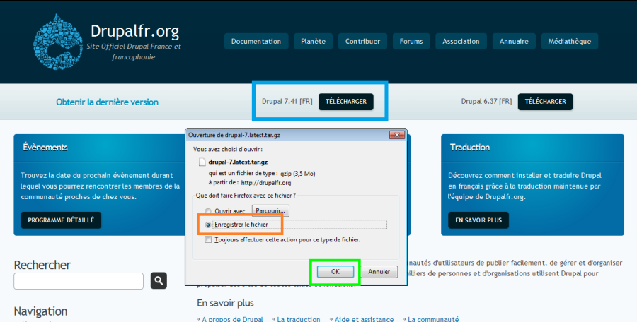
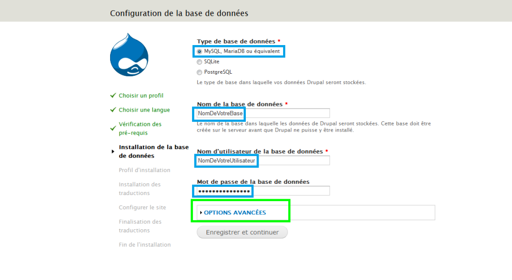
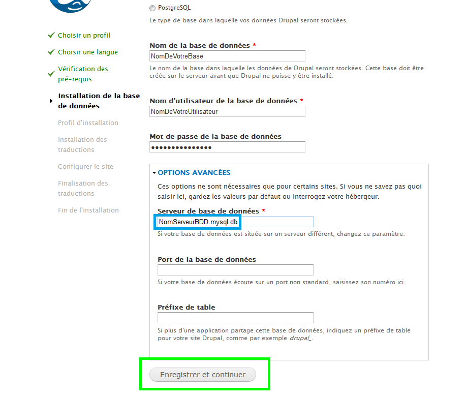
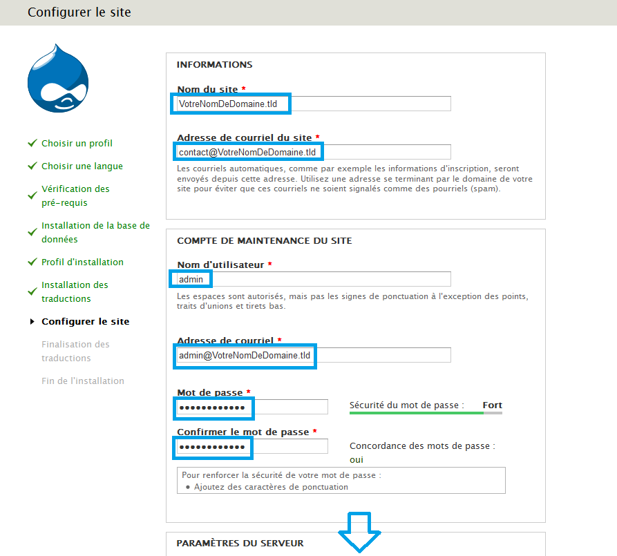
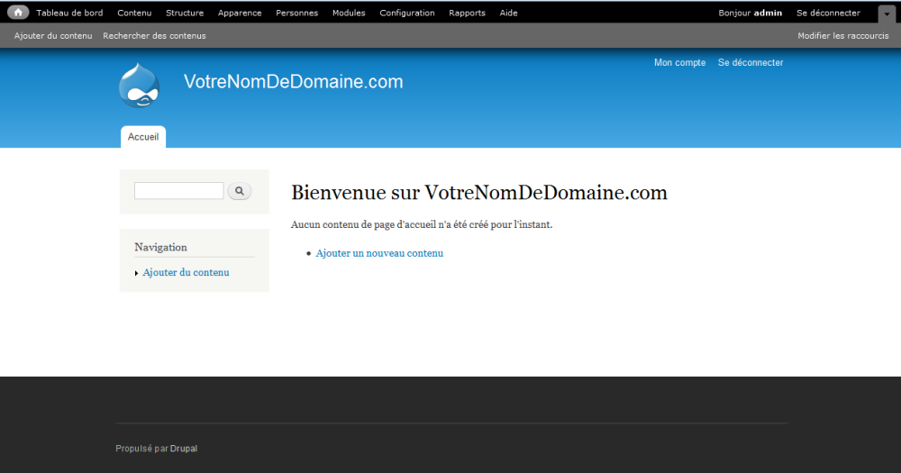

> [!warning]
>
> OVH met à votre disposition des services dont la configuration, la gestion et la responsabilité vous incombent. Il vous revient de ce fait d'en assurer le bon fonctionnement.
> 
> Nous mettons à votre disposition ce guide afin de vous accompagner au mieux sur des tâches courantes. Néanmoins, nous vous recommandons de faire appel à un prestataire spécialisé et/ou de contacter l'éditeur du service si vous éprouvez des difficultés. En effet, nous ne serons pas en mesure de vous fournir une assistance. Plus d'informations dans la section « Aller plus loin » de ce guide.
> 

Pour vous aider, chacune des étapes est détaillée. Pour toute demande précise liée au CMS, nous vous invitons à vous rapprocher de l'éditeur du CMS, ou des communautés en rapport avec celui-ci.

La version de Drupal utilisée dans ce guide est la versions 7.41.

**La version 8 de Drupal est compatible avec les hébergements mutualisés, il vous suffit d'être en version stable.**

Plus d'informations [dans ce guide](../modifier-lenvironnement-dexecution-de-mon-hebergement-web/#modifier-la-configuration-de-lhebergement-web-depuis-lespace-client).

Si vous souhaitez installer d'autres modules/CMS, consultez [ce guide]({legacy}1375){.ref}.

Les CMS sont des [systèmes de gestion de contenu](https://fr.wikipedia.org/w/index.php?title=Systeme_de_gestion_de_contenu&redirect=no){.external}, ils ont généralement besoin d'une plateforme d'hébergement comprenant un serveur FTP, une base de données, et un nom de domaine.

Vous pouvez trouver tous ces éléments dans [nos offres](https://www.ovh.com/fr/hebergement-web/){.external}.

*Si vous souhaitez installer Drupal de manière automatique depuis votre espace client, vous pouvez vous aider du guide suivant :* {.ref}

## Mise en ligne de Drupal

### Partie 1 &#58; preparation de linstallation
**Outils nécessaires**

Pour installer le CMS  **Drupal**  sur votre offre d'hébergement mutualisé, nous vous conseillons de vous munir d'un logiciel  **FTP**  tel que **FileZilla**  (gratuit). *Assurez-vous d'être en possession de votre identifiant client (nic-handle) et de votre mot de passe, pour pouvoir vous connecter à votre* [espace client OVH](https://www.ovh.com/auth/?action=gotomanager&from=https://www.ovh.com/fr/&ovhSubsidiary=fr){.external} *si nécessaire.*

- Récupérez votre identifiant et le mot de passe FTP qui vous permettent de vous connecter sur l'hébergement web.
- Il est aussi nécessaire d'avoir en votre possession votre identifiant et le mot de passe de la base de données SQL qui vous permettent de vous connecter dans la base de données.

### Partie 2 &#58; recuperation des fichiers sources
- Rendez-vous sur le site de [Drupal](http://drupalfr.org/){.external} .

{.thumbnail}

> [!success]
>
> Vous y trouverez généralement un lien vous permettant de télécharger la dernière version stable du CMS sur votre ordinateur.
> Dans notre exemple il s'agit de la version 7.41.
> 

Le fichier que vous allez récupérer est généralement  **compressé** (zippé), il faudra être en mesure de le  **décompresser**  (extraire) sur votre ordinateur. Vous trouverez sur Internet différentes aides à ce sujet.

### Partie 3 &#58; mise en place des fichiers sur l'hebergement via FTP
- Décompression du dossier de fichier

Ouvrez le dossier dans lequel vous avez téléchargé le dossier compressé.

Réalisez un clic droit sur le dossier en question, puis sélectionnez "Extraire tout..." (ou *Extraire ici*).

Indiquez une destination afin d'extraire vos fichiers dans un nouveau dossier.

*De nombreux tutoriels et logiciels de décompression sont disponibles sur internet pour vous aider à réaliser ces manipulations. Consultez-les si vous êtes bloqués à cette étape.*

Le dossier cible sera intitulé " **Drupal-xxx**" (xxx étant souvent remplacé par le numéro de la version).

{.thumbnail}

- Connexion à l'hébergement web via FTP

Pour déposer les fichiers de  **Drupal**  sur votre hébergement, vous devez tout d'abord vous connecter à celui-ci.

*Un guide est disponible concernant la connexion en FTP sur l'offre mutualisée :* {.ref}

- Transfert des fichiers via FTP

Suivez ces étapes pour déposer vos fichiers sur le FTP. Une fois connecté à FileZilla.

Dans la partie "Site local", qui correspond à la liste des fichiers présents sur votre ordinateur, ouvrez le dossier décompressé intitulé "Drupal-xxx" dans lequel sont présents les fichiers du CMS.

Dans la partie "Site distant" qui correspond dans ce cas à votre hébergement mutualisé OVH, ouvrez le dossier "www". C'est dans ce dossier que tous les fichiers du CMS devront être déposés.

> [!alert]
>
> Si ce dossier n'existe pas il vous est possible de le créer.
> 

*Vos fichiers doivent obligatoirement être déposés dans le dossier "www" sinon la procédure d'installation ne sera pas accessible depuis votre nom de domaine.* Une fois ces dossiers ouverts :

Dans la partie "Site local", vous retrouvez tous les fichiers nécessaires à l'installation du CMS Drupal.

Pour tous les sélectionner, réaliser la combinaison de touche  **CTRL+A** .

Réalisez ensuite le glisser-déposer des fichiers vers la partie "Site distant" dans le dossier "www".

{.thumbnail}

*Il est fort probable que le dossier "www" ne soit pas vide. Il n'est pas obligatoire de supprimer les fichiers présents dedans. Nous reviendrons sur ce point dans la suite de ce guide.* Le transfert des fichiers est en cours.

Attendez que la totalité des fichiers soit déposés sur le serveur FTP distant. Cela peut prendre quelques minutes.

Une fois le transfert terminé, assurez-vous que tous les fichiers et les dossiers ont été correctement transférés.

Cette opération conclut la partie consacrée au dépôt des fichiers sur le FTP.

{.thumbnail}

## Installation et configuration

### Étape 1 - Installation de Drupal
Rendez-vous sur un navigateur web, et tapez votre nom de domaine dans la barre d'adresse.

Vous arriverez sur cette page

Cochez "Standard Install with commonly used features pre-configured." puis cliquez sur "Save and continue"pour continuer.

{.thumbnail}

### Étape 2 - Choix de la langue
Sélectionnez la langue d'installation "Français" puis cliquez sur "Save and continue".

{.thumbnail}

### Étape 3 - Connexion a la base de donnees
Munissez-vous des identifiants de votre base de données (une aide à ce sujet est disponible ici :{.ref} ).

Renseignez les informations demandées concernant la base de données :

Cochez "MySQL, MariaDB ou équivalent".

- Nom de la base de données : choisi lors de sa création dans l'espace client.
- Nom d'utilisateur : identique au nom de la base de données.
- Mot de passe de la base de données: vous a été envoyé par mail lors de la création de la base de données – il est possible que vous l'ayez modifié depuis.
- Cliquez ensuite sur " OPTIONS AVANCÉES ".

{.thumbnail}

- Serveur de base de données : renseignez le nom du serveur de votre base de données, indiqué dans le mail d'installation ou dans votre espace client. Il se finit généralement par " .mysql.db ".
- Port de la base de données : Laissez vide.
- Préfixe de table : utile pour réaliser plusieurs installations de Drupal ou autres CMS sur la même base de données. Dans ce cas, il faudra renseigner un préfixe différent pour chacune des installations. Dans le doute, laissez vide.

{.thumbnail}

> [!success]
>
> Important : les identifiants de la base de données ne sont pas automatiquement
> envoyés lors de l'installation de l'hébergement. Pour les recevoir, vous devez
> activer la base de données dans votre espace client.
> 

Cliquez sur "Enregistrer et continuer" pour valider les informations de connexion à la base de données.

### Étape 4 - Progression
Si vous avez correctement renseigné les différentes informations de la base de données, l'installation se lance. Sinon, il faudra le refaire correctement.

- Il vous suffit de patienter le temps que l'installation se termine.

{.thumbnail}

### Étape 5 - Configuration de l'administration Drupal
Voici maintenant les paramètres d'administration de votre CMS  **Drupal** .

- Nom du site : Indiquez votre nom de domaine.
- Adresse de courriel du site : Indiquez l'adresse qu'utilisera votre site pour envoyer des message à vos abonnés.
- Nom d'utilisateur : Indiquez le nom du compte administrateur de votre site. Dans l'exemple nous choisissons admin.
- Adresse de courriel : Indiquez l'adresse qui sera rattachée à votre compte administrateur.
- Mot de passe : Indiquez ici le mot de passe du compte administrateur.
- Confirmer le mot de passe : Même chose ici.

Descendez plus bas vers la page

{.thumbnail}

- Pays par défaut : Choisissez le pays/La langue du site.
- Fuseau horaire par défaut : Choisissez le fuseau horaire du site.
- Mises à jour automatique & recevoir les courriels de notification : Nous vous conseillons d'activer ces options, avant d'augmenter la stabilité et la sécurité de votre site.
- Cliquez ensuite sur " Enregistrer et continuer ".

{.thumbnail}

### Étape 6 - Finalisation
Votre CMS Drupal est maintenant installé. Cliquez sur "Visitez votre nouveau site".

{.thumbnail}

Il ne vous reste plus qu'à utiliser  **Drupal**  et construire votre site.

{.thumbnail}

## Informations utiles

### Support Drupal
Nous vous invitons à consulter les forums dédiés à la solution Drupal.

- Voici le site du [support Drupal](https://www.drupal.org/support){.external} si vous nécessitez une aide à son utilisation.

> [!alert]
>
> Le support d'OVH ne sera pas habilité à vous répondre pour toute demande d'aide concernant la configuration de votre Drupal.
> Cependant, un guide d'utilisation est à votre disposition : <legacy:2053>.
> 

### Erreurs classiques
- Erreur "OVH - Site en construction"

Vous avez mis en place vos fichiers sur le FTP, cependant la page "Site en construction" est toujours affichée.

À l'installation de votre hébergement, OVH met en place une page d'attente, le temps que vous déposiez les fichiers de votre site internet.

Si vous déposez simplement vos fichiers dans le dossier  **"www"**  sans supprimer le contenu déposé par OVH, vous risquez de rencontrer ce souci.

Afin de corriger cela, vous devez supprimer ou renommer le fichier "index.html" mis en place par OVH sur votre hébergement.

*Il peut être intéressant de simplement le renommer afin de vous permettre de le réactiver à tout moment et de vous en servir comme page d'attente.*

Autre information utile : les fichiers de votre site doivent être déposés dans le dossier "www" afin d'être pris en compte.

{.thumbnail}

- Erreur avec la version de PHP

Il s'agit ici d'une erreur concernant la version PHP de votre serveur.

La cause est simple : la dernière version du PHP n'a pas été activée.

*Un guide est disponible concernant la modification de la version PHP sur l'offre mutualisée :* {.ref}

## Aller plus loin

Échangez avec notre communauté d'utilisateurs sur <https://community.ovh.com>.