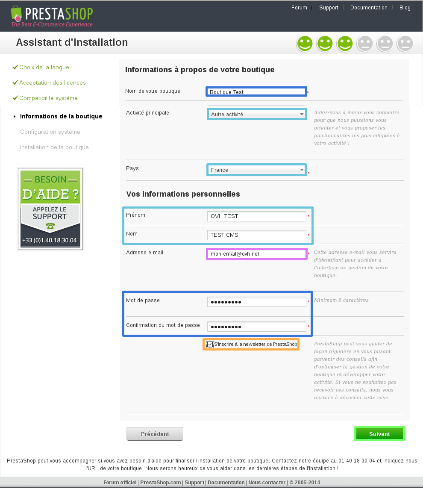
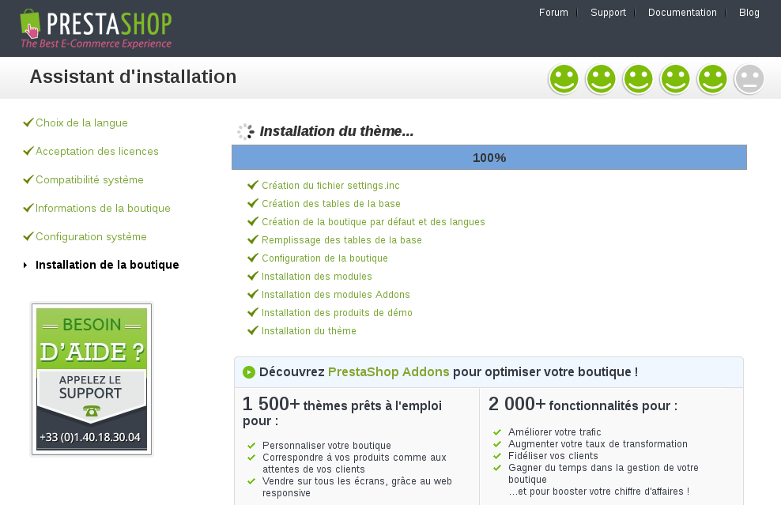

## Parte 1: preparazione all’installazione

## [b]Software[/b]
Per installare la piattaforma PrestaShop sulla tua offerta di hosting condiviso, ti consigliamo di utilizzare un client FTP come FileZilla (gratuito).

## [b]Credenziali[/b]
Assicurati di disporre delle credenziali (Nic-handle e password) di accesso al tuo [Spazio Cliente OVH](https://www.ovh.com/auth/?action=gotomanager&from=https://www.ovh.it/&ovhSubsidiary=it).

- Recupera le credenziali FTP per accedere al tuo hosting Web.
Per recuperare gli identificativi FTP, consulta la guida [prestashop]({legacy}1374)

- Assicurati di avere a disposizione le credenziali per accedere al tuo database SQL.
Per recuperare le tue credenziali SQL, consulta la guida [prestashop]({legacy}1374)

{.thumbnail}

## Parte 2: recupero dei file sorgente

- Accedi al sito di [PrestaShop](https://www.prestashop.com/).

In genere, il link disponibile ti permette di scaricare l'ultima versione stabile del CMS.

Il file scaricato generalmente è compresso (.zip). Per aprirlo e installarlo è necessario decomprimerlo.

{.thumbnail}

## Parte 3: configurazione dei file sull'FTP

## - Decomprimi la cartella:
Apri la cartella in cui hai scaricato il file compresso.

Clicca con il tasto destro, seleziona Estrai tutto... o Estrai qui e indica la cartella di destinazione dei tuoi file.

Se hai bisogno di aiuto, segui i numerosi tutorial online e scarica uno dei tanti programmi per decomprimere file .zip disponibili su Internet.

La cartella di destinazione si chiamerà PrestaShop.

{.thumbnail}

## - Accedi al tuo hosting Web via FTP
Accedi al tuo hosting e salva i file di PrestaShop.

Se hai bisogno di aiuto per accedere in FTP alla tua soluzione di hosting condiviso, consulta la guida [prestashop]({legacy}1374)

{.thumbnail}

## - Trasferisci i tuoi file via FTP
Per salvare i tuoi file sull'FTP, segui questi step.

## Step 1
Apri FileZilla.

Nella sezione Sito locale, che contiene l'elenco dei file presenti sul tuo pc, apri la cartella decompressa PrestaShop in cui sono presenti i file del tuo CMS.

Nella sezione Sito remoto, che corrisponde in questo caso al tuo hosting condiviso OVH, apri la cartella www in cui dovrai salvare tutti i file del CMS.

Se questa cartella non esiste, puoi crearla.

Per poter effettuare l'installazione dal tuo dominio, i tuoi file devono necessariamente essere salvati nella cartella "www".

{.thumbnail}

## Step 2
Apri le cartelle:

Nella sezione Sito locale, trovi i file necessari all'installazione di PrestaShop.

Selezionali tutti premendo i tasti CTRL+A.

Trascina i tuoi file nella cartella "www" della sezione Sito remoto.

È molto probabile che la cartella "www" non sia vuota. Non è obbligatorio eliminare i file presenti al suo interno.

{.thumbnail}

## Step 3
Attendi qualche minuto fino al completo trasferimento dei file sul server FTP remoto.

Al termine dell'operazione, assicurati che tutti i file e le cartelle siano stati spostati correttamente.

{.thumbnail}

## Parte 4: collega PrestaShop al tuo database

## - Per evitare errori, prima di proseguire cancella la cache del tuo browser.
Per collegare PrestaShop al tuo database, è necessario seguire gli step di installazione del CMS.

## Step 1
Inserisci il tuo dominio nella barra degli indirizzi del tuo browser.

Per installare la tua boutique PrestaShop, seleziona la lingua Italiano (Italian)" e clicca su Avanti per continuare.

{.thumbnail}

## Step 2
Seleziona la casella Accetto i termini e le condizioni dei presenti accordi e clicca su Avanti per passare allo step successivo.

{.thumbnail}

## Step 3
Ti vengono richieste alcune informazioni relative al negozio online che vuoi creare:

Nome del negozio: inserisci il nome del tuo negozio (ti ricordiamo che può influenzarne la referenziazione).

Attività principale: inserisci l'attività principale del tuo negozio.

Paese di default: seleziona il Paese del tuo negozio.

Nome: inserisci il nome dell'amministratore.

Cognome: inserisci il cognome dell'amministratore.

Indirizzo email: inserisci un indirizzo email valido per accedere al tuo negozio come amministratore.

Password del negozio: inserisci la password per accedere al tuo negozio come amministratore (minimo 8 caratteri).

Digita nuovamente la password: conferma la password inserita precedentemente.

Aggiornamento alla newsletter: seleziona questa opzione per ricevere la newsletter da parte di PrestaShop.

Clicca su Successivo per confermare le informazioni inserite.

{.thumbnail}

## Step 4
Inserisci le informazioni del tuo database:

Indirizzo server del database:  inserisci il nome del server del tuo database, indicato nell'email di installazione o nel tuo Spazio Cliente OVH.

Nome del database: il nome scelto al momento della sua creazione nello Spazio Cliente OVH.

Nome di accesso database: uguale al nome del database.

Password del database: se non l'hai modificata, la password che hai ricevuto per email al momento della creazione del tuo database.

Prefisso delle tabelle: utile per realizzare più installazioni di PrestaShop sur la même base de données. utilizzando lo stesso database. In questo caso, è necessario inserire un prefisso diverso per ognuna delle installazioni.

Importante: le credenziali del database non vengono inviate automaticamente durante l'installazione dell'hosting. Per riceverle, attiva il database nel tuo Spazio Cliente OVH.

Una volta completate le informazioni, puoi verificare la connessione al tuo database.

Clicca su Avanti pour confermare i dati inseriti.

{.thumbnail}

## Finalizzazione

## Finalizzazione dell'installazione
Segui gli step di installazione del CMS per completare l'installazione del tuo shop online.

## Step 1
Attendi fino al completamento dell’installazione. A questo punto, si apre una nuova finestra.

{.thumbnail}

## Step 2
L'installazione del tuo negozio PrestaShop è completata!

Inserisci le tue credenziali per iniziare subito a gestire il tuo shop online.

- Per motivi di sicurezza, per accedere è necessario eliminare manualmente la cartella install presente nella cartella www del tuo hosting condiviso.

{.thumbnail}

## Pannello di amministrazione di PrestaShop
Una volta effettuato l'accesso, visualizzi il pannello di amministrazione di PrestaShop.

{.thumbnail}

## Informazioni utili
Il supporto OVH non risponde alle domande relative alla configurazione del tuo PrestaShop. Se hai bisogno di aiuto, consulta la guida [prestashop]({legacy}2053) disponibile online o i [forum dedicati](https://www.prestashop.com/forums/forum/57-forum-italiano/) a questa soluzione.

## - Errore "Sito in costruzione"
Hai configurato i tuoi file sul tuo server FTP, ma continui a visualizzare la pagina "Sito in construzione".

Quando installi il tuo hosting, OVH realizza una pagina di attesa per permetterti di caricare i file del tuo sito.

Se salvi i file nella cartella www ma non elimini il contenuto inserito da OVH, potrebbe verificarsi questo problema.

Per risolverlo, elimina o rinomina il file "index.html" che OVH ha salvato sul tuo hosting.

Se rinomini semplicemente il file, puoi riattivarlo in qualsiasi momento per utilizzarlo come pagina di attesa.

Altre informazioni utili: per essere presi in carico, i file del tuo sito devono trovarsi nella cartella "www".

{.thumbnail}

## - Cartella "install" non eliminata

- Attenzione: per motivi di sicurezza, è necessario eliminare manualmente la cartella install presente nella cartella www del tuo hosting condiviso. In questo modo, potrai effettuare l'accesso al termine dell'installazione.

{.thumbnail}

