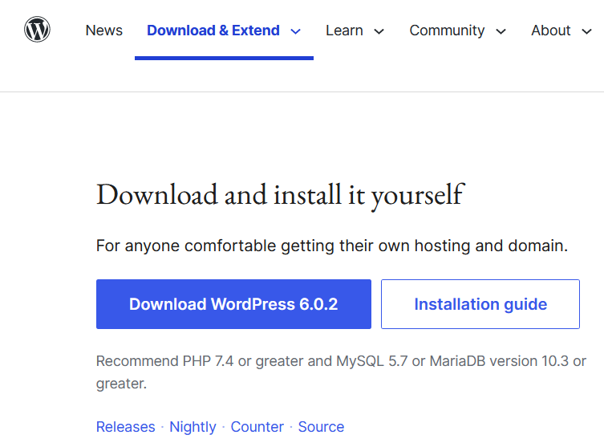
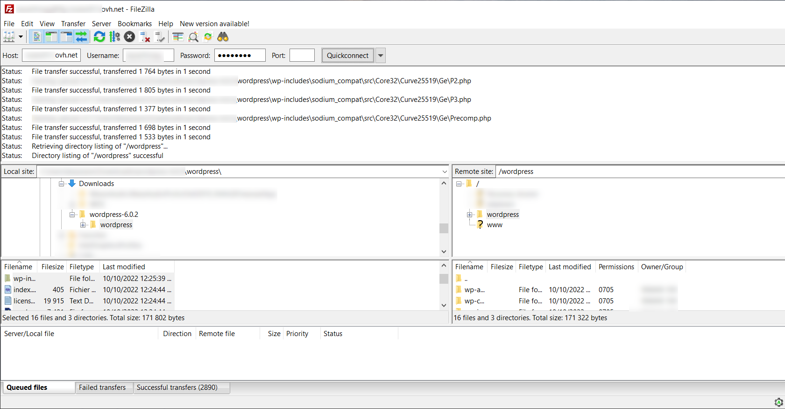

**Ostatnia aktualizacja z dnia 16-11-2022**
  
> [!primary]
> Tłumaczenie zostało wygenerowane automatycznie przez system naszego partnera SYSTRAN. W niektórych przypadkach mogą wystąpić nieprecyzyjne sformułowania, na przykład w tłumaczeniu nazw przycisków lub szczegółów technicznych. W przypadku jakichkolwiek wątpliwości zalecamy zapoznanie się z angielską/francuską wersją przewodnika. Jeśli chcesz przyczynić się do ulepszenia tłumaczenia, kliknij przycisk „Zaproponuj zmianę” na tej stronie.
>

## Wprowadzenie

Tutorial ten pomoże Ci ręcznie zainstalować CMS (Content Management System) WordPress w kilku etapach.

> [!warning]
>
> OVHcloud oddaje do Twojej dyspozycji usługi, których konfiguracja, zarządzanie i odpowiedzialność spoczywa na Ciebie. W związku z tym należy zapewnić ich prawidłowe funkcjonowanie.
> 
> Oddajemy w Twojej ręce niniejszy przewodnik, którego celem jest pomoc w jak najlepszym wykonywaniu bieżących zadań. W przypadku trudności zalecamy skorzystanie z pomocy [wyspecjalizowanego usługodawcy](https://partner.ovhcloud.com/pl/) lub [edytora CMS WordPress](https://wordpress.com/support/){.external}. Niestety firma OVH nie będzie mogła udzielić wsparcia w tym zakresie. Więcej informacji znajduje się w sekcji ["Sprawdź również"](#go-further) niniejszego przewodnika.
>

> [!success]
>
> Aby zainstalować moduł WordPress **automatycznie** z poziomu [Panelu klienta OVHcloud](https://www.ovh.com/auth/?action=gotomanager&from=https://www.ovh.pl/&ovhSubsidiary=pl), zapoznaj się z naszą dokumentacją dotyczącą [instalacji modułu za pomocą jednego kliknięcia](https://docs.ovh.com/pl/hosting/hosting_www_przewodniki_dotyczace_modulow_na_hostingu_www/).
>
> Aby zainstalować **ręcznie inny CMS** (Joomla!, Drupal, PrestaShop), zapoznaj się z naszą dokumentacją dotyczącą [ręczna instalacja CMS](https://docs.ovh.com/pl/hosting/hosting_www_reczna_instalacja_modulu_cms/).
>

## Wymagania

- Posiadanie oferty[hostingu](https://www.ovhcloud.com/pl/web-hosting/), która zawiera przynajmniej jedną bazę danych.
- Posiadanie [domeny](https://www.ovhcloud.com/pl/domains/)
- Zalogowanie do[Panelu klienta OVHcloud](https://www.ovh.com/auth/?action=gotomanager&from=https://www.ovh.pl/&ovhSubsidiary=pl){.external}

## W praktyce

### Etap 1 - przygotowanie instalacji <a name="step1"></a>

Aby zainstalować CMS **WordPress** na Twoim hostingu [hosting](https://www.ovhcloud.com/pl/web-hosting/), konieczne są pewne przygotowania.

#### 1.1 - Sprawdź zgłoszenie w katalogu głównym

"Katalog główny" to katalog, w którym Twój przyszły CMS zostanie zainstalowany na Twoim hostingu. Zalecamy wybór pustego katalogu, aby uniknąć konfliktów z innymi potencjalnymi stronami podpiętymi w opcji MultiSite.

Zapoznaj się z naszą dokumentacją [jak dodać stronę podpiętą w opcji MultiSite na hostingu](https://docs.ovh.com/pl/hosting/konfiguracja-multisite-na-hostingu/), aby zdefiniować katalog główny, którego chcesz użyć w WordPress.

> [!primary]
>
> Jeśli określisz nazwę "katalogu głównego", który nie istnieje na Twoim hostingu, zostanie on automatycznie utworzony w przestrzeni dyskowej FTP Twojego hostingu.
>

#### 1.2 - Sprawdź "wskazanie" domeny

- Upewnij się, czy domena, której będziesz używał do uzyskania dostępu do WordPress, jak również jej subdomena z "www", wskazują na adres IP Twojej usługi[hosting](https://www.ovhcloud.com/pl/web-hosting/).

Aby uzyskać adres IP Twojego hostingu, zaloguj się do [Panelu klienta OVHcloud](https://www.ovh.com/auth/?action=gotomanager&from=https://www.ovh.pl/&ovhSubsidiary=pl) w części `Web Cloud`{.action} i wybierz ofertę hostingu w sekcji `Hosting`{.action}.<br>
W ramce `Informacje ogólne`{.action} po prawej stronie znajdziesz adres IP Twojego hostingu w formularzu `IPv4`{.action}.

Jeśli aktywną strefą DNS Twojej domeny jest zarządzana w Twoim [Panelu klienta OVHcloud](https://www.ovh.com/auth/?action=gotomanager&from=https://www.ovh.pl/&ovhSubsidiary=pl), porównaj adres IP Twojego hostingu z adresem IP w strefie DNS Twojej domeny, korzystając z naszej dokumentacji dotyczącej [stref DNS OVHcloud](https://docs.ovh.com/pl/domains/hosting_www_jak_edytowac_strefe_dns/).

> [!warning]
>
> Jeśli aktywowałeś opcje `CDN`{.action} lub `IP kraju`{.action} dla Twojej domeny, użyj odpowiedniego adresu IP, korzystając z naszej dokumentacji zawierającej [wszystkie adresy IP naszych hostingów](https://docs.ovh.com/pl/hosting/lista-adresow-ip-klastrow-i-hostingow-www/).
>

Jeśli nie możesz przeprowadzić tych weryfikacji, skontaktuj się z aktualnym operatorem strefy DNS, aby zaktualizować wskazanie Twojej domeny.

> [!warning]
>
> Wszystkie modyfikacje wprowadzone w strefie DNS spowodują, że czas propagacji wynosi od 4 do 24 godzin.
>

- Pobierz [informacje potrzebne do zalogowania się do przestrzeni FTP Twojego hostingu](https://docs.ovh.com/pl/hosting/logowanie-przestrzen-dyskowa-ftp-hosting-web/#etap-1-pobranie-informacji-niezbednych-do-logowania).
- Zdobądź dostęp do bazy danych Twojego hostingu, jeśli już istnieje, lub utwórz ją zgodnie z naszym [dokumentacją](https://docs.ovh.com/pl/hosting/tworzenie-bazy-danych/).

#### 1.3 - Zainstaluj darmowy program FTP "Filezilla"

W dokumentacji OVH dotyczącej korzystania z usługi znajdziesz link do pobrania za darmo oraz tutorial dotyczący korzystania z tego linku.[korzystanie z Filezilla wraz z hostingiem OVHcloud](https://docs.ovh.com/pl/hosting/hosting_www_przewodnik_dotyczacy_korzystania_z_programu_filezilla/).

#### 1.4 - Przygotowanie bazy danych <a name="step1-4"></a>

CMS potrzebują bazy danych do działania. Nasza oferta[hosting](https://www.ovhcloud.com/pl/web-hosting/) zawiera listę usług, z wyjątkiem [darmowego hostingu Start 10M](https://www.ovhcloud.com/pl/domains/free-web-hosting/).

Skorzystaj z naszej dokumentacji, aby [utworzyć bazę danych w ramach hostingu](https://docs.ovh.com/pl/hosting/tworzenie-bazy-danych/).

Jeśli dysponujesz usługą CloudDB z wykorzystaniem MySQL lub MariaDB i chcesz z niej korzystać do ręcznej instalacji modułu WordPress, zapoznaj się z naszą dokumentacją dotyczącą [utworzenia bazy danych w usłudze CloudDB](https://docs.ovh.com/pl/clouddb/tworzenie-baz-danych-i-uzytkownikow/#tworzenie-bazy-danych).

Po utworzeniu bazy danych pobierz parametry połączenia (serwer, nazwa bazy danych, nazwa użytkownika i hasło) i zachowaj je dla [etap 3](#step3) tego przewodnika.

> [!primary]
>
> Jeśli chcesz zainstalować CMS WordPress z istniejącą bazą danych, pobierz parametry połączenia z bazą danych bezpośrednio do powiązanych plików strony WWW.
>
> Jeśli jest to również CMS, który powinieneś zainstalować, możesz użyć [tego przewodnika](https://docs.ovh.com/pl/hosting/zmiana-hasla-do-bazy-danych/#etap-3-zmiana-hasla-do-bazy-danych-twojej-strony-www-w-pliku-konfiguracyjnym) do identyfikacji plików konfiguracyjnych w [przestrzeni dyskowej FTP](https://docs.ovh.com/pl/hosting/logowanie-przestrzen-dyskowa-ftp-hosting-web/).
>
> Połącz się następnie z bazą danych, aby określić "prefiksy" stołów już obecnych w środku. W ten sposób nie możesz wybrać prefiksu tabeli używanego już przez inne Twoje strony.
>
> - Aby zalogować się do bazy danych powiązanej z hostingiem, zapoznaj się z [tym przewodnikiem](https://docs.ovh.com/pl/hosting/tworzenie-bazy-danych/#dostep-do-interfejsu-phpmyadmin).
> - Aby zalogować się do bazy danych w usłudze Cloud DB, zapoznaj się z [tym przewodnikiem](https://docs.ovh.com/pl/clouddb/polaczenie-bazy-danych-serwer-bdd/).
>

### Etap 2 - uruchomienie ręcznej instalacji

#### 2.1 - Pobranie plików źródłowych WordPress

Przejdź do strony edytora [WordPress](https://wordpress.org/download/#download-install){.external}, aby pobrać pliki źródłowe CMS.

{.thumbnail}

> [!primary]
>
> Na stronie pobierania znajdziesz wersję PHP oraz wersję MySQL lub MariaDB wymaganą do uruchomienia WordPress.
>
> Skonfiguruj następnie wersję PHP na Twoim hostingu, korzystając z dokumentacji OVHcloud [dotyczącej zmiany wersji PHP na hostingu](https://docs.ovh.com/pl/hosting/konfiguracja_php_na_hostingu_www_ovh_2014/).
>
> Jeśli używasz już wersji PHP większej lub równej tej, której potrzebujesz, nie musisz wprowadzać zmian.
>

> [!warning]
>
> Jeśli masz inne strony zainstalowane na Twoim hostingu, sprawdź, czy są one kompatybilne z wersją PHP, którą wybierasz dla WordPress.
>

#### 2.2 - Rozłącz pliki źródłowe zapisane w nowym katalogu

Pobrany plik jest w formacie **skompresowanym** (zaznaczonym). Utwórz folder zatytułowany "**WordPress**" na komputerze, a następnie **rozpakuj** zawartość pliku pobranego wewnątrz folderu "**WordPress***".

W tym celu otwórz folder, do którego pobrałeś skompresowany plik, kliknij prawym przyciskiem myszy plik, a następnie wybierz "Wyodrębnij wszystko... ".

Wpisz folder "**WordPress**" docelowo, aby pobrać pliki z tego folderu.

#### 2.3 - Przenieś pliki źródłowe z katalogu "WordPress" do "katalogu głównego" na Twój hosting

Po rozpakowaniu plików w Twoim katalogu "**WordPress**", [zaloguj się przez FTP do przestrzeni dyskowej](https://docs.ovh.com/pl/hosting/logowanie-przestrzen-dyskowa-ftp-hosting-web/) przy użyciu [klienta FTP Filezilla](https://docs.ovh.com/pl/hosting/hosting_www_przewodnik_dotyczacy_korzystania_z_programu_filezilla/), a następnie skopiuj pliki zawarte w katalogu "**WordPress**" do "katalogu głównego", który zdefiniowałeś na Twoim hostingu w trakcie [etap 1](#step1) niniejszego przewodnika.

{.thumbnail}

>[!warning]
>
> Zalecamy użycie pustego katalogu głównego, aby uniknąć konfliktu z inną stroną. Przed przeniesieniem plików sprawdź, czy folder docelowy nie zawiera żadnych elementów.
>

>[!primary]
>
> Jeśli "katalog główny", który zdefiniowałeś nie został utworzony automatycznie podczas operacji opisanych w [etap 1](#step1), możesz go utworzyć za pomocą Filezilla.
>
> Przechowywanie plików na hostingu może zająć kilka minut.
>
> Po zakończeniu transferu sprawdź, czy wszystkie elementy znajdujące się w katalogu lokalnym "**WordPress**" zostały poprawnie przeniesione do katalogu głównego na Twoim hostingu.
>

**Przypadek Szczególny**: Jeśli dysponujesz ograniczoną przepustowością do Internetu i/lub hostingiem **Pro** lub wyższym, możesz użyć połączenia **SSH**, aby umieścić pliki źródłowe WordPress w przestrzeni dyskowej Twojego hostingu. 

Aby zalogować się przez SSH do Twojego hostingu, zapoznaj się z naszym przewodnikiem dotyczącym [logowania przez SSH na hostingu OVHcloud](https://docs.ovh.com/pl/hosting/hosting_www_ssh_na_hostingu/).

Po zalogowaniu się w **SSH** wykonaj następujące polecenia:

- Przejdź do katalogu głównego, w którym chcesz zainstalować moduł WordPress na Twoim hostingu:

```bash
cd NameOfYourTargetFolder
```

- Pobierz pliki źródłowe WordPress bezpośrednio z katalogu głównego:

```bash
http://wordpress.org/latest.tar.gz
```

- Rozpakuj pliki źródłowe WordPress w katalogu głównym:

```bash
tar xvf latest.tar.gz
```

- W katalogu głównym utworzony jest katalog "**wordpress**". Przenieś jego zawartość do podstawy katalogu głównego:

```bash
mv wordpress/* ./

```

- Usuń katalog "**wordpress**" teraz pusty:

```bash
rmdir ./wordpress/
```

- Usuń skompresowany plik "**latest.tar.gz**":

```bash
rm -f latest.tar.gz
```

### Etap 3 - zakończenie ręcznej instalacji <a name="step3"></a>

> [!success]
>
> Przed kontynuowaniem instalacji, usuń cache przeglądarki internetowej, aby uniknąć błędów.
>

#### 3.1 - Przejście do strony WordPress za pomocą przeglądarki

Wpisz swoją domenę na pasku wyszukiwania przeglądarki internetowej.

Jeśli pliki źródłowe WordPress zostały poprawnie umieszczone w katalogu głównym, pojawi się strona WordPress pozwalająca na wybór języka:

{.thumbnail}

Wybierz język strony i kliknij na `Kontynuuj`{.action}.


#### 3.2 - Powiązanie modułu WordPress z bazą danych

WordPress poprosi Cię o pobranie danych do logowania do bazy danych:

{.thumbnail}

Przygotuj dane do logowania do bazy danych (w razie potrzeby sprawdź [etap 1.4](#step1-4) tego przewodnika), następnie kliknij polecenie 'To jest zaczynać!{.action}, aby kontynuować.

Pojawi się następująca strona:

{.thumbnail}

Wpisz wymagane informacje dotyczące bazy danych:

- Nazwa bazy danych: nazwa ta została zdefiniowana podczas tworzenia bazy danych w [Panelu klienta OVHcloud](https://www.ovh.com/auth/?action=gotomanager&from=https://www.ovh.pl/&ovhSubsidiary=pl).

- Identyfikator: nazwa bazy danych jest identyczna, jeśli korzystasz z bazy danych zawartej w Twoim hostingu.
W przypadku baz danych utworzonych w ramach usługi CloudDB, zapoznaj się z informacjami podanymi w [etapie 1.4](#step1-4) niniejszego przewodnika.

- Hasło: otrzymasz e-mail podczas tworzenia bazy danych. Możliwe, że zmieniłeś ją w międzyczasie.

- Adres bazy danych: wprowadź nazwę serwera Twojej bazy danych w e-mailu instalacyjnym lub w Panelu klienta. 

> [!primary]
> 
> - Nazwa serwera bazy danych zawarta w ofercie hostingu WWW ma zazwyczaj taką formę: `NameOfYourDatabase.mysql.db`. 
>
> - Nazwa serwera bazy danych CloudDB zaczyna się od Twojego identyfikatora klienta OVHcloud i ma następującą formę: `OVHID(without-ovh)-XXX.eu.clouddb.ovh.net` gdzie **"X"** należy zastąpić odniesieniem do Twojej usługi CloudDB.
>

- Prefiks tabel: jeśli instalacja jest wykonywana z nową bazą danych, wprowadź odpowiedni prefiks. Jeśli używasz bazy danych wykorzystywanej już przez inną stronę WWW, zapoznaj się z [etap 1.4](#step1-4) tego przewodnika, aby nie wprowadzić prefiksu tabeli już używanego w Twojej bazie danych.

Kliknij polecenie `Podaj`{.action}, aby potwierdzić dane do logowania do bazy danych.

Jeśli wszystko przebiegło pomyślnie, wyświetli się następna strona:

{.thumbnail}

Kliknij polecenie `Uruchom instalację`{.action}.

#### 3.3 - Zdefiniuj dostęp administratora do usługi "back-office" dla modułu WordPress oraz do e-maila kontaktowego

Po zainstalowaniu modułu WordPress pojawi się problem z informacjami o przyszłej stronie WWW, w tym z utworzeniem identyfikatora Administratora WordPress.

Następnie będziesz mógł przejść do panelu administracyjnego, znanego jako "Back-office", Twojego CMS WordPress.

{.thumbnail}

Wpisz wymagane informacje:

- Nazwa strony: wprowadź nazwę swojej strony.
- Identyfikator: zdefiniuj identyfikator administratora Twojego CMS.
- Hasło: zdefiniuj hasło dla tego identyfikatora administratora.
- Adres poczty elektronicznej: wprowadź poprawny adres e-mail.
- Życie prywatne: zaznacz to pole, aby wyszukiwarki wskazywały WordPress.

Kliknij polecenie `Zainstaluj moduł WordPress`{.action} jak tylko wszystko jest poprawnie opisane.

#### 3.4 - Zakończenie ręcznej instalacji i przetestowanie dostępu "Administrator"

Instalacja zostanie zakończona, jeśli pojawi się następna strona:

{.thumbnail}

Teraz kliknij przycisk 'Logowanie{.action}, aby przetestować dostęp do "Back-office" Twojego nowego CMS WordPress za pomocą identyfikatorów administratora utworzonych przed etapem 3.3.

> [!primary]
>
> OVHcloud nie zapewnia wsparcia w zakresie rozwiązań zewnętrznych, takich jak WordPress, dlatego nie może Ci towarzyszyć w korzystaniu z ani w konfiguracji CMS WordPress.
>
> Do tego celu zachęcamy do korzystania z forum dedykowanego do rozwiązania WordPress.
>

Po zalogowaniu pojawi się następująca strona:

{.thumbnail}

> [!success]
>
> Możesz teraz rozpocząć tworzenie zawartości swojej strony WordPress!
>

## Sprawdź również <a name="go-further"></a>

[Oficjalna strona WordPress](https://wordpress.org)

W przypadku wyspecjalizowanych usług (pozycjonowanie, rozwój, etc.) skontaktuj się z [partnerami OVHcloud](https://partner.ovhcloud.com/pl/).

Jeśli chcesz otrzymywać wsparcie w zakresie konfiguracji i użytkowania Twoich rozwiązań OVHcloud, zapoznaj się z naszymi [ofertami pomocy](https://www.ovhcloud.com/pl/support-levels/).

Dołącz do społeczności naszych użytkowników na stronie <https://community.ovh.com/en/>. 