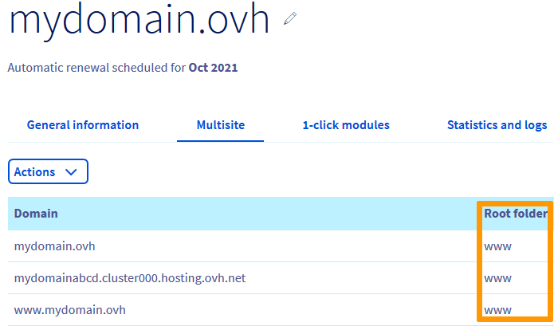

> [!primary]
> This translation was automatically generated by our partner SYSTRAN. In some cases, imprecise wordings may occur, for example button labeling or technical details. We recommend to refer to the English/French version of the guide page in case of any doubts.
> If you would like to help us improve this translation, please use the "Contribute" button on this page.
>

**Last updated 10/05/2022**

## Objective

If a `Multisite` configuration is not correctly set up, your website may display an **Index of** page.

{.thumbnail}

**Find out how to change the display of an Index of page.**

> [!warning]
>
> OVHcloud provides services which you are responsible for with regard to their configuration and management. You are therefore responsible for ensuring they function correctly.
>
> We have provided you with this guide in order to help you with common tasks. Nevertheless, we recommend contacting a specialist provider and/or the service’s software publisher if you encounter any difficulties. We will not be able to assist you ourselves. You can find more information in the [Go further](#gofurther) section of this guide.
>

## Requirements

- a [web hosting plan](https://www.ovhcloud.com/en-gb/web-hosting/)
- access to the [OVHcloud Control Panel](https://www.ovh.com/auth/?action=gotomanager&from=https://www.ovh.co.uk/&ovhSubsidiary=GB)

## Instructions

### Understanding the origin of the Index of page

Your domain name is connected via the `Multisite`{.action} section of your hosting plan to a directory (a `Root folder`) on your [FTP](https://docs.ovh.com/gb/en/hosting/log-in-to-storage-ftp-web-hosting/) server.

The **Index of** page indicates that the directory does not contain an **index.php** or **index.html** file. A file like this is your site's "*entry point*".

To display your website, from the `Multisite`{.action} section of your hosting plan, you will need to link your domain to the `Root folder` that contains this **index.php** or **index.html** file.

> [!primary]
>
> If you want to temporarily link your domain to a `Root folder` that does not contain an **index.php** or **index.html** file, you can prevent the list of folders from being displayed on your site by following this [guide](https://docs.ovh.com/gb/en/hosting/what_else_can_you_do_with_the_htaccess_file/#prevent-the-content-of-a-directory-from-being-listed). You can also protect access to your folders with a [password](https://docs.ovh.com/gb/en/hosting/how_to_password_protect_a_directory_on_your_website/).
>
> We recommend contacting a [specialist provider](https://partner.ovhcloud.com/en-gb/directory/) if you experience any difficulties setting up this configuration. Our support teams will not be able to assist you with any changes to your website’s internal programming.

### Resolve the most common case of an Index of page

You have imported the files from your **mydomain.ovh** website into the `www` folder on your web hosting plan via [FTP](https://docs.ovh.com/gb/en/hosting/log-in-to-storage-ftp-web-hosting/). Outside, your domain name is not linked to this folder in the `Root folder` column of your `Multisite`{.action}.

{.thumbnail}

Modify the `Root folder` by clicking on the `...`{.action} button to the right of the table, then `Modify domain`{.action}:

{.thumbnail}

In the window that opens:

* Select the `Also modify the www.mydomain.ovh sub-domain`{.action} (1) box.
* Specify the directory containing your site's **index.php** or **index.html** file as `Root folder` (2).
* Click on `Next` (3).

{.thumbnail}

> [!primary]
>
> There is no requirement to use the `www` directory as `Root folder`. You can install your website in another folder on your [FTP server](https://docs.ovh.com/gb/en/hosting/log-in-to-storage-ftp-web-hosting/).
>

In the next window, click on `Confirm`{.action}.

{.thumbnail}

In a few minutes (remember to refresh your browser), you will see the following result:

{.thumbnail}

Finally, check that your website appears correctly. Otherwise, reboot your device and clear your browser cache if necessary.

## Go further 

[Resolve the most common 1-click module errors](https://docs.ovh.com/gb/en/hosting/error-frequently-1-click-modules/)

[Resolve the "Website not installed" error](https://docs.ovh.com/gb/en/hosting/web_hosting_error_-_website_not_installed/)

[Hosting multiple websites on your Web Hosting plan](https://docs.ovh.com/gb/en/hosting/multisites-configuring-multiple-websites/)

If you would like assistance using and configuring your OVHcloud solutions, please refer to our [support offers](https://www.ovhcloud.com/en-gb/support-levels/).

Join our community of users on <https://community.ovh.com/en/>.