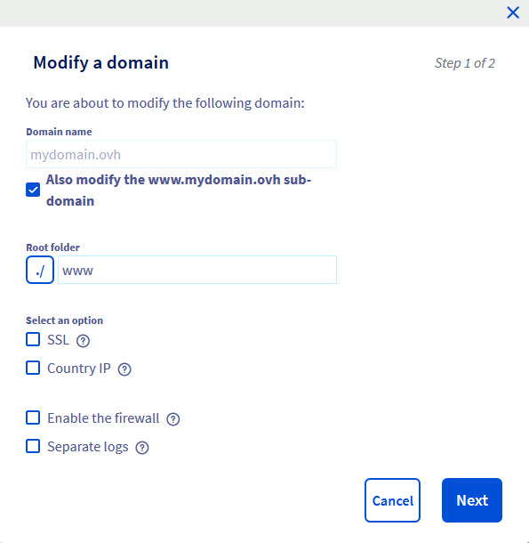

> [!primary]
> Esta traducción ha sido generada de forma automática por nuestro partner SYSTRAN. En algunos casos puede contener términos imprecisos, como en las etiquetas de los botones o los detalles técnicos. En caso de duda, le recomendamos que consulte la versión inglesa o francesa de la guía. Si quiere ayudarnos a mejorar esta traducción, por favor, utilice el botón «Contribuir» de esta página.
>

**Última actualización: 25/06/2021**
 
## Objetivo

Si una configuración `Multisitio` no está bien configurada, es posible que el sitio web muestre una página **« Index of »**.

{.thumbnail}

**Esta guía explica cómo corregir la visualización de una página « Index of ».**

> [!warning]
>
> La configuración, la gestión y la responsabilidad de los servicios que OVHcloud pone a su disposición recaen sobre usted. Por lo tanto, usted deberá asegurarse de que estos funcionen correctamente.
>
> Esta guía le ayudará a realizar las operaciones más habituales. No obstante, si tiene alguna duda le recomendamos que contacte con un proveedor de servicios especializado o con el editor del servicio. Nosotros no podremos asistirle al respecto. Para más información, consulte el apartado [Más información](#gofurther) de esta guía.
>

## Requisitos

- Tener un [plan de hosting](https://www.ovhcloud.com/es-es/web-hosting/).
- Haber iniciado sesión en el [área de cliente de OVHcloud](https://www.ovh.com/auth/?action=gotomanager&from=https://www.ovh.es/&ovhSubsidiary=es).

## Procedimiento

### Entender el origen de la página « Index of »

El dominio está conectado a través de la sección `Multisitio` del alojamiento a un directorio (un « `Carpeta raíz` ») del servidor [FTP](../conexion-espacio-almacenamiento-ftp-alojamiento-web/).

La página **« Index of »** indica que el directorio en cuestión no contiene ningún archivo **index.php** o **index.html**. Un archivo de este tipo constituye el « punto de entrada » del sitio web.

Para mostrar su sitio web, deberá asociar su dominio a la `Carpeta raíz` que contiene el archivo **index.php** o **index.html** desde la sección `Multisitio` del alojamiento.

> [!primary]
>
> Si desea asociar temporalmente su dominio a un `Carpeta raíz` que no contenga un archivo **index.php** o **index.html**, puede prohibir la visualización de la lista de carpetas de su sitio web siguiendo esta [guía](https://docs.ovh.com/gb/en/hosting/what_else_can_you_do_with_the_htaccess_file/#prevent-the-content-of-a-directory-from-being-listed). También puede proteger el acceso a sus carpetas con una [contraseña](https://docs.ovh.com/gb/en/hosting/how_to_password_protect_a_directory_on_your_website/).
>
> Si necesita ayuda, le recomendamos que contacte con un [proveedor especializado](https://partner.ovhcloud.com/es-es/directory/). Nuestro equipo de soporte no podrá ofrecerle soporte para modificar la programación interna de su sitio web.

### Solucionar el caso más común de una página « Index of »

Ha importado los archivos de su sitio **mydomain.ovh** a la carpeta `www` de su alojamiento por [FTP](../conexion-espacio-almacenamiento-ftp-alojamiento-web/). Su dominio no está asociado a esta carpeta en la columna `Carpeta raíz` de su `Multisitio`.

{.thumbnail}

Modifique la `Carpeta raíz` haciendo clic en el botón `...`{.action} a la derecha de la tabla y luego en `Modificar el dominio`{.action} :

{.thumbnail}

Marque la casilla `Editar también el subdominio www.mydomain.ovh` e indique el directorio que contiene el archivo **index.php** o **index.html** de su sitio web como `Carpeta raíz`.

> [!primary]
>
> Usar el directorio `www` como `raíz` no es obligatorio. Puede instalar su sitio web en otra carpeta de su [servidor FTP](../conexion-espacio-almacenamiento-ftp-alojamiento-web/).

Haga clic en `Siguiente` para continuar.

{.thumbnail}

A continuación, haga clic en `Aceptar`{.action}.

{.thumbnail}

Obtendrá el siguiente resultado:

{.thumbnail}

## Más información 

[Resolver los errores más frecuentes asociados a los módulos en 1 clic](../errores-frecuentes-modulos-en-1-clic/)

[Solucionar el error «Sitio no instalado»](../web_hosting_error_sitio_no_instalado/)

[Alojar varios sitios web en un mismo hosting](../configurar-un-multisitio-en-un-alojamiento-web/)

Si quiere disfrutar de ayuda para utilizar y configurar sus soluciones de OVHcloud, consulte nuestros distintos [servicios de soporte](https://www.ovhcloud.com/es-es/support-levels/).

Interactúe con nuestra comunidad de usuarios en <https://community.ovh.com/en/>.
