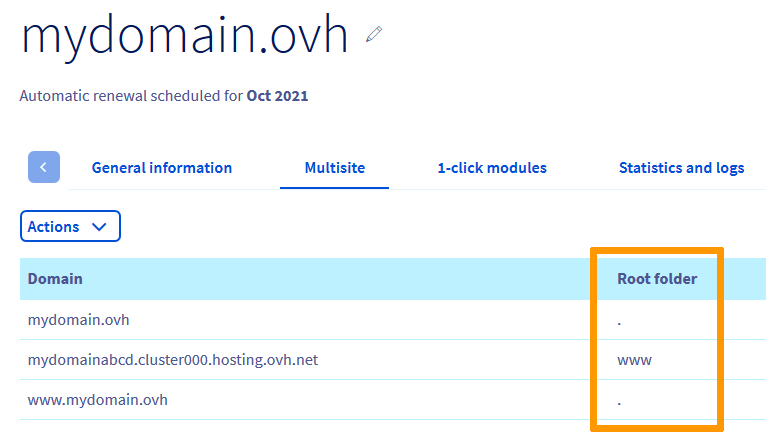

**Dernière mise à jour le 25/06/2021**

## Objectif

Lorsqu’une configuration `Multisite` n’est pas correctement paramétrée, votre site est susceptible d’afficher une page **« Index of »**.

{.thumbnail}

**Découvrez comment corriger l’affichage d’une page « Index of ».**

> [!warning]
>
> OVHcloud met à votre disposition des services dont la configuration, la gestion et la responsabilité vous incombent. Il vous revient de ce fait d'en assurer le bon fonctionnement.
>
> Nous mettons à votre disposition ce guide afin de vous accompagner au mieux sur des tâches courantes. Néanmoins, nous vous recommandons de faire appel à un prestataire spécialisé et/ou de contacter l'éditeur du service si vous éprouvez des difficultés. En effet, nous ne serons pas en mesure de vous fournir une assistance. Plus d'informations dans la section [Aller plus loin](#aller-plus-loin) de ce guide.
>

## Prérequis

- Disposer d'une [offre d'hébergement web](https://www.ovhcloud.com/fr/web-hosting/)
- Être connecté à votre [espace client OVHcloud](https://www.ovh.com/auth/?action=gotomanager&from=https://www.ovh.com/fr/&ovhSubsidiary=fr)

## En pratique

### Comprendre l'origine de la page « Index of »

Votre nom de domaine est connecté via la partie `Multisite` de votre hébergement à un répertoire (un « `Dossier racine` ») sur votre serveur [FTP](../connexion-espace-stockage-ftp-hebergement-web/).

La page **Index of** indique que le répertoire concerné ne contient pas de fichier **index.php** ou **index.html**. Un fichier de ce type constitue le « point d'entrée » de votre site.

Pour afficher votre site web, vous devrez donc, depuis la partie `Multisite` de votre hébergement, relier votre domaine au `Dossier racine` qui contient ce fichier **index.php** ou **index.html**.

> [!primary]
>
> Si vous souhaitez relier temporairement votre domaine à un `Dossier racine` ne contenant pas de fichier **index.php** ou **index.html**, il vous est possible d'interdire l'affichage de la liste des dossiers de votre site en suivant ce [guide](../mutualise-htaccess-les-autres-operations-realisables-avec-des-fichiers-htaccess/#empecher-le-listage-du-contenu-dun-repertoire). Vous pouvez également protéger l'accès à vos dossiers par un [mot de passe](../mutualise-htaccess-comment-proteger-lacces-a-un-repertoire-par-une-authentification/).
>
> Nous vous recommandons de faire appel à un [prestataire spécialisé](https://partner.ovhcloud.com/fr/directory/), si vous éprouvez des difficultés à mettre en place cette configuration. En effet, nos équipes support ne seront pas en mesure de vous fournir une assistance sur toute modification de la programmation interne de votre site.

### Résoudre le cas le plus courant d’une page « Index of »

Vous avez importé les fichiers de votre site **mydomain.ovh** dans le dossier `www` de votre hébergement par [FTP](../connexion-espace-stockage-ftp-hebergement-web/). Hors, votre nom de domaine n'est pas relié à ce dossier dans la colonne `Dossier racine` de votre `Multisite`.

{.thumbnail}

Modifiez le `Dossier racine` en cliquant sur le bouton `...`{.action} à droite du tableau, puis sur `Modifier le domaine`{.action} :

{.thumbnail}

Cochez la case `Modifier également le sous domaine www.mydomain.ovh` et indiquez le répertoire contenant le fichier **index.php** ou **index.html** de votre site comme `Dossier racine`.

> [!primary]
>
> Utiliser le répertoire `www` comme `Dossier racine` n'est en aucun cas obligatoire. Vous pouvez installer votre site dans un autre dossier de votre [serveur FTP](../connexion-espace-stockage-ftp-hebergement-web/).

Cliquez ensuite sur `Suivant`.

{.thumbnail}

Puis cliquez sur `Valider`{.action}.

{.thumbnail}

Vous obtiendrez le résultat suivant :

{.thumbnail}

## Aller plus loin 

[Résoudre les erreurs les plus fréquentes liées aux modules en 1 clic](../erreurs-frequentes-modules-en-1-clic/)

[Résoudre l’erreur « Site non installé »](../erreur-site-non-installe/)

[Partager son hébergement entre plusieurs sites](../multisites-configurer-un-multisite-sur-mon-hebergement-web/)

Si vous souhaitez bénéficier d'une assistance à l'usage et à la configuration de vos solutions OVHcloud, nous vous invitons à consulter nos différentes [offres de support](https://www.ovhcloud.com/fr/support-levels/).

Échangez avec notre communauté d'utilisateurs sur <https://community.ovh.com/>.
