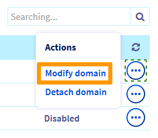

> [!primary]
> Esta tradução foi automaticamente gerada pelo nosso parceiro SYSTRAN. Em certos casos, poderão ocorrer formulações imprecisas, como por exemplo nomes de botões ou detalhes técnicos. Recomendamos que consulte a versão inglesa ou francesa do manual, caso tenha alguma dúvida. Se nos quiser ajudar a melhorar esta tradução, clique em "Contribuir" nesta página.
>

**Última atualização: 25/06/2021**
 
## Objetivo

Se uma configuração `Multisite` não estiver corretamente configurada, é possível que o seu site apresente uma página **« Index of »**.

{.thumbnail}

**Saiba como corrigir a apresentação de uma página « Index of ».**

> [!warning]
>
> A responsabilidade sobre a configuração e a gestão dos serviços que a OVHcloud disponibiliza recai sobre o utilizador. Assim, deverá certificar-se de que estes funcionam corretamente.
>
> Este manual fornece as instruções necessárias para realizar as operações mais habituais. No entanto, se encontrar dificuldades, recomendamos que recorra a um prestador de serviços especializado e/ou que contacte o editor do serviço. Não poderemos proporcionar-lhe assistência técnica. Para mais informações, aceda à secção [Quer saber mais?](#gofurther).
>

## Requisitos

- Ter um [serviço de alojamento web](https://www.ovh.pt/alojamento-partilhado/)
- Estar ligado à [Área de Cliente OVHcloud](https://www.ovh.com/auth/?action=gotomanager&from=https://www.ovh.pt/&ovhSubsidiary=pt).

## Instruções

### Compreender a origem da página « Index of »

O seu nome de domínio está ligado através da parte `Multisite` do seu alojamento a um diretório (um « `Pasta raiz`") no seu servidor [FTP](../aceder-espaco-de-armazenamento-ftp-alojamento-web/).

A página **Index of** indica que o diretório em causa não contém nenhum ficheiro **index.php** ou **index.html**. Um ficheiro deste tipo constitui o « ponto de entrada » do seu site.

Para apresentar o seu website, deverá, a partir da parte `Multisite` do seu alojamento, associar o seu domínio ao `Pasta raiz` que contém este ficheiro **index.php** ou **index.html**.

> [!primary]
>
> Se pretender associar temporariamente o seu domínio a uma `Pasta raiz` que não contém um ficheiro **index.php** ou **index.html**, pode proibir a apresentação da lista de pastas do seu site seguindo este [guia](../what_else_can_you_do_with_the_htaccess_file/#prevent-the-content-of-a-directory-from-being-listed). Pode também proteger o acesso às suas pastas com uma [palavra-passe](../how_to_password_protect_a_directory_on_your_website/).
>
> Se precisar de ajuda, recomendamos que recorra a um [prestador de serviços especializado](https://partner.ovhcloud.com/pt/directory/). As nossas equipas de suporte não poderão fornecer-lhe assistência relativamente a qualquer alteração da programação interna do seu site.

### Resolver o caso mais comum de uma página « Index of »

Importou os ficheiros do seu site **mydomain.ovh** para a pasta `www` do seu alojamento por [FTP](../aceder-espaco-de-armazenamento-ftp-alojamento-web/). Se o domínio não estiver associado a esta pasta, consulte a coluna `Pasta raiz` do `Multisite`.

{.thumbnail}

Altere a Pasta `raiz` clicando no botão `...`{.action} à direita da tabela e, a seguir, em `Modificar o domínio`{.action}:

{.thumbnail}

Selecione a caixa `Modificar também o subdomínio www.mydomain.ovh` e indique o diretório que contém o ficheiro **index.php** ou **index.html** do seu site como `Pasta raiz`.

> [!primary]
>
> A utilização do diretório `www` como `Pasta raiz` não é, em caso algum, obrigatória. Pode instalar o seu site noutra pasta do seu [servidor FTP](../aceder-espaco-de-armazenamento-ftp-alojamento-web/).

E clique em `Seguinte`.

{.thumbnail}

De seguida, clique em `Validar`{.action}.

{.thumbnail}

Irá obter o seguinte resultado:

{.thumbnail}

## Quer saber mais? 

[Resolver os erros mais frequentes associados aos módulos 1 clique](../erros-frequentes-modulos-em-1-clique/)

[Resolver o erro “Site não instalado”](../alojamento_web_erro_de_site_nao_instalado/)

[Partilhar o alojamento entre vários sites](../multisites-configurar-um-multisite-no-meu-alojamento-web/)

Se pretender usufruir de uma assistência na utilização e na configuração das suas soluções OVHcloud, convidamo-lo a consultar as nossas diferentes [ofertas de suporte](https://www.ovhcloud.com/pt/support-levels/).

Fale com a nossa comunidade de utilizadores: <https://community.ovh.com/en/>.
