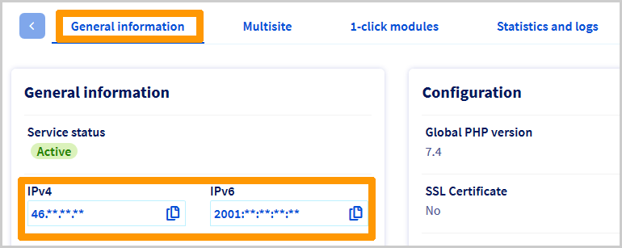

> [!primary]
> Diese Übersetzung wurde durch unseren Partner SYSTRAN automatisch erstellt. In manchen Fällen können ungenaue Formulierungen verwendet worden sein, z.B. bei der Beschriftung von Schaltflächen oder technischen Details. Bitte ziehen Sie beim geringsten Zweifel die englische oder französische Fassung der Anleitung zu Rate. Möchten Sie mithelfen, diese Übersetzung zu verbessern? Dann nutzen Sie dazu bitte den Button “Mitmachen“ auf dieser Seite.
>

**Stand 08.07.2021**
 
## Ziel 

Es können mehrere Fehlermeldungen auftreten, wenn Ihre Website nicht erreichbar ist. Die folgenden Beispiele zeigen an, dass Ihr Webhosting kein [SSL-Zertifikat](../ssl-zertifikate-auf-webhostings-verwalten/) enthält (wenn Ihre Website keine der in dieser Anleitung beschriebenen Anomalien zeigt, lesen Sie den Abschnitt [“Weiterführende Informationen“](#gofurther) in dieser Anleitung): 

|Browser|Betreffende Fehlermeldung|
|-|---|
|Über Chrome: "Dies ist keine sichere Verbindung"|{.thumbnail}|
|Über Firefox: "Warnung: Mögliches Sicherheitsrisiko erkannt"|{.thumbnail}|
|Über Edge: "Ihre Verbindung ist nicht privat."|{.thumbnail}|
|Über Safari: "Diese Verbindung ist nicht privat"|{.thumbnail}|

**Hier erfahren Sie, wie Sie Fehler vom Typ “Dies ist keine sichere Verbindung“ beheben.**

> [!warning]
>
> OVHcloud stellt Ihnen Dienstleistungen zur Verfügung, für deren Konfiguration und Verwaltung Sie die alleinige Verantwortung tragen. Es liegt somit bei Ihnen, sicherzustellen, dass diese ordnungsgemäß funktionieren.
>
> Wir stellen Ihnen diese Anleitung zur Verfügung, um Ihnen bei der Bewältigung alltäglicher Verwaltungsaufgaben zu helfen. Dennoch empfehlen wir Ihnen, falls Sie Hilfe brauchen, einen spezialisierten Dienstleister und/oder den Herausgeber des Dienstes zu kontaktieren. Für externe Dienstleistungen bietet OVHcloud leider keine Unterstützung. Weitere Informationen finden Sie im Abschnitt [“Weiterführende Informationen“](#gofurther) dieser Anleitung.
>

## Voraussetzungen

- Sie haben die Verwaltung der Server und der [DNS-Zone](../../domains/webhosting_bearbeiten_der_dns_zone/#dns-konzept-verstehen) Ihrer Domain
- Sie sind in Ihrem [OVHcloud Kundencenter](https://www.ovh.com/auth/?action=gotomanager&from=https://www.ovh.de/&ovhSubsidiary=de) angemeldet.

## In der praktischen Anwendung

Um diese Anomalie zu beheben müssen Sie:

1. das Hosting, mit dem Ihre Domain verbunden ist, bestimmen, um auf dem richtigen Server zu intervenieren;
2. auf dem betreffenden Hosting ein [SSL-Zertifikat](../ssl-zertifikate-auf-webhostings-verwalten/) für Ihre Domain erstellen, aktivieren oder verlängern.

### Schritt 1: überprüfen Sie das Hosting Ihrer Domain

#### Die IP-Adresse des Hostings überprüfen

Die [oben](#objective) genannten Fehlermeldungen bedeuten nicht unbedingt, dass Ihre Website auf einem unserer [Cloud Web Angebote](https://www.ovh.de/hosting/) gehostet wird. Überprüfen Sie daher die IP-Adresse des Servers, an den Ihre [Domainname](https://www.ovh.de/domains/) angehängt ist.

Um die IP-Adresse Ihres [OVHcloud Hostings](https://www.ovh.de/hosting/) wiederzufinden, klicken Sie oben in Ihrem [OVHcloud Kundencenter](https://www.ovh.com/auth/?action=gotomanager&from=https://www.ovh.de/&ovhSubsidiary=de) auf `Web Cloud`{.action} und dann links im Menü auf `Hosting-Pakete`{.action} und wählen Sie das betreffende Hosting aus.

Im Tab `Allgemeine Informationen`{.action} Informationen beachten Sie die IPv4 und/oder IPv6-Adresse Ihres Hostings.

{.thumbnail}

#### IP-Adresse in der DNS Zone überprüfen

Überprüfen Sie nun, ob die in der [DNS Zone](../../domains/webhosting_bearbeiten_der_dns_zone/#dns-konzept-verstehen) angegebene IP-Adresse der Adresse Ihres [Web Cloud hostings](https://www.ovh.de/hosting/) entspricht.

Klicken Sie oben links in Ihrem [OVHcloud Kundencenter](https://www.ovh.com/auth/?action=gotomanager&from=https://www.ovh.de/&ovhSubsidiary=de) auf `Domainnamen`{.action} und wählen Sie die Domain Ihrer Website aus.

Wählen Sie den Tab `DNS-Zone`{.action} aus und notieren Sie das Ziel des Eintrags vom Typ `A` für Ihre Domainname:

{.thumbnail}

#### Die notwendigen Aktionen durchführen

|Szenario|Was zu tun|
|---|---|
|Die in der [DNS-Zone](../../domains/webhosting_bearbeiten_der_dns_zone/) gelistete IP-Adresse entspricht der IP-Adresse Ihres Webhosting Plans.|Geht zu der [Schritt 2](#step2)|
|Die in der Zone angegebene IP-Adresse betrifft keines der Webhosting-Pläne Ihres [OVHcloud Kundencenter](https://www.ovh.com/auth/?action=gotomanager&from=https://www.ovh.de/&ovhSubsidiary=de), sondern erscheint in der [Liste unserer Web Server](../verzeichnis-der-ip-adressen-web-hosting-cluster/).|Überprüfen Sie, dass Sie mit dieser IP Adresse keine Hosting-Adresse in einem Ihrer anderen [OVHcloud Kundenaccounts](https://www.ovh.com/auth/?action=gotomanager&from=https://www.ovh.de/&ovhSubsidiary=de), wenn Sie mehrere haben. Für mehr Informationen kontaktieren Sie Ihren Webmaster oder [OVHcloud Partner](https://partner.ovhcloud.com/de/).|
|Die in die Zone eingegebene IP-Adresse ist nicht die Ihrer Hosting-Plattform und erscheint auch nicht in der [Liste unserer Cloud Web Server](../verzeichnis-der-ip-adressen-web-hosting-cluster/).|Kontaktieren Sie Ihren Webmaster oder [OVHcloud Partner](https://partner.ovhcloud.com/de/) für mehr Informationen.|
|Im Tab `DNS-Zone`{.action} gibt ein Warnhinweis an, dass Ihre Domain andere Server [DNS](../../domains/webhosting_bearbeiten_der_dns_zone/#dns-konzept-verstehen) verwendet. Diese werden in der Form “ns **?** .ovh.net“ oder “dns **?** .ovh.net“ angezeigt (ersetzen Sie "**?**" durch die entsprechende DNS-Servernummer):  {.thumbnail}|Sie müssen daher die DNS-Server Ihrer Domain ändern Damit sie das Gebiet identifizieren. Befolgen Sie hierzu die Anweisungen von [dieser Anleitung](../../domains//webhosting_allgemeine_informationen_zu_den_dns_servern/#dns-server-andern).|
|Im Tab `DNS-Zone`{.action} gibt eine Nachricht an, dass Ihre Domain weitere [DNS](../../domains/webhosting_bearbeiten_der_dns_zone/#dns-konzept-verstehen) Server verwendet, die nicht in der Form “ns **?** .ovh.net“ oder “dns **?** .ovh.net“ erscheinen :  !warning_external_dns_srv](images/warning_external_dns_srv.png){.thumbnail}|Kontaktieren Sie Ihren Webmaster oder Ihre [OVHcloud Partner](https://partner.ovhcloud.com/de/) für mehr Informationen.|
|Ihre Domain erscheint nicht im Bereich `Domainname`{.action} des [OVHcloud Kundencenter](https://www.ovh.com/auth/?action=gotomanager&from=https://www.ovh.de/&ovhSubsidiary=de).  Oder der Tab `DNS-Zone`{.action} Ihrer Domainname erscheint wie folgt:  >{.thumbnail}|Dies bedeutet, dass dieser Domainname wird nicht von Ihrem [OVHcloud Kundencenter](https://www.ovh.com/auth/?action=gotomanager&from=https://www.ovh.de/&ovhSubsidiary=de) verwaltet.  Überprüfen Sie, ob er nicht von einem Ihrer anderen [OVHcloud Kunden-Accounts](https://www.ovh.com/auth/?action=gotomanager&from=https://www.ovh.de/&ovhSubsidiary=de) verwaltet wird, wenn Sie mehrere davon erstellt haben.  Sie können auch den Anmeldeserver überprüfen Domainname und die tatsächlichen DNS Server mit unserem [WHOIS Tool](https://www.ovh.com/fr/support/outils/check_whois.pl).<)  Falls nötig kontaktieren Sie Ihren Webmaster oder Ihre [OVHcloud Partner](https://partner.ovhcloud.com/de/) dazu.|

### Schritt 2: das SSL Zertifikat Ihres Hostings überprüfen 

Überprüfen Sie im Tab `Allgemeine Informationen`{.action} Ihres OVHcloud Hostings den Abschnitt `SSL-Zertifikat`:

{.thumbnail}

#### Szenario 1: ihr Hosting enthält kein SSL Zertifikat

Aktivieren Sie ein [SSL-Zertifikat](https://www.ovh.de/ssl/) auf Ihrem Hosting gemäß den Anweisungen in dieser [Anleitung](../ssl-zertifikate-auf-webhostings-verwalten/).

#### Szenario 2: das SSL Zertifikat Ihres Hostings funktioniert nicht

Wenn Sie ein **"Let's Encrypt" SSL-Zertifikat** erstellt haben, aktivieren Sie die SSL-Option in der `Multisite`{.action} Ihres Hostings gemäß den Anweisungen in dieser [Anleitung](../ssl-zertifikate-auf-webhostings-verwalten/#ssl-zertifikat-fur-eine-multisite-aktivieren).

Wenn Sie über ein **importiertes SSL-Zertifikat** verfügen und dieses nicht funktioniert, kontaktieren Sie bitte den Anbieter.

Wenn Sie eines der **kostenpflichtigen SSL-Zertifikat** unseres Partners [SECTIGO](https://sectigo.com/){.external} bestellt haben.  Kontaktieren Sie bitte den [SECTIGO Support-Team](https://sectigo.com/support){.external}.

>[!primary]
>
> Um alle von unseren Diensten versendeten E-Mails einzusehen, klicken Sie oben rechts in Ihrem [OVHcloud Kundencenter](https://www.ovh.com/auth/?action=gotomanager&from=https://www.ovh.de/&ovhSubsidiary=de) und dann auf `E-Mails vom Support`{.action}):
>
>{.thumbnail}
>

## Weiterführende Informationen 

[SSL-Zertifikat auf einem Webhosting verwalten](../ssl-zertifikate-auf-webhostings-verwalten/)

[Website mit SSL-Zertifikat auf HTTPS umstellen](../website-umstellen-https-ssl/)

[Fehler “Seite nicht installiert” beheben](../webhosting_fehler_-_webseite_ist_nicht_installiert/)

[Beheben des Fehlers “500 Internal Server Error”](../webhosting_bei_einem_fehler_500_internal_server_error/)

[Die häufigsten Fehler bei 1-Klick-Modulen beheben](../fehler-bei-1-klick-modulen/)

Für spezialisierte Dienstleistungen (Referenzierung, Entwicklung etc.) kontaktieren Sie die [OVHcloud Partner](https://partner.ovhcloud.com/de/).

Wenn Sie Hilfe bei der Nutzung und Konfiguration Ihrer OVHcloud Lösungen benötigen, können Sie unsere [Support-Angebote](https://www.ovhcloud.com/de/support-levels/) einsehen.

Für den Austausch mit unserer User Community gehen Sie auf <https://community.ovh.com/en/>.