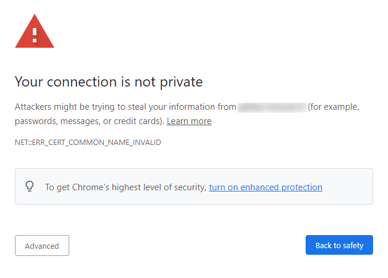

**Stand 06.07.2021**
 
## Ziel 

Es können mehrere Fehlermeldungen auftreten, wenn Ihre Website nicht erreichbar ist. Die folgenden Beispiele zeigen an, dass Ihr Webhosting kein [SSL](../les-certificats-ssl-sur-les-hebergements-web/)-Zertifikat enthält (wenn Ihre Website keine der in dieser Anleitung beschriebenen Anomalien zeigt, lesen Sie den Abschnitt "[Weiterführende](#aller-plus-loin)"in dieser Anleitung): 

€ Browser
\|-|---|
|über Chrome: "Ihre Verbindung ist nicht privat"|{.thumbnail}\|
|zu Firefox: "Achtung: wahrscheinliches Sicherheitsrisiko" {.thumbnail}
|über Edge: "Ihre Verbindung ist nicht privat"|{.thumbnail}\|
|über Safari: "Diese Verbindung ist nicht privat"|{.thumbnail}\|

**Hier erfahren Sie, wie Sie Fehler vom Typ "Ihre Verbindung ist nicht privat" beheben.**

> [!warning]
>
> OVHcloud stellt Ihnen Dienstleistungen zur Verfügung, für deren Konfiguration und Verwaltung Sie die alleinige Verantwortung tragen. Es liegt somit bei Ihnen, sicherzustellen, dass diese ordnungsgemäß funktionieren.
>
> Wir stellen Ihnen diese Anleitung zur Verfügung, um Ihnen bei der Bewältigung alltäglicher Verwaltungsaufgaben zu helfen. Dennoch empfehlen wir Ihnen, falls Sie Hilfe brauchen, einen spezialisierten Dienstleister und/oder den Herausgeber des Dienstes zu kontaktieren. Für externe Dienstleistungen bietet OVHcloud leider keine Unterstützung. Weitere Informationen finden Sie im [Abschnitt "Weiterführende](#aller-plus-loin) Informationen" dieser Anleitung.
>

## Voraussetzungen

- Sie haben die Verwaltung der Server und der [DNS](../../domains/editer-ma-zone-dns/#comprendre-la-notion-de-dns)-Zone Ihrer Domain
- Sie sind in Ihrem [OVHcloud Kundencenter](https://www.ovh.com/auth/?action=gotomanager&from=https://www.ovh.com/fr/&ovhSubsidiary=fr) angemeldet.

## In der praktischen Anwendung

Um diese Anomalie zu beheben müssen Sie:

1. das Hosting, mit dem Ihre Domain verbunden ist, bestimmen, um auf dem richtigen Server zu intervenieren;
2. auf dem betreffenden Hosting ein [SSL](../les-certificats-ssl-sur-les-hebergements-web/)-Zertifikat für Ihre Domain erstellen, aktivieren oder verlängern.

### Schritt 1: Überprüfen Sie das Hosting Ihrer Domain

#### Die IP-Adresse des Hostings überprüfen

Die oben genannten Fehlermeldungen [bedeuten](#objectif) nicht unbedingt, dass Ihre Website auf einem unserer Cloud Web [Angebote gehostet wird](https://www.ovh.com/fr/hebergement-web/). Überprüfen Sie daher die IP-Adresse des Servers, an den Ihre [Domain angehängt ist](https://www.ovh.com/world/domains/).

Um die IP-Adresse Ihres [OVHcloud](https://www.ovh.com/fr/hebergement-web/) Hostings wiederzufinden, klicken Sie oben [in Ihrem OVHcloud Kundencenter](https://www.ovh.com/auth/?action=gotomanager&from=https://www.ovh.com/fr/&ovhSubsidiary=fr) auf `Cloud`{.action} und dann links im Menü auf Hosting-Pakete` `{.action} und wählen Sie das betreffende Hosting aus.

Im Tab `Allgemeine`{.action} Informationen beachten Sie die IPv4- und/oder IPv6-Adresse Ihres Hostings.

{.thumbnail}

#### IP-Adresse in der DNS Zone überprüfen

Überprüfen Sie nun, ob die in der [DNS](../../domains/editer-ma-zone-dns/#comprendre-la-notion-de-dns) Zone angegebene IP-Adresse der Adresse Ihres [Cloud Webhostings entspricht](https://www.ovh.com/fr/hebergement-web/).

Klicken Sie `oben`{.action} links in Ihrem OVHcloud [Kundencenter auf Domainnamen](https://www.ovh.com/auth/?action=gotomanager&from=https://www.ovh.com/fr/&ovhSubsidiary=fr) und wählen Sie die Domain Ihrer Website aus.

Wählen Sie den Tab `DNS`{.action} Zone aus und notieren Sie das Ziel des Eintrags vom Typ `A` für Ihre Domain:

{.thumbnail}

#### Die notwendigen Aktionen durchführen

|Szenario|Was zu tun|
|—|—
|Die in der [DNS Zone] (domains/web_host_how_to_edit_my_dns_zone/) gelistete IP-Adresse entspricht der IP-Adresse Ihres Webhosting Plans.|Auf die [Step 2](#step2)|
|Die in der Zone angegebene IP-Adresse betrifft keines der Webhosting-Pläne Ihres [OVHcloud Account](https://www.ovh.com/auth/?action=gotomanager&from=https://www.ovh.co.uk/&ovhSubsidiary=GB), sondern erscheint in der [Liste unserer Web Server](.../IP-Adressliste der Webhosting-Cluster/).|Überprüfen Sie, dass Sie mit dieser IP Adresse keine Hosting-Adresse in einem Ihrer anderen [OVHcloud Kundenaccounts](https://www.ovh.com/auth/?action=gotomanager&from=https://www.ovh.co.uk/&ovhSubsidiary=GB), wenn Sie mehrere haben. Für mehr Informationen kontaktieren Sie Ihren Webmaster oder [OVHcloud Partner](https://partner.ovhcloud.com/en-gb/).|
|Die in die Zone eingegebene IP-Adresse ist nicht die Ihrer Hosting-Plattform und erscheint auch nicht in der [Liste unserer Cloud Web Server](.../IP-Adressliste der Webhosting-Cluster/).|Kontaktieren Sie Ihren Webmaster oder [OVHcloud Partner](https://partner.ovhcloud.com/en-gb/) für mehr Informationen.|
|Im Tab DNS Zone {.action} gibt ein Warnhinweis an, dass Ihre Domain andere Server [DNS](../../domains/edit-dns-zone/#Understanding-the-concept-of-dns) verwendet. Diese werden in der Form "ns ***?**.ovh.net"oder "dns **?**.ovh.net" angezeigt (ersetzen Sie "**?**" durch die entsprechende DNS-Servernummer):  {.thumbnail}|Sie müssen daher die DNS-Server Ihrer Domain ändern Damit sie das Gebiet identifizieren. Befolgen Sie hierzu die Anweisungen von [dieser Anleitung](../../domains/web_host_general_information_about_dns_servers/#access-the-ovhcloud-dns-server-management)|
|Im Tab DNS Zone {.action} gibt eine Nachricht an, dass Ihre Domain weitere [DNS](../../domains/edit-dns-zone/#Understanding-the-concept-of-dns) Server verwendet, die nicht in der Form "ns***?**.ovh.net"oder "dns******.ovh.net" erscheinen :  ! warning_external_dns_srv](images/warning_external_dns_srv.png){.thumbnail}|Kontaktieren Sie Ihren Webmaster oder Ihre [OVHcloud Partner](https://partner.ovhcloud.com/en-gb/) für mehr Informationen.|
|Ihre Domain erscheint nicht im Bereich {.action} Domains des Konfigurationspanels [OVHcloud](https://www.ovh.com/auth/?action=gotomanager&from=https://www.ovh.co.uk/&ovhSubsidiary=GB).  Oder der Tab DNS Zone {.action} Ihrer Domain erscheint wie folgt:  >{.thumbnail}|Dies bedeutet, dass Der Name wird nicht von Ihrem [OVHcloud Konfigurations-Panel](https://www.ovh.com/auth/?action=gotomanager&from=https://www.ovh.co.uk/&ovhSubsidiary=GB) verwaltet.  Überprüfen Sie, ob er nicht von einem Ihrer anderen [OVHcloud Kunden-Accounts](https://www.ovh.com/auth/?action=gotomanager&from=https://www.ovh.co.uk/&ovhSubsidiary=GB) verwaltet wird, wenn Sie mehrere davon erstellt haben.   >> Sie können auch den Anmeldeserver überprüfen Domainname und die tatsächlichen DNS Server mit unserem [WHOIS Tool](https://www.ovh.com/fr/support/outils/check_whois.plhttps://partner.ovhcloud.com/en-gb/).<)  Falls nötig kontaktieren Sie Ihren Webmaster oder Ihre [OVHcloud Partner]() dazu.|

### Schritt 2: Das SSL Zertifikat Ihres Hostings überprüfen 

Überprüfen Sie im Tab `Allgemeine`{.action} Informationen Ihres OVHcloud Hostings den Abschnitt `SSL Zertifikat`:

{.thumbnail}

#### Szenario 1: Ihr Hosting enthält kein SSL Zertifikat

Aktivieren Sie [ein SSL](https://www.ovh.com/fr/ssl/)-Zertifikat auf Ihrem Hosting gemäß den Anweisungen in dieser [Anleitung](../les-certificats-ssl-sur-les-hebergements-web/).

#### Szenario 2: Das SSL Zertifikat Ihres Hostings funktioniert nicht

Wenn Sie ein **"Let's Encrypt"SSL-Zertifikat erstellt haben**, aktivieren Sie die SSL-Option in der `Multisite`{.action} Ihres Hostings gemäß den Anweisungen in dieser [Anleitung](../les-certificats-ssl-sur-les-hebergements-web/#activer-un-certificat-ssl-sur-un-multisite).

Wenn Sie über ein **importiertes SSL**-Zertifikat verfügen und dieses nicht funktioniert, kontaktieren Sie bitte den Anbieter.

Wenn Sie eines der kostenpflichtigen **SSL Zertifikate unseres Partners bestellt** haben >Kontaktieren Sie bitte den [SECTIGO](https://sectigo.com/support){.external} Support.

> [!primary]
>
> Um alle von unseren Diensten versendeten E-Mails einzusehen, klicken Sie oben rechts [in Ihrem OVHcloud Kundencenter](https://www.ovh.com/auth/?action=gotomanager&from=https://www.ovh.com/fr/&ovhSubsidiary=fr) und dann `auf E-Mails`{.action}):
>
>{.thumbnail}
>

## Mehr 

[SSL-Zertifikat auf einem Webhosting verwalten](../les-certificats-ssl-sur-les-hebergements-web/)

[Website mit SSL-Zertifikat auf HTTPS umstellen](../passer-site-internet-https-ssl/)

[Fehler "Seite nicht installiert"beheben](../erreur-site-non-installe/)

[Diagnose und Korrektur bei einer weißen Seite](../comment-diagnostiquer-page-blanche/)

[Was tun bei einem 500 Internal Server Error Fehler?](../erreur-500-internal-server-error/)

[Die häufigsten Fehler bei 1-Klick-Modulen beheben](../erreurs-frequentes-modules-en-1-clic/)
 
Für spezialisierte Dienstleistungen (Referenzierung, Entwicklung etc.) kontaktieren Sie die [OVHcloud Partner](https://partner.ovhcloud.com/fr/).

Wenn Sie Hilfe bei der Nutzung und Konfiguration Ihrer OVHcloud Lösungen benötigen, können Sie unsere Support-Angebote [einsehen](https://www.ovhcloud.com/fr/support-levels/).

Für den Austausch mit unserer User Community gehen Sie auf <https://community.ovh.com>.