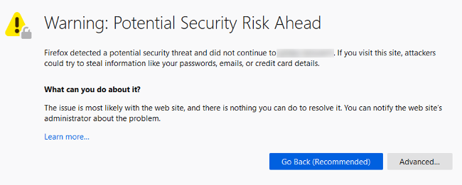

**Dernière mise à jour le 30/06/2021**
 
## Objectif 

Plusieurs messages d'erreurs peuvent apparaître en cas d'inaccessibilité de votre site. Les exemples ci-dessous indiquent que votre hébergement web ne contient pas de certificat SSL (si votre site n'affiche pas l'une des anomalies décrites dans ce guide, consultez la section [Aller plus loin](#aller-plus-loin)) : 

|Navigateur|Erreur concernée|
|-|---|
|Sur Chrome : « Votre connexion n'est pas privée »|{.thumbnail}|
|Sur Firefox : « Attention : risque probable de sécurité »|{.thumbnail}|
|Sur Edge : « Votre connexion n’est pas privée »|{.thumbnail}|
|Sur Safari : « Cette connexion n'est pas privée »|{.thumbnail}|

**Découvez comment résoudre les erreurs du type « Votre connexion n'est pas privée »**

> [!warning]
>
> OVHcloud met à votre disposition des services dont la configuration, la gestion et la responsabilité vous incombent. Il vous revient de ce fait d'en assurer le bon fonctionnement.
>
> Nous mettons à votre disposition ce guide afin de vous accompagner au mieux sur des tâches courantes. Néanmoins, nous vous recommandons de faire appel à un prestataire spécialisé et/ou de contacter l'éditeur du service si vous éprouvez des difficultés. En effet, nous ne serons pas en mesure de vous fournir une assistance. Plus d'informations dans la section [Aller plus loin](#aller-plus-loin) de ce guide.
>

## Prérequis

- Avoir la gestion de ses serveurs et de sa zone [DNS](../../domains/editer-ma-zone-dns/#comprendre-la-notion-de-dns)
- Disposer d'une [offre d'hébergement web OVHcloud](https://www.ovh.com/fr/hebergement-web/)
- Être connecté à votre [espace client OVHcloud](https://www.ovh.com/auth/?action=gotomanager&from=https://www.ovh.com/fr/&ovhSubsidiary=fr)
 
## En pratique

Afin de résoudre cette anomalie, vous devrez : 

1. Déterminer l'hébergement auquel est relié votre domaine, afin d'être certain d'intervenir sur le bon serveur.
2. Créer, activer ou renouveler un certificat SSL sur ce serveur.

### Étape 1 : Vérifiez l'hébergement auquel est relié votre nom de domaine

#### Vérifiez l'adresse IP de la zone DNS

Les messages d'erreur indiqués dans la partie [Objectif](#objectif) ne sont pas caractéristiques d'un serveur d'hébergement OVHcloud. Vous devez donc vérifier, dans un premier temps, le serveur auquel est relié votre domaine.

Pour retrouver l'adresse IP de l'hébergement auquel votre nom de domaine est lié, cliquez en haut à gauche de votre [espace client OVHcloud](https://www.ovh.com/auth/?action=gotomanager&from=https://www.ovh.com/fr/&ovhSubsidiary=fr) sur `Noms de domaine`{.action}, puis sur le domaine de votre site : 

{.thumbnail}

Cliquez ensuite sur l'onglet `Serveurs DNS`{.action} et notez les serveurs indiqués :

{.thumbnail}

Puis sur l'onglet `Zone DNS`{.action} et notez la cible de l'entrée de type `A` pour votre domaine :

{.thumbnail}

> [!warning]
>
> Si l'onglet `Serveurs DNS`{.action} n'apparaît pas dans cette partie de votre [espace client OVHcloud](https://www.ovh.com/auth/?action=gotomanager&from=https://www.ovh.com/fr/&ovhSubsidiary=fr) et que votre `Domaine`{.action} s'y affiche de la façon suivante : 
>
> {.thumbnail}
>
> Cela signifie que votre domaine n'est pas géré depuis votre [espace client OVHcloud](https://www.ovh.com/auth/?action=gotomanager&from=https://www.ovh.com/fr/&ovhSubsidiary=fr). Dans ce cas de figure, contactez vos prestataires ou les anciens responsables de votre site, afin de retrouver l'adresse IP contenue dans la `Zone DNS`{.action} active de votre domaine.

Plusieurs cas sont possibles : 

|Scénario|Action à entreprendre|
|---|---|
|Les `Serveurs DNS`{.action} n'apparaissent pas sous la forme **« nsX.ovh.net »** ou **« dnsX.ovh.net »**. Cela signifie que la `Zone DNS`{.action} active de votre domaine ne se trouve pas sur votre [espace client OVHcloud](https://www.ovh.com/auth/?action=gotomanager&from=https://www.ovh.com/fr/&ovhSubsidiary=fr).|Contactez votre webmaster ou les [partenaires OVHcloud](https://partner.ovhcloud.com/fr/) à ce sujet.|
|La cible de l'entrée de type `A` pour votre domaine dans sa `Zone DNS`{.action} n'apparaît pas dans la [liste des hébergements mutualisés OVHcloud](../liste-des-adresses-ip-des-clusters-et-hebergements-web/)|Contactez votre webmaster ou les [partenaires OVHcloud](https://partner.ovhcloud.com/fr/) à ce sujet.|
|La cible de l'entrée de type `A` pour votre domaine dans sa `Zone DNS`{.action} apparaît dans la [liste des hébergements mutualisés OVHcloud](../liste-des-adresses-ip-des-clusters-et-hebergements-web/), mais aucun de vos hébergements ne possèdent cette adresse IP|Vérifiez dans vos autres [espace client OVHcloud](https://www.ovh.com/auth/?action=gotomanager&from=https://www.ovh.com/fr/&ovhSubsidiary=fr)Contactez votre webmaster ou les [partenaires OVHcloud](https://partner.ovhcloud.com/fr/) à ce sujet.||

#### Vérifiez l'adresse IP de l'hébergement

Dans cette étape, vous vérifierez que l'adresse IP indiquée dans la zone DNS de votre domaine est bien identique à celle de votre hébergement.

Si votre site est hébergé en dehors de l'infrastructure OVHcloud ou par une tierce personne, contactez le support de l'hébergeur ou le prestataire concerné, afin d'obtenir l'adresse IP du serveur hébergeant votre site.

Si votre site est hébergé sur l'une de vos offres mutualisées OVHcloud, cliquez sur l'onglet `Hébergements`{.action} à gauche de votre écran, puis sur l'hébergement concerné.

{.thumbnail}

Dans l'onglet `Informations générales`{.action}, copiez l'adresse IPV4 et/ou IPV6 de votre domaine, 

{.thumbnail}

Puis reportez-la, si besoin, dans la [Zone DNS](../../domains/editer-ma-zone-dns/#editer-la-zone-dns-ovhcloud-de-votre-nom-domaine_1) de votre domaine, en modifiant ou créant une ou plusieurs entrées de type `A`. Patientez enfin 24 heures au maximum (délai technique maximum de propagation des modifications dans la `Zone DNS`{.action}).

### Étape 2 : Vérifiez le certificat SSL de votre hébergement

#### Scénario 1 : Votre hébergement ne contient pas de certificat SSL

LIen vers page commercial et guides d'activation

#### Scénario 2 : Le certificat SSL de votre hébergement ne fonctionne pas

Vérifier activation ds le multisite

Retrouver mail de renouvellement du ssl sectigo > rappeler Sectigo si besoin

## Aller plus loin 

[Résoudre l’erreur « Site non installé »](../erreur-site-non-installe/)

[Comment diagnostiquer une page blanche ?](../comment-diagnostiquer-page-blanche/)

[Que faire en cas d’erreur 500 Internal Server Error ?](../erreur-500-internal-server-error/)

[Résoudre les erreurs les plus fréquentes liées aux modules en 1 clic](../erreurs-frequentes-modules-en-1-clic/)
 
Pour des prestations spécialisées (référencement, développement, etc), contactez les [partenaires OVHcloud](https://partner.ovhcloud.com/fr/).

Si vous souhaitez bénéficier d'une assistance à l'usage et à la configuration de vos solutions OVHcloud, nous vous proposons de consulter nos différentes [offres de support](https://www.ovhcloud.com/fr/support-levels/).

Échangez avec notre communauté d'utilisateurs sur <https://community.ovh.com>.