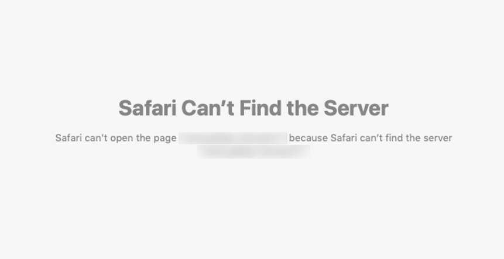

**Last updated 16th July 2021**

## Objective

Several error messages may appear on your browser in the event of your site being inaccessible. The examples below indicate an incorrect configuration of your [DNS](../../domains/web_hosting_how_to_edit_my_dns_zone/#understanding-dns) or a suspended domain (if your website does not display one of the error messages described here, see the [Go further](#gofurther) section of this guide):

|Browser|Error Message|
|-|---|
|Chrome: "This site can't be reached"|{.thumbnail}|
|Firefox: "Hmm. We're having trouble finding that site."|{.thumbnail}|
|Edge: "Hmmm... can't reach this page"|{.thumbnail}|
|Safari: "Safari Can't Find the Server"|{.thumbnail}|

**Find out how to resolve the "This site can't be reached" type errors**

> [!warning]
>
> OVHcloud provides services which you are responsible for with regard to their configuration and management. You are therefore responsible for ensuring they function correctly.
>
> We have provided you with this guide in order to help you with common tasks. Nevertheless, we recommend contacting a specialist provider and/or the service’s software publisher if you encounter any difficulties. We will not be able to assist you ourselves. You can find more information in the [Go further](#gofurther) section of this guide.
>

## Requirements

- control over your domain’s servers and [DNS zone](../../domains/web_hosting_how_to_edit_my_dns_zone/#understanding-dns)
- access to the [OVHcloud Control Panel](	https://ca.ovh.com/auth/?action=gotomanager&from=https://www.ovh.com/world/&ovhSubsidiary=we)

## Instructions

### Step 1: check the validity of your domain name subscription

> [!warning]
>
> You are solely responsible for renewing your web services. 
> As a hosting provider, OVHcloud is required to permanently delete any web services (domains, hosting plans, e-mails, etc.) that have not been renewed in time, as well as all of the data they store.
>
> As a result, we strongly recommend that you enable [automatic renewal](../../billing/how-to-use-automatic-renewal-at-ovh/#instructions) for all of your OVHcloud subscriptions.
>

To check that your domain name subscription is valid, click on your name at the top right-hand corner of your [OVHcloud Control Panel](	https://ca.ovh.com/auth/?action=gotomanager&from=https://www.ovh.com/world/&ovhSubsidiary=we), then click on `Products and services`{.action} within the right-hand menu.

{.thumbnail}|

Renew your domain if necessary with the `...`{.action} button, then click on `Renew service`{.action}.

{.thumbnail}

After the renewal of your offer is completed, your website will be available within a maximum of 48 hours.

### Step 2: check the DNS servers

To check that your [DNS servers](../../domains/web_hosting_general_information_about_dns_servers/) are valid, click on `Domain names`{.action} in the top left-hand corner of your [OVHcloud Control Panel](	https://ca.ovh.com/auth/?action=gotomanager&from=https://www.ovh.com/world/&ovhSubsidiary=we), then on your domain name.

#### Scenario 1: no anomalies appear on the DNS servers

Check the servers listed in the `DNS servers`{.action} tab:

{.thumbnail}

If they are identical to the targets of the `NS` type entries in the `DNS zone`{.action}, go to [step 3](#step3):

{.thumbnail}

#### Scenario 2: a warning appears above the DNS zone

A warning in the `DNS zone`{.action} tab indicates that the DNS servers used by your domain name are not the ones indicated in your [DNS zone](../../domains/web_hosting_how_to_edit_my_dns_zone/#understanding-dns). Two scenarios are possible:

- Under the sentence "You are currently using the following DNS servers", the servers listed are "ns **?** .ovh.net" and "dns **?** .ovh.net" (replace the "**?**" by any number):

{.thumbnail}

Modify the DNS servers as described in [this guide](../../domains/web_hosting_general_information_about_dns_servers/#modifying-dns-servers), so that they are identical to the targets of the `NS` type records in your `DNS zone`{.action}.

Your website will then be available within a maximum of 48 hours.

- Under the sentence "You are currently using the following DNS servers", the servers listed are not "ns **?** .ovh.net" and "dns **?** .ovh.net".

{.thumbnail}

> [!warning]
>
> In this situation, please contact your webmaster or [OVHcloud partners](https://partner.ovhcloud.com/en/) before making any changes.
>
> The DNS servers used by your domain name may be functional and the problem accessing your website be linked to a missing or incorrect entry in the active [DNS zone](../../domains/web_hosting_how_to_edit_my_dns_zone/#understanding-dns). Changing the DNS servers in this situation might make your e-mail addresses or other online applications related to your domain name unavailable.
>

#### Scenario 3: no NS-type entries appear in the DNS zone

Your domain’s `DNS zone`{.action} does not contain any `NS` record:

{.thumbnail}

Back up the current zone by clicking on the `Change in text format`{.action} button:

{.thumbnail}

Then copy and paste the content of your `DNS zone`{.action} into a text document on your computer.

Then click on `Reset my DNS zone`{.action} and select `No, but I want to reset my DNS zone`{.action}. Select your e-mail and hosting servers and click on `Confirm`{.action}.

{.thumbnail}

Your website will then be available again within a maximum of 24 hours.

### Step 3: check the DNS zone 

In this step, you will find your hosting plan’s IP address, then add it to your `DNS zone`{.action}.

If your site is not hosted on the OVHcloud infrastructure or is managed by another provider, please contact the concerned support service.

If your site is hosted on one of our [Cloud web offers](https://www.ovh.com/world/web-hosting/), click on the `Hosting plans`{.action} tab on the left-hand side of your screen and choose the web hosting offer which contains your website.

In the `General information`{.action} tab, copy the IPV4 and/or IPV6 address of your domain name.

{.thumbnail}

Then refer to it in your domain’s [DNS zone](../../domains/web_hosting_how_to_edit_my_dns_zone/#edit-your-domain-names-ovhcloud-dns-zone_1), by modifying or creating one or more `A` entries.

{.thumbnail}

Your website will then be available within a maximum of 24 hours.

## Go further 

[Resolving a “Site not installed” error](../web_hosting_error_-_website_not_installed/)

[Fixing the 500 Internal Server Error](../web_hosting_how_to_fix_the_500_internal_server_error/)

[Resolving the most common 1-click module errors](../error-frequently-1-click-modules/)

For specialised services (SEO, development, etc.), contact the [OVHcloud partners](https://partner.ovhcloud.com/en/).

If you would like assistance using and configuring your OVHcloud solutions, please refer to our [support offers](https://www.ovhcloud.com/en/support-levels/).

Join our community of users on <https://community.ovh.com/en/>.
