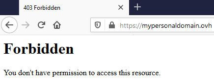
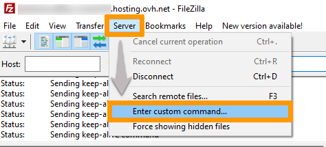
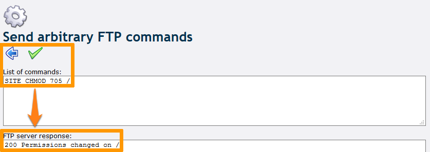

**Dernière mise à jour le 30/05/2023**

## Objectif

Une page **« 403 forbidden »** peut apparaitre lorsque :

- les droits d'accès FTP (CHMOD) sont insuffisants ou restreints. L'accès au fichier/dossier/site web auquel vous souhaitez accéder via votre navigateur Internet est alors refusé par le serveur web de votre hébergement web ;

- le fichier **.htaccess** contient une règle de restriction d'accès ;

- un plugin de sécurité protège l'accès à vos fichiers/dossier/sites web via votre navigateur Internet ;

- un pare-feu applicatif est activé.

Suite à la détection d'un fonctionnement suspect, nos robots de sécurité peuvent bloquer temporairement l'accès aux fichiers de votre hébergement web. Ce dispositif permet d'empêcher :


- la progression d'un éventuel piratage de vos données présentes sur votre hébergement web ;

- l'envoi de code malveillant vers d'autres entités/sites web, pouvant alors entraîner un piratage de ces derniers ;

- la réalisation d'opérations illégales.
 
 Cela vise également à vous protéger juridiquement contre les actions résultantes d'un éventuel piratage de votre hébergement web en direction d'autres organisations/sites web. 
 
 *Si vous êtes concernés par ce type de blocage, une notification vous est envoyée sur l'adresse e-mail du contact « administrateur » de votre hébergement web*

{.thumbnail}

**Découvrez comment débloquer l'accès à votre site web en cas d’affichage d'une page « 403 forbidden ».**

> [!warning]
>
> OVHcloud met à votre disposition des services dont la configuration, la gestion et la responsabilité vous incombent. Il vous revient de ce fait d'en assurer le bon fonctionnement.
>
> Nous mettons à votre disposition ce guide afin de vous accompagner au mieux sur des tâches courantes. Néanmoins, nous vous recommandons de faire appel à un [prestataire spécialisé](https://partner.ovhcloud.com/fr/directory/) et/ou d'échanger avec notre [communauté d'utilisateurs](https://community.ovh.com) si vous éprouvez des difficultés. En effet, nous ne serons pas en mesure de vous fournir une assistance. Plus d'informations dans la section [« Aller plus loin »](#go-further) de ce guide.
>

## Prérequis

- Disposer d'une [offre d'hébergement web](https://www.ovhcloud.com/fr/web-hosting/) OVHcloud.
- Disposer des [identifiants de connexion](/pages/web/hosting/ftp_connection) à l'espace de stockage FTP de votre hébergement web.
- Être connecté à votre [espace client OVHcloud](https://www.ovh.com/auth/?action=gotomanager&from=https://www.ovh.com/fr/&ovhSubsidiary=fr).

## En pratique

### Étape 1 : analyser la situation

Si la page **« 403 forbidden »** est apparue suite à une modification de votre site web, [restaurez tout ou partie de l'espace de stockage FTP de votre hébergement](/pages/web/hosting/ftp_save_and_backup) à une date antérieure.

Si les sauvegardes disponibles ne vous permettent pas de rétablir l'accès à votre site web, contactez un [prestataire spécialisé](https://partner.ovhcloud.com/fr/directory/).

Si la page **« 403 forbidden »** n'est pas apparue suite à une modification de votre site web, consultez votre messagerie. Si vous avez reçu un e-mail de nos services indiquant une fermeture de votre hébergement web pour des raisons de sécurité, passez directement à [l'étape 2](#step-2) du présent guide.

Si la page **« 403 forbidden »** est apparue sans action de votre part et que vous n'avez pas reçu de mails de nos services à ce sujet, vérifiez les droits d'accès FTP (CHMOD) de vos fichiers/dossiers ainsi que le code contenu dans votre (vos) fichier(s) **.htaccess**. Vérifiez également si cette situation n'est pas générée par un plugin de sécurité ou par un pare-feu applicatif. Si besoin, contactez un [prestataire spécialisé](https://partner.ovhcloud.com/fr/directory/).

### Étape 2 : sécuriser vos solutions <a name="step-2"></a>

Vérifiez tout d'abord la sécurité de votre (vos) poste(s)/appareil(s) informatique(s) :

- Effectuez les mises à jour de sécurité de vos appareils;
- Vérifiez qu'un antivirus est installé, mettez-le à jour et lancez un scan complet. Si vous n'en possédez aucun, consultez un [prestataire spécialisé](https://partner.ovhcloud.com/fr/directory/) avant toute installation ;
- Modifiez l'ensemble de vos mots de passe locaux, notamment ceux de vos adresses e-mail, en respectant les **bonnes pratiques** précisées dans ce [guide](/pages/account/customer/manage-ovh-password);
- Modifiez les mots de passe de l'ensemble de vos services OVHcloud, notamment ceux de votre [base de données](/pages/web/hosting/sql_change_password) et de l'accès à votre [espace de stockage FTP](/pages/web/hosting/ftp_change_password).

> [!warning]
>
> Avant de changer le mot de passe de la base de données de votre site web depuis votre [espace client OVHcloud](https://www.ovh.com/auth/?action=gotomanager&from=https://www.ovh.com/fr/&ovhSubsidiary=fr), mettez à jour le fichier de configuration de votre site web afin qu'il se connecte à la base de données avec le nouveau mot de passe.
>
> Dans le cas contraire, la modification du mot de passe de votre base de données entraînera une coupure d'accès à votre site web ou à vos services/clients qui l'utilisent.
>
> En cas de doute sur les manipulations à réaliser, contactez les [partenaires OVHcloud](https://partner.ovhcloud.com/fr/directory/).
>

### Étape 3 : intervenir sur votre hébergement web

Notez tout d'abord la date d'envoi de l'e-mail d'OVHcloud indiquant la désactivation de votre hébergement web, ainsi que le ou les dossiers contenant les exemples de fichiers illégitimes.

> [!primary]
>
> Nos robots de sécurité peuvent appliquer deux niveaux de désactivation sur votre hébergement web : 
>
> - une désactivation en appliquant un « **CHMOD 700** » à la racine FTP de votre hébergement web;
> - une désactivation en appliquant un « **CHMOD 000** » à la racine FTP de votre hébergement web.
>
> Dans le cas d'une désactivation par restriction d'accès FTP en « **CHMOD 000** », contactez obligatoirement nos [équipes support](https://www.ovhcloud.com/fr/support-levels/) pour faire le point sur la situation avant de poursuivre les étapes décrites dans ce guide. 
>
> En fonction de votre situation, ces derniers appliqueront une restriction moins élevée en transformant le « **CHMOD 000** » en « **CHMOD 700** » afin que vous puissiez agir sur l'espace FTP de votre hébergement web.
>

#### Cas n°1 : votre hébergement web a été désactivé il y a moins de deux semaines

Si votre hébergement a été fermé il y a moins de deux semaines et qu'il ne contient qu'un seul site web, restaurez votre espace de stockage FTP. S'il contient plusieurs sites web, restaurez uniquement le ou les dossiers contenant les fichiers illégitimes.

Pour restaurer tout ou partie de votre espace de stockage FTP, consultez notre [guide](/pages/web/hosting/ftp_save_and_backup) sur le sujet.

> [!warning]
>
> La restauration seule de votre espace de stockage FTP ne suffit pas à corriger de potentielles failles de sécurité préalablement présentes sur votre site web.
> Pour identifier ces failles de sécurité, analysez les [« logs web »](/pages/web/hosting/logs_and_statistics) de votre hébergement web ou faites appel à un [prestataire spécialisé](https://partner.ovhcloud.com/fr/directory/) afin de réaliser un audit de sécurité de vos sites web.
>

#### Cas n°2 : votre hébergement web a été désactivé il y a plus de deux semaines

Si votre hébergement a été fermé il y a plus de deux semaines, contactez un [prestataire spécialisé](https://partner.ovhcloud.com/fr/directory/) afin d'effectuer un audit de sécurité de vos sites web. 

> [!success]
>
> Si vous souhaitez plus de détails concernant les [étapes 2 et 3](#step-2) précédentes, consultez notre tutoriel sur [les actions à réaliser en cas de piratage de votre site web](/pages/web/hosting/cms_what_to_do_if_your_site_is_hacked).

>

### Étape 4 : réactiver votre hébergement web <a name="reactivate-web-hosting"></a>

> [!warning]
>
> Nous vous recommandons de réaliser un audit de sécurité **avant** la réouverture de votre hébergement web. Toute opération malveillante effectuée depuis votre hébergement web peut engager votre responsabilité juridique.
>

#### Réactiver votre hébergement web avec FileZilla

> [!primary]
>
> Pour installer le logiciel **FileZilla** afin de manipuler les fichiers de votre site web, suivez les instructions de ce [tutoriel](/pages/web/hosting/ftp_filezilla_user_guide).
>

Ouvrez le logiciel FileZilla puis [connectez-vous à votre espace de stockage FTP](/pages/web/hosting/ftp_connection). Cliquez ensuite sur `Serveur`{.action} dans la barre de menu, puis sur `Entrer une commande FTP`{.action} (l'intitulé peut être différent suivant la version de FileZilla que vous utilisez) :

{.thumbnail}

Dans la fenêtre qui s'affiche, renseignez la commande ci-dessous puis validez-la :

```
SITE CHMOD 705 /
```

{.thumbnail}

Une réponse **« 200 Permissions changed on / »** confirme que la manipulation s'est bien effectuée. Pour le vérifier, essayez à nouveau d'accéder à votre site web.

> [warning]
>
> Un délai de quelques minutes (maximum 20 minutes) peut être nécessaire pour que la modification soit visible via votre navigateur Internet.

>
> En fonction de votre site web, il peut également être nécessaire de vider le cache de votre navigateur.

>

Si la commande ci-dessus ne fonctionne pas, vous pouvez essayer cette autre commande :

```
SITE CHMOD 705 .
```

#### Réactiver votre hébergement avec le FTP Explorer « net2ftp »

Dans votre [espace client OVHcloud](https://www.ovh.com/auth/?action=gotomanager&from=https://www.ovh.com/fr/&ovhSubsidiary=fr), rendez-vous dans la partie `Web Cloud`{.action}. Cliquez sur l'onglet `Hébergements`{.action} dans la colonne de gauche et sélectionnez l'hébergement web concerné. Sélectionnez l'onglet `FTP-SSH`{.action} sur la page qui s'affiche.

Appuyez sur le bouton `FTP Explorer`{.action} et connectez-vous à votre [espace de stockage FTP](/pages/web/hosting/ftp_connection). 

Cliquez sur le bouton `Avancé`{.action} puis sur le bouton `Go`{.action} à côté de « Envoyer des commandes FTP arbitraires au serveur FTP ».

{.thumbnail}

Dans la partie supérieure de la page, renseignez la commande ci-dessous :

```
SITE CHMOD 705 /
```

puis cliquez sur le bouton représentant un « V » vert.

{.thumbnail}

Une réponse **« 200 Permissions changed on / »** confirme que la manipulation s'est bien effectuée. Pour le vérifier, essayez à nouveau d'accéder à votre site web.

> [warning]
>
> Un délai de quelques minutes (maximum 20 minutes) peut être nécessaire pour que la modification soit visible via votre navigateur Internet.

>
> En fonction de votre site web, il peut également être nécessaire de vider le cache de votre navigateur.

>

## Aller plus loin <a name="go-further"></a>

[Cas d'usage - Conseils suite au piratage de votre site Web](/pages/web/hosting/cms_what_to_do_if_your_site_is_hacked)

[Activation du pare-feu applicatif](/pages/web/hosting/multisites_activating_application_firewall)

[Changer la version de PHP de son hébergement web](/pages/web/hosting/php_configure_php_on_your_web_hosting_2014)

Pour des prestations spécialisées (référencement, développement, etc), contactez les [partenaires OVHcloud](https://partner.ovhcloud.com/fr/directory/).

Si vous souhaitez bénéficier d'une assistance à l'usage et à la configuration de vos solutions OVHcloud, nous vous proposons de consulter nos différentes [offres de support](https://www.ovhcloud.com/fr/support-levels/).

Échangez avec notre communauté d'utilisateurs sur <https://community.ovh.com>.
