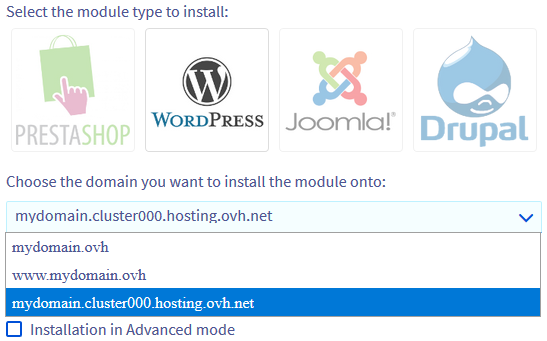

**Last updated 2nd june 2021**

## Objective

Creating a [1-click Module](../web_hosting_web_hosting_modules/) in single or advanced mode can cause various anomalies.

**This guides explains how to diagnose the most common cases of errors when creating 1-click modules**

> [!warning]
>
> OVHcloud provides services which you are responsible for with regard to their configuration and management. You are therefore responsible for ensuring they function correctly.
>
> We have provided you with this guide in order to help you with common tasks. Nevertheless, we recommend contacting a specialist provider and/or the service’s software publisher if you encounter any difficulties. We will not be able to assist you ourselves. You can find more information in the [Go further](#gofurther) section of this guide.
>

## Requirements

- a compatible [web](https://www.ovh.com/fr/hebergement-web/) hosting plan
- access to the [OVHcloud Control Panel](https://www.ovh.com/auth/?action=gotomanager&from=https://www.ovh.co.uk/&ovhSubsidiary=GB)
- use of the [1-click module](../web_hosting_web_hosting_modules/) feature to create a new website

## Instructions

> [!primary]
>
> The most common errors are listed here. If you experience any other anomaly, please refer to our [Web Hosting FAQ](../web-hosting-faq/).
>

### “An error has occurred loading the information. (You need at least one free database)“

{.thumbnail}

This message might appear when you try to create a new module. It means that a new database can't be created on your web hosting. A 1-click module needing its own database, the following solutions might be considered :

#### Solution 1: change your hosting plan

> [!primary]
>
> See our comparison of different [hosting plans](https://www.ovh.co.uk/web-hosting/).
>

In the [OVHcloud Control Panel](https://www.ovh.com/auth/?action=gotomanager&from=https://www.ovh.co.uk/&ovhSubsidiary=GB), click on `Web Cloud`{.action}, then `Hosting`{.action}. Select the plan concerned, then click `Change solution` in the `Subscription` - `Offer` section:

{.thumbnail}

With the [Pro2014](https://www.ovh.co.uk/web-hosting/web-hosting-pro.xml) and [Performance](https://www.ovh.co.uk/web-hosting/performance-web-hosting.xml) offers, you can create up to three additional 1-click modules. **Performance** hosting plans also allow you to enable a [private SQL server](https://www.ovh.com/fr/hebergement-web/options-sql.xml) for free.

#### Solution 2: delete an unused database 

> [!warning]
>
> A database suppression is permanent. Its backups would also be deleted. If you are unsure about the changes you need to make, contact your webmaster or one of our [partners](https://partner.ovhcloud.com/en-gb/directory/).
>

To delete a database, in the [OVHcloud Control Panel](https://www.ovh.com/auth/?action=gotomanager&from=https://www.ovh.co.uk/&ovhSubsidiary=GB), click on `Web Cloud`{.action}, then `Hosting`{.action}, then on the `Databases`{.action} tab. Choose carefully the database to delete :

{.thumbnail}

#### Solution 3: order new databases

In the [OVHcloud](https://www.ovh.com/auth/?action=gotomanager&from=https://www.ovh.co.uk/&ovhSubsidiary=GB) Control Panel, click `Web Cloud`{.action}, then `Hosting`{.action}. In `Databases`{.action}, click `Actions`{.action}:

{.thumbnail}

> [!primary]
>
> Check our different [database offers](https://www.ovh.co.uk/web-hosting/sql-options.xml)
>

#### Solution 4: install your module on a database you already use

To install your module on an already used database, you will need to use the [advanced mode](../web_hosting_web_hosting_modules/#advanced-module-installation).

To find your database login details, please read our [FAQ](https://www.ovh.co.uk/web-hosting/faq/).

### “The installation directory is not empty“

{.thumbnail}

After creating your module, you received an email stating that your module’s creation failed for the installation directory is not empty.

This message means that the **Root folder** your domain is linked to within your FTP server contains at least one file or folder.

To link your domain to another directory, click on `Modify domain`{.action} in the `Multisite`{.action} tab, then enter the name of a new **Root folder** (an empty directory will be created automatically on your web hosting).

{.thumbnail}

You can also log in to your hosting plan via [FTP](../connexion-espace-stockage-ftp-hebergement-web/), then delete or move the folder content after backing it up.

### “Unable to connect to database“ 

{.thumbnail}

After you launched your module installation in advanced mode, you received an e-mail stating that your module cannot connect to the specified database. 

First check your database credentials. To find them, please read our [FAQ](https://www.ovh.co.uk/web-hosting/faq/).

Then delete your module via the 1-click `modules tab`{.action}:

{.thumbnail}

Then try installing a new module again.

### Your domain name is not offered when you create the module

{.thumbnail}

Click the `Multisite`{.action} tab, and then perform the following checks:

|Scenario|What to do|
|---|---|
|The domain or subdomain linked to the website you want to create does not appear in the `Multisite`{.action}.|Add your domain by following [this page](../multisites-configuring-multiple-websites/#step-21-adding-an-ovhcloud-registered-domain).|
|The domain name has been deleted from the `Multisite`{.action} without any action on your side.|If your domain or its [DNS zone](../../domains/web_hosting_how_to_edit_my_dns_zone/#understanding-dns) are not managed on your [OVHcloud Control Panel](https://www.ovh.com/auth/?action=gotomanager&from=https://www.ovh.co.uk/&ovhSubsidiary=GB), follow this [guide](../multisites-configuring-multiple-websites/#step-22-adding-an-external-domain)add your domain name to the `Multisite`{.action}.|

### Your module will appear on a web address such as “xxxxx.cluster0xx.hosting.ovh.net”

{.thumbnail}

Back up the actual **1-click modules** and its **Database**, if necessary. Then, [delete your module](#deleteModule), then its [database](#deleteDB) and create a new module on the right `Domain name`.

### Your old website will still appear

This anomaly can have several causes: 

- You have recently changed your [DNS zone](../../domains/web_hosting_how_to_edit_my_dns_zone/#understanding-dns) or servers, or [transferred your domain name](../../domains/domain_transfer.xml). Wait until these operations are complete (48 hours for changes on your `DNS servers`). Restart your devices regularly (PC, smartphone, box, etc.) and refresh your web browser’s cache.

- Your domain name is still linked to your old hosting plan. In this case, edit your [DNS Zone](../../domains/web_hosting_how_to_edit_my_dns_zone/#edit-your-domain-names-ovhcloud-dns-zone_1) or [DNS servers](../../domains/web_hosting_general_information_about_dns_servers/#modifying-dns-servers), or contact your old hosting provider to do so.

## Go further 

For specialised services (SEO, development, etc.), contact [OVHcloud partners](https://partner.ovhcloud.com/en-gb/)

If you would like assistance using and configuring your OVHcloud solutions, please check our [support offers](https://www.ovhcloud.com/en-gb/support-levels/).

Join our community of users on <https://community.ovh.com/en/>.
