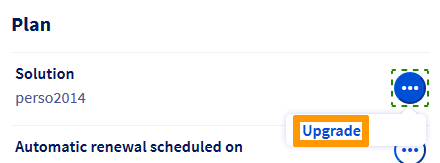
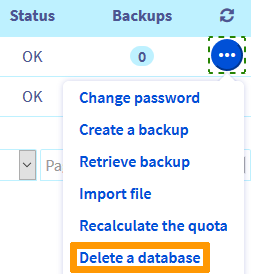
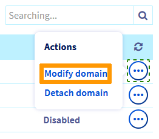

> [!primary]
> Tłumaczenie zostało wygenerowane automatycznie przez system naszego partnera SYSTRAN. W niektórych przypadkach mogą wystąpić nieprecyzyjne sformułowania, na przykład w tłumaczeniu nazw przycisków lub szczegółów technicznych. W przypadku jakichkolwiek wątpliwości zalecamy zapoznanie się z angielską/francuską wersją przewodnika. Jeśli chcesz przyczynić się do ulepszenia tłumaczenia, kliknij przycisk "Zaproponuj zmianę" na tej stronie.
>

**Ostatnia aktualizacja z dnia 08/10/2021**

## Wprowadzenie

Utworzenie [modułu za pomocą 1 kliknięcia](../hosting_www_przewodniki_dotyczace_modulow_na_hostingu_www/) w trybie prostym lub zaawansowanym może spowodować różne nieprawidłowości.

**Dowiedz się, jak zdiagnozować najczęstsze przypadki błędów związanych z modułami za pomocą 1 kliknięcia**

> [!warning]
>
> OVHcloud udostępnia różnorodne usługi, jednak to Ty odpowiadasz za ich konfigurację i zarządzanie nimi. Ponosisz więc odpowiedzialność za ich prawidłowe funkcjonowanie.
>
> Oddajemy w Twoje ręce niniejszy przewodnik, którego celem jest pomoc w wykonywaniu bieżących zadań. W przypadku trudności zalecamy skorzystanie z pomocy wyspecjalizowanego webmastera lub kontakt z producentem oprogramowania. Niestety firma OVH nie będzie mogła udzielić wsparcia w tym zakresie. Więcej informacji znajduje się w sekcji [Sprawdź również](#gofurther) ten przewodnik.
>

## Wymagania początkowe

- Posiadanie kompatybilnego [hostingu](https://www.ovhcloud.com/pl/web-hosting/).
- Dostęp do [Panelu klienta OVHcloud](https://www.ovh.com/auth/?action=gotomanager&from=https://www.ovh.pl/&ovhSubsidiary=pl).
- Korzystanie z funkcji [Module za 1 kliknięciem](../hosting_www_przewodniki_dotyczace_modulow_na_hostingu_www/), aby utworzyć nową stronę.

## W praktyce

> [!primary]
>
> Wyszczególniamy tutaj najczęstsze błędy. Jeśli zauważysz inną anomalię, zapoznaj się z naszym [FAQ dotyczący hostingu www](https://www.ovhcloud.com/pl/web-hosting/).
>

### "Wystąpił błąd podczas pobierania informacji. (You need at least one free database)"

{.thumbnail}

Jeśli pojawi się ta wiadomość po uruchomieniu instalacji modułu, nie można utworzyć nowej bazy danych na Twoim hostingu.

#### Rozdział 1: zmień ofertę hostingu

> [!primary]
>
> Zapoznaj się z porównaniem naszych [ofert hostingu](https://www.ovhcloud.com/pl/web-hosting/).
>

W [Panelu klienta OVHcloud](https://www.ovh.com/auth/?action=gotomanager&from=https://www.ovh.pl/&ovhSubsidiary=pl) kliknij `Web Cloud`{.action}, a następnie `Hosting`{.action}. Wybierz odpowiedni hosting i kliknij `Zmień ofertę` w sekcji `Abonament` - `Oferta`:

{.thumbnail}

Dzięki ofercie [Hosting Pro](https://www.ovhcloud.com/pl/web-hosting/professional-offer/) i [Hosting Performance](https://www.ovhcloud.com/pl/web-hosting/performance-offer/) możesz utworzyć do trzech modułów za pomocą 1 kliknięcia. Wraz z pakietem **Hosting Performance** będziesz mógł włączyć za darmo prywatny [serwer SQL](https://www.ovhcloud.com/pl/web-hosting/options/start-sql/).

#### Rozdział 2: usuń niewykorzystaną bazę danych 

> [!warning]
>
> Operacja usunięcia bazy danych jest ostateczna. Pociąga to również za sobą usunięcie kopii zapasowych odpowiedniej bazy danych. Jeśli nie masz pewności co do przeprowadzenia tych czynności, skontaktuj się z webmasterem lub jednym z naszych [partnerów](https://partner.ovhcloud.com/pl/directory/).
>

Aby usunąć bazę danych, w [Panelu klienta OVHcloud](https://www.ovh.com/auth/?action=gotomanager&from=https://www.ovh.pl/&ovhSubsidiary=pl) kliknij pozycję `Web Cloud`{.action}, następnie `Hosting`{.action} i wreszcie `Bazy danych`{.action}. Usuń wybraną bazę danych:

{.thumbnail}

#### Rozdział 3: zamów nowe bazy danych

W [Panelu klienta OVHcloud](https://www.ovh.com/auth/?action=gotomanager&from=https://www.ovh.pl/&ovhSubsidiary=pl) kliknij `Web Cloud`{.action}, a następnie `Hosting`{.action}. W `Bazach danych`{.action} kliknij `Operacje`{.action}:

{.thumbnail}

> [!primary]
>
> Zapoznaj się z porównaniem naszych [ofert baz danych](https://www.ovhcloud.com/pl/web-hosting/options/start-sql/)
>

#### Rozdział 4: zainstalować moduł na bazie danych

Aby zainstalować moduł na bazie danych, której już używasz, [użyj zaawansowanego](../hosting_www_przewodniki_dotyczace_modulow_na_hostingu_www/#instalacja-w-trybie-zaawansowanym)trybu instalacji nowego **modułu za pomocą 1 kliknięcia**.

Aby odnaleźć dane do logowania do bazy danych, sprawdź nasz [FAQ](https://www.ovhcloud.com/pl/web-hosting/).

### "Katalog instalacji nie jest pusty"

{.thumbnail}

Po utworzeniu modułu otrzymałeś e-mail z informacją, że katalog instalacyjny modułu nie jest pusty.

Wiadomość ta oznacza, że **Katalog główny** Twojej domeny zawiera jeden lub więcej plików lub katalogów.

Aby powiązać domenę z innym katalogiem, kliknij `Zmień domenę`{.action} w zakładce `MultiSite`{.action}, następnie podaj nazwę nowej **Katalogu głównego** (pusty katalog zostanie automatycznie utworzony na Twoim hostingu).

{.thumbnail}

Możesz również połączyć się z hostingiem przez [FTP](../logowanie-przestrzen-dyskowa-ftp-hosting-web/), a następnie usunąć lub przenieść zawartość folderu po jego zapisaniu.

### "Wystąpił błąd podczas pobierania informacji (There is not enough space on your hosting (you need at least xxx MB))"

{.thumbnail}

Wiadomość ta wskazuje, że [przestrzeń dyskowa](../logowanie-przestrzen-dyskowa-ftp-hosting-web/) Twojego hostingu zawiera zbyt dużą ilość danych. Musisz więc usunąć lub przenieść domenę zanim będziesz mógł zainstalować nowy [moduł za 1 kliknięciem](../hosting_www_przewodniki_dotyczace_modulow_na_hostingu_www/).

W tej sytuacji [zaloguj się przez FTP](../logowanie-przestrzen-dyskowa-ftp-hosting-web/) na Twoim hostingu [zapisz lokalnie](../hosting_www_przewodnik_dotyczacy_korzystania_z_programu_filezilla/#transfer-plikow), a następnie usuń pliki, które nie są konieczne do działania Twojej strony WWW.

> [!primary]
>
> W przypadku pytań dotyczących danych do usunięcia, w celu zmniejszenia ilości danych na hostingu, skontaktuj się z naszą [społecznością użytkowników](https://community.ovh.com/en/) lub [partnerami OVHcloud](https://partner.ovhcloud.com/pl/). 
> Nie będziemy w stanie udzielić wsparcia w tym zakresie.

### "Nie można połączyć się z bazą danych" 

{.thumbnail}

Po uruchomieniu instalacji modułu w trybie zaawansowanym otrzymałeś wiadomość e-mail z informacją, że moduł nie może się łączyć z wskazaną bazą danych. 

Należy więc sprawdzić dane dostępowe do bazy danych. Aby je znaleźć, sprawdź nasz [FAQ](https://www.ovhcloud.com/pl/web-hosting/).

Następnie usuń moduł w zakładce `Moduły za 1 kliknięciem`{.action}:

{.thumbnail}

Następnie uruchom ponownie instalację nowego modułu.

### "You have insufficient rights on this database."

{.thumbnail}

Baza danych nie może zostać zmieniona, ponieważ ilość danych w niej zawartych przekracza dozwolony limit. Wiadomość ta pojawia się podczas instalacji modułu w [tryb zaawansowany](../hosting_www_przewodniki_dotyczace_modulow_na_hostingu_www/#instalacja-w-trybie-zaawansowanym).

W tej sytuacji zainstaluj moduł przechodząc przez [tryb "prosty"](../hosting_www_przewodniki_dotyczace_modulow_na_hostingu_www/#prosta-instalacja-modulu) lub wybierz inną bazę danych podczas instalacji w trybie zaawansowanym. Jeśli potrzebujesz dodatkowej [oferty baz danych](https://www.ovh.pl/hosting/opcje-sql.xml).

Jeśli nie posiadasz innych baz danych i nie chcesz zamawiać dodatkowej oferty, [zaimportuj kopię bazy](../eksport-bazy-danych/#en-praktyka) a następnie usuń niepotrzebne dane.

> [!warning]
>
> **Usunięcie elementów z bazy danych może spowodować zablokowanie Twojej strony WWW.**
>
> W przypadku dodatkowych pytań skontaktuj się z naszym [społecznością użytkowników](https://community.ovh.com/en/) lub [partnerami OVHcloud](https://partner.ovhcloud.com/pl/). 
> Nie będziemy w stanie udzielić wsparcia w tym zakresie.
>

### "Can't connect to database 'test' at 'xxxxxx-xxx.privatesql'. The error is: Access denied for user 'xxxx'@'xxxxxxxx' (using password: YES)"

{.thumbnail}

Instalacja modułu za pomocą 1 kliknięcia w [tryb zaawansowany](../hosting_www_przewodniki_dotyczace_modulow_na_hostingu_www/#prosta-instalacja-modulu) na bazie danych znajdującej się na [prywatnym serwerze SQL](../pierwsze-kroki-private-sql/). Ten komunikat błędu został wysłany na e-mail. Oznacza to, że zarejestrowany użytkownik podczas instalacji nie posiada wystarczających uprawnień do bazy danych lub że wskazane identyfikatory są nieprawidłowe.

W tej sytuacji najpierw zmodyfikuj [prawa użytkownika](../tworzenie-baz-danych-i-uzytkownikow/#zarzadzanie-prawami-uzytkownikow), aby posiadał on uprawnienia **Administrator** lub **Odczyt/zapis** na bazie danych.

Sprawdź również jego dane do logowania [bezpośrednio](../polaczenie-bazy-danych-serwer-bdd/#w-praktyce) do serwera baz danych i uruchom ponownie instalację modułu.

### "Can't connect to database 'xxxxxxxx' at 'xxxxxxxx.mysql.db'. The error is: Unknown MySQL server host 'xxxxxxxx.mysql.db'"

{.thumbnail}

Instalacja modułu za pomocą 1 kliknięcia w [tryb zaawansowany](../hosting_www_przewodniki_dotyczace_modulow_na_hostingu_www/#prosta-instalacja-modulu) na bazie danych znajdującej się na [prywatnym serwerze SQL](../pierwsze-kroki-private-sql/). Ten komunikat błędu został wysłany na e-mail. Oznacza to, że podana przez Ciebie nazwa serwera baz danych jest nieprawidłowa.

Kliknij na `Web cloud`{.action} [Panel klienta OVHcloud](https://www.ovh.com/auth/?action=gotomanager&from=https://www.ovh.pl/&ovhSubsidiary=pl), a następnie na zakładkę `Bazy danych`{.action} po lewej stronie ekranu.

Następnie kliknij wybraną ofertę: nazwa serwera, który ma być użyty, podana jest pod nagłówkiem `Nazwa hosta` w podczęści `SQL` danych do logowania.

### Twoja domena nie jest dostępna podczas tworzenia modułu

{.thumbnail}

Kliknij kartę `MultiSite`{.action}, po czym przeprowadź następujące kontrole:

|Scenariusz|Co należy zrobić?|
|---|---|
|Domena lub subdomena przypisana do strony, którą chcesz utworzyć nie wyświetla się w opcji `MultiSite`{.action}.|Dodaj swoją domenę zgodnie z [tymi wskazówkami](../konfiguracja-multisite-na-hostingu/#etap-2-dodanie-domeny-lub-subdomeny).|
|Domena została usunięta z strony podpiętej w opcji MultiSite bez konieczności wykonywania przez Ciebie żadnych czynności.|Jeśli Twoja domena lub [Strefa DNS](../../domains/hosting_www_jak_edytowac_strefe_dns/#zrozumienie-pojecia-dns) nie są zarządzane z poziomu konta OVHcloud, dodaj domenę do `MultiSite`{.action} zgodnie z [tym przewodnikiem](../konfiguracja-multisite-na-hostingu/#etap-22-dodaj-domene-zewnetrzna).|

### Twój moduł wyświetla się na koncie www typu "xxxxx.cluster0xx.hosting.ovh.net"

{.thumbnail}

Po wykonaniu wszystkich niezbędnych kopii zapasowych [usuń moduł](#delete-module), następnie jego [bazę danych](#delete-database). Następnie uruchom ponownie instalację dla wybranej domeny.

### Twoja stara strona wciąż się wyświetla

Ta nieprawidłowość może mieć kilka przyczyn:

- Dokonałeś ostatnio zmiany strefy lub serwerów [DNS](../../domains/hosting_www_jak_edytowac_strefe_dns/#zrozumienie-pojecia-dns) lub [transferu domeny](../../domains/przeniesienie-domeny-globalnej/). Odczekaj, aż operacje te zostaną zakończone (48 godziny w przypadku zmiany serwerów DNS). Pamiętaj, aby zrestartować urządzenia (komputer, smartfon, box, etc.) i usunąć cache przeglądarki.

- Twoja domena jest zawsze powiązana z Twoim poprzednim hostingiem. W tym przypadku zmień [strefę DNS](../../domains/hosting_www_jak_edytowac_strefe_dns/#modyfikacja-strefy-dns-domeny_1) lub [serwery DNS](../../domains/hosting_www_informacje_na_temat_serwerow_dns/#zmien-serwery-dns) lub skontaktuj się z aktualnym dostawcą usług hostingowych.

## ## Sprawdź również 

[Jak zdiagnozować białą stronę?](../hosting_www_jak_sprawdzic_przyczyne_wyswietlania_sie_bialej_strony/)

Skontaktuj się z [partnerami OVHcloud](https://partner.ovhcloud.com/pl/), jeśli chcesz wykonać specjalistyczne operacje (pozycjonowanie, rozwój, itp.)

Jeśli chcesz otrzymywać wsparcie w zakresie konfiguracji i korzystania z rozwiązań OVHcloud, sprawdź naszą [ofertę wsparcia](https://www.ovhcloud.com/pl/support-levels/).

Dołącz do społeczności naszych użytkowników na stronie <https://community.ovh.com/en/>.
