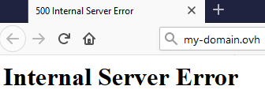

> [!primary]
> Esta tradução foi automaticamente gerada pelo nosso parceiro SYSTRAN. Em certos casos, poderão ocorrer formulações imprecisas, como por exemplo nomes de botões ou detalhes técnicos. Recomendamos que consulte a versão inglesa ou francesa do manual, caso tenha alguma dúvida. Se nos quiser ajudar a melhorar esta tradução, clique em "Contribuir" nesta página.
>

**Última atualização: 07/05/2021**

## Objetivo

Os erros 500 "Internal Server Error" podem afetar a totalidade ou parte do seu site, ser aleatórios ou permanentes. Podem também aparecer sob a forma de uma página em branco.

{.thumbnail}

Por vezes, provêm também de uma atualização efetuada **automaticamente** por um componente do seu site e, portanto, ocorrem sem ação da sua parte.

**Saiba como diagnosticar os casos mais comuns de erros 500.**

> [!warning]
>
> A responsabilidade sobre a configuração e a gestão dos serviços que a OVHcloud disponibiliza recai sobre o utilizador. Assim, deverá certificar-se de que estes funcionam corretamente.
>
> Este manual fornece as instruções necessárias para realizar as operações mais habituais. No entanto, se encontrar dificuldades, recomendamos que recorra a um prestador de serviços especializado e/ou que contacte o editor do serviço. Não poderemos proporcionar-lhe assistência técnica. Para mais informações, aceda à secção [Quer saber mais](#gofurther) ?
>

## Requisitos

- Dispor de uma [oferta de alojamento partilhado](https://www.ovh.pt/alojamento-partilhado/)
- Ter acesso à Área de [Cliente OVHcloud](https://www.ovh.com/auth/?action=gotomanager&from=https://www.ovh.pt/&ovhSubsidiary=pt)

## Instruções

Antes de prosseguir, verifique o seu site em vários dispositivos e browsers. Se o erro 500 não aparece em certos casos (por exemplo, num browser diferente do seu), é porque não está relacionado com os seus serviços OVHcloud. Reinicie os seus dispositivos e contacte um técnico informático próximo da sua casa.

Um site é constituído por um **código fonte** (os ficheiros em .php, por exemplo, visíveis durante uma ligação ao seu alojamento em [FTP](.../aceder-espaco-de-armazenamento-ftp-alojamento-web/), ao qual se junta frequentemente uma **base de dados**.
 Apesar do erro 500, é fortemente aconselhado efetuar um backup local do conjunto dos seus dados antes de qualquer outra manipulação :

- Siga este [guia](../partilhado_guia_de_utilizacao_do_filezilla/) para obter uma cópia do código fonte.
- Se o seu site utiliza uma base de dados, consulte também este [documento](../partilhado_guia_de_exportacao_de_uma_base_de_dados_mysql/) para obter uma cópia.

No caso de um erro 500, é perfeitamente possível efetuar um [restauro](#restore) do seu site. No entanto, é preferível efetuar um diagnóstico aprofundado para determinar a origem exata do erro.

### Verificar os logs do seu alojamento

Consulte primeiro este [guia](../partilhado_consultar_as_estatisticas_e_os_logs_do_meu_site/) para procurar a causa do erro 500 nos logs do seu alojamento.

### Passar o seu site em modo de desenvolvimento

Para que apareçam eventuais erros PHP, passe o seu alojamento em modo de `desenvolvimento` graças a estas [indicações](../modificar_o_ambiente_de_execucao_do_meu_alojamento_web/#2-alterar-a-configuracao-do-alojamento-web).

### Testar o ficheiro.htaccess

Um erro 500 pode estar associado a uma anomalia num ficheiro `.htaccess`. Este ficheiro está geralmente localizado no primeiro nível da pasta que contém o seu site no seu FTP.

Para o verificar, [ligue-se FTP](../aceder-espaco-de-armazenamento-ftp-alojamento-web/) ao seu alojamento.

De seguida, renomeie este ficheiro em `.htaccess.old` e volte a testar o seu site.

Se este último estiver de novo acessível, então o `.htaccess` está em causa. Por conseguinte, deverá ser alterado. Se desejar, contacte um dos nossos [parceiros](https://partner.ovhcloud.com/pt/directory//) a este respeito.

### Verificar permissões nas pastas e nos ficheiros

Os ficheiros e os dossiers que constituem o seu site possuem um certo nível de "permissões" em leitura, escrita e execução. Isto para as proteger contra qualquer manipulação maliciosa ou incorreta.

Um erro 500 pode estar associado a um nível de direitos de acesso incorreto em alguns dos dossieres ou ficheiros do seu site.

Para aceder a estes ficheiros, ligue-se ao seu alojamento através de FTP, seguindo a nossa [documentação](../aceder-espaco-de-armazenamento-ftp-alojamento-web/).

O guia "[Partilhado : Guia de utilização do FileZilla](../partilhado_guia_de_utilizacao_do_filezilla/#permissoes-de-pastas-e-ficheiros)" ajudá-lo-á a verificar os seguintes elementos : 

- A **raiz** do seu alojamento (Trata-se do diretório notado `/` ou `.` no seu software FTP) deve ter obrigatoriamente permissões 705 (são permissões padrão). Aconselhamos que não altere este nível de direitos.
- Os dossiers devem estar em permissões 705.
- Os ficheiros devem estar em permissões 604.

### Aceder aos detalhes dos erros nos seus scripts

Por razões de segurança, o seu website oculta eventuais detalhes sobre a origem do erro 500 a qualquer pessoa que se lhe ligue por um browser.

Se pretender ter acesso a estes detalhes, poderá aceder ao seu site através de uma [ligação ssh](../partilhado_o_ssh_nos_alojamentos_partilhados/) a partir da fórmula de alojamento [pro2014](https://www.ovh.pt/alojamento-partilhado/alojamento-partilhado-pro.xml).

### Restaurar o seu site para o estado anterior 

> [!warning]
>
> O restauro do código fonte do seu site dirá respeito ao conjunto dos sites do seu alojamento OVHcloud.
>
> Durante o restauro, o conteúdo do seu espaço FTP ou da sua base de dados é substituído por um backup. Assim, não poderá recuperar os dados presentes no servidor imediatamente antes do restauro.
>

Para restaurar o código fonte do seu site, consulte o nosso manual "[Restaurar o espaço de armazenamento do alojamento web](../restauracao-ftp-filezilla-area-de-cliente/)".

Se o seu site tiver uma base de dados, consulte o nosso manual "[Importar um backup para a base de dados de um alojamento web](../partilhado_guia_de_importacao_de_uma_base_de_dados_mysql/#restaurar-um-backup-a-partir-da-area-de-cliente)" para a restaurar para um estado anterior.

Por fim, se o erro 500 aparecer após uma atualização da versão PHP do seu alojamento, consulte o nosso guia "[Mudar a versão de PHP do alojamento web](../configurar_o_php_num_alojamento_web_alojamentos_2014_ovh//)" para voltar à configuração anterior.

## Saiba mais 

[Partilhado: Tudo sobre o ficheiro .htaccess](../partilhado_tudo_sobre_o_ficheiro_htaccess/)

Fale com a nossa comunidade de utilizadores em <https://community.ovh.com/en/>.
