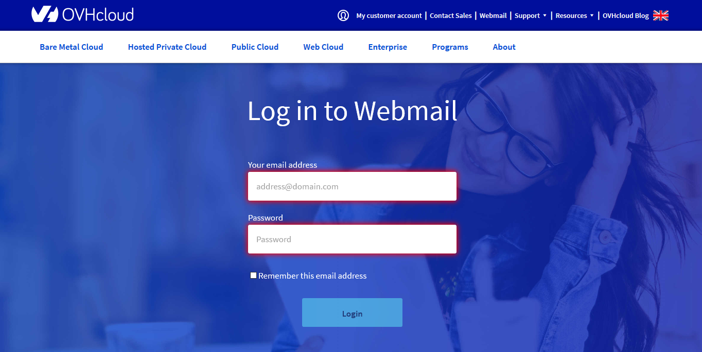
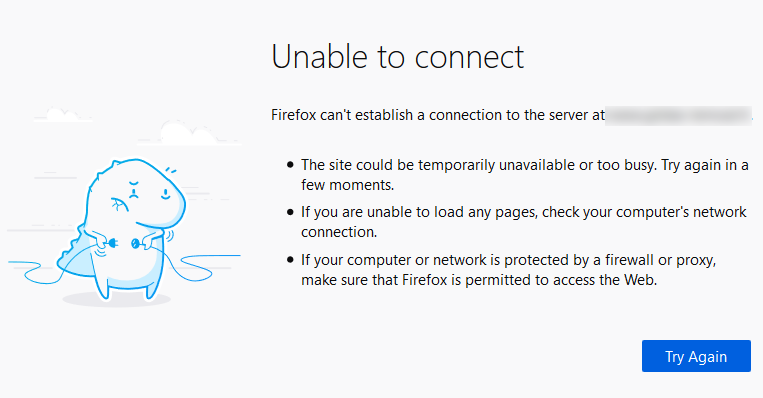
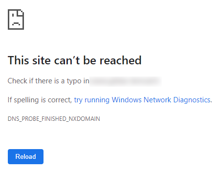

**Dernière mise à jour le 05/06/2021**

## FAQ hébergements web OVHcloud

### Configuration

#### Comment configurer mon hébergement ? 

Pour configurer votre hébergement, connectez-vous tout d'abord à votre [espace client OVHcloud](https://www.ovh.com/auth/?action=gotomanager&from=https://www.ovh.com/fr/&ovhSubsidiary=fr){.external}. Depuis la rubrique `Hébergement` vous pourrez notamment gérer vos certificats SSL, vos versions PHP, vos CDN, vos multisites, vos bases de données, ...

**Trucs et Astuces** : Pour vous aider à configurer votre hébergement, nous vous invitons à prendre connaissance de la rubrique   « Premiers pas » que vous retrouverez [ici](../).

#### Comment créer ou supprimer un élément sur mon produit/service (compte e-mail, base de données, ….) ?

Pour créer ou supprimer un élément, connectez-vous à votre [espace client OVHcloud](https://www.ovh.com/auth/?action=gotomanager&from=https://www.ovh.com/fr/&ovhSubsidiary=fr){.external} puis sélectionnez le produit concerné   (`E-mail`, `Base de données`, `Modules`). Vous pourrez ainsi faire évoluer votre produit à votre convenance.

**Trucs et Astuces** : depuis votre [espace client OVHcloud](https://www.ovh.com/auth/?action=gotomanager&from=https://www.ovh.com/fr/&ovhSubsidiary=fr){.external}, vous avez la possibilité de réaliser des sauvegardes régulières de vos bases de données.

#### Comment gérer mes mots de passe ? 

Pour gérer vos mots de passe, vous devez tout d'abord vous connecter à votre [espace client OVHcloud](https://www.ovh.com/auth/?action=gotomanager&from=https://www.ovh.com/fr/&ovhSubsidiary=fr){.external}. En cas d'oubli de votre identifiant ou de votre mot de passe, cliquez sur `Identifiant ou mot de passe oublié`{.action} sous la fenêtre de connexion. Un e-mail vous sera envoyé avec une procédure de réinitialisation. 
Vous pouvez également consulter le guide [Définir et gérer le mot de passe de votre compte](https://docs.ovh.com/fr/customer/gerer-son-mot-de-passe/){.external}.

Une fois connecté à votre espace client, vous pourrez gérer vos différents accès tels que : 

* l'accès à votre serveur FTP et aux bases de données. Pour ce faire, accédez à la rubrique `Hébergement` de votre [espace client OVHcloud](https://www.ovh.com/auth/?action=gotomanager&from=https://www.ovh.com/fr/&ovhSubsidiary=fr){.external} et sélectionnez le produit/service concerné .
* l'accès à vos e-mails, depuis votre [espace client OVHcloud](https://www.ovh.com/auth/?action=gotomanager&from=https://www.ovh.com/fr/&ovhSubsidiary=fr){.external}, rubrique `E-mail`.

**Trucs et Astuces** : Dans le cas d'une offre E-mail Pro ou Exchange, vous pouvez également gérer vos accès depuis les webmails respectifs de ces offres.

#### Comment mettre en ligne mon site ? 

Pour mettre en ligne votre site chez OVHcloud, vous devez disposer d'un nom de domaine, qui correspondra à l'adresse depuis laquelle votre site sera accessible (exemple : ovh.com). Vous devez également disposer d'un hébergement web sur lequel vous allez mettre en place votre site. Vous pouvez également consulter ce guide : [Mettre en ligne un site internet sur son hébergement web](../mettre-mon-site-en-ligne)

**Trucs et Astuces** : Pour vous aider à créer votre site internet, OVHcloud met à votre disposition des modules en 1 clic tels que Wordpress, Prestashop, Joomla ou encore Drupal. Retrouvez-les [ici](https://www.ovh.com/fr/hebergement-web/site/).external}. Vous pouvez également vous aider de [notre documentation](../modules-en-1-clic/).

#### Comment migrer mon site internet et mes e-mails vers OVHcloud ? 

Pour migrer votre site internet et vos e-mails vers OVHcloud, vous devez disposer d'une [offre d'hébergement Web](https://www.ovh.com/fr/hebergement-web/){.external} ainsi que d'une [offre e-mail OVHcloud](https://www.ovh.com/fr/emails/){.external}. Vous pourrez ensuite vous connecter au serveur FTP de votre hébergement afin d'y transférer les fichiers de votre site. Si vous disposez actuellement d'une base de données, pensez également à réaliser une sauvegarde de celle-ci. 

Pour migrer les e-mails, vous devrez recréer vos comptes chez OVHcloud, puis utiliser notre outil de migration [OMM (OVH Mail Migrator)](https://omm.ovh.net/) que vous trouverez [ici](https://omm.ovh.net/). 

Une fois ces étapes réalisées, vous pourrez modifier la zone DNS de votre domaine afin qu'elle puisse sous 1 à 24 heures pointer sur notre infrastructure. Si vous souhaitez des informations complémentaires, n'hésitez pas à consulter le guide [Migrer mon site chez OVHcloud](../migrer-mon-site-chez-ovh/).

**Trucs et Astuces** : Pour le transfert de vos fichiers, vous pouvez utiliser un logiciel tel que Filezilla ou Cyberduck en vous appuyant sur [notre documentation](../mutualise-guide-utilisation-filezilla/).

#### Comment héberger plusieurs sites web sur un même hébergement mutualisé ?

Pour les utilisateurs experts, vous pouvez héberger plusieurs sites internet sur le même hébergement mutualisé. Pour cela, vous devez attacher un autre nom de domaine ou attacher un sous-domaine à cet hébergement. La procédure pour attacher ou détacher un domaine est expliquée dans [ce guide](../multisites-configurer-un-multisite-sur-mon-hebergement-web/).

#### Comment faire évoluer mon offre d'hébergement web ?

Si vous souhaitez changer votre offre actuelle pour une offre supérieure, rendez-vous dans votre [espace client OVHcloud](https://www.ovh.com/auth/?action=gotomanager&from=https://www.ovh.com/fr/&ovhSubsidiary=fr){.external}, dans la rubrique `Web Cloud`{.action}. Cliquez sur `Hébergements`{.action} dans la barre de services située à gauche et sélectionnez l'offre concernée.

Depuis l'onglet `Informations générales`, dans le cadre `Abonnement`, cliquez sur le bouton `...`{.action} devant « Offre » puis cliquez sur  `Changer d'offre`{.action}. Suivez les instructions suivantes pour finaliser votre commande. Un prorata du temps restant de votre offre actuelle est rajouté sur la nouvelle offre.

### Diagnostic

#### Que faire si mon site web dysfonctionne ? 

Plusieurs raisons peuvent expliquer le dysfonctionnement de votre site Internet. Pour en identifier la cause, commencez par vérifier que tous vos services sont bien renouvelés et actifs, en vous connectant à votre [espace client OVHcloud](https://www.ovh.com/auth/?action=gotomanager&from=https://www.ovh.com/fr/&ovhSubsidiary=fr){.external}. Une fois cette vérification faite, consultez les [tâches travaux en cours](http://travaux.ovh.net/){.external}. Si tous vos services sont actifs et qu'aucune tâche travaux n'impacte votre site, nous vous invitons à réaliser un diagnostic plus approfondi à l'aide des questions qui suivent.

**Trucs et Astuces** : Si votre site est soudainement indisponible suite à une manipulation de votre part, vous pouvez restaurer son contenu depuis votre [espace client OVHcloud](https://www.ovh.com/auth/?action=gotomanager&from=https://www.ovh.com/fr/&ovhSubsidiary=fr){.external}. Pour cela, dirigez-vous sur l'onglet `FTP - SSH` de votre hébergement et cliquez sur le bouton `Restaurer une sauvegarde`{.action}, situé à droite de votre écran. Vous pouvez également vous appuyer sur la documentation suivante : [Restaurer l’espace de stockage de son hébergement web](../restauration-ftp-filezilla-espace-client/).

#### Que faire si après publication de mon site, la page « Félicitations » d'OVHcloud reste affichée ?

À l'installation de votre hébergement, OVHcloud met en place cette page d'attente, sous la forme d'un fichier **index.html** contenu dans le dossier **www** de votre serveur FTP.

Ce fichier est automatiquement désactivé lors de la création de votre [module en 1 clic](../modules-en-1-clic/#etape-3-ajouter-un-module).

Si vous avez choisi d'installer [votre site manuellement](../mutualise-installer-manuellement-mon-cms/), [connectez-vous à votre hébergement en FTP](../connexion-espace-stockage-ftp-hebergement-web/), afin de le renommer en **index.html.old**. 

**Autre information utile** : Afin d'être pris en compte, les fichiers de votre site doivent être téléchargés [en FTP](../connexion-espace-stockage-ftp-hebergement-web/) sur votre hébergement. Le répertoire dans lequel vous mettrez ces fichiers devra correspondre au `Dossier racine`, auquel est lié votre domaine dans le multisite.

#### Que faire si mon site affiche une erreur "403 forbidden" ?

{.thumbnail}

Consultez le guide [Réagir en cas de désactivation pour sécurité d’un hébergement](../site-ferme-pour-hack/)

#### Que faire si mon site affiche une erreur indiquant que la version PHP de mon hébergement est insuffisante ?

{.thumbnail}

Consultez le guide [Changer la version de PHP de son hébergement web](../configurer-le-php-sur-son-hebergement-web-mutu-2014/)

#### Que faire si mon site affiche une page "Index of" ?

{.thumbnail}

Votre nom de domaine est relié par le multisite de votre hébergement à un répertoire (`Dossier racine`) dans votre serveur FTP.

Cette anomalie indique que le répertoire concerné ne contient pas de fichier **index.php** ou **index.html**.

Pour résoudre l'anomalie "index of", vous devrez donc lier votre domaine au dossier racine qui contient le fichier **index.php** ou **index.html** de votre site.

Exemple : Vous avez importé les fichiers de votre site **mydomain.ovh** dans le dossier `www` de votre hébergement par FTP. Hors, votre nom de domaine n'est pas relié à ce dossier dans la colonne `Dossier racine` de votre `Multisite".

{.thumbnail}

Modifiez le `Dossier racine` en cliquant sur le bouton `...` à droite du tableau, puis `Modifier le domaine` :

{.thumbnail}

Cochez la case `Modifier également le sous domaine www` et indiquez le répertoire contenant le fichier **index** de votre site comme `Dossier racine`. Faites `Suivant` :

{.thumbnail}

Puis `Valider` :

{.thumbnail}

Vous obtiendrez, sous quelques minutes, le résultat suivant : 

{.thumbnail}

> [!primary]
>
> Utiliser le répertoire `www` comme `Dossier racine` n'est en aucun cas obligatoire. Vous pouvez installer votre site dans un autre dossier de votre serveur FTP.

#### Que faire si mon site s'affiche sur une adresse web de type « xxxxx.cluster0xx.hosting.ovh.net » ?

{.thumbnail}

Deux scénarii sont possibles. Soit votre site a été créé sous cette adresse web, soit celle-ci est apparue suite à une modification :

Scénario 1 : Votre site a été créé sur une adresse web de type « xxxxx.cluster0xx.hosting.ovh.net »

> [!warning]
>
> L'opération de suppression d'une base de données comme celle d'un module en 1 clic sont définitives. Elles entraînent également la suppression des sauvegardes des données concernées. Si vous n'êtes pas certain des manipulations à effectuer, contactez votre webmaster ou l'un de nos [partenaires](https://partner.ovhcloud.com/fr/directory/).
>

Dans le premier cas, après avoir réalisé toutes les sauvegardes nécessaires, supprimez votre module depuis la partie `Hébergements` de votre espace client OVHcloud :

{.thumbnail}

Puis sa base de données depuis l'onglet du même nom situé à droite de votre écran, toujours dans la partie `Hébergements` : 

{.thumbnail}
 
Puis relancez son installation sur le nom de domaine souhaité, [manuellement](../mutualise-installer-manuellement-mon-cms/) ou en utilisant la fonctionnalité [Module en 1 clic](../modules-en-1-clic/).

Scénario 2 : 

Si votre site s'affiche sous cette url suite à une manipulation, restaurez-le à son état antérieur.

> [!warning]
>
> La restauration de votre hébergement OVHcloud entraînera celle de l'ensemble des sites qu'il contient.
>
> Lors d'une restauration, le contenu de votre espace FTP, ou celui de votre base de données, est remplacé par une sauvegarde. Vous ne pourrez donc pas récupérer ensuite les données présentes sur le serveur juste avant la restauration.
>

Pour restaurer le code source de votre site, consultez notre guide « [Restaurer l’espace de stockage de son hébergement web](../restauration-ftp-filezilla-espace-client/) ».

Si votre site comporte une base de données, consultez notre guide « [Restaurer une sauvegarde de votre base de données](../mutualise-guide-importation-dune-base-de-donnees-mysql/#restaurer-une-sauvegarde-depuis-lespace-client) ».

#### Que faire si mon site redirige vers le webmail OVHcloud ?

{.thumbnail}

Cette anomalie indique une configuration erronée au niveau des [serveurs DNS] ou de la [zone DNS] associés à votre nom de domaine.

Le cas le plus courant est lié au fait que votre nom de domaine et votre hébergement ayant été commandés séparément, ils ne sont pas reliés entre eux.

Rendez-vous dans la partie Domaines de votre espace client OVHcloud, 

#### Que faire si mon nom de domaine redirige vers un site inconnu ?

#### Que faire si mon site affiche une page "Site non installé" ?

{.thumbnail}

https://docs.ovh.com/fr/hosting/erreur-site-non-installe/

#### Que faire si mon site affiche une page "Error establishing database connection" ?

### Que faire si mon site affiche une erreur "Too many redirect" ?

### Que faire si mon site affiche une erreur "Serveurs inaccessibles" ?

Si votre site affiche des erreurs de ce type : 

Firefox : 

{.thumbnail}

Google : 

{.thumbnail}

Safari : 

(Attendre un peu pour tester mypersonaldomainname.ovh sur safari (pas dispo sur windows))

#### Que faire si mon site affiche une erreur "500 Internal Server Error" ?

Si votre site affiche une erreur **500 Internal Server Error**, consultez ce [guide](https://docs.ovh.com/fr/hosting/erreur-500-internal-server-error/).

#### Que faire si mon site rencontre des lenteurs ?

En cas de lenteurs sur votre site, consultez ce [guide](https://docs.ovh.com/fr/hosting/optimisation-performances-site/).

#### Que faire si mon site affiche une page blanche ?

Si votre site affiche une page entièrement blanche, consultez ce [guide](https://docs.ovh.com/fr/hosting/comment-diagnostiquer-page-blanche/).

#### Que faire si ma base de données est pleine ?

#### Que faire si mon site affiche "Connexion non sécurisée ?

#### Que faire si mon site affiche une erreur "503 error Backend fetch failed (Varnish cache)" ?

#### Que faire si mon site affiche une erreur  "Your request has been blocked" ou Your IP has been banned" ?

#### Le nom de domaine qui apparaît dans mon espace client est bizarre et ne correspond pas à celui que j'ai commandé. Que dois-je faire ? (notation IDN)

## Aller plus loin 

[Partager son hébergement entre plusieurs sites](../multisites-configurer-un-multisite-sur-mon-hebergement-web/)

Si vous souhaitez bénéficier d'une assistance à l'usage et à la configuration de vos solutions OVHcloud, nous vous proposons de consulter nos différentes [offres de support](https://www.ovhcloud.com/fr/support-levels/)

Échangez avec notre communauté d'utilisateurs sur <https://community.ovh.com>.
