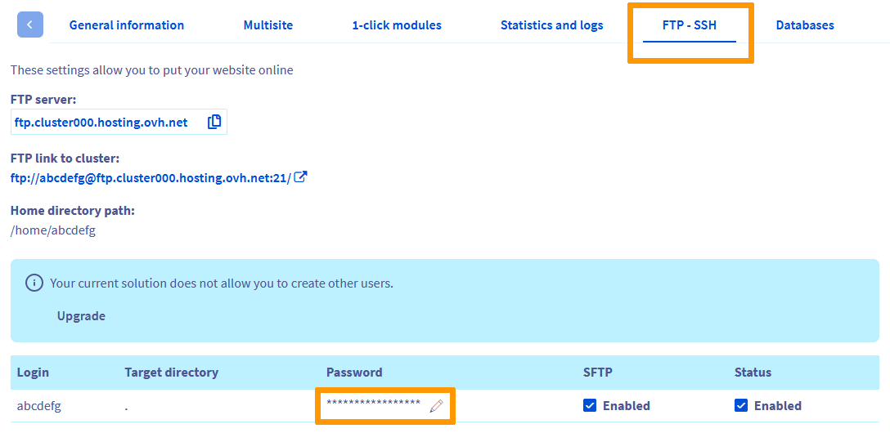

> [!primary]
> Diese Übersetzung wurde durch unseren Partner SYSTRAN automatisch erstellt. In manchen Fällen können ungenaue Formulierungen verwendet worden sein, z.B. bei der Beschriftung von Schaltflächen oder technischen Details. Bitte ziehen Sie beim geringsten Zweifel die englische oder französische Fassung der Anleitung zu Rate. Möchten Sie mithelfen, diese Übersetzung zu verbessern? Dann nutzen Sie dazu bitte den Button “Mitmachen“ auf dieser Seite.
>

**Letzte Aktualisierung am 18.08.2022**

## Ziel

Die OVHcloud Webhosting Angebote bieten Zugriff auf einen Online-Speicherplatz für Dateien, der über das **FTP**-Protokoll nutzbar ist. Zugriff auf diesen Bereich ist über einen FTP-Benutzer und das zugehörige Passwort möglich.
 Mit diesem Zugang können Sie [Ihre Website online stellen](https://docs.ovh.com/de/hosting/webhosting_meine_seite_online_stellen/).

**Diese Anleitung erklärt, wie Sie das Passwort eines auf Ihrem OVHcloud Webhosting erstellten FTP-Benutzers ändern.**

> [!warning]
> OVHcloud stellt Ihnen Dienstleistungen zur Verfügung, für deren Konfiguration und Verwaltung Sie die alleinige Verantwortung tragen. Es liegt somit bei Ihnen, sicherzustellen, dass diese ordnungsgemäß funktionieren.
> 
> Diese Anleitung soll Sie bei allgemeinen Aufgaben bestmöglich unterstützen. Dennoch empfehlen wir Ihnen, falls Sie Hilfe brauchen, einen [spezialisierten Dienstleister](https://partner.ovhcloud.com/de/directory/) zu kontaktieren und/oder Ihre Fragen in der OVHcloud Community zu stellen. Leider können wir Ihnen für administrative Aufgaben keine weitergehende technische Unterstützung anbieten. Weitere Informationen finden Sie am [Ende dieser Anleitung](#gofurther).
>

## Voraussetzungen

- Sie verfügen über ein [OVHcloud Webhosting](https://www.ovhcloud.com/de/web-hosting/).
- Sie haben Zugriff auf Ihr [OVHcloud Kundencenter](https://www.ovh.com/auth/?action=gotomanager&from=https://www.ovh.de/&ovhSubsidiary=de).

## In der praktischen Anwendung

### Schritt 1: Auf die FTP-Benutzerverwaltung zugreifen

Loggen Sie sich in Ihr [OVHcloud Kundencenter](https://www.ovh.com/auth/?action=gotomanager&from=https://www.ovh.de/&ovhSubsidiary=de) ein, gehen Sie in den Bereich `Web Cloud`{.action}, klicken Sie auf `Hosting-Pakete`{.action} und wählen Sie das betreffende Hosting aus. Öffnen Sie den Tab `FTP-SSH`{.action}.

Eine Tabelle zeigt die auf Ihrem Hosting erstellten FTP-Benutzer an. Mit diesen Benutzern können Sie auf Ihren FTP-Speicherplatz zugreifen, um dort die Dateien Ihrer Website bereitzustellen. Bei der Installation Ihres Hostings wird automatisch ein Benutzer erstellt.

### Schritt 2: Passwort eines FTP-Benutzers ändern

> [!primary]
>
> Für weitere Informationen zu bewährten Praktiken bei der Passwortverwaltung folgen Sie den Anweisungen in [dieser Anleitung](https://docs.ovh.com/de/customer/Passwort-verwalten/).
>

Je nach Ihrem [OVHcloud Webhosting](https://www.ovhcloud.com/de/web-hosting/) erfolgt die Änderung des Passworts Ihres FTP-Benutzers im Tab `FTP-SSH`{.action} über zwei verschiedene Wege:

- **Für Hosting-Pakete, die keinen zweiten FTP-Benutzer erstellen können** (Start 10M und Basic Hosting): Klicken Sie in der Spalte `Passwort`{.action} auf das Bleistift-Symbol, geben Sie das neue Passwort ein und bestätigen Sie die Änderung, indem Sie auf den grünen Button klicken.

{.thumbnail}

- **Für Hosting-Pakete, die es erlauben, mehrere FTP-Benutzer zu erstellen** (Pro und Performance): Klicken Sie auf die drei Punkte rechts neben dem betreffenden FTP-Benutzer und anschließend auf `Passwort ändern`{.action}. Geben Sie im angezeigten Fenster das neue Passwort ein, bestätigen Sie dieses, indem Sie es ein zweites Mal eingeben und klicken Sie dann auf den Button `Bestätigen`{.action}.

{.thumbnail}

Wählen Sie das neue Passwort Ihrer Datenbank aus und notieren Sie es. In beiden Fällen muss es folgende Bedingungen erfüllen:

- Mindestens 8 Zeichen
- Maximal 30 Zeichen
- Mindestens ein Großbuchstabe
- Mindestens ein Kleinbuchstabe
- Mindestens eine Ziffer
- Es darf ausschließlich aus Ziffern und Buchstaben bestehen

Gehen Sie dann zum Tab `Aktuelle Tasks`{.action} und laden Sie die Seite regelmäßig neu. Die Änderung benötigt einige Minuten, bis sie wirksam ist.

### Schritt 3: Auf Ihren Speicherplatz zugreifen

Das Hochladen Ihrer Dateien in den Hosting-Bereich kann auf mehrere Arten erfolgen:

- **FTP Explorer**: Dieses Tool ist über Ihr [OVHcloud Kundencenter](https://www.ovh.com/auth/?action=gotomanager&from=https://www.ovh.de/&ovhSubsidiary=de) erreichbar. Klicken Sie im Tab `FTP-SSH`{.action} auf den Button `FTP Explorer`{.action}.

> [!warning]
>
> FTP Explorer ist für das Angebot Cloud Web nicht verfügbar. Es muss eine der beiden folgenden Methoden verwendet werden.

- **Zugang mit FTP Programm**: Installieren Sie einen FTP-kompatiblen Client auf Ihrem Computer (z.B. [FileZilla](https://docs.ovh.com/de/hosting/webhosting_hilfe_zur_verwendung_von_filezilla/)).

- **SSH-Zugang** (nur bei den Hostings Pro und Performance): Verwenden Sie dieses Verbindungsprotokoll mithilfe der Anleitung "[SSH-Zugang Ihres Webhostings verwenden](https://docs.ovh.com/de/hosting/webhosting_ssh_auf_ihren_webhostings/)".

> [!primary]
>
> Weitere Informationen finden Sie in der Anleitung "[Mit dem Speicherplatz eines Webhostings verbinden](https://docs.ovh.com/de/hosting/verbindung-ftp-speicher-webhosting/)".
>

## Weiterführende Informationen 

[Das Passwort Ihres Kunden-Accounts anlegen und verwalten](https://docs.ovh.com/de/customer/Passwort-verwalten/)

Kontaktieren Sie für spezialisierte Dienstleistungen (SEO, Web-Entwicklung etc.) die [OVHcloud Partner](https://partner.ovhcloud.com/de/directory/).

Wenn Sie Hilfe bei der Nutzung und Konfiguration Ihrer OVHcloud Lösungen benötigen, beachten Sie unsere [Support-Angebote](https://www.ovhcloud.com/de/support-levels/).

Für den Austausch mit unserer User Community gehen Sie auf <https://community.ovh.com/en/>.
